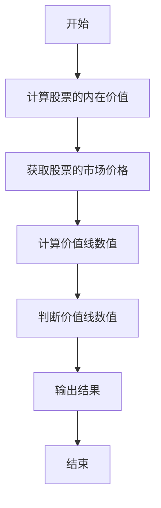
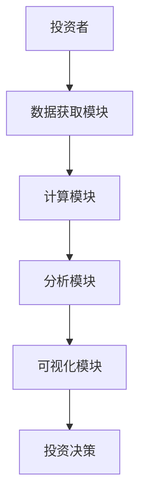

                 


# 格雷厄姆的价值线概念及其应用

> **关键词**：价值线，投资，格雷厄姆，股票分析，数学模型，系统架构
>
> **摘要**：本文深入探讨了格雷厄姆的价值线概念，从其背景、核心理论到数学模型、系统架构，再到项目实战和最佳实践，全面分析了价值线在投资决策中的应用。通过详细讲解和实例分析，帮助读者理解如何利用价值线进行股票估值和投资策略优化。

---

## 第1章：价值线概念的背景介绍

### 1.1 问题背景与描述

#### 1.1.1 投资理论的发展历程
投资理论的发展经历了多个阶段，从早期的简单估值方法到现代的复杂模型。格雷厄姆的价值线概念正是在这一背景下提出，为价值投资提供了重要的理论基础。

#### 1.1.2 价值投资的核心问题
价值投资的核心在于识别被低估的股票。然而，如何量化“低估”是一个复杂的问题，需要考虑多个因素，包括市盈率、市净率、股息率等。

#### 1.1.3 价值线的提出与意义
格雷厄姆的价值线概念通过将股票的内在价值与市场价格进行对比，为投资者提供了一个直观的判断依据。这一概念不仅简化了估值过程，还为后续的量化投资策略奠定了基础。

### 1.2 价值线概念的解决方法

#### 1.2.1 价值线的定义与目标
价值线（Value Line）是指股票的市场价格与内在价值之间的差异线。其目标是通过分析这一差异，帮助投资者识别被低估或高估的股票。

#### 1.2.2 价值线与其他投资模型的对比
价值线与市盈率、市净率等传统估值指标相比，具有更高的灵活性和适用性。它能够结合多种因素，提供更全面的估值结果。

#### 1.2.3 价值线在投资决策中的作用
价值线为投资者提供了一个量化工具，帮助他们在不同市场环境下做出更明智的投资决策。

### 1.3 价值线概念的边界与外延

#### 1.3.1 价值线的适用范围
价值线适用于股票市场，尤其是对成长型和价值型股票的分析。然而，其应用可能受到市场波动和数据质量的限制。

#### 1.3.2 价值线的局限性
价值线仅提供了一个估值框架，无法完全消除市场的不确定性和复杂性。此外，其准确性依赖于对内在价值的正确估计。

#### 1.3.3 价值线与市场环境的关系
价值线的有效性受到市场环境的影响。在牛市中，高估现象普遍；而在熊市中，低估现象更为常见。因此，投资者需要根据市场环境调整价值线的应用策略。

---

## 第2章：价值线概念的核心理论与数学模型

### 2.1 核心概念的原理

#### 2.1.1 价值线的基本原理
价值线通过比较股票的市场价格与内在价值，判断其是否被低估或高估。内在价值是基于公司基本面（如盈利能力、成长性等）计算得出的理论价值。

#### 2.1.2 价值线与股票内在价值的关系
股票的内在价值是价值线分析的核心。内在价值的计算涉及多个因素，包括公司盈利、成长性、行业地位等。价值线通过比较市场价格与内在价值，为投资者提供决策依据。

#### 2.1.3 价值线与市场波动的互动
市场波动会影响股票的价格，从而影响价值线的走向。价值线的分析需要结合市场波动，才能更准确地判断股票的投资价值。

### 2.2 核心概念的属性特征对比

#### 2.2.1 价值线与市盈率的对比
市盈率（P/E）是市场价格与每股收益的比值，反映市场对股票盈利能力的预期。价值线则综合考虑了多个因素，提供更全面的估值结果。

#### 2.2.2 价值线与市净率的对比
市净率（P/B）是市场价格与每股净资产的比值，反映市场对股票资产质量的评估。价值线则结合了市盈率和市净率的特点，提供更综合的估值指标。

#### 2.2.3 价值线与其他估值指标的对比
价值线与市盈率、市净率等传统估值指标相比，具有更高的灵活性和适用性。它能够结合多种因素，提供更全面的估值结果。

### 2.3 实体关系图（ER图）

```mermaid
er
    entity 股票 {
        id
        名称
        内在价值
        市场价格
    }
    entity 投资者 {
        id
        投资目标
        投资策略
    }
    entity 价值线 {
        id
        股票id
        内在价值
        市场价格
        价值线数值
    }
    relationship 投资者 --> 股票: 投资
    relationship 股票 --> 价值线: 生成
```

---

## 第3章：价值线概念的数学模型与算法

### 3.1 算法原理

#### 3.1.1 算法概述
价值线的计算基于股票的内在价值与市场价格的对比。具体公式如下：

$$
\text{价值线} = \frac{\text{市场价格}}{\text{内在价值}}
$$

如果价值线数值小于1，则表示股票被低估；如果大于1，则表示高估。

#### 3.1.2 算法步骤



### 3.2 数学模型

#### 3.2.1 内在价值的计算公式
股票的内在价值可以通过以下公式计算：

$$
\text{内在价值} = \frac{\text{每股盈利} \times (1 + \text{增长率})}{\text{折现率}}
$$

#### 3.2.2 价值线的计算公式
价值线的计算公式为：

$$
\text{价值线} = \frac{\text{市场价格}}{\text{内在价值}}
$$

---

## 第4章：价值线概念的系统架构与设计

### 4.1 系统架构设计

#### 4.1.1 系统概述
价值线分析系统是一个用于帮助投资者进行股票估值和投资决策的工具。系统架构包括数据获取、计算、分析和可视化模块。

#### 4.1.2 系统架构图



#### 4.1.3 接口设计
系统需要提供以下接口：
- 数据获取接口：获取股票的基本信息和财务数据。
- 计算接口：计算股票的内在价值和价值线数值。
- 分析接口：提供价值线分析结果和投资建议。

---

## 第5章：价值线概念的项目实战

### 5.1 项目环境安装

#### 5.1.1 环境需求
- Python 3.8+
- Jupyter Notebook
- pandas、numpy、matplotlib库

#### 5.1.2 安装步骤
```bash
pip install pandas numpy matplotlib
```

### 5.2 核心代码实现

#### 5.2.1 内在价值计算
```python
import pandas as pd
import numpy as np

def calculate_intrinsic_value(eps, growth_rate, discount_rate):
    return (eps * (1 + growth_rate)) / discount_rate
```

#### 5.2.2 价值线计算
```python
def calculate_value_line(stock_price, intrinsic_value):
    return stock_price / intrinsic_value
```

### 5.3 案例分析

#### 5.3.1 案例背景
假设某股票的每股盈利为1元，增长率5%，折现率10%，市场价格为15元。

#### 5.3.2 内在价值计算
$$
\text{内在价值} = \frac{1 \times (1 + 0.05)}{0.10} = 10.5 \text{元}
$$

#### 5.3.3 价值线计算
$$
\text{价值线} = \frac{15}{10.5} \approx 1.43
$$

由于价值线数值大于1，说明该股票被高估。

---

## 第6章：价值线概念的最佳实践与总结

### 6.1 最佳实践

#### 6.1.1 数据质量的重要性
确保输入数据的准确性和完整性，尤其是财务数据。

#### 6.1.2 模型的适用性
根据市场环境和投资目标选择合适的模型和参数。

#### 6.1.3 持续监控
定期更新数据和重新评估价值线，以应对市场变化。

### 6.2 小结

通过本文的分析，我们深入探讨了格雷厄姆的价值线概念，从理论到实践，全面解析了其在投资决策中的应用。价值线为投资者提供了一个有效的工具，帮助他们在复杂的市场环境中做出更明智的投资决策。

---

## 作者

**作者：AI天才研究院/AI Genius Institute & 禅与计算机程序设计艺术 /Zen And The Art of Computer Programming**

---

希望这篇文章能够为读者提供清晰的价值线概念和实际应用的指导，帮助他们在投资领域取得更好的成果。

