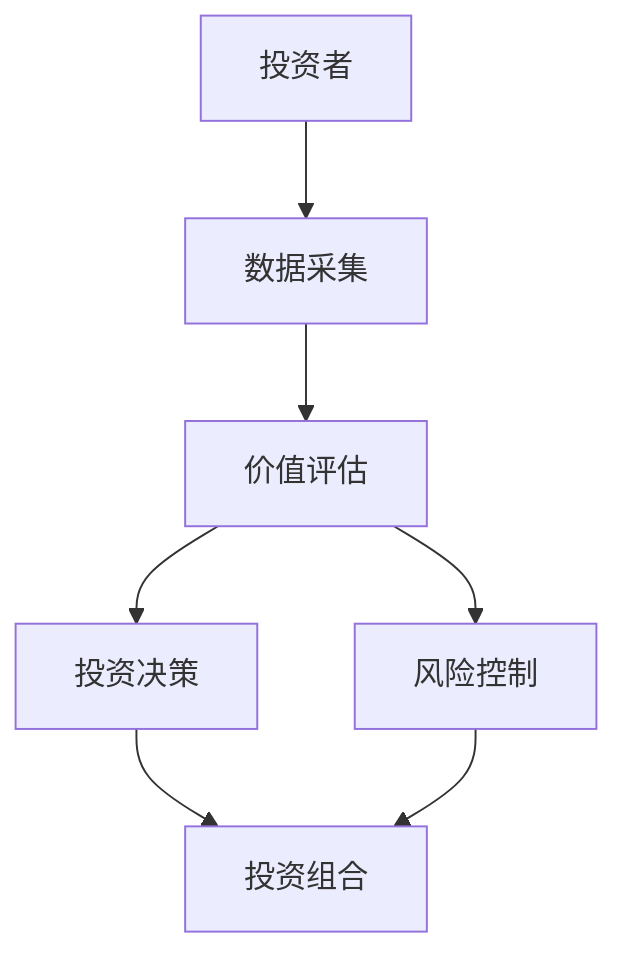

                 


# 格雷厄姆的价格与价值区分：市场先生的教训

---

## 关键词：
- 格雷厄姆，价值投资，价格，价值，市场先生，投资策略，内在价值

---

## 摘要：
本文深入探讨了格雷厄姆的价格与价值区分理论，结合市场先生的比喻，分析了投资市场的波动性与非理性。通过数学模型和系统架构的视角，详细阐述了格雷厄姆的价值评估方法及其在实际投资中的应用。文章还结合案例分析，为读者提供了从理论到实践的最佳投资策略和注意事项。

---

# 第四部分: 格雷厄姆价格与价值区分的系统架构与实战分析

---

## 第4章: 系统架构与投资策略

### 4.1 投资系统的整体架构
#### 4.1.1 系统功能模块设计
- 数据采集模块：收集公司财务数据、市场数据等。
- 价值评估模块：基于格雷厄姆模型计算内在价值。
- 投资决策模块：根据市场价格与内在价值的对比，制定投资策略。
- 风险控制模块：评估投资风险，调整投资组合。

#### 4.1.2 系统架构图


### 4.2 投资策略的系统实现

#### 4.2.1 核心算法实现
基于格雷厄姆模型的价值评估算法：
```python
def graham_value_calculation(EPS, growth_rate, discount_rate):
    """
    计算内在价值
    """
    value = (EPS * (1 + growth_rate)) / discount_rate
    return value
```

#### 4.2.2 系统接口设计
- 输入接口：公司财务数据、市场数据。
- 输出接口：内在价值、市场价格对比结果、投资建议。

#### 4.2.3 投资决策流程
1. 采集目标公司数据。
2. 计算内在价值。
3. 对比市场价格与内在价值。
4. 制定投资策略（买入、持有、卖出）。
5. 实时监控市场波动，动态调整投资组合。

### 4.3 实战分析与案例解读

#### 4.3.1 案例公司：XYZ公司
- 假设XYZ公司的EPS为$2.0，预期年增长率为5%，折现率为10%。
- 内在价值计算：
$$\text{内在价值} = \frac{2.0 \times (1 + 0.05)}{0.10} = 21$$
- 当前市场价格为$18，说明公司股票被低估。

#### 4.3.2 投资决策
- 根据格雷厄姆的“安全边际”原则，建议在市场价格低于内在价值的一定比例（如80%）时买入。

### 4.4 本章小结
通过系统架构与实战分析，我们展示了如何将格雷厄姆的价值投资理论应用于实际投资决策中。投资者可以通过数学模型和系统工具，更科学地判断价格与价值的差异，并制定有效的投资策略。

---

## 第5章: 价值投资的实战与注意事项

### 5.1 格雷厄姆投资策略的实战应用
#### 5.1.1 选择投资标的的步骤
1. 筛选低市盈率、低市净率的股票。
2. 计算内在价值，判断是否低估。
3. 结合公司基本面分析，确认投资标的的稳定性。

#### 5.1.2 格雷厄姆的选股标准
- 市盈率低于15倍。
- 市净率低于1.5倍。
- 股息率稳定，且不低于5%。

### 5.2 投资中的常见误区
#### 5.2.1 过度关注短期市场波动
格雷厄姆强调长期投资，避免被市场先生的短期情绪左右。

#### 5.2.2 忽略安全边际
内在价值的计算需要留有一定的安全空间，以应对市场的不确定性。

### 5.3 投资的注意事项
#### 5.3.1 定期复盘与调整
- 定期检查投资组合，评估是否偏离最初的投资目标。
- 根据市场变化，适当调整投资策略。

#### 5.3.2 风险控制
- 分散投资，避免过度集中。
- 设定止损点，防止亏损过大。

### 5.4 本章小结
通过实战分析与注意事项，我们强调了格雷厄姆价值投资策略的科学性与实用性。投资者需要结合理论与实践，制定适合自己的投资策略，并注意风险控制。

---

## 第6章: 总结与展望

### 6.1 核心观点总结
- 格雷厄姆的价值投资理论强调价格与价值的区分。
- 内在价值是投资决策的核心依据。
- 市场波动为理性投资者提供了低价买入的机会。

### 6.2 投资策略的未来发展
- 结合人工智能技术，提升价值评估的准确性。
- 开发自动化投资系统，优化投资决策流程。

### 6.3 最佳实践Tips
1. 长期投资，避免频繁交易。
2. 保持学习，不断更新投资知识。
3. 理解市场先生的非理性，避免随波逐流。

### 6.4 本章小结
通过本文的系统分析与深入探讨，我们深刻理解了格雷厄姆的价格与价值区分理论，并将其应用于实际投资中。未来，随着技术的进步，价值投资将更加科学化、系统化。

---

## 作者：
**AI天才研究院/AI Genius Institute & 禅与计算机程序设计艺术 /Zen And The Art of Computer Programming**

---

# END

