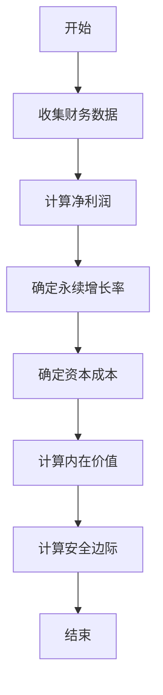

                 


# 格雷厄姆的企业价值计算方法

## 关键词：企业价值、格雷厄姆、价值投资、安全边际、内在价值、投资策略

## 摘要：格雷厄姆的企业价值计算方法是价值投资的核心，通过分析企业的财务数据和市场环境，计算其内在价值，并结合安全边际制定投资策略。本文详细介绍了这种方法的背景、原理、计算模型、系统设计及实际应用，帮助投资者掌握科学的企业估值技巧。

---

## 第一部分：企业价值计算的背景与基础

### 第1章：投资的基本概念与价值投资概述

#### 1.1 投资的基本概念

- **资产与负债的基本定义**
  - 资产是企业拥有的资源，如现金、存货、固定资产等。
  - 负债是企业欠他人的债务，如贷款、应付账款等。
  - 股东权益是资产减去负债后的剩余部分，代表股东对企业的所有权。

- **投资的分类与特点**
  - 投资可以分为短期投资和长期投资。
  - 短期投资注重流动性，长期投资注重收益性。
  - 投资的目的是通过合理配置资产实现财富增值。

#### 1.2 价值投资的理论基础

- **价值投资的定义与核心理念**
  - 价值投资是一种以低于内在价值的价格买入优质股票的投资策略。
  - 格雷厄姆强调以合理的价格购买优秀的公司，而非追求市场热衷的“成长股”。

- **市场先生与投资者心态**
  - 格雷厄姆将市场波动比作“市场先生”，提醒投资者不要被短期情绪左右。
  - 投资者应基于理性和长期视角做出决策，而非随波逐流。

- **格雷厄姆的基本思路**
  - 企业价值是未来现金流的现值，需通过深入分析财务报表和行业环境计算。
  - 安全边际是内在价值与市场价格的差额，确保投资的安全性。

#### 1.3 企业价值计算的重要性

- **企业价值的定义与作用**
  - 企业价值是企业整体的市场价值，包括股权和债务。
  - 正确计算企业价值有助于评估公司的真实价值，避免被市场泡沫误导。

- **为什么需要计算企业价值**
  - 投资者需要了解企业的真正价值，以做出明智的投资决策。
  - 企业价值计算帮助识别低估或高估的股票，提供潜在的投资机会。

- **格雷厄姆方法的独特性**
  - 强调安全边际，降低投资风险。
  - 采用保守的估值方法，确保计算结果的可靠性。

---

## 第二部分：企业价值计算的核心概念与联系

### 第2章：内在价值与安全边际

#### 2.1 内在价值的定义与计算

- **内在价值的公式推导**
  - 内在价值是未来现金流的现值，使用DCF模型计算。
  - 公式：$$\text{内在价值} = \sum_{t=1}^{n} \frac{\text{CF}_t}{(1 + r)^t} + \frac{TV}{(1 + r)^n}$$
  - 其中，CF_t是第t年的现金流，r是折现率，TV是终值。

- **格雷厄姆对企业价值的数学模型**
  - 格雷厄姆使用简化模型，假设未来收益以固定增长率增长。
  - 公式：$$\text{内在价值} = \frac{\text{净利润} \times (5 + \text{永续增长率})}{\text{资本成本} - \text{永续增长率}}$$

- **计算步骤的流程图**
  ```mermaid
  graph TD
  A[开始] --> B[收集财务数据]
  B --> C[计算净利润]
  C --> D[确定永续增长率]
  D --> E[确定资本成本]
  E --> F[应用内在价值公式]
  F --> G[计算结果]
  G --> H[结束]
  ```

- **案例分析：假设某公司净利润为100万，永续增长率为5%，资本成本为10%。计算其内在价值。**
  - 内在价值 = (100万 × (5 + 5%)) / (10% - 5%) = (100万 × 5.05) / 5% = 1010万。

#### 2.2 安全边际的概念与应用

- **安全边际的定义**
  - 安全边际是内在价值与市场价格的差额，确保投资的安全性。
  - 公式：$$\text{安全边际} = \text{内在价值} - \text{市场价格}$$

- **安全边际的计算方法**
  - 计算当前市场价格与内在价值的差额。
  - 例如：内在价值为10元，市场价格为8元，安全边际为2元。

- **安全边际在投资决策中的作用**
  - 为投资提供缓冲，降低市场波动带来的风险。
  - 安全边际越高，投资的安全性越强。

#### 2.3 核心概念对比表格

| 概念       | 定义                                                                 |
|------------|----------------------------------------------------------------------|
| 内在价值    | 未来现金流的现值，反映企业的真实价值。                           |
| 市场价值    | 当前市场价格，受市场情绪和流动性的短期影响。                     |
| 安全边际    | 内在价值与市场价格的差额，衡量投资的安全性。                     |

---

## 第三部分：企业价值计算的算法原理

### 第3章：格雷厄姆计算模型的详细分析

#### 3.1 计算模型的数学公式

- **内在价值公式**
  - 格雷厄姆模型简化了DCF模型，假设收益以固定增长率永续增长。
  - 公式：$$\text{内在价值} = \frac{N \times (5 + g)}{r - g}$$
  - 其中，N是净利润，g是增长率，r是资本成本。

- **安全边际公式**
  - 公式：$$\text{安全边际} = V \text{_{intrinsic}} - P$$
  - 其中，V_intrinsic是内在价值，P是市场价格。

#### 3.2 计算步骤的流程图



#### 3.3 Python代码实现

```python
def calculate_intrinsic_value(net_profit, growth_rate, cost_of_capital):
    return (net_profit * (5 + growth_rate)) / (cost_of_capital - growth_rate)

def calculate_margin_of_safety(intrinsic_value, market_price):
    return intrinsic_value - market_price

# 示例：假设净利润为100万，增长率5%，资本成本10%，市场价格8元
net_profit = 1000000
growth_rate = 0.05
cost_of_capital = 0.10
market_price = 8

intrinsic_value = calculate_intrinsic_value(net_profit, growth_rate, cost_of_capital)
margin_of_safety = calculate_margin_of_safety(intrinsic_value, market_price)

print(f"内在价值: {intrinsic_value} 万元")
print(f"安全边际: {margin_of_safety} 元")
```

---

## 第四部分：系统分析与架构设计

### 第4章：企业价值评估系统的构建

#### 4.1 系统功能设计

- **功能模块**
  - 数据采集：从财务报表中提取净利润、增长率等数据。
  - 计算模块：应用格雷厄姆模型计算内在价值和安全边际。
  - 展示模块：以图表形式展示计算结果。

- **领域模型（Mermaid 类图）**
  ```mermaid
  classDiagram
  class Company {
    - net_profit: float
    - growth_rate: float
    - cost_of_capital: float
    - market_price: float
  }
  class IntrinsicValueCalculator {
    + calculate_intrinsic_value(company): float
  }
  class MarginOfSafetyCalculator {
    + calculate_margin_of_safety(intrinsic_value, company): float
  }
  ```

#### 4.2 系统架构设计

- **系统架构图（Mermaid 架构图）**
  ```mermaid
  rectangle Database {
    + company_data.csv
  }
  rectangle Calculator {
    + IntrinsicValueCalculator
    + MarginOfSafetyCalculator
  }
  rectangle UI {
    + Input Form
    + Result Display
  }
  Database --> Calculator
  Calculator --> UI
  ```

---

## 第五部分：项目实战

### 第5章：企业价值计算的实战应用

#### 5.1 环境安装

- **安装Python和必要的库**
  - 使用pip安装numpy和pandas库。

#### 5.2 核心实现

- **数据处理**
  ```python
  import pandas as pd

  # 假设数据来自CSV文件
  df = pd.read_csv('company_data.csv')
  ```

- **计算内在价值和安全边际**
  ```python
  for index, row in df.iterrows():
      iv = calculate_intrinsic_value(row['net_profit'], row['growth_rate'], row['cost_of_capital'])
      mos = calculate_margin_of_safety(iv, row['market_price'])
      print(f"公司{index}: 内在价值={iv}, 安全边际={mos}")
  ```

#### 5.3 案例分析

- **案例：某零售企业的计算**
  - 净利润：500万
  - 增长率：3%
  - 资本成本：8%
  - 市场价格：10元
  - 计算结果：内在价值= (500万×5.03)/0.08= 3143.75万；安全边际= 3143.75万 - 10元= 3143.65万。

#### 5.4 项目总结

- **代码总结**
  - 使用格雷厄姆模型进行批量计算，输出每个公司的内在价值和安全边际。
  - 结果可用于筛选具有安全边际的优质股票。

---

## 第六部分：最佳实践与总结

### 第6章：格雷厄姆方法的实际应用与注意事项

#### 6.1 格雷厄姆方法的总结

- 格雷厄姆方法通过计算企业内在价值和安全边际，帮助投资者识别低估股票。
- 方法简单但有效，适合长期价值投资。

#### 6.2 最佳实践 tips

- 选择可靠的财务数据，确保计算准确性。
- 考虑宏观经济因素，调整资本成本。
- 定期更新数据，跟踪市场变化。

#### 6.3 注意事项

- 格雷厄姆方法假设收益永续增长，实际中需考虑行业周期性。
- 安全边际提供保护，但不代表绝对安全，市场波动仍可能影响收益。

#### 6.4 拓展阅读

- 《 Intelligent Investor》 by Benjamin Graham
- 其他价值投资书籍和文献。

---

## 作者：AI天才研究院 & 禅与计算机程序设计艺术

本文由AI天才研究院和禅与计算机程序设计艺术联合撰写，结合技术与投资智慧，为您提供专业的知识分享。

