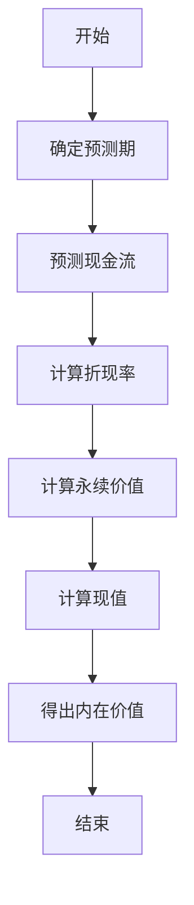
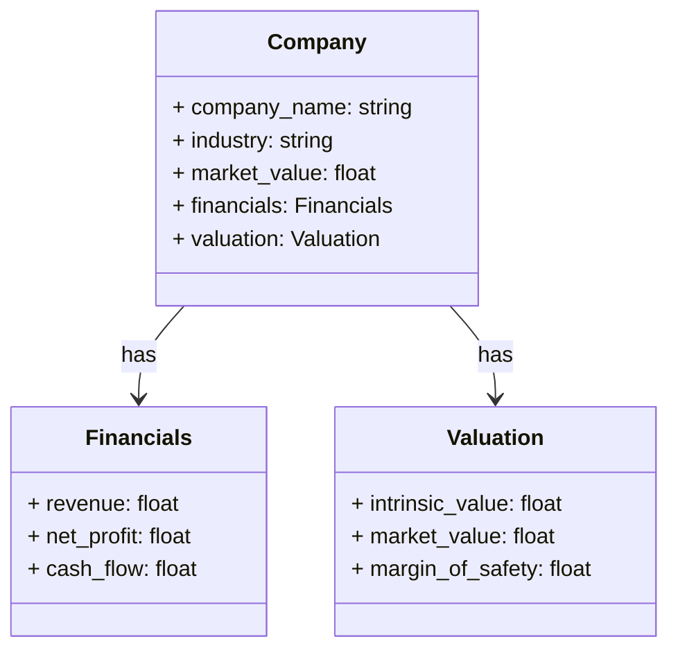
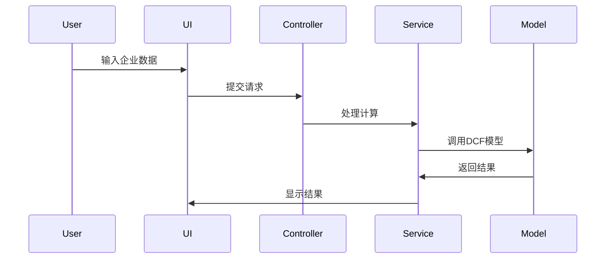

                 


# 格雷厄姆的企业价值计算：内在价值的重要性

## 关键词：企业价值计算、内在价值、格雷厄姆、DCF模型、价值投资、现金流折现法

## 摘要：格雷厄姆的企业价值计算方法是价值投资的重要基础，本文深入解析了内在价值的计算方法，通过DCF模型详细讲解了企业价值评估的核心算法，并通过实际案例展示了如何在投资中应用这些方法。

---

# 第一部分: 背景介绍

## 第1章: 企业价值评估的背景与基本概念

### 1.1 企业价值评估的基本概念

#### 1.1.1 企业价值的定义
企业价值是指一家企业整体的经济价值，包括其资产、负债、未来现金流等因素的综合评估。企业价值的核心在于其未来现金流的折现值。

#### 1.1.2 内在价值的定义与重要性
内在价值是基于企业基本面（如盈利能力、现金流、资产质量等）计算出的企业实际价值，与市场波动无关。它是价值投资的核心，帮助投资者识别被低估的投资机会。

#### 1.1.3 企业价值评估的必要性
企业价值评估是投资决策的关键步骤，通过评估企业的真实价值，投资者可以避免被市场情绪左右，做出理性的投资决策。

### 1.2 问题背景与描述

#### 1.2.1 传统企业价值评估方法的局限性
传统方法如市盈率、市净率等基于相对估值，容易受市场波动影响，无法反映企业的真实价值。

#### 1.2.2 现代企业价值评估方法的发展
现代方法如现金流折现法（DCF）通过预测企业未来现金流并折现，准确评估企业的真实价值。

#### 1.2.3 格雷厄姆投资理念的核心思想
格雷厄姆强调安全边际和内在价值，认为市场先生是错误的，长期来看，股票价格回归其内在价值。

### 1.3 问题解决与边界

#### 1.3.1 企业价值计算的核心问题
如何准确预测企业未来现金流并计算其折现值，确定其内在价值。

#### 1.3.2 计算模型的边界与外延
模型假设企业永续经营，现金流预测基于稳定的增长率，忽略宏观经济波动等不确定性因素。

#### 1.3.3 格雷厄姆模型的适用范围
适用于稳定增长的企业，特别适合公用事业、制造业等行业的价值评估。

### 1.4 核心概念结构与要素

#### 1.4.1 格雷厄姆模型的构成要素
包括现金流、折现率、增长率、永续价值等。

#### 1.4.2 内在价值与市场价值的关系
内在价值是企业的实际价值，市场价值是价格，两者可能不一致，内在价值是投资决策的基础。

#### 1.4.3 企业价值评估的关键假设
假设企业未来现金流可预测，折现率合理，忽略不可抗力因素。

## 1.5 本章小结
本章介绍了企业价值评估的基本概念和格雷厄姆模型的核心思想，强调了内在价值的重要性，并为后续分析奠定了基础。

---

# 第二部分: 核心概念与联系

## 第2章: 核心概念与联系

### 2.1 内在价值计算的核心原理

#### 2.1.1 格雷厄姆的内在价值公式
$$
\text{内在价值} = \sum_{t=1}^{n} \frac{\text{现金流}_t}{(1 + r)^t} + \frac{\text{永续价值}}{1 + r}
$$
其中，$r$ 是折现率，$n$ 是预测期，$\text{永续价值}$ 是预测期后的终值。

#### 2.1.2 内在价值与企业基本面的关系
企业基本面（如ROE、现金流、负债率）直接影响现金流的预测，从而影响内在价值的计算。

#### 2.1.3 格雷厄姆模型的数学表达式
通过预测未来现金流并折现，计算企业的真实价值，与市场价对比，识别低估机会。

### 2.2 核心概念对比分析

#### 2.2.1 内在价值与外在价值的对比
| 内在价值 | 外在价值 |
|---------|---------|
| 基于基本面 | 基于市场价 |
| 理论指导 | 市场情绪驱动 |

#### 2.2.2 不同企业价值评估方法的优缺点
| 方法 | 优点 | 缺点 |
|------|------|------|
| DCF模型 | 准确反映企业价值 | 预测现金流难度大 |
| 相对估值法 | 简单易用 | 易受市场波动影响 |

#### 2.2.3 格雷厄姆模型与其他模型的联系
格雷厄姆模型是DCF模型的前身，为后续现代价值评估方法奠定了基础。

### 2.3 实体关系架构

#### 2.3.1 企业价值评估的ER实体关系图
```mermaid
erDiagram
    company {
        公司代码 : string
        公司名称 : string
        行业 : string
        市值 : float
    }
    financials {
        财务报表日期 : date
        营业收入 : float
        净利润 : float
        现金流 : float
    }
    valuation {
        内在价值 : float
        市场价值 : float
        安全边际 : float
    }
    company --> financials : 提供
    financials --> valuation : 计算
```

#### 2.3.2 格雷厄姆模型的流程图


---

# 第三部分: 算法原理与数学

## 第3章: 算法原理与数学

### 3.1 现金流折现模型（DCF）

#### 3.1.1 基本原理
DCF模型将企业未来所有现金流折现，计算其现值，确定内在价值。

#### 3.1.2 算法步骤
1. 预测未来5年现金流。
2. 计算永续期现金流。
3. 选择合理的折现率。
4. 计算终值。
5. 折现并求和，得到内在价值。

#### 3.1.3 数学公式
$$
\text{内在价值} = \sum_{t=1}^{5} \frac{\text{现金流}_t}{(1 + r)^t} + \frac{\text{终值}}{(1 + r)^5}
$$
其中，$r$ 是折现率，终值 = $\text{现金流}_5 \times (1 + g)$，$g$ 是永续期增长率。

### 3.2 算法实现

#### 3.2.1 Python代码
```python
def calculate_intrinsic_value(fcf, r, g):
    # 预测未来5年现金流
    terminal_value = fcf[-1] * (1 + g)
    iv = 0
    for t in range(5):
        iv += fcf[t] / (1 + r) ** t
    iv += terminal_value / (1 + r) ** 5
    return iv

# 示例数据
fcf = [100, 110, 120, 130, 140]
r = 0.08
g = 0.02
iv = calculate_intrinsic_value(fcf, r, g)
print(f"内在价值为：{iv:.2f}")
```

#### 3.2.2 代码解读
1. `calculate_intrinsic_value` 函数计算内在价值，输入自由现金流、折现率和增长率。
2. 预测未来5年现金流，计算永续期终值。
3. 折现每一年的现金流并求和，得到内在价值。

### 3.3 算法优化与扩展

#### 3.3.1 确定合理的折现率
折现率通常基于无风险利率和市场风险溢价，例如使用CAPM模型计算。

#### 3.3.2 处理非稳定增长期
企业可能在预测期后进入稳定增长阶段，调整永续期现金流的计算方式。

---

# 第四部分: 系统分析与架构设计方案

## 第4章: 系统分析与架构设计方案

### 4.1 问题场景介绍
投资者需要评估一家企业的内在价值，使用DCF模型进行分析。

### 4.2 项目介绍
开发一个企业价值评估系统，基于格雷厄姆模型，帮助投资者快速计算内在价值。

### 4.3 系统功能设计

#### 4.3.1 系统功能模块
1. 数据输入模块：用户输入企业财务数据。
2. 模型计算模块：预测现金流，计算内在价值。
3. 结果展示模块：显示计算结果，提供可视化报告。

#### 4.3.2 领域模型类图


### 4.4 系统架构设计

#### 4.4.1 系统架构图
```mermaid
graph TD
    User --> UI : 输入数据
    UI --> Controller : 处理请求
    Controller --> Service : 执行计算
    Service --> Repository : 存储数据
    Repository --> Model : 调用DCF模型
    Model --> Service : 返回结果
    Service --> UI : 显示结果
```

### 4.5 系统接口设计

#### 4.5.1 API接口
1. POST /api/valuation：接收企业数据，返回内在价值。
2. GET /api/reports：获取评估报告。

### 4.6 系统交互流程图

#### 4.6.1 用户与系统交互


---

# 第五部分: 项目实战

## 第5章: 项目实战

### 5.1 环境安装

#### 5.1.1 安装Python和依赖库
```bash
pip install numpy pandas matplotlib
```

### 5.2 系统核心实现

#### 5.2.1 核心代码实现
```python
import numpy as np
import pandas as pd

def calculateDCF(fcf, r, g):
    terminal_value = fcf[-1] * (1 + g)
    iv = 0
    for t in range(len(fcf)):
        iv += fcf[t] / (1 + r) ** (t + 1)
    iv += terminal_value / (1 + r) ** (len(fcf) + 1)
    return iv

# 示例数据
fcf = [100, 110, 120, 130, 140]
r = 0.08
g = 0.02
iv = calculateDCF(fcf, r, g)
print(f"内在价值为：{iv:.2f}")
```

#### 5.2.2 代码解读
1. `calculateDCF` 函数实现DCF模型，输入现金流、折现率和增长率。
2. 预测未来现金流，计算终值，折现并求和，得到内在价值。

### 5.3 实际案例分析

#### 5.3.1 案例分析
假设某公司未来5年现金流分别为100、110、120、130、140万元，折现率为8%，永续增长率为2%。计算其内在价值。

#### 5.3.2 计算过程
$$
\text{终值} = 140 \times 1.02 = 142.8 \\
\text{内在价值} = \frac{100}{1.08} + \frac{110}{1.08^2} + \frac{120}{1.08^3} + \frac{130}{1.08^4} + \frac{140}{1.08^5} + \frac{142.8}{1.08^5}
$$

### 5.4 系统小结

#### 5.4.1 项目总结
通过代码实现DCF模型，帮助投资者快速计算企业内在价值，做出理性投资决策。

---

# 第六部分: 最佳实践与小结

## 第6章: 最佳实践与小结

### 6.1 最佳实践

#### 6.1.1 数据准确性
确保财务数据的准确性和完整性，选择可靠的财务报表。

#### 6.1.2 模型假设
合理假设现金流增长率和折现率，考虑企业所处行业和经济环境。

#### 6.1.3 持续学习
市场环境变化，需不断优化模型，学习新的价值评估方法。

### 6.2 小结

#### 6.2.1 格雷厄姆模型的重要性
格雷厄姆的企业价值计算方法为投资者提供了科学的内在价值评估工具，帮助识别低估投资机会。

#### 6.2.2 模型的局限性
现金流预测难度大，模型假设可能与实际情况不符，需结合其他分析方法。

#### 6.2.3 投资者的责任
投资者需深入研究企业基本面，合理使用模型，做出明智的投资决策。

---

# 作者：AI天才研究院 & 禅与计算机程序设计艺术

