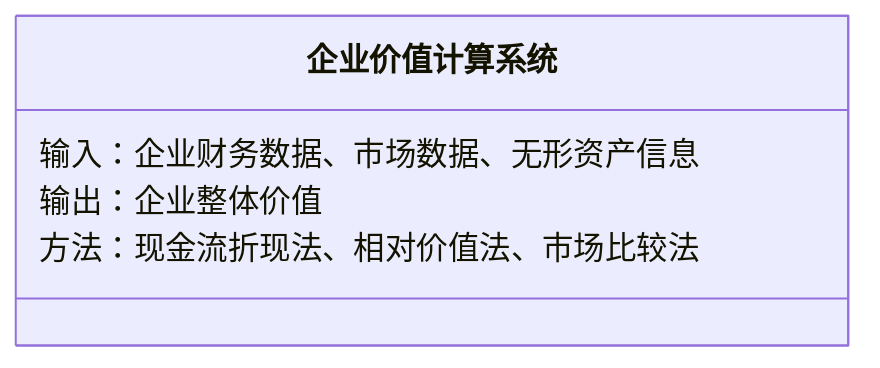
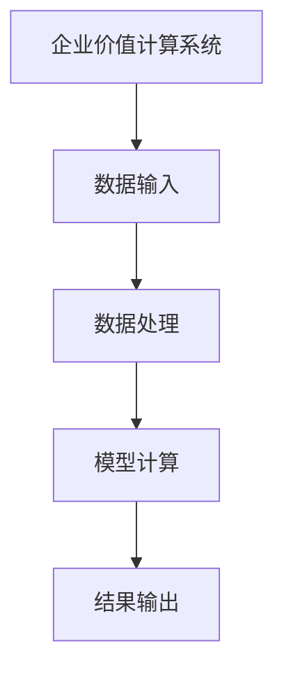

                 


# 格雷厄姆的企业价值计算：调整无形资产的重要性

> 关键词：企业价值计算，无形资产，格雷厄姆，投资理论，DCF模型

> 摘要：本文深入探讨了格雷厄姆的企业价值计算方法，并重点分析了无形资产在其中的重要性。通过详细讲解无形资产的评估方法、数学模型和实际案例，展示了如何在现代企业价值计算中调整和优化无形资产的评估，从而提升企业估值的准确性和实用性。

---

## 第一部分：企业价值计算的背景与基础

### 第1章：企业价值计算的背景与概述

#### 1.1 企业价值计算的核心概念
##### 1.1.1 企业价值计算的定义与范围
企业价值计算是评估企业整体价值的过程，通常包括有形资产和无形资产的评估。传统的企业价值计算方法主要关注有形资产，而忽略了无形资产对企业整体价值的贡献。

##### 1.1.2 无形资产的定义与特征
无形资产是指企业拥有的非实体性资产，如专利、商标、品牌价值、商誉等。这些资产通常难以量化，但对企业的长期价值和竞争优势具有重要影响。

##### 1.1.3 企业价值计算的重要性与意义
准确的企业价值计算有助于投资者做出合理的投资决策，同时也能帮助企业制定有效的战略规划。传统的价值计算方法往往低估了无形资产的价值，导致企业估值的不准确。

#### 1.2 无形资产在企业中的重要性
##### 1.2.1 无形资产的分类与表现形式
无形资产可以分为两类：一类是可确指的无形资产，如专利、商标；另一类是不可确指的无形资产，如商誉。

##### 1.2.2 无形资产对企业价值的影响
无形资产的价值往往决定了企业的市场竞争力和未来的盈利能力。例如，强大的品牌价值可以显著提升企业的市场份额和定价能力。

##### 1.2.3 无形资产的评估与量化
无形资产的评估需要结合企业的实际情况，采用多种方法进行综合评估。常见的评估方法包括相对价值法、现金流折现法（DCF）和市场比较法。

---

### 第2章：格雷厄姆投资理论与企业价值计算

#### 2.1 格雷厄姆投资理论概述
##### 2.1.1 格雷厄姆的价值投资理念
格雷厄姆是价值投资的鼻祖，他认为市场的短期波动是不可预测的，而企业的真实价值可以通过对其财务状况和未来现金流的分析来确定。

##### 2.1.2 格雷厄姆的企业估值方法
格雷厄姆提出了“内在价值”概念，即企业未来现金流的现值。他主张以低于内在价值的价格买入股票，以确保投资的安全性。

##### 2.1.3 格雷厄姆与现代企业价值计算的联系
尽管格雷厄姆的理论提出较早，但其核心思想与现代企业价值计算的方法有诸多相似之处，尤其是现金流折现法（DCF）的使用。

#### 2.2 无形资产在格雷厄姆理论中的地位
##### 2.2.1 格雷厄姆对企业无形资产的重视
格雷厄姆在其著作中多次提到商誉等无形资产的重要性，并认为这些资产是企业长期竞争优势的来源。

##### 2.2.2 无形资产在企业价值计算中的权重
格雷厄姆认为，无形资产的价值不应被低估，尤其是在评估企业的长期价值时，无形资产的贡献需要被充分考虑。

##### 2.2.3 格雷厄姆理论对现代无形资产评估的启示
格雷厄姆的理论强调了企业基本面分析的重要性，这为现代无形资产评估提供了重要的方法论支持。

---

## 第二部分：无形资产的评估与计算方法

### 第3章：无形资产的评估方法

#### 3.1 无形资产评估的核心原理
##### 3.1.1 相对价值法
相对价值法是通过比较同类企业的市场估值来确定目标企业价值的一种方法。这种方法适用于无形资产较为相似的企业。

##### 3.1.2 现金流折现法（DCF）
现金流折现法是通过将企业未来现金流折现到现值来计算企业价值的方法。这种方法适用于无形资产对企业未来现金流有显著影响的情况。

##### 3.1.3 市场比较法
市场比较法是通过比较同类企业的市场倍数（如市盈率、市净率）来确定目标企业价值的方法。这种方法适用于无形资产对企业市场倍数有显著影响的情况。

#### 3.2 不同无形资产的评估策略
##### 3.2.1 商誉的评估
商誉是企业整体价值减去可确指净资产后的剩余价值。商誉的评估需要结合企业的盈利能力、市场地位等因素。

##### 3.2.2 专利的评估
专利的评估需要考虑其法律保护期限、市场应用前景以及对竞争对手的潜在影响。

##### 3.2.3 版权的评估
版权的评估需要考虑其使用范围、市场影响力以及企业的使用成本。

---

### 第4章：企业价值计算的数学模型与公式

#### 4.1 企业价值计算的数学模型
##### 4.1.1 现金流折现模型（DCF）
$$ \text{企业价值} = \sum_{t=1}^{n} \frac{\text{自由现金流}}{(1 + r)^t} + \frac{\text{终值}}{(1 + r)^n} $$
其中，\( r \) 是折现率，\( n \) 是预测期。

##### 4.1.2 市盈率模型
$$ \text{企业价值} = \text{市盈率} \times \text{每股收益} $$

##### 4.1.3 市净率模型
$$ \text{企业价值} = \text{市净率} \times \text{每股净资产} $$

#### 4.2 无形资产价值的数学公式
##### 4.2.1 商誉的计算公式
$$ \text{商誉} = \text{企业价值} - \text{可确指净资产公允价值} $$

##### 4.2.2 专利价值的评估公式
$$ \text{专利价值} = \text{未来现金流} \times \text{折现率} $$

##### 4.2.3 版权价值的评估公式
$$ \text{版权价值} = \text{使用期限} \times \text{年收入} \times \text{分成比例} $$

#### 4.3 示例计算与分析
##### 4.3.1 商誉计算的案例分析
假设一家企业以20亿元收购一家被评估企业，被评估企业的可确指净资产公允价值为15亿元，则商誉为5亿元。

##### 4.3.2 专利价值评估的案例分析
假设某专利预计在未来5年内为企业带来年均现金流1000万元，折现率为8%，则专利价值约为4224万元。

##### 4.3.3 版权价值评估的案例分析
假设某版权的使用期限为10年，年收入为500万元，分成比例为20%，则版权价值为1000万元。

---

## 第三部分：系统分析与架构设计

### 第5章：企业价值计算的系统分析

#### 5.1 问题场景介绍
##### 5.1.1 企业价值计算的典型场景
企业在进行并购、上市或融资时，需要对其价值进行准确评估。传统的价值计算方法往往忽视了无形资产的价值，导致企业估值不准确。

##### 5.1.2 问题描述
无形资产的评估是企业价值计算中的难点，其复杂性主要体现在以下几个方面：
1. 无形资产的价值难以量化。
2. 无形资产的评估需要结合企业的实际情况。
3. 无形资产的价值对企业未来现金流的影响较大。

##### 5.1.3 问题解决
通过引入现代数学模型和数据分析方法，可以更准确地评估无形资产的价值，并将其纳入企业价值计算的框架中。

##### 5.1.4 边界与外延
企业的无形资产包括商誉、专利、版权等。本文主要讨论商誉和专利的评估方法。

##### 5.1.5 概念结构与核心要素组成
企业价值计算的核心要素包括现金流、折现率、无形资产价值。其中，无形资产价值是影响企业整体价值的重要因素。

---

### 第6章：系统架构设计

#### 6.1 系统功能设计
##### 6.1.1 领域模型


#### 6.2 系统架构设计


#### 6.3 系统接口设计
##### 6.3.1 数据输入接口
系统需要输入企业的财务数据、市场数据和无形资产信息。

##### 6.3.2 数据输出接口
系统输出企业整体价值和无形资产价值的评估结果。

#### 6.4 系统交互设计
##### 6.4.1 用户与系统交互
```mermaid
sequenceDiagram
    participant 用户
    participant 系统
    用户 -> 系统：输入数据
    系统 -> 用户：输出企业价值
```

---

## 第四部分：项目实战

### 第7章：项目实战

#### 7.1 环境安装
需要安装Python和相关数据处理库（如Pandas、NumPy）。

#### 7.2 核心实现源代码
以下是现金流折现法（DCF）的Python代码示例：
```python
import pandas as pd
import numpy as np

def calculate_enterprise_value(fcf, wacc, horizon, terminal_value):
    """
    计算企业价值的现金流折现法
    """
    # 计算现值
    present_value = 0
    for t in range(1, horizon + 1):
        present_value += fcf[t] / (1 + wacc) ** t
    # 计算终值现值
    present_value_terminal = terminal_value / (1 + wacc) ** horizon
    # 总企业价值
    enterprise_value = present_value + present_value_terminal
    return enterprise_value

# 示例数据
fcf = pd.Series([1000, 1200, 1500, 2000], index=[1, 2, 3, 4])
wacc = 0.08
horizon = 4
terminal_value = 5000

enterprise_value = calculate_enterprise_value(fcf, wacc, horizon, terminal_value)
print(f"企业价值：{enterprise_value}")
```

#### 7.3 代码应用解读与分析
上述代码展示了如何使用现金流折现法计算企业价值。通过调整现金流和折现率，可以实现对不同无形资产价值的评估。

#### 7.4 实际案例分析
以某科技公司为例，假设其未来五年的自由现金流分别为1000万元、1200万元、1500万元、2000万元和2500万元，折现率为8%，终值为6000万元。根据上述代码，计算出的企业价值为：

$$
\text{企业价值} = \frac{1000}{1.08} + \frac{1200}{(1.08)^2} + \frac{1500}{(1.08)^3} + \frac{2000}{(1.08)^4} + \frac{2500 + 6000}{(1.08)^5}
$$

计算结果约为：8500万元。

#### 7.5 项目小结
通过上述案例分析，可以看出现金流折现法在评估企业价值时具有较高的准确性。特别是在考虑无形资产价值时，需要结合企业的实际情况进行调整。

---

## 第五部分：最佳实践与总结

### 第8章：最佳实践与总结

#### 8.1 最佳实践 tips
1. 在企业价值计算中，无形资产的评估至关重要。
2. 使用多种方法进行综合评估，以提高准确性。
3. 结合企业的实际情况进行调整，避免过于依赖单一模型。

#### 8.2 小结
本文深入探讨了格雷厄姆的企业价值计算方法，并重点分析了无形资产在其中的重要性。通过详细讲解无形资产的评估方法、数学模型和实际案例，展示了如何在现代企业价值计算中调整和优化无形资产的评估，从而提升企业估值的准确性和实用性。

#### 8.3 注意事项
1. 无形资产的评估需要结合企业的实际情况。
2. 在使用数学模型时，需要确保数据的准确性和合理性。
3. 企业价值计算结果仅供参考，实际投资决策需要综合考虑其他因素。

#### 8.4 拓展阅读
1. 格雷厄姆的《 Intelligent Investor》
2. 现金流折现法（DCF）的深入研究
3. 无形资产评估的最新方法和工具

---

作者：AI天才研究院/AI Genius Institute & 禅与计算机程序设计艺术 /Zen And The Art of Computer Programming

