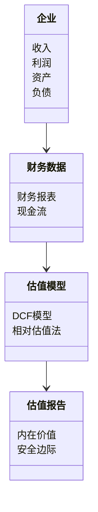
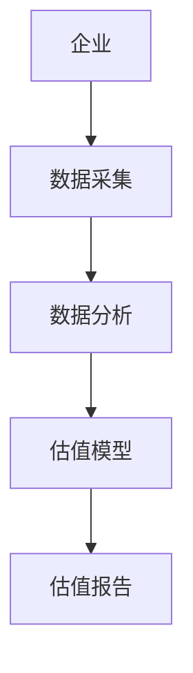

                 


# 格雷厄姆的企业价值评估方法

## 关键词：企业价值评估，格雷厄姆，价值投资，安全边际，内在价值

## 摘要：  
格雷厄姆的企业价值评估方法是价值投资领域的经典理论，通过分析企业的基本面和财务数据，利用安全边际的概念，评估企业的内在价值。本文将详细阐述格雷厄姆的企业价值评估方法的核心概念、算法原理、系统分析、项目实战以及最佳实践。

---

# 第1章: 企业价值评估的基本概念

## 1.1 企业价值评估的定义与背景

### 1.1.1 企业价值评估的定义  
企业价值评估（Business Valuation）是指通过对企业的财务状况、经营业绩、市场环境等多方面因素的分析，估算出企业在特定时点的内在价值的过程。它是投资决策的重要依据，也是企业并购、融资等活动中不可或缺的环节。

### 1.1.2 企业价值评估的背景与重要性  
企业价值评估的背景可以追溯到20世纪初，随着资本主义经济的发展，投资者开始关注如何科学地对企业进行估值。格雷厄姆作为价值投资的鼻祖，提出了许多经典的企业价值评估方法，为企业估值奠定了理论基础。企业价值评估的重要性体现在以下几个方面：  
1. 投资决策：帮助投资者判断股票是否被低估或高估。  
2. 企业并购：为企业并购提供合理的估值依据。  
3. 企业融资：帮助企业在融资活动中确定合理的融资价格。  
4. 股权激励：为企业股权激励计划提供参考。

### 1.1.3 企业价值评估的核心要素与边界  
企业价值评估的核心要素包括：  
- **财务数据**：收入、利润、资产、负债、现金流等。  
- **行业环境**：行业竞争格局、市场前景、政策环境等。  
- **管理团队**：管理层的能力和战略决策。  
- **风险因素**：企业面临的财务风险、市场风险等。  

企业价值评估的边界包括：  
1. 评估范围：仅限于企业整体价值，不包括部分股权或无形资产。  
2. 时间范围：通常基于未来5-10年的现金流预测。  
3. 数据限制：依赖于可获取的公开财务数据。

---

## 1.2 格雷厄姆投资理念的起源

### 1.2.1 价值投资的起源与发展  
价值投资起源于20世纪初，格雷厄姆是这一理念的奠基人。他在《证券分析》一书中提出了“安全边际”的概念，强调以低于内在价值的价格买入股票，从而确保投资的安全性。  

### 1.2.2 格雷厄姆的学术贡献与投资实践  
格雷厄姆不仅是理论家，还是成功的实践者。他在哥伦比亚大学教授证券分析课程，并与大卫·多德合著了《证券分析》，这本书成为价值投资领域的经典著作。  

### 1.2.3 格雷厄姆投资理念的核心思想  
格雷厄姆的核心思想是：  
1. 价格波动是投资的风险，而价值是投资的核心。  
2. 通过寻找被市场低估的企业，实现长期稳定的收益。  
3. 安全边际是投资成功的关键。  

---

## 1.3 企业价值评估的理论基础

### 1.3.1 资本资产定价模型（CAPM）  
CAPM是一种广泛应用于企业估值的理论模型，其公式为：  
$$ E(R_i) = R_f + \beta_i (E(R_m) - R_f) $$  
其中，$E(R_i)$是资产的预期收益率，$R_f$是无风险利率，$\beta_i$是资产的贝塔系数，$E(R_m)$是市场预期收益率。  

### 1.3.2 股权资本成本与企业价值的关系  
企业价值评估需要确定股权资本成本，而CAPM为企业提供了资本成本的计算方法。股权资本成本越低，企业的内在价值越高。  

### 1.3.3 现金流折现法的理论基础  
现金流折现法（DCF）是企业价值评估的核心方法之一，其基本思想是将企业未来现金流折现，计算其现值。公式为：  
$$ V = \sum_{t=1}^{n} \frac{CF_t}{(1 + r)^t} $$  
其中，$V$是企业价值，$CF_t$是第$t$年的现金流，$r$是折现率。

---

# 第2章: 格雷厄姆的企业价值评估方法

## 2.1 格雷厄姆的价值评估模型

### 2.1.1 格雷厄姆的内在价值公式  
格雷厄姆的内在价值公式可以表示为：  
$$ V = \frac{E}{P} + \frac{E}{P} \times g $$  
其中，$E$是企业的净利润，$P$是企业价值的倍数，$g$是增长率。  

### 2.1.2 安全边际的概念与计算  
安全边际是格雷厄姆理论的核心，其计算公式为：  
$$ \text{安全边际} = \text{内在价值} - \text{市场价格} $$  
安全边际越大，投资风险越小。  

### 2.1.3 企业价值评估的三要素：资产、收益与价格  
格雷厄姆认为，企业价值由资产、收益和价格三要素构成。资产是基础，收益是核心，价格是表象。

---

## 2.2 格雷厄姆的企业估值方法

### 2.2.1 市盈率法  
市盈率（P/E）是企业价值评估的重要指标，其公式为：  
$$ \text{市盈率} = \frac{\text{股价}}{\text{每股收益}} $$  

### 2.2.2 市净率法  
市净率（P/B）是另一种常用的估值指标，其公式为：  
$$ \text{市净率} = \frac{\text{股价}}{\text{每股净资产}} $$  

### 2.2.3 股息率法  
股息率是衡量股票收益能力的指标，其公式为：  
$$ \text{股息率} = \frac{\text{每股股息}}{\text{股价}} $$  

---

## 2.3 格雷厄姆的选股策略

### 2.3.1 低市盈率策略  
选择市盈率低于行业平均水平的股票。  

### 2.3.2 低市净率策略  
选择市净率低于行业平均水平的股票。  

### 2.3.3 高股息率策略  
选择股息率高于行业平均水平的股票。  

---

# 第3章: 企业基本面分析与财务报表解读

## 3.1 企业基本面分析的核心指标

### 3.1.1 收入与利润分析  
- 净收入：企业总收入减去成本和费用。  
- 净利润：企业税后利润。  

### 3.1.2 资产与负债分析  
- 总资产：企业所有资产的总和。  
- 总负债：企业所有负债的总和。  

### 3.1.3 现金流量分析  
- 经营活动现金流：企业经营活动产生的现金流。  
- 投资活动现金流：企业投资活动产生的现金流。  
- 筹资活动现金流：企业筹资活动产生的现金流。  

---

## 3.2 财务报表分析方法

### 3.2.1 资产负债表分析  
通过分析资产负债表，可以了解企业的资产构成、负债情况和所有者权益。  

### 3.2.2 利润表分析  
通过分析利润表，可以了解企业的收入、成本和利润情况。  

### 3.2.3 现金流量表分析  
通过分析现金流量表，可以了解企业的现金流状况。  

---

## 3.3 企业财务健康度评估

### 3.3.1 财务比率分析  
- 资产负债率：$\text{负债总额} / \text{资产总额}$。  
- 速动比率：$\text{流动资产} / \text{流动负债}$。  

### 3.3.2 盈利能力分析  
- 净利率：$\text{净利润} / \text{营业收入}$。  
- 毛利率：$\text{毛利} / \text{营业收入}$。  

### 3.3.3 偿债能力  
- 利息覆盖倍数：$\text{EBIT} / \text{利息支出}$。  

---

# 第4章: 企业价值评估模型

## 4.1 现金流折现模型（DCF）

### 4.1.1 DCF模型的核心步骤  
1. 预测企业未来现金流。  
2. 确定合适的折现率。  
3. 将未来现金流折现，计算现值。  

### 4.1.2 DCF模型的公式  
$$ V = \sum_{t=1}^{n} \frac{CF_t}{(1 + r)^t} + \frac{TV}{(1 + r)^n} $$  
其中，$CF_t$是第$t$年的现金流，$r$是折现率，$TV$是终值。  

---

## 4.2 相对估值法

### 4.2.1 相对估值法的原理  
相对估值法是通过比较同类企业的估值倍数，确定目标企业的合理估值。  

### 4.2.2 常用的相对估值指标  
- 市盈率（P/E）。  
- 市净率（P/B）。  
- 企业价值/息税前利润（EV/EBIT）。  

---

## 4.3 选择合适的估值模型

### 4.3.1 选择模型的依据  
1. 企业的行业特点。  
2. 企业的财务状况。  
3. 数据的可获得性。  

### 4.3.2 模型的优缺点比较  
| 模型 | 优点 | 缺点 |  
|------|------|------|  
| DCF | 精确性高 | 数据依赖性强 |  
| 相对估值 | 简单易用 | 受市场情绪影响大 |  

---

# 第5章: 企业价值评估的系统分析与架构设计

## 5.1 系统分析

### 5.1.1 问题场景介绍  
假设我们是一家投资机构，需要对企业A进行价值评估。  

### 5.1.2 系统功能设计  
- 数据采集模块：收集企业的财务数据。  
- 数据分析模块：计算财务比率和现金流。  
- 模型计算模块：应用DCF模型和相对估值法。  
- 报告生成模块：输出估值报告。  

### 5.1.3 领域模型类图  


### 5.1.4 系统架构设计  


---

## 5.2 项目实战

### 5.2.1 环境安装  
- 安装Python和相关库（如pandas、numpy）。  

### 5.2.2 核心实现代码  
```python
import pandas as pd
import numpy as np

# 假设我们有企业的财务数据
data = {
    '收入': [100, 200, 300],
    '利润': [20, 40, 60],
    '现金流': [30, 60, 90]
}
df = pd.DataFrame(data)

# 计算DCF模型
def dcf_valuation(data, discount_rate=0.1):
    cash_flows = data['现金流']
    n = len(cash_flows)
    present_value = sum(cash_flows[i] / (1 + discount_rate)**i for i in range(n))
    return present_value

valuation = dcf_valuation(data)
print("DCF估值：", valuation)
```

### 5.2.3 实际案例分析  
以企业A为例，假设其财务数据如下：  
- 收入：100万元  
- 利润：20万元  
- 现金流：30万元  

计算DCF模型的内在价值：  
$$ V = \frac{30}{1 + 0.1} + \frac{60}{(1 + 0.1)^2} + \frac{90}{(1 + 0.1)^3} $$  

---

## 5.3 项目小结  
通过DCF模型和相对估值法的结合，我们可以科学地对企业进行估值。  

---

# 第6章: 企业价值评估的误区与风险

## 6.1 评估中的常见误区

### 6.1.1 忽略市场风险  
企业价值评估需要考虑市场波动对估值的影响。  

### 6.1.2 过度依赖历史数据  
历史数据不能完全代表未来。  

### 6.1.3 忽略管理层质量  
管理层的质量对企业的长期价值影响重大。  

---

## 6.2 评估中的风险与管理策略

### 6.2.1 市场风险  
通过分散投资降低市场风险。  

### 6.2.2 数据风险  
通过多来源验证数据的准确性。  

### 6.2.3 模型风险  
通过 sensitivity 分析验证模型的稳健性。  

---

## 6.3 最佳实践 tips

### 6.3.1 小结  
企业价值评估需要结合理论与实践，注重数据的准确性和模型的合理性。  

### 6.3.2 注意事项  
1. 避免单一模型的过度依赖。  
2. 定期更新财务数据和市场环境。  
3. 保持对管理层和行业动态的关注。  

### 6.3.3 拓展阅读  
- 格雷厄姆的《证券分析》。  
- 巴菲特的《巴菲特致股东的信》。  

---

# 总结

格雷厄姆的企业价值评估方法为企业估值提供了科学的理论基础和实践方法。通过本文的详细阐述，读者可以掌握如何利用格雷厄姆的方法进行企业估值，并在实际投资中应用这些方法。未来，随着金融市场的不断发展，企业价值评估的方法和工具也将不断创新，为投资者提供更精准的决策支持。

---

# 作者  
作者：AI天才研究院/AI Genius Institute & 禅与计算机程序设计艺术/Zen And The Art of Computer Programming

