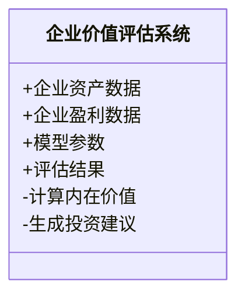
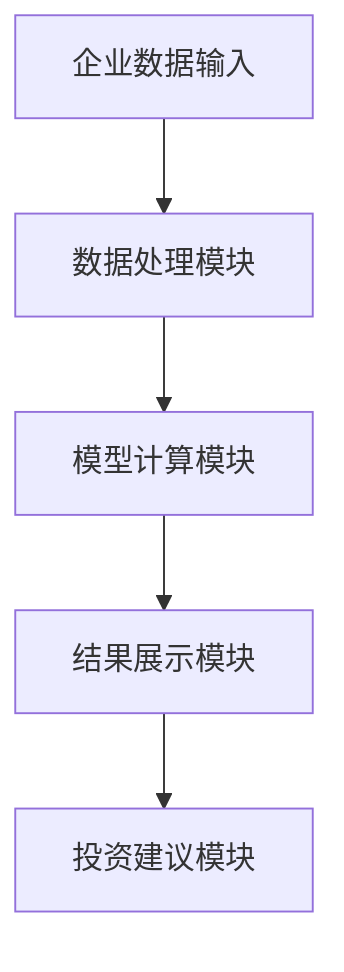

                 


# 格雷厄姆的企业价值评估方法：资产还是盈利？

## 关键词：企业价值评估，资产，盈利，格雷厄姆，投资方法，内在价值

## 摘要：
格雷厄姆的企业价值评估方法是价值投资的重要基石，其核心在于通过分析企业的资产和盈利能力来确定其内在价值。本文详细探讨了格雷厄姆方法的核心概念，包括资产与盈利的关系，数学模型的应用，以及如何通过系统架构设计实现企业价值评估。通过案例分析，进一步验证了格雷厄姆方法的有效性，并提供了实际操作中的最佳实践建议。

---

## 第1章: 背景介绍

### 1.1 问题背景与描述
#### 1.1.1 传统企业价值评估的局限性
传统的企业价值评估方法往往依赖市场波动和主观判断，难以准确反映企业的实际价值。这种方法可能导致投资者在市场波动中做出错误决策。

#### 1.1.2 格雷厄姆投资方法的核心问题
本杰明·格雷厄姆作为价值投资之父，提出了一种基于企业资产和盈利能力的评估方法，旨在发现被市场低估的企业。

#### 1.1.3 资产与盈利的关系在企业价值评估中的重要性
资产和盈利是衡量企业价值的两个关键指标，它们共同决定了企业的内在价值。

### 1.2 格雷厄姆企业价值评估方法的提出
#### 1.2.1 格雷厄姆的学术背景与投资理念
格雷厄姆是哥伦比亚大学的教授，他的投资理念强调安全边际和长期价值，而非短期市场波动。

#### 1.2.2 格雷厄姆方法的核心假设
格雷厄姆假设市场会回归理性，企业的内在价值可以通过分析其资产和盈利能力来确定。

#### 1.2.3 方法在现代企业价值评估中的应用
格雷厄姆的方法被广泛应用于投资领域，成为价值投资的基础。

---

## 第2章: 核心概念与联系

### 2.1 资产与盈利的关系分析
#### 2.1.1 资产的定义与分类
资产是企业拥有的资源，包括流动资产和非流动资产。资产的健康状况直接影响企业的偿债能力和运营能力。

#### 2.1.2 盈利的定义与衡量指标
盈利是企业在一定时期内的收益，常用净利润率来衡量。高盈利表明企业运营效率高，市场竞争力强。

#### 2.1.3 资产与盈利的对比分析
资产和盈利都是衡量企业价值的重要指标，但它们关注的方面不同。资产关注的是企业的资源基础，而盈利关注的是企业的经营效率。

### 2.2 核心概念原理
#### 2.2.1 资产与盈利的内在联系
资产的合理配置可以提高盈利能力，而持续的盈利能力又可以增加企业的资产规模。两者相辅相成。

#### 2.2.2 格雷厄姆模型的核心公式
$$ V = \frac{E}{(1 - g)} $$
其中，V是企业的内在价值，E是企业的盈利，g是预期的盈利能力增长率。

#### 2.2.3 模型的数学表达式与应用场景
通过公式可以看出，企业的内在价值与其盈利能力和资产配置密切相关。格雷厄姆模型适用于评估那些资产稳健、盈利能力稳定的企业。

---

## 第3章: 格雷厄姆模型的算法原理

### 3.1 格雷厄姆模型的数学模型
#### 3.1.1 内在价值公式
$$ V = \sum \frac{CF_t}{(1 + r)^t} $$
其中，CF_t是第t年的现金流，r是折现率。该公式用于计算企业未来现金流的现值，即内在价值。

#### 3.1.2 盈利能力与资产回报率的关系
$$ ROE = \frac{Net\ Profit}{Total\ Equity} $$
ROE（净资产收益率）是衡量企业盈利能力的重要指标，高ROE表明企业利用股东资产创造了更多的利润。

### 3.2 格雷厄姆模型的算法流程
#### 3.2.1 数据收集与处理
收集企业的财务数据，包括资产、负债、收入和利润等。

#### 3.2.2 模型参数计算
计算企业的净资产收益率（ROE）、预期增长率和折现率。

#### 3.2.3 内在价值评估与投资决策
根据计算出的内在价值与市场价格进行比较，判断企业是否被低估。

---

## 第4章: 系统分析与架构设计方案

### 4.1 问题场景介绍
#### 4.1.1 企业价值评估的常见问题
市场波动、信息不透明等因素可能导致企业价值评估的困难。

#### 4.1.2 格雷厄姆模型的应用场景
适用于那些资产稳健、盈利稳定的成熟企业。

### 4.2 系统功能设计
#### 4.2.1 领域模型（Mermaid类图）


### 4.3 系统架构设计
#### 4.3.1 系统架构图（Mermaid架构图）


---

## 第5章: 项目实战

### 5.1 环境安装与配置
#### 5.1.1 数据分析工具安装
安装Python和相关库，如Pandas和NumPy。

#### 5.1.2 格雷厄姆模型代码库安装
安装必要的库，如Matplotlib用于数据可视化。

### 5.2 核心代码实现
#### 5.2.1 内在价值计算代码
```python
def calculate_intrinsic_value(enterprise_value, expected_growth_rate):
    return enterprise_value / (1 - expected_growth_rate)
```

### 5.3 案例分析与解读
#### 5.3.1 某行业龙头企业的评估
以某公司为例，计算其内在价值，并与市场价格进行比较，判断其是否被低估。

---

## 第6章: 总结与小结

### 6.1 核心内容回顾
格雷厄姆的企业价值评估方法通过分析资产和盈利，帮助企业确定其内在价值。

### 6.2 格雷厄姆方法的优缺点
优点：方法简单，易于操作；缺点：适用于成熟企业，对新兴企业可能不太适用。

### 6.3 最佳实践 tips
- 选择资产稳健、盈利稳定的公司进行投资。
- 定期重新评估企业的内在价值，调整投资策略。

### 6.4 注意事项
- 数据来源的准确性影响评估结果。
- 市场波动可能影响短期价格，但不影响长期价值。

### 6.5 拓展阅读
建议阅读格雷厄姆的经典著作《 Intelligent Investor》，深入理解价值投资的理念。

---

## 作者：AI天才研究院 & 禅与计算机程序设计艺术

通过本文的详细分析，您可以掌握格雷厄姆的企业价值评估方法，并将其应用于实际投资中。

