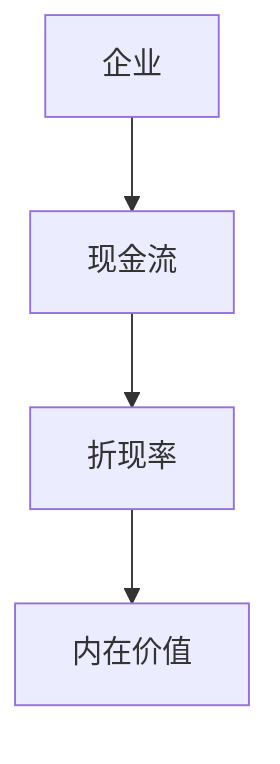
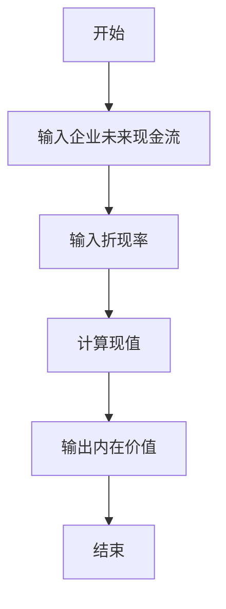

                 


# 格雷厄姆的企业内在价值计算方法

## 关键词：  
企业内在价值、格雷厄姆、价值投资、财务分析、投资策略、计算公式、系统架构设计

## 摘要：  
格雷厄姆的企业内在价值计算方法是价值投资领域的经典理论，通过对企业未来现金流的折现来评估其内在价值。本文将详细讲解该方法的核心概念、数学模型、系统架构设计及实际案例分析，帮助读者掌握如何通过技术手段量化企业价值。

---

# 第一部分: 企业内在价值计算的背景与基础

## 第1章: 投资与企业内在价值概述

### 1.1 投资的基本概念

#### 1.1.1 投资的定义与分类
投资是指将资金投入到某个资产或项目中，以期获得未来收益的行为。根据资产类型，投资可分为股票、债券、房地产等；根据风险程度，可分为低风险投资（如债券）和高风险投资（如股票）。

#### 1.1.2 企业内在价值的定义
企业内在价值是指企业在未来经营中能创造的现金流的现值。它是企业的真实价值，与市场波动无关。

#### 1.1.3 格雷厄姆的价值投资理念
本杰明·格雷厄姆是价值投资的鼻祖，他认为市场的短期波动是机会，而非反映企业的实际价值。投资者应寻找市场价格低于内在价值的企业进行投资。

---

### 1.2 企业内在价值的核心要素

#### 1.2.1 企业的财务状况
企业的财务状况包括资产负债表、利润表和现金流量表，是评估企业内在价值的重要依据。

#### 1.2.2 企业的盈利能力
盈利能力反映企业赚钱能力，常用的指标有净利润率、ROE（净资产收益率）等。

#### 1.2.3 企业的成长潜力
成长潜力指企业未来收入和利润的增长能力，通常通过行业趋势和管理层能力来评估。

---

## 第2章: 企业内在价值的计算公式与核心概念

### 2.1 格雷厄姆内在价值计算公式

#### 2.1.1 格雷厄姆公式的基本结构
格雷厄姆的内在价值公式如下：
$$ V = \frac{E}{(1 + r)^n} $$
其中，\( V \) 为内在价值，\( E \) 为未来现金流的总和，\( r \) 为折现率，\( n \) 为时间跨度。

#### 2.1.2 格雷厄姆公式的关键参数
- \( E \)：未来现金流，需基于企业的盈利能力和增长潜力预测。
- \( r \)：折现率，通常取企业资本成本或债券收益率。
- \( n \)：时间跨度，通常取10年或更长。

#### 2.1.3 格雷厄姆公式的数学推导
通过时间价值理论，未来现金流需折现到现值，以反映资金的时间价值。

---

### 2.2 核心概念与联系

#### 2.2.1 核心概念原理
企业内在价值与未来现金流的现值直接相关，市场价低于内在价值时，投资机会出现。

#### 2.2.2 核心概念属性特征对比表格

| 概念         | 定义                                                                 |
|--------------|------------------------------------------------------------------|
| 现金流       | 企业的现金流入和流出，包括经营活动、投资活动和筹资活动的现金流。 |
| 折现率       | 用于将未来现金流折现到现值的利率，反映资金的时间价值。          |
| 内在价值     | 企业未来现金流的现值，反映企业的真正价值。                    |

#### 2.2.3 实体关系图（ER图）架构


---

### 2.3 算法原理讲解

#### 2.3.1 算法流程


#### 2.3.2 代码实现
```python
def calculate_intrinsic_value(cash_flows, discount_rate):
    intrinsic_value = 0
    for year, cf in enumerate(cash_flows):
        if year == 0:
            discount_factor = 1
        else:
            discount_factor = (1 + discount_rate) ** year
        intrinsic_value += cf / discount_factor
    return intrinsic_value
```

---

## 第3章: 内在价值计算的数学模型与公式

### 3.1 格雷厄姆内在价值计算的数学模型

#### 3.1.1 格雷厄姆公式
$$ V = \frac{E}{(1 + r)^n} $$

---

### 3.2 相关数学公式与推导

#### 3.2.1 折现率的计算公式
$$ r = \frac{D}{P} $$
其中，\( D \) 为股息支付率，\( P \) 为股票价格。

#### 3.2.2 现金流的计算公式
$$ CF = \text{净利润} + \text{折旧} - \text{资本支出} $$

---

### 3.3 举例说明

#### 3.3.1 案例分析
假设某公司未来5年的现金流分别为100万、120万、150万、180万、200万，折现率为10%。

#### 3.3.2 计算现值
$$ PV = \frac{100}{1.1} + \frac{120}{1.1^2} + \frac{150}{1.1^3} + \frac{180}{1.1^4} + \frac{200}{1.1^5} $$

---

## 第4章: 系统分析与架构设计方案

### 4.1 问题场景介绍

#### 4.1.1 投资者如何快速评估企业内在价值
投资者需要通过财务数据和市场信息，快速计算企业的内在价值，以做出投资决策。

#### 4.1.2 系统如何辅助投资决策
通过系统化的方法，利用技术手段辅助投资者计算内在价值，降低人为误差。

---

### 4.2 项目介绍

#### 4.2.1 项目目标
开发一个基于格雷厄姆方法的企业内在价值计算系统。

#### 4.2.2 项目范围
包括数据输入、现金流预测、折现率计算和内在价值输出功能。

#### 4.2.3 项目团队
由数据分析师、软件工程师和投资专家组成。

---

### 4.3 系统功能设计

#### 4.3.1 领域模型类图


---

## 第5章: 项目实战

### 5.1 环境安装

#### 5.1.1 安装Python
```bash
python --version
pip install numpy pandas
```

#### 5.1.2 安装数据分析库
```bash
pip install pandas numpy
```

---

### 5.2 系统核心实现源代码

#### 5.2.1 现金流预测模块
```python
def predict_cash_flows(financial_data):
    # 基于历史财务数据预测未来现金流
    return predicted_flows
```

#### 5.2.2 折现率计算模块
```python
def calculate_discount_rate(risk_free_rate, market_return):
    return risk_free_rate + beta * (market_return - risk_free_rate)
```

---

### 5.3 实际案例分析

#### 5.3.1 案例分析：苹果公司
假设苹果公司未来5年的现金流分别为1000亿、1200亿、1500亿、1800亿、2000亿，折现率为10%。

---

## 第6章: 总结与展望

### 6.1 小结
通过格雷厄姆方法，投资者可以量化企业内在价值，做出更明智的投资决策。

### 6.2 注意事项
- 数据质量对结果影响重大，需确保财务数据的准确性。
- 折现率的选取需基于合理的市场分析。

### 6.3 拓展阅读
建议阅读格雷厄姆的《聪明的投资者》和彼得·林奇的《投资不需要很聪明》。

---

## 作者：  
AI天才研究院/AI Genius Institute & 禅与计算机程序设计艺术 /Zen And The Art of Computer Programming

