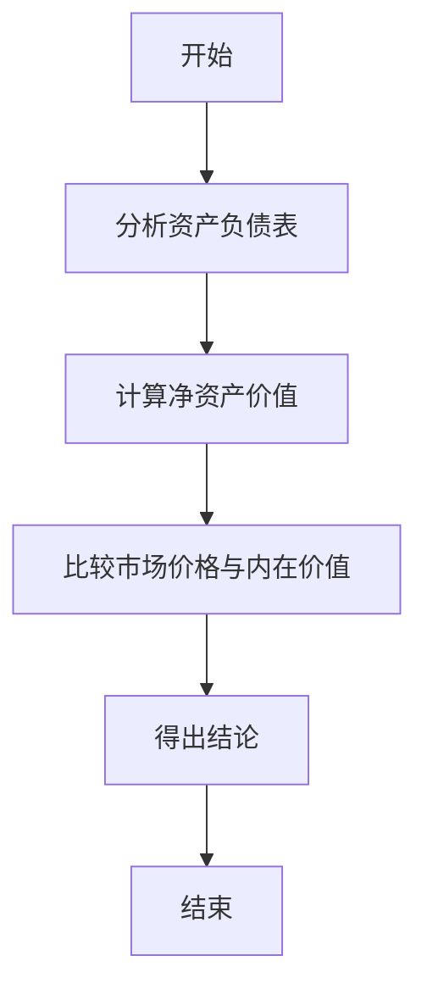
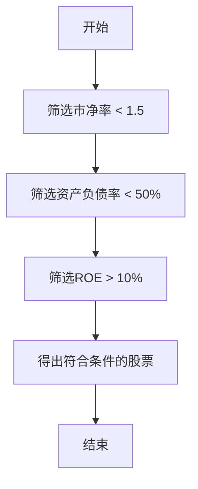
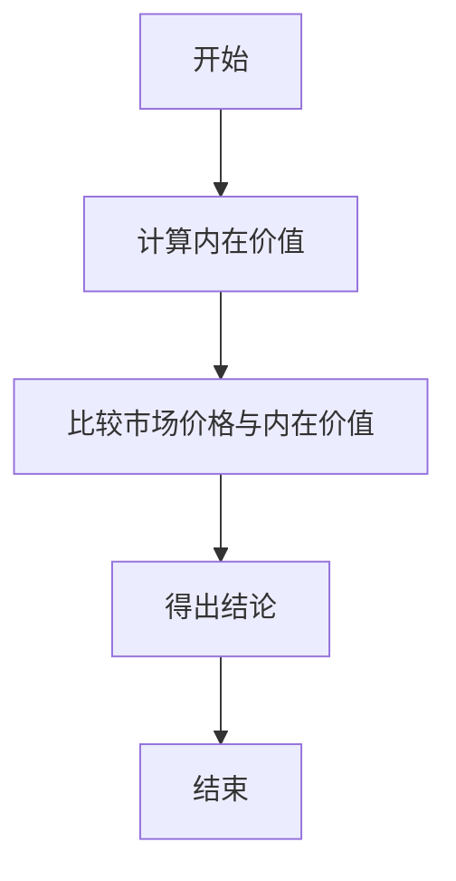
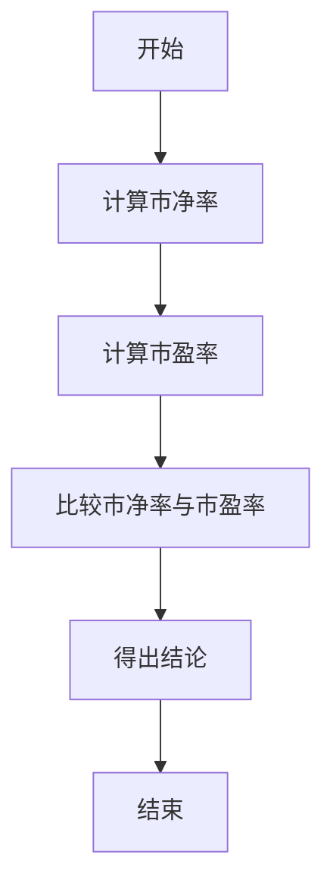
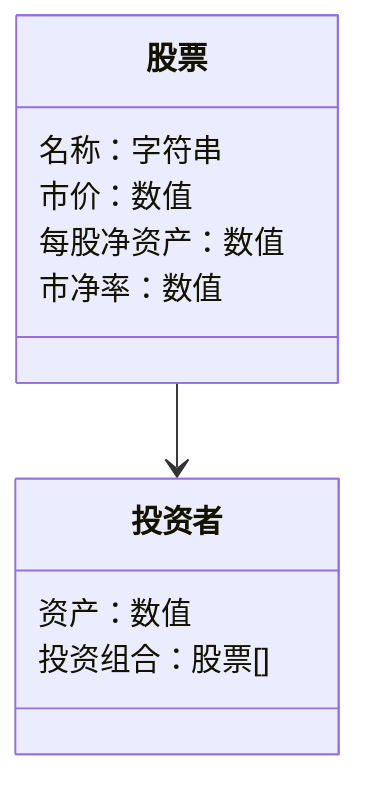
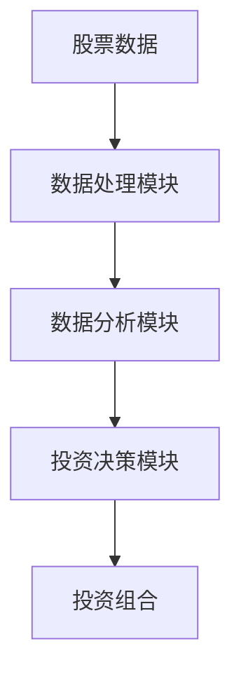
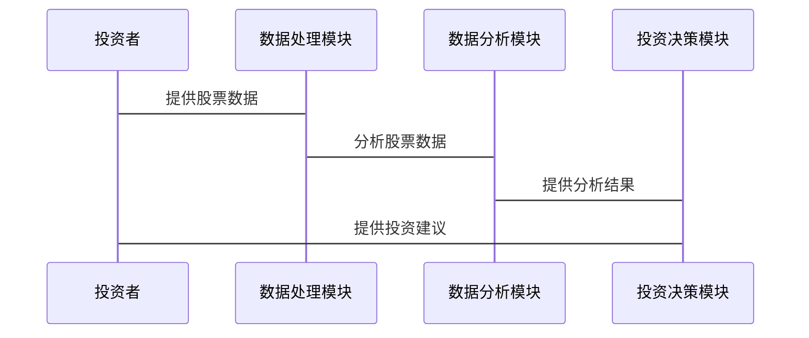

                 


# 格雷厄姆的净净股票策略：寻找极度低估的公司

## 关键词：格雷厄姆, 净净股票策略, 价值投资, 投资组合, 股票分析

## 摘要：本文详细介绍了格雷厄姆的净净股票策略，探讨了其背后的理论基础、实施步骤、数学模型及实际案例分析。通过系统化的分析，帮助投资者识别市场价格远低于内在价值的公司，从而实现长期稳定的收益。文章结合技术语言和专业分析，为读者提供了深入的见解和实践指导。

---

## 第一部分：格雷厄姆的净净股票策略基础

### 第1章：价值投资与净净股票策略概述

#### 1.1 格雷厄姆与价值投资的起源

##### 1.1.1 格雷厄姆的生平与投资理念

本杰明·格雷厄姆（Benjamin Graham）是20世纪最伟大的投资思想家之一，被誉为“价值投资之父”。他出生于1894年，曾在哥伦比亚大学教授证券分析，培养了包括沃伦·巴菲特在内的众多投资大师。格雷厄姆的投资理念强调安全边际和长期稳定收益，主张以低于内在价值的价格购买优质股票。

##### 1.1.2 价值投资的核心思想

价值投资的核心在于寻找市场价格低于内在价值的公司。格雷厄姆认为，市场短期是投票器，长期是称重机。投资者应关注企业的基本面，而非市场的短期波动。他强调，真正的投资是寻找具有安全边际的企业，即市场价格远低于其资产价值。

##### 1.1.3 净净股票策略的定义与目标

净净股票策略是格雷厄姆提出的一种投资方法，旨在通过分析企业的净资产价值，寻找市场价格远低于其内在价值的公司。这种方法的核心在于关注企业的资产状况，而非盈利能力。目标是通过低估值的股票，实现长期的超额收益。

---

#### 1.2 净净股票策略的基本原理

##### 1.2.1 什么是净净股票

净净股票是指那些市场价格远低于其净资产价值的股票。这类股票通常被市场低估，具有较高的安全边际。格雷厄姆认为，这类股票的内在价值可以通过对企业资产的分析来确定，而市场价格则可能因为市场情绪或短期波动而被低估。

##### 1.2.2 净净股票的三大核心要素

1. **资产价值**：企业的总资产减去总负债，即净资产价值。
2. **市场价格**：股票的市价。
3. **安全边际**：市场价格与内在价值之间的差距，越大的差距意味着越高的安全边际。

##### 1.2.3 净净股票与市场价值的关系

净净股票策略的核心在于比较市场价格与内在价值。当市场价格远低于内在价值时，股票具有投资价值。这种关系可以通过市净率（P/B）来衡量，公式为：
$$\text{市净率} = \frac{\text{股价}}{\text{每股净资产}}$$
当市净率低于1时，通常意味着股价低于净资产价值。

---

### 第2章：净净股票策略的理论基础

#### 2.1 股票内在价值的评估方法

##### 2.1.1 格雷厄姆的内在价值计算公式

股票的内在价值可以通过对企业资产的分析来确定。格雷厄姆提出了以下公式：
$$\text{内在价值} = \text{可转换资产价值} + \text{非可转换资产价值} - \text{负债}$$
其中，可转换资产价值是指可以通过出售或转换为现金的资产，而非可转换资产价值是指无法快速变现的资产。

##### 2.1.2 资产负债表分析的重要性

资产负债表是评估企业内在价值的核心工具。通过分析企业的资产、负债和股东权益，投资者可以准确评估企业的净资产价值。以下是一个简单的资产负债表分析流程图：



##### 2.1.3 股东权益的评估与影响

股东权益是企业净资产的重要组成部分，包括股本、资本公积、盈余公积和未分配利润等。格雷厄姆认为，股东权益的稳定性是评估企业内在价值的重要指标。

---

#### 2.2 净净股票策略的核心指标

##### 2.2.1 市净率（P/B）的定义与计算

市净率是衡量股票估值的重要指标，公式为：
$$\text{市净率} = \frac{\text{股价}}{\text{每股净资产}}$$
当市净率低于1时，通常意味着股价低于净资产价值。

##### 2.2.2 净资产收益率（ROE）的计算与意义

净资产收益率是衡量企业盈利能力的重要指标，公式为：
$$\text{净资产收益率} = \frac{\text{净利润}}{\text{股东权益}}$$
高净资产收益率表明企业盈利能力强，但格雷厄姆更关注企业的资产质量而非盈利能力。

##### 2.2.3 其他相关指标

除了市净率和净资产收益率，投资者还应关注其他指标，如股息率和市盈率。股息率公式为：
$$\text{股息率} = \frac{\text{股息支付率}}{\text{股价}}$$
市盈率公式为：
$$\text{市盈率} = \frac{\text{股价}}{\text{每股收益}}$$

---

### 第3章：净净股票策略的实施步骤

#### 3.1 确定投资目标与筛选标准

##### 3.1.1 确定投资目标的三个关键要素

1. **安全边际**：确保市场价格远低于内在价值。
2. **资产质量**：选择具有稳定资产基础的公司。
3. **行业地位**：选择行业龙头或具有竞争优势的公司。

##### 3.1.2 筛选标准的制定与优化

格雷厄姆建议投资者制定严格的筛选标准，如市净率低于1.5，资产负债率低于50%等。以下是一个简单的筛选标准流程图：



##### 3.1.3 如何避免价值陷阱

价值陷阱是指那些看似低估但实际存在重大问题的股票。为了避免价值陷阱，投资者应关注企业的财务健康状况，如是否存在大额应收账款、存货是否合理等。

---

#### 3.2 数据收集与公司分析

##### 3.2.1 财务报表分析的关键步骤

1. **分析资产负债表**：计算净资产价值。
2. **分析利润表**：评估企业的盈利能力。
3. **分析现金流量表**：评估企业的现金流状况。

##### 3.2.2 股价与内在价值的对比分析

通过比较股价与内在价值，投资者可以判断股票是否被低估。以下是一个简单的对比分析流程图：



##### 3.2.3 行业分析与宏观经济因素的影响

行业分析和宏观经济分析是评估股票的重要环节。投资者应关注行业发展趋势、宏观经济政策对企业的影响等。

---

### 第4章：净净股票策略的数学模型与公式

#### 4.1 内在价值计算的数学模型

##### 4.1.1 格雷厄姆的内在价值公式

$$\text{内在价值} = \text{可转换资产价值} + \text{非可转换资产价值} - \text{负债}$$

##### 4.1.2 资产价值的评估与调整

投资者应根据企业的具体情况调整资产价值，如考虑折旧、减值等因素。

---

#### 4.2 市场价值与内在价值的对比分析

##### 4.2.1 市净率与市盈率的对比

通过比较市净率和市盈率，投资者可以判断股票的估值水平。以下是一个简单的对比分析流程图：



---

## 第五部分：系统分析与架构设计方案

### 第5章：净净股票策略的系统分析

#### 5.1 问题场景介绍

本文旨在通过系统化的分析，帮助投资者识别市场价格远低于内在价值的公司，从而实现长期稳定的收益。

#### 5.2 系统功能设计

##### 5.2.1 领域模型

以下是一个简单的领域模型类图：



##### 5.2.2 系统架构设计

以下是一个简单的系统架构图：



##### 5.2.3 系统接口设计

系统接口包括数据输入、数据处理和结果输出三个部分。

##### 5.2.4 系统交互设计

以下是一个简单的系统交互序列图：



---

## 第六部分：项目实战

### 第6章：实际案例分析与解读

#### 6.1 环境安装

投资者需要安装以下工具：
1. 财务数据获取工具（如Yahoo Finance API）
2. 数据分析工具（如Excel、Python）

#### 6.2 系统核心实现源代码

以下是一个简单的Python代码示例：

```python
import pandas as pd

# 获取股票数据
data = pd.read_csv('stock.csv')

# 计算市净率
data['市净率'] = data['股价'] / data['每股净资产']

# 筛选市净率 < 1的股票
cheap_stocks = data[data['市净率'] < 1]

print(cheap_stocks)
```

---

## 第七部分：风险管理与最佳实践

### 第7章：风险管理与注意事项

#### 7.1 风险管理策略

投资者应关注以下风险：
1. **市场风险**：市场波动可能影响股价。
2. **企业风险**：企业财务状况可能恶化。
3. **流动性风险**：股票可能难以变现。

#### 7.2 最佳实践 tips

1. **分散投资**：避免过度集中。
2. **定期复盘**：及时调整投资组合。
3. **持续学习**：关注市场动态和企业变化。

---

## 第八部分：总结与展望

### 第8章：总结与展望

#### 8.1 内容总结

本文详细介绍了格雷厄姆的净净股票策略，探讨了其背后的理论基础、实施步骤、数学模型及实际案例分析。通过系统化的分析，帮助投资者识别市场价格远低于内在价值的公司，从而实现长期稳定的收益。

#### 8.2 未来展望

随着市场环境的变化，净净股票策略需要不断优化和调整。投资者应关注新的分析工具和方法，如大数据分析和人工智能技术，以提高投资效率和准确性。

---

## 作者信息

作者：AI天才研究院/AI Genius Institute & 禅与计算机程序设计艺术 /Zen And The Art of Computer Programming

---

# 结语

通过本文的系统分析和实际案例，读者可以更好地理解和应用格雷厄姆的净净股票策略，从而在投资市场中找到那些被低估的优质股票，实现长期稳定的收益。

