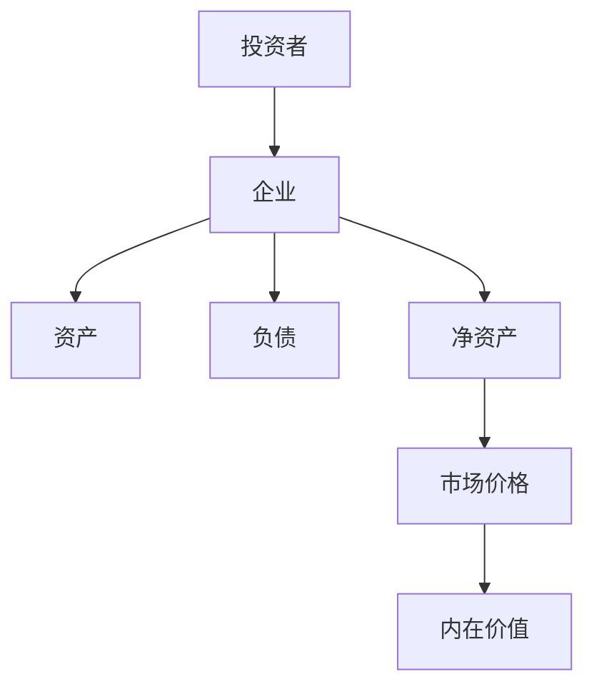
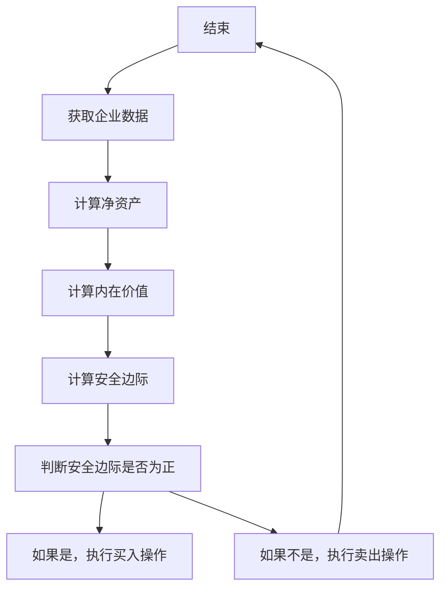
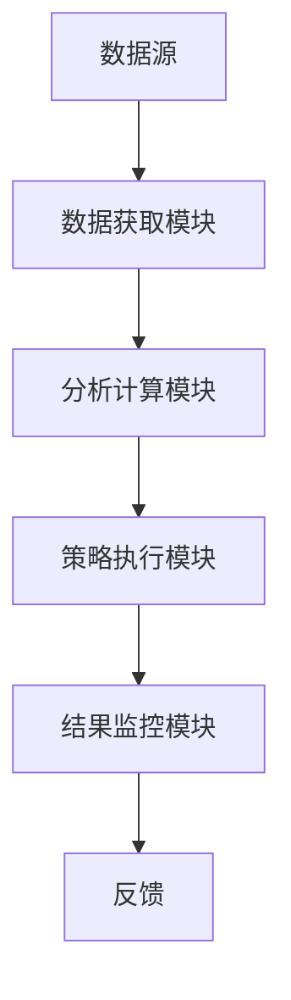

                 


# 格雷厄姆的净净股策略

> 关键词：本杰明·格雷厄姆，价值投资，净净股策略，安全边际，投资策略，股票分析

> 摘要：本篇文章深入探讨了本杰明·格雷厄姆的净净股策略，分析了其核心理念、数学模型、算法原理以及实际应用案例。通过详细的技术分析和系统架构设计，本文为投资者提供了从理论到实践的完整指南。

---

# 第一部分: 格雷厄姆的净净股策略概述

## 第1章: 投资大师本杰明·格雷厄姆简介

### 1.1 本杰明·格雷厄姆的生平与成就

#### 1.1.1 格雷厄姆的早年经历

本杰明·格雷厄姆（Benjamin Graham）是20世纪最伟大的投资理论家之一，被誉为“价值投资之父”。他出生于1894年，早年在伦敦度过，后随家人移民到美国。他在哥伦比亚大学获得了经济学学位，并在华尔街开始了他的职业生涯。

#### 1.1.2 格雷厄姆的投资理念形成

格雷厄姆在职业生涯中逐渐形成了独特的价值投资理念。他认为，股票不仅仅是市场上的价格标签，而是代表了企业的所有权。他的投资策略注重企业的基本面分析，尤其是企业的净资产和盈利能力。

#### 1.1.3 格雷厄姆的著作与影响力

格雷厄姆与戴维·多德（David Dodd）合著了《证券分析》（1934年），这本书奠定了价值投资的基础。此外，他还是《聪明的投资者》（1949年）的作者，这本书成为了全球投资界的经典著作。

### 1.2 格雷厄姆的价值投资理论

#### 1.2.1 价值投资的核心理念

价值投资的核心理念是寻找市场价格低于其内在价值的股票。格雷厄姆认为，市场价格往往会在短期内偏离其真实价值，而长期来看，价格会回归其价值。

#### 1.2.2 格雷厄姆对安全边际的理解

安全边际是指股票的市场价格与内在价值之间的差距。格雷厄姆认为，通过购买市场价格远低于内在价值的股票，可以降低投资风险。

#### 1.2.3 格雷厄姆的投资哲学与现代投资学的联系

格雷厄姆的投资哲学与现代投资学密切相关，他强调了基本面分析的重要性，并为后来的投资者提供了系统的分析框架。

## 第2章: 净净股策略的背景与定义

### 2.1 净资产与股票价值的关系

#### 2.1.1 净资产的定义与计算

净资产是指企业的资产减去负债，即所有者权益。计算公式为：

$$
净资产 = 资产 - 负债
$$

#### 2.1.2 净资产与股票价值的关联

股票的内在价值与企业的净资产密切相关。格雷厄姆认为，股票的合理价格应基于企业的净资产。

#### 2.1.3 净净股策略的核心思想

净净股策略的核心思想是寻找市场价格低于净资产的股票，即：

$$
市场价格 < 净资产
$$

### 2.2 净净股策略的定义与特点

#### 2.2.1 净净股策略的定义

净净股策略是指通过分析企业的净资产，寻找市场价格低于其净资产的股票进行投资。

#### 2.2.2 净净股策略的主要特点

- 重视基本面分析
- 强调安全边际
- 适合长期投资

#### 2.2.3 净净股策略的适用场景与限制

适用场景：市场低迷、企业基本面良好。

限制：仅适用于对冲基金等长期投资者，不适合短期交易。

## 第3章: 净净股策略的核心概念与联系

### 3.1 核心概念原理

#### 3.1.1 净资产评估算法

净资产评估算法通过计算企业的资产、负债和盈利能力，评估其内在价值。

#### 3.1.2 市场价格与内在价值的对比算法

市场价格与内在价值的对比算法用于确定安全边际。

#### 3.1.3 安全边际计算算法

安全边际计算公式为：

$$
安全边际 = 内在价值 - 市场价格
$$

### 3.2 核心概念属性特征对比表格

| 概念       | 定义                           | 特性对比               |
|------------|--------------------------------|------------------------|
| 净资产     | 资产总额减去负债总额           | 反映企业的真实价值       |
| 市场价格   | 股票在市场上的交易价格         | 受市场情绪影响较大       |
| 内在价值   | 股票基于基本面的真实价值       | 需要通过分析计算得出       |
| 安全边际   | 股票价格与内在价值的差距       | 用于降低投资风险         |

### 3.3 ER实体关系图（Mermaid流程图）



---

# 第二部分: 净净股策略的算法与系统架构

## 第4章: 净净股策略的算法原理

### 4.1 算法原理概述

#### 4.1.1 净资产评估算法

净资产评估算法通过计算企业的资产、负债和盈利能力，评估其内在价值。

#### 4.1.2 市场价格与内在价值的对比算法

市场价格与内在价值的对比算法用于确定安全边际。

#### 4.1.3 安全边际计算算法

安全边际计算公式为：

$$
安全边际 = 内在价值 - 市场价格
$$

### 4.2 算法流程图（Mermaid）



## 第5章: 净净股策略的系统架构设计

### 5.1 系统功能设计

#### 5.1.1 数据获取模块

数据获取模块负责收集企业的财务数据和市场数据。

#### 5.1.2 分析计算模块

分析计算模块负责计算净资产、内在价值和安全边际。

#### 5.1.3 策略执行模块

策略执行模块根据计算结果执行买入或卖出操作。

#### 5.1.4 结果监控模块

结果监控模块负责监控投资结果并进行反馈。

### 5.2 系统架构图（Mermaid）



## 第6章: 净净股策略的项目实战

### 6.1 环境安装

需要安装Python、Pandas、NumPy等库。

### 6.2 核心代码实现

```python
import pandas as pd
import numpy as np

def calculate_net_assets(revenue, expenses):
    return revenue - expenses

def calculate_intrinsic_value(net_assets, market_price):
    return net_assets - (market_price * 0.1)

def calculate_margin_of_safety(intrinsic_value, market_price):
    return intrinsic_value - market_price
```

### 6.3 案例分析

以某公司为例，计算其安全边际，并判断是否符合净净股策略。

---

# 第三部分: 净净股策略的最佳实践

## 第7章: 净净股策略的最佳实践

### 7.1 小结

本文详细介绍了格雷厄姆的净净股策略，从理论到实践进行了系统分析。

### 7.2 注意事项

- 严格遵循基本面分析
- 保持长期投资视角
- 定期调整投资组合

### 7.3 拓展阅读

建议阅读格雷厄姆的《证券分析》和《聪明的投资者》。

---

# 作者

作者：AI天才研究院/AI Genius Institute & 禅与计算机程序设计艺术 /Zen And The Art of Computer Programming

