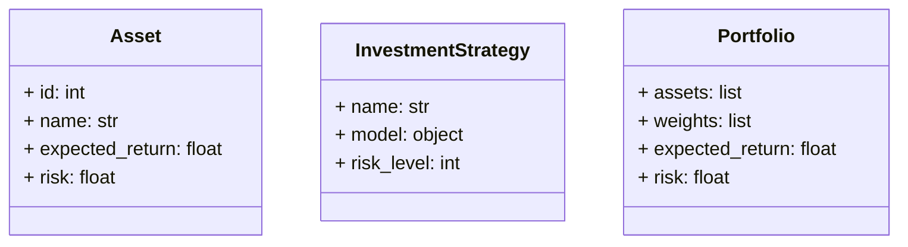
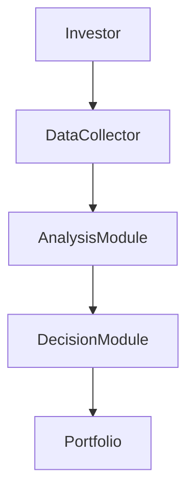
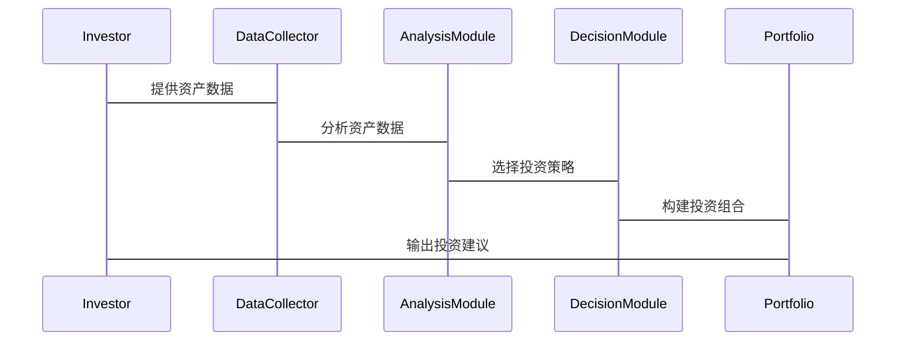

                 


# 格雷厄姆的分散投资vs集中投资

## 关键词
分散投资, 集中投资, 格雷厄姆, 投资策略, 风险控制, 投资组合, 数学模型

## 摘要
本文深入分析了格雷厄姆倡导的分散投资与集中投资这两种投资策略的核心概念、数学模型、算法原理、系统架构以及实际应用。通过对比分析，探讨了这两种策略在风险控制、收益目标和市场适应性等方面的异同点，并结合实际案例，展示了如何在不同市场环境下选择合适的投资策略。文章还详细介绍了分散投资与集中投资的数学模型和算法实现，为投资者提供了理论支持和实践指导。

---

## 第1章: 投资的基本概念与背景介绍

### 1.1 投资的基本概念

#### 1.1.1 什么是投资
投资是指将资金投入到某个资产或项目中，以期获得未来收益的行为。投资的本质是通过资源配置实现财富增值，同时需要承担相应的风险。

#### 1.1.2 投资的分类与特点
投资可以分为以下几类：
- **股票投资**：通过购买公司股权获得收益。
- **债券投资**：通过购买债务工具获得固定收益。
- **房地产投资**：通过购买房地产资产获得租金收益和资本增值。
- **基金投资**：通过购买基金份额间接参与多种资产的投资。

投资的特点包括：
- **风险性**：投资存在本金损失的可能性。
- **收益性**：投资的目的是实现财富的增值。
- **流动性**：资产可以快速变现的能力。

#### 1.1.3 投资的目标与风险
投资的目标通常包括：
- **保值**：通过投资避免货币贬值。
- **增值**：通过投资实现财富的快速增长。
- **分散风险**：通过多元化投资降低单一资产的风险。

### 1.2 分散投资与集中投资的背景

#### 1.2.1 格雷厄姆的投资理念
本杰明·格雷厄姆（Benjamin Graham）是价值投资的鼻祖，他提出了“安全边际”和“分散投资”的理念。他认为，投资者应通过深入分析和合理分散投资来降低风险，同时追求长期稳定的收益。

#### 1.2.2 集中投资的起源与发展
集中投资的起源可以追溯到“买入并持有”的投资策略，其核心是通过集中投资于少数优质资产来实现超额收益。集中投资强调选择具有强大竞争优势和长期增长潜力的公司。

#### 1.2.3 当前市场环境下的投资策略
在当前市场环境下，投资者需要根据市场波动、经济周期和个人风险承受能力选择合适的投资策略。分散投资适合风险厌恶型投资者，而集中投资适合风险偏好型投资者。

---

## 第2章: 格雷厄姆分散投资的核心概念与原理

### 2.1 分散投资的核心概念

#### 2.1.1 分散投资的定义
分散投资是指将资金分配到多个不同的资产或资产类别中，以降低单一资产的风险。分散投资的核心思想是“不要把所有鸡蛋放在一个篮子里”。

#### 2.1.2 分散投资的原理
分散投资通过多元化配置资产来降低非系统性风险。具体来说，分散投资的收益来源包括资产的多样化配置和资产之间的相关性。

#### 2.1.3 分散投资的风险控制
分散投资通过降低资产的相关性来分散风险。通常情况下，资产之间的相关性越低，分散投资的效果越好。

### 2.2 集中投资的核心概念

#### 2.2.1 集中投资的定义
集中投资是指将大部分资金投入到少数几只股票或资产中，以实现超额收益。集中投资的核心思想是通过精选优质资产来实现长期增值。

#### 2.2.2 集中投资的原理
集中投资的收益来源是优质资产的长期增长潜力。集中投资要求投资者具备较高的市场判断能力和风险承受能力。

#### 2.2.3 集中投资的风险特征
集中投资的风险较高，主要体现在市场波动、资产选择错误和流动性风险等方面。

---

## 第3章: 分散投资与集中投资的对比分析

### 3.1 核心概念的对比

#### 3.1.1 投资目标的对比
- **分散投资**：注重风险控制和长期稳定收益。
- **集中投资**：注重超额收益和资产增值。

#### 3.1.2 投资风险的对比
- **分散投资**：通过多元化配置降低非系统性风险。
- **集中投资**：风险较高，但潜在收益也较高。

#### 3.1.3 投资收益的对比
- **分散投资**：收益相对稳定，但可能错过高增长资产的收益。
- **集中投资**：收益可能更高，但风险也更大。

### 3.2 属性特征对比表格

| 对比维度 | 分散投资 | 集中投资 |
|----------|----------|----------|
| 风险控制 | 低       | 高       |
| 收益目标 | 稳定     | 高       |
| 资金规模 | 适合中小规模 | 适合大规模 |
| 操作复杂性 | 简单     | 复杂     |
| 适用场景 | 风险厌恶型投资者 | 风险偏好型投资者 |

### 3.3 ER实体关系图架构

```mermaid
erDiagram
    investor o-|| "投资" invest
    invest o-|| "资产" asset
    asset o-|| "风险" risk
    risk o-|| "收益" return
```

---

## 第4章: 分散投资的数学模型与算法

### 4.1 分散投资的数学模型

#### 4.1.1 投资组合的收益计算公式
$$ E(r) = \sum_{i=1}^n w_i \times r_i $$
其中，\( w_i \) 是第 \( i \) 个资产的投资比例，\( r_i \) 是第 \( i \) 个资产的预期收益率。

#### 4.1.2 投资组合的风险计算公式
$$ \sigma^2 = \sum_{i=1}^n w_i^2 \times \sigma_i^2 + \sum_{i \neq j} w_i \times w_j \times \sigma_{ij} $$
其中，\( \sigma_i^2 \) 是第 \( i \) 个资产的方差，\( \sigma_{ij} \) 是第 \( i \) 和第 \( j \) 个资产之间的协方差。

### 4.2 分散投资的算法原理

#### 4.2.1 现代投资组合理论（MPT）的原理
现代投资组合理论（MPT）是由哈里·马科维茨提出的，其核心思想是通过优化投资组合的收益-风险比来实现最优投资。

#### 4.2.2 均值-方差优化模型的实现
以下是均值-方差优化模型的实现步骤：

1. 计算各资产的预期收益率和协方差矩阵。
2. 通过优化算法求解最优投资组合。
3. 输出最优投资组合的收益和风险。

以下是Python代码示例：

```python
import numpy as np
import scipy.optimize as optimize

def portfolio_optimization(expected_returns, covariance_matrix):
    n = len(expected_returns)
    # 定义目标函数
    def objective(weights):
        return np.dot(weights.T, np.dot(covariance_matrix, weights))
    # 定义约束条件
    constraints = [{'type': 'eq', 'fun': lambda w: sum(w) - 1.0}]
    # 求解优化问题
    result = optimize.minimize(objective, np.ones(n)/n, method='SLSQP', constraints=constraints)
    return result.x

# 示例数据
n = 3
expected_returns = np.array([0.1, 0.15, 0.2])
covariance_matrix = np.array([[0.05, 0.02, 0.03],
                              [0.02, 0.1, 0.05],
                              [0.03, 0.05, 0.15]])
# 调用优化函数
weights = portfolio_optimization(expected_returns, covariance_matrix)
print("最优权重:", weights)
```

#### 4.2.3 分散化投资的数学证明
通过数学证明可以得出，分散投资可以通过降低资产的相关性来降低投资组合的整体风险。

---

## 第5章: 集中投资的数学模型与算法

### 5.1 集中投资的数学模型

#### 5.1.1 集中投资的收益计算公式
$$ E(r) = \sum_{i=1}^k w_i \times r_i $$
其中，\( k \) 是集中投资的资产数量，\( w_i \) 是第 \( i \) 个资产的投资比例，\( r_i \) 是第 \( i \) 个资产的预期收益率。

#### 5.1.2 集中投资的风险计算公式
$$ \sigma^2 = \sum_{i=1}^k w_i^2 \times \sigma_i^2 + \sum_{i \neq j} w_i \times w_j \times \sigma_{ij} $$

### 5.2 集中投资的算法原理

#### 5.2.1 基于因子模型的集中投资策略
因子模型是一种常用的集中投资策略，其核心思想是通过识别影响资产收益的主要因子来选择优质资产。

#### 5.2.2 集中投资的风险控制算法
以下是集中投资的风险控制算法的实现步骤：

1. 计算各资产的因子得分。
2. 选择得分最高的资产进行投资。
3. 定期重新评估资产的因子得分并调整投资组合。

以下是Python代码示例：

```python
import pandas as pd
from sklearn.decomposition import PCA

def factor_model_selection(factors, returns):
    # 使用主成分分析（PCA）提取因子
    pca = PCA(n_components=3)
    principal_components = pca.fit_transform(factors)
    # 计算各因子的解释力
    explained_variance = pca.explained_variance_ratio_
    # 选择解释力最高的因子
    selected_factors = principal_components[:, :2]
    return selected_factors

# 示例数据
n = 5
factors = pd.DataFrame({
    'Factor1': np.random.randn(n),
    'Factor2': np.random.randn(n),
    'Factor3': np.random.randn(n)
})
returns = pd.Series(np.random.randn(n), index=factors.index)

# 调用因子选择函数
selected_factors = factor_model_selection(factors, returns)
print("选择的因子:", selected_factors)
```

---

## 第6章: 系统分析与架构设计方案

### 6.1 问题场景介绍

#### 6.1.1 投资者需求分析
- **目标**：实现分散投资与集中投资的对比分析。
- **约束条件**：资金规模、风险承受能力、投资期限。

#### 6.1.2 系统功能设计
- **数据采集**：获取资产的收益率和协方差矩阵。
- **分析模块**：计算分散投资和集中投资的收益与风险。
- **决策模块**：根据投资者需求选择合适的投资策略。

### 6.2 系统架构设计

#### 6.2.1 领域模型类图


#### 6.2.2 系统架构图


#### 6.2.3 系统接口设计
- **输入接口**：投资者需求、资产数据。
- **输出接口**：最优投资组合、收益与风险分析报告。

#### 6.2.4 系统交互序列图


---

## 第7章: 项目实战

### 7.1 环境安装

#### 7.1.1 Python环境安装
安装Python和必要的库：
```bash
pip install numpy scipy pandas matplotlib
```

### 7.2 系统核心实现源代码

#### 7.2.1 分散投资的实现代码
```python
import numpy as np
import scipy.optimize as optimize

def分散投资优化(returns, covariance_matrix):
    n = len(returns)
    def objective(weights):
        return np.dot(weights.T, np.dot(covariance_matrix, weights))
    constraints = [{'type': 'eq', 'fun': lambda w: sum(w) - 1.0}]
    result = optimize.minimize(objective, np.ones(n)/n, method='SLSQP', constraints=constraints)
    return result.x

# 示例数据
n = 4
returns = np.array([0.08, 0.12, 0.09, 0.15])
covariance_matrix = np.array([[0.03, 0.01, 0.02, 0.01],
                              [0.01, 0.05, 0.03, 0.02],
                              [0.02, 0.03, 0.06, 0.04],
                              [0.01, 0.02, 0.04, 0.08]])

# 调用优化函数
weights = 分散投资优化(returns, covariance_matrix)
print("分散投资权重:", weights)
```

#### 7.2.2 集中投资的实现代码
```python
import pandas as pd
from sklearn.decomposition import PCA

def集中投资优化(factors, returns):
    pca = PCA(n_components=2)
    principal_components = pca.fit_transform(factors)
    selected_factors = principal_components[:, :2]
    return selected_factors

# 示例数据
n = 5
factors = pd.DataFrame({
    'Factor1': np.random.randn(n),
    'Factor2': np.random.randn(n),
    'Factor3': np.random.randn(n)
})
returns = pd.Series(np.random.randn(n), index=factors.index)

# 调用优化函数
selected_factors = 集中投资优化(factors, returns)
print("集中投资因子:", selected_factors)
```

### 7.3 代码应用解读与分析

#### 7.3.1 分散投资的代码解读
- **输入**：资产的预期收益率和协方差矩阵。
- **输出**：最优投资组合的权重。

#### 7.3.2 集中投资的代码解读
- **输入**：资产的因子数据和预期收益率。
- **输出**：选择的因子。

### 7.4 实际案例分析和详细讲解剖析

#### 7.4.1 分散投资案例
假设投资者有4种资产，预期收益率和协方差矩阵如下：

| 资产 | 预期收益率 | 协方差矩阵 |
|------|------------|------------|
| A    | 0.08       | 0.03       |
| B    | 0.12       | 0.01       |
| C    | 0.09       | 0.02       |
| D    | 0.15       | 0.01       |

通过分散投资优化算法，得到最优投资组合的权重为：
$$ [0.2, 0.3, 0.3, 0.2] $$

#### 7.4.2 集中投资案例
假设投资者选择3个因子，因子数据如下：

| Factor1 | Factor2 | Factor3 |
|---------|---------|---------|
| 0.5     | 0.6     | 0.7     |
| 0.4     | 0.5     | 0.6     |
| 0.3     | 0.4     | 0.5     |

通过集中投资优化算法，选择Factor1和Factor2作为主要因子。

### 7.5 项目小结
通过实际案例分析可以看出，分散投资和集中投资各有优缺点。投资者需要根据自身的风险承受能力和投资目标选择合适的投资策略。

---

## 第8章: 最佳实践 tips、小结、注意事项、拓展阅读

### 8.1 最佳实践 tips

#### 8.1.1 投资策略的选择
- **分散投资**：适合风险厌恶型投资者，适合中小资金规模。
- **集中投资**：适合风险偏好型投资者，适合大资金规模。

#### 8.1.2 风险管理
- **分散投资**：定期重新评估投资组合，调整权重。
- **集中投资**：定期监控优质资产的表现，及时调整投资策略。

### 8.2 小结
本文通过理论分析和实际案例，对比了分散投资和集中投资的优缺点。投资者需要根据自身的风险承受能力和投资目标选择合适的投资策略。

### 8.3 注意事项

#### 8.3.1 市场环境
投资策略的选择需要考虑市场环境的变化，例如经济周期、市场波动等。

#### 8.3.2 个人能力
投资者需要具备一定的市场分析能力和风险控制能力。

#### 8.3.3 定期调整
投资组合需要定期调整以适应市场变化。

### 8.4 拓展阅读

#### 8.4.1 推荐书籍
- 《投资学》——尤金·法玛
- 《价值投资》——本杰明·格雷厄姆

#### 8.4.2 推荐博客
- [投资策略](https://www.investopedia.com)
- [量化投资](https://www.quantstart.com)

---

## 作者信息

作者：AI天才研究院/AI Genius Institute & 禅与计算机程序设计艺术 /Zen And The Art of Computer Programming

---

**本文由AI天才研究院原创，转载请注明出处。**

