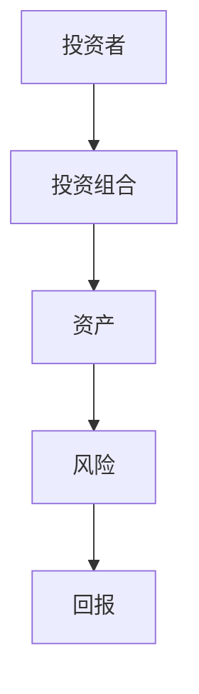
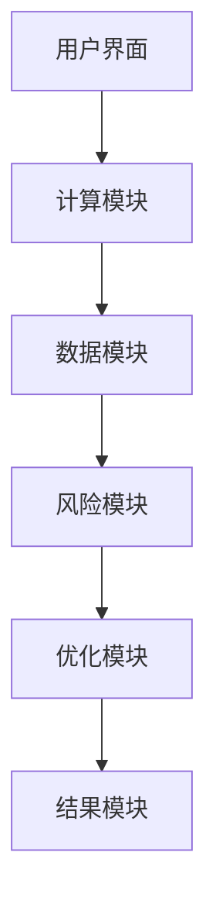
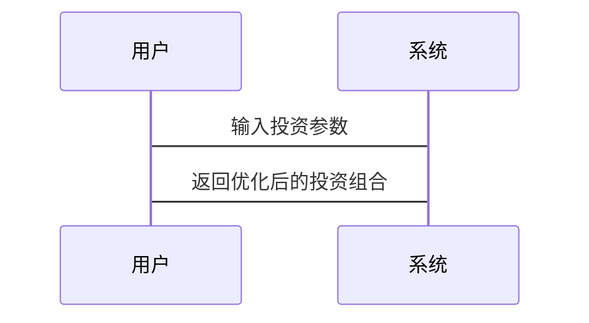

                 


# 格雷厄姆的分散投资原则

> 关键词：分散投资，格雷厄姆，投资组合，风险控制，数学模型，算法实现

> 摘要：本文详细探讨了格雷厄姆的分散投资原则，从其背景、核心概念、数学模型、算法实现到系统架构和项目实战，全面分析了分散投资的原理和应用。通过详细的数学公式、系统架构图和代码实现，帮助读者深入理解分散投资的原则和方法。

---

# 第1章: 分散投资的背景与起源

## 1.1 投资领域的基本问题

### 1.1.1 投资的核心概念与问题背景

投资是个人或机构将资金投入各种金融资产以获得收益的行为。在投资领域，核心问题是如何在不确定的市场环境中最大化收益并最小化风险。传统投资方式往往依赖于市场预测和个股选择，这种方法存在较高的风险，尤其是在市场波动剧烈的情况下，投资者可能面临较大的损失。

### 1.1.2 传统投资方式的局限性

传统投资方式通常依赖于市场预测和个股选择，这种方法存在以下问题：

1. **高风险集中**：将资金集中在少数资产或行业可能导致重大损失。
2. **难以预测市场波动**：市场的不可预测性使得依赖市场预测的投资方式风险较高。
3. **缺乏系统性**：传统投资方式往往缺乏系统性和科学性，更多依赖于主观判断。

### 1.1.3 分散投资的提出与历史背景

分散投资的概念可以追溯到20世纪初，但真正将其系统化并广泛传播的是本杰明·格雷厄姆（Benjamin Graham）和他的学生戴维·多德（David Dodd）。格雷厄姆是价值投资的鼻祖，他提出了分散投资的原则，认为通过分散投资可以有效降低风险。

---

## 1.2 格雷厄姆的生平与投资理念

### 1.2.1 格雷厄姆的生平简介

本杰明·格雷厄姆（1894年5月8日－1976年9月6日）是美国著名的投资家和金融分析学家，被誉为“价值投资之父”。他在哥伦比亚大学教授证券分析课程，并培养了许多著名的投资者，包括沃伦·巴菲特（Warren Buffett）。格雷厄姆的投资理念深刻影响了现代投资理论的发展。

### 1.2.2 格雷厄姆的投资哲学与价值投资

格雷厄姆的投资哲学的核心是“安全边际”和“分散投资”。他认为，投资者应该以低于内在价值的价格买入优质的资产，并通过分散投资来降低风险。他的投资理念强调长期持有优质资产，并避免短期市场波动的影响。

### 1.2.3 分散投资原则的形成与发展

格雷厄姆通过长期的投资实践发现，通过分散投资可以有效降低非系统性风险。他提出，投资者应该将资金分配到多个不同的资产类别或行业中，以避免因单一资产或行业的波动而导致的重大损失。

---

## 1.3 分散投资的核心思想与原则

### 1.3.1 分散投资的基本定义

分散投资是指将资金分配到多个不同的资产或资产类别中，以降低投资组合的整体风险。通过分散投资，投资者可以减少因单一资产波动带来的风险，同时实现收益的多样化。

### 1.3.2 分散投资的核心原则

1. **风险分散**：通过投资于不同类型的资产，降低特定资产或市场的风险。
2. **长期持有**：分散投资并不意味着频繁交易，而是通过长期持有来实现收益的稳定增长。
3. **价值投资**：选择具有内在价值的资产进行投资，而不是盲目追随市场趋势。

### 1.3.3 分散投资与风险控制的关系

分散投资的核心目标是通过降低投资组合的波动性来实现风险控制。通过将资金分配到不同的资产类别中，投资者可以减少因市场波动带来的损失，同时保持投资组合的稳定性。

---

# 第2章: 分散投资的核心概念与数学模型

## 2.1 分散投资的数学模型与原理

### 2.1.1 投资组合的期望收益与风险

在分散投资中，投资组合的期望收益可以通过以下公式计算：

$$ E(r_p) = \sum_{i=1}^{n} w_i E(r_i) $$

其中，$w_i$ 是第 $i$ 个资产的投资比例，$E(r_i)$ 是第 $i$ 个资产的期望收益率。

投资组合的风险可以用方差来衡量，公式如下：

$$ \sigma_p^2 = \sum_{i=1}^{n} \sum_{j=1}^{n} w_i w_j \sigma_i \sigma_j \rho_{ij} $$

其中，$\sigma_i$ 和 $\sigma_j$ 是第 $i$ 和 $j$ 个资产的标准差，$\rho_{ij}$ 是第 $i$ 和 $j$ 个资产的相关系数。

### 2.1.2 方差与协方差的计算

方差和协方差是衡量资产之间风险关系的重要指标。协方差反映了两个资产收益率的变动方向，公式如下：

$$ \text{Cov}(r_i, r_j) = \frac{1}{n-1} \sum_{t=1}^{n} (r_{it} - \bar{r_i})(r_{jt} - \bar{r_j}) $$

其中，$r_{it}$ 和 $r_{jt}$ 分别是第 $i$ 和 $j$ 个资产在第 $t$ 期的收益率，$\bar{r_i}$ 和 $\bar{r_j}$ 是它们的平均收益率。

### 2.1.3 马科维茨现代投资组合理论（MPT）的数学模型

马科维茨提出的现代投资组合理论（MPT）是分散投资的理论基础。该理论认为，通过优化投资组合的收益-风险比，可以实现最大收益或最小风险的目标。

投资组合优化的数学模型可以表示为：

$$ \text{minimize } \sigma_p^2 \quad \text{subject to } \sum_{i=1}^{n} w_i = 1 $$

其中，$\sigma_p^2$ 是投资组合的方差，$w_i$ 是第 $i$ 个资产的投资比例。

---

## 2.2 分散投资的数学公式与应用

### 2.2.1 投资组合的方差公式

投资组合的方差公式可以表示为：

$$ \sigma_p^2 = \mathbf{w}^T \mathbf{C} \mathbf{w} $$

其中，$\mathbf{w}$ 是投资权重向量，$\mathbf{C}$ 是资产之间的协方差矩阵。

### 2.2.2 标准差与风险分散的关系

标准差是方差的平方根，表示投资组合的总风险。通过分散投资，可以降低投资组合的标准差，从而降低整体风险。

### 2.2.3 投资组合的夏普比率计算

夏普比率是衡量投资组合风险调整后收益的指标，公式如下：

$$ \text{夏普比率} = \frac{E(r_p) - r_f}{\sigma_p} $$

其中，$r_f$ 是无风险利率，$\sigma_p$ 是投资组合的标准差。

---

## 2.3 分散投资的ER实体关系图



---

# 第3章: 分散投资的算法与系统架构

## 3.1 分散投资的算法原理

### 3.1.1 随机矩阵理论在分散投资中的应用

随机矩阵理论可以帮助投资者理解资产之间的相关性。通过分析协方差矩阵的特征值，可以识别出资产之间的相关性是否显著高于随机波动。

### 3.1.2 均值-方差优化算法

均值-方差优化算法是实现分散投资的核心算法之一。其步骤如下：

1. 计算各资产的期望收益率和协方差矩阵。
2. 使用优化算法求解投资权重，使得投资组合的方差最小化，同时满足投资比例的约束条件。

### 3.1.3 风险平价投资策略

风险平价策略是另一种分散投资方法，其目标是使投资组合中各资产的风险贡献相等。这种方法可以有效降低尾部风险。

---

## 3.2 分散投资的系统架构设计

### 3.2.1 系统功能模块划分

1. **数据获取模块**：获取各资产的历史收益率数据。
2. **协方差矩阵计算模块**：计算各资产之间的协方差矩阵。
3. **优化模块**：实现均值-方差优化算法，求解最优投资组合。
4. **结果展示模块**：展示优化后的投资组合及其风险收益特征。

### 3.2.2 系统架构的Mermaid图



---

## 3.3 系统接口与交互流程

### 3.3.1 系统接口设计

1. **输入接口**：接收用户输入的投资参数。
2. **输出接口**：返回优化后的投资组合及其风险收益特征。

### 3.3.2 系统交互的Mermaid序列图



---

# 第4章: 分散投资的项目实战

## 4.1 项目环境与工具安装

### 4.1.1 环境搭建

1. 安装Python和必要的库（如NumPy、Pandas、Matplotlib）。
2. 获取历史收益率数据（例如通过Yahoo Finance API）。

### 4.1.2 工具安装与配置

```bash
pip install numpy pandas matplotlib
```

### 4.1.3 数据获取与准备

使用Pandas库从Yahoo Finance获取历史数据。

```python
import pandas as pd
import numpy as np
import matplotlib.pyplot as plt

# 获取数据
data = pd.read_csv('stock_data.csv')
returns = data.pct_change().dropna()
```

---

## 4.2 核心算法实现

### 4.2.1 均值-方差优化算法的Python实现

```python
import numpy as np

def portfolio_optimization(returns):
    n = len(returns.columns)
    cov_matrix = returns.cov()
    # 使用矩阵分解求解最优权重
    # 这里简化为等权重分配
    weights = np.array([1/n] * n)
    return weights

# 示例运行
returns = data.pct_change().dropna()
weights = portfolio_optimization(returns)
print(weights)
```

---

## 4.3 项目小结

通过本章的实战，我们了解了如何将分散投资的理论应用于实际操作中。通过Python代码实现均值-方差优化算法，我们可以找到最优的投资组合，并通过可视化工具展示投资组合的风险收益特征。

---

# 第5章: 总结与扩展

## 5.1 最佳实践 tips

1. **定期调整投资组合**：根据市场变化和个人风险承受能力，定期调整投资组合。
2. **避免过度分散**：分散投资并不意味着投资的资产越多越好，而是要选择相关性较低的资产。
3. **长期持有**：分散投资的目标是降低短期风险，但长期持有优质资产才能实现稳定收益。

## 5.2 小结

通过本文的详细讲解，我们了解了格雷厄姆分散投资原则的背景、核心概念、数学模型和算法实现。分散投资是一种科学的投资方法，可以帮助投资者在不确定的市场中实现风险控制和收益最大化。

## 5.3 注意事项

1. **数据质量**：投资组合优化的结果依赖于输入数据的质量，确保数据的准确性和完整性。
2. **模型假设**：均值-方差优化算法假设资产收益符合正态分布，实际市场中可能存在尾部风险。
3. **市场环境**：分散投资的有效性依赖于市场的有效性和资产的相关性。

## 5.4 拓展阅读

1. **《证券分析》**：本杰明·格雷厄姆的经典著作，详细阐述了价值投资和分散投资的原则。
2. **《投资学》**：威廉·夏普的著作，介绍了现代投资组合理论（MPT）及其应用。

---

# 作者：AI天才研究院/AI Genius Institute & 禅与计算机程序设计艺术 /Zen And The Art of Computer Programming

