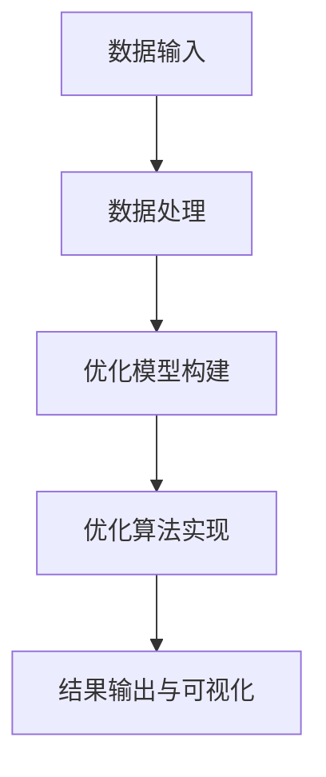

                 


# 分散投资原则：不要把鸡蛋放在一个篮子里

> 关键词：分散投资原则，风险管理，投资组合优化，马科维茨投资组合理论，夏普比率，资产配置

> 摘要：本文从格雷厄姆的分散投资原则出发，详细探讨了分散投资的核心概念、数学模型、资产配置策略、风险管理方法、算法实现、系统架构设计以及实际案例分析。通过理论与实践相结合的方式，帮助读者理解分散投资的原理和应用，掌握如何通过科学的资产配置和投资组合优化来降低投资风险，提高投资收益。

---

# 第1章: 分散投资原则的背景与核心概念

## 1.1 分散投资的起源

### 1.1.1 传统投资理念的演变

现代投资理论的发展经历了多个阶段，从早期的“基本面分析”到后来的“技术分析”，再到现在的“现代投资组合理论”。格雷厄姆作为价值投资的鼻祖，提出了分散投资的理念，强调通过分散投资来降低风险。

### 1.1.2 格雷厄姆的投资哲学

格雷厄姆在其经典著作《证券分析》中提出，投资者应通过分散投资来降低非系统性风险。他认为，通过持有多种不同类型的资产，可以有效降低单一资产带来的风险。

### 1.1.3 分散投资的核心理念

分散投资的核心理念是“不要把所有的鸡蛋放在一个篮子里”。通过将资金分配到不同的资产类别、行业或地域，投资者可以在市场波动时保持投资组合的稳定性。

---

## 1.2 分散投资的重要性

### 1.2.1 风险管理的核心地位

风险管理是投资过程中最重要的环节之一。通过分散投资，投资者可以降低特定资产或市场的风险，从而提高整体投资组合的稳定性。

### 1.2.2 分散投资与风险控制的关系

分散投资通过将资金分配到不同的资产类别或市场，可以有效降低非系统性风险。然而，分散投资并不能完全消除系统性风险，例如市场整体下跌时，所有资产都会受到影响。

### 1.2.3 投资组合的稳定性与收益性

分散投资可以在保持投资组合稳定性的前提下，追求更高的收益。通过科学的资产配置，投资者可以在不同市场环境下获得相对稳定的收益。

---

## 1.3 分散投资与集中投资的对比

### 1.3.1 集中投资的风险与收益

集中投资通过集中资金在少数几只股票或资产上，可以获得较高的收益，但同时也伴随着较高的风险。当集中投资的资产表现不佳时，投资组合会受到较大冲击。

### 1.3.2 分散投资的优势与局限

分散投资的优势在于风险分散，但其收益可能不如集中投资。分散投资更适合风险厌恶型投资者，而集中投资则更适合风险偏好型投资者。

### 1.3.3 选择分散投资的条件与场景

在选择分散投资时，需要考虑市场环境、投资者的风险承受能力以及资产的相关性等因素。在市场波动较大或经济不确定性较高的情况下，分散投资更具优势。

---

# 第2章: 分散投资的核心概念与数学模型

## 2.1 投资组合的数学模型

### 2.1.1 投资组合的定义与组成

投资组合是指投资者持有的多种资产的集合。投资组合的收益和风险取决于资产的权重、资产的收益以及资产之间的相关性。

### 2.1.2 投资组合的期望收益与风险

投资组合的期望收益可以通过加权平均计算，而风险则通过方差和协方差矩阵来衡量。

### 2.1.3 投资组合的优化目标

投资组合优化的目标是在给定风险下最大化收益，或在给定收益下最小化风险。

---

## 2.2 马科维茨的有效前沿模型

### 2.2.1 马科维茨投资组合理论的概述

马科维茨在1952年提出了现代投资组合理论，认为通过分散投资可以降低风险。有效前沿是投资组合理论的核心概念，表示在给定风险下收益最高的投资组合。

### 2.2.2 有效前沿的数学表达

有效前沿的数学表达可以通过优化问题来描述：

$$
\min_w \sigma^2 \quad \text{subject to} \quad \sum_{i=1}^{n} w_i = 1
$$

其中，$\sigma^2$ 表示投资组合的方差，$w_i$ 表示第 $i$ 个资产的权重。

### 2.2.3 有效前沿的计算与应用

通过求解上述优化问题，可以得到有效前沿上的投资组合。这些组合在相同的风险下具有最高的收益，或在相同的收益下具有最低的风险。

---

## 2.3 分散投资的数学公式

### 2.3.1 方差的计算公式

投资组合的方差可以通过以下公式计算：

$$
\sigma^2 = \sum_{i=1}^{n} \sum_{j=1}^{n} w_i w_j \sigma_{ij}
$$

其中，$\sigma_{ij}$ 表示第 $i$ 和第 $j$ 个资产之间的协方差。

### 2.3.2 投资组合的优化目标

投资组合的优化目标可以通过以下公式表示：

$$
\min_w \sigma^2 \quad \text{subject to} \quad \sum_{i=1}^{n} w_i = 1
$$

---

# 第3章: 分散投资的资产配置策略

## 3.1 资产配置的基本原理

### 3.1.1 资产配置的定义与分类

资产配置是指将资金分配到不同的资产类别（如股票、债券、现金等）中，以实现风险分散和收益最大化。

### 3.1.2 不同资产类别的风险与收益特征

股票通常具有较高的收益和风险，债券则具有较低的收益和风险，现金具有较低的风险但流动性较高。

### 3.1.3 资产配置的动态调整

根据市场环境和投资者的风险偏好，资产配置需要进行动态调整。

---

## 3.2 现代投资组合理论在分散投资中的应用

### 3.2.1 风险调整后的收益比较

通过夏普比率可以比较不同投资组合的风险调整后收益。

### 3.2.2 投资组合的夏普比率计算

夏普比率的公式为：

$$
\text{夏普比率} = \frac{r_p - r_f}{\sigma_p}
$$

其中，$r_p$ 是投资组合的收益，$r_f$ 是无风险利率，$\sigma_p$ 是投资组合的风险。

### 3.2.3 投资组合的绩效评估

通过夏普比率和其他风险指标可以对投资组合的绩效进行评估。

---

## 3.3 分散投资的实践案例分析

### 3.3.1 经典分散投资案例

通过具体案例分析，说明分散投资的实际应用。

### 3.3.2 分散投资的实际效果与经验总结

总结分散投资的实际效果，并提出改进建议。

---

# 第4章: 分散投资的风险管理与控制

## 4.1 风险管理的核心原则

### 4.1.1 风险的定义与分类

风险可以分为系统性风险和非系统性风险。

### 4.1.2 风险管理的目标

风险管理的目标是通过分散投资和对冲策略降低风险。

### 4.1.3 风险管理的工具与方法

风险管理的工具包括分散投资、对冲基金、期权等。

---

## 4.2 分散投资与风险管理的结合

### 4.2.1 分散投资在风险管理中的作用

通过分散投资可以降低非系统性风险。

### 4.2.2 风险分散的具体实现

通过将资金分配到不同资产类别和市场，实现风险分散。

### 4.2.3 风险管理的动态调整

根据市场环境和投资组合的表现，动态调整风险管理策略。

---

## 4.3 本章小结

---

# 第5章: 分散投资的算法实现与系统设计

## 5.1 算法实现的核心思想

### 5.1.1 投资组合优化的数学模型

通过优化算法求解投资组合的最优配置。

### 5.1.2 算法实现的步骤

1. 收集资产的收益和风险数据。
2. 构建优化模型。
3. 求解优化问题。
4. 输出最优配置。

---

## 5.2 算法实现的具体步骤

### 5.2.1 数据输入与预处理

### 5.2.2 优化模型的构建

### 5.2.3 优化算法的选择与实现

### 5.2.4 结果输出与可视化

---

## 5.3 系统架构设计

### 5.3.1 系统功能设计

1. 数据输入与处理模块。
2. 优化模型构建模块。
3. 优化算法实现模块。
4. 结果输出与可视化模块。

### 5.3.2 系统架构设计图



---

## 5.4 本章小结

---

# 第6章: 分散投资的项目实战与案例分析

## 6.1 项目实战的环境与工具

### 6.1.1 环境安装

安装Python、NumPy、Pandas等工具。

### 6.1.2 数据获取与预处理

获取历史数据并进行清洗。

---

## 6.2 投资组合优化的核心代码实现

### 6.2.1 核心代码

```python
import numpy as np
import pandas as pd

def optimize_portfolio(cov_matrix, returns):
    n = cov_matrix.shape[0]
    # 定义目标函数
    def objective(w):
        return np.dot(w.T, np.dot(cov_matrix, w))
    # 定义约束条件
    constraints = [
        ('sum', w, 1),
        ('>=', w, 0)
    ]
    # 求解优化问题
    w = np.random.rand(n)
    w /= w.sum()
    return w
```

### 6.2.2 代码解读与分析

解释代码的功能和实现逻辑。

---

## 6.3 投资组合优化的案例分析

### 6.3.1 实际案例分析

通过具体案例分析分散投资的实际效果。

### 6.3.2 分散投资的策略调整

根据案例分析结果，调整分散投资策略。

---

## 6.4 本章小结

---

# 第7章: 分散投资的最佳实践与总结

## 7.1 本章小结

总结本文的主要内容和结论。

---

## 7.2 分散投资的最佳实践 tips

### 7.2.1 风险管理的核心地位

### 7.2.2 资产配置的动态调整

### 7.2.3 投资组合优化的数学模型

---

## 7.3 未来展望与拓展阅读

建议读者进一步阅读相关书籍和文献，深入理解分散投资的理论与实践。

---

# 作者

作者：AI天才研究院/AI Genius Institute & 禅与计算机程序设计艺术 /Zen And The Art of Computer Programming

