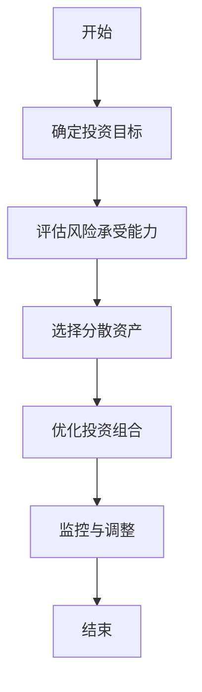
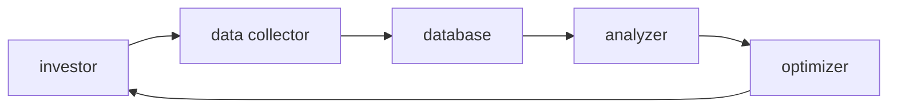
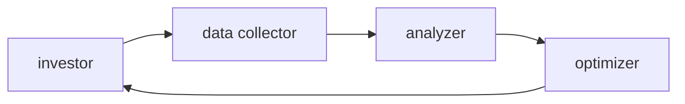

                 

# 格雷厄姆的分散投资原则：在全球化退潮中的新应用

**关键词**：分散投资、格雷厄姆、全球化退潮、投资组合优化、风险管理

**摘要**：本文深入探讨了格雷厄姆的分散投资原则在全球化退潮背景下的新应用。通过分析分散投资的理论基础、算法原理和系统架构，结合实际案例，展示了如何在当前经济环境下有效应用这些原则，实现投资组合优化和风险管理。

---

## 第一部分: 分散投资的背景与起源

### 第1章: 分散投资的起源与理论基础

#### 1.1 分散投资的起源

- **投资的基本概念与定义**  
  投资是指将资金投入到各种资产中，以期获得收益的过程。分散投资则是通过将资金分配到不同的资产类别或地理区域，降低风险的一种策略。

- **分散投资的历史背景**  
  分散投资的概念可以追溯到古代的商业实践，但其系统化理论的提出源于20世纪初。格雷厄姆是这一理论的奠基人，他的投资哲学强调安全性和分散性。

- **格雷厄姆的分散投资理念**  
  格雷厄姆认为，分散投资是降低风险的有效手段，尤其在市场波动加剧的情况下。他建议投资者将资金分配到多个资产类别中，以减少单一资产带来的风险。

#### 1.2 格雷厄姆的分散投资理论

- **格雷厄姆的投资哲学**  
  格雷厄姆倡导“安全边际”理论，即以低于内在价值的价格买入资产，以分散投资降低风险。

- **分散投资的核心原则**  
  分散投资的核心原则包括：资产多样化、风险分散化和收益最大化。通过合理分配资产，投资者可以在不同市场条件下平衡风险和收益。

- **分散投资与风险控制的关系**  
  分散投资通过减少对单一资产的依赖，降低特定资产波动带来的风险。这种策略在市场波动加剧时尤为重要。

#### 1.3 全球化退潮的现状与影响

- **全球化的基本概念与特征**  
  全球化是指资本、商品和信息在全球范围内的自由流动。全球化促进了资产的跨国配置，但也带来了更高的市场风险。

- **全球化退潮的背景与原因**  
  近年来，全球化面临挑战，包括贸易摩擦、地缘政治紧张和新冠疫情的影响。这些因素促使投资者重新审视分散投资的策略。

- **全球化退潮对投资策略的影响**  
  全球化退潮可能导致资产相关性增加，投资者需要通过分散投资来降低风险。此外，区域市场的波动可能影响整体投资组合的表现。

---

## 第2章: 格雷厄姆分散投资的核心概念

### 2.1 分散投资的核心要素

- **投资组合的构成**  
  投资组合应包含不同类型的资产，如股票、债券、房地产等，以降低特定资产类别的风险。

- **资产配置的重要性**  
  资产配置是分散投资的关键，合理的配置可以平衡风险和收益。投资者应根据自身的风险承受能力和投资目标进行配置。

- **风险分散的机制**  
  风险分散通过投资于不相关的资产或市场，降低投资组合的整体波动性。这种机制在市场波动时尤为重要。

### 2.2 分散投资的数学模型

- **投资组合的期望收益与方差**  
  投资组合的期望收益由各资产的期望收益加权平均得出。方差则反映了投资组合的波动性，是风险的指标。

- **现代投资组合理论（MPT）的简要介绍**  
  MPT由马科维茨提出，强调通过优化资产配置，找到收益与风险的最佳平衡点。该理论为分散投资提供了理论基础。

- **分散投资的数学公式推导**  
  通过公式推导，可以证明分散投资如何降低方差，从而降低风险。

### 2.3 分散投资与相关概念的对比

- **分散投资与集中投资的对比**  
  集中投资风险较高，而分散投资通过多样化降低风险。

- **分散投资与对冲投资的对比**  
  对冲投资通过做空和做多对冲风险，而分散投资通过资产多样化降低风险。

- **分散投资与指数投资的对比**  
  指数投资通过跟踪指数分散风险，而分散投资更强调主动配置。

---

## 第3章: 分散投资的算法原理

### 3.1 投资组合优化的算法

- **均值-方差优化模型**  
  该模型通过最小化投资组合的方差，最大化收益。是分散投资的重要工具。

- **马科维茨的有效前沿理论**  
  有效前沿展示了在给定风险下，投资组合可能的最大收益。投资者应选择处于该前沿的组合。

- **现实中的优化算法实现**  
  实际应用中，优化算法需要考虑交易成本、税收等因素，以提高模型的实用性。

### 3.2 分散投资的数学公式

- **投资组合的期望收益公式**  
  $$ E(r_p) = \sum_{i=1}^{n} w_i E(r_i) $$  
  其中，\( w_i \) 是第i个资产的权重，\( E(r_i) \) 是第i个资产的期望收益。

- **投资组合的方差公式**  
  $$ Var(r_p) = \sum_{i=1}^{n} \sum_{j=1}^{n} w_i w_j Cov(r_i, r_j) $$  
  该公式展示了资产之间协方差对整体风险的影响。

### 3.3 分散投资的流程图

---

## 第4章: 系统分析与架构设计

### 4.1 系统功能设计

- **问题场景介绍**  
  投资者需要在复杂市场环境下优化投资组合，分散风险。

- **系统架构设计**  
  使用Mermaid绘制架构图，展示系统的各个模块及其交互。

### 4.2 系统架构设计

### 4.3 系统接口设计

- **数据采集接口**  
  从数据库获取资产数据。

- **优化接口**  
  调用优化算法，返回优化后的投资组合。

### 4.4 系统交互设计

---

## 第5章: 项目实战

### 5.1 环境安装

- **Python环境**  
  需要安装Python和相关库，如numpy、pandas、scipy。

### 5.2 核心代码实现

- **均值-方差优化**  
  使用scipy.optimize模块实现优化。

### 5.3 案例分析

- **实际案例分析**  
  以某投资者为例，展示如何应用分散投资策略优化其投资组合。

---

## 第6章: 最佳实践

### 6.1 小结

- 分散投资在当前市场环境下具有重要意义。

### 6.2 注意事项

- 定期监控和调整投资组合。

### 6.3 拓展阅读

- 推荐阅读《证券分析》等书籍。

---

## 作者

作者：AI天才研究院 & 禅与计算机程序设计艺术

---

以上是文章的大纲和部分详细内容，按照用户的格式要求，逐步展开每个部分的内容，确保逻辑清晰，结构完整。

