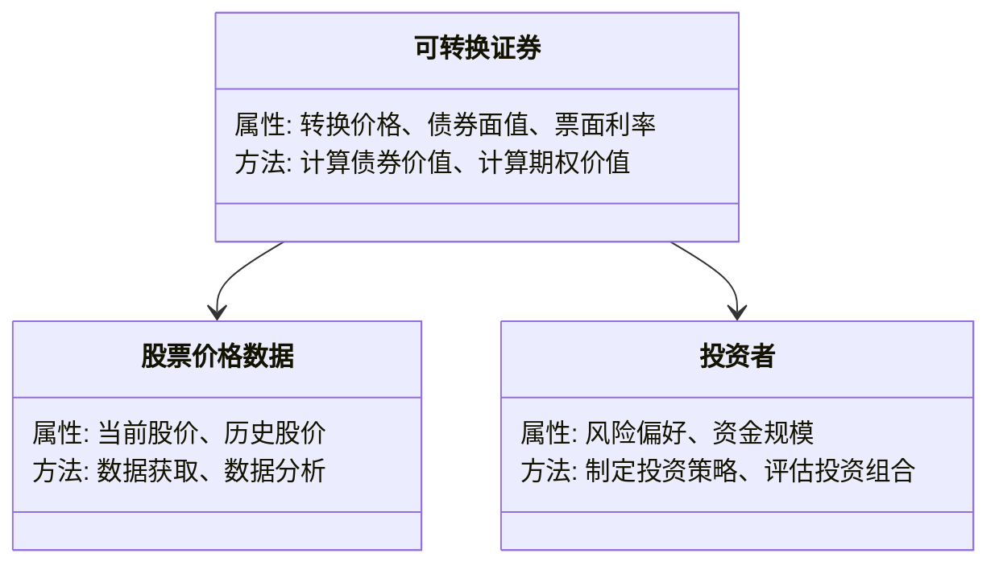

                 


# 格雷厄姆的可转换证券投资策略

> **关键词**：可转换证券、价值投资、格雷厄姆、投资策略、风险管理  
> **摘要**：本文深入探讨了格雷厄姆提出的可转换证券投资策略，分析其核心理念、数学模型、系统架构及实际应用。通过案例分析和最佳实践，为投资者提供科学的投资决策支持。

---

## 第一部分：可转换证券投资策略概述

### 第1章：证券市场的基本概念

#### 1.1 证券市场的基本构成

##### 1.1.1 证券市场的定义与分类
证券市场是金融市场的核心组成部分，主要通过发行和交易证券来实现资金的融通。证券市场可以分为一级市场（发行市场）和二级市场（流通市场）。一级市场主要涉及新股发行（IPO）、债券发行等；二级市场则是股票、债券等证券的交易场所。

##### 1.1.2 股票、债券与基金的区别
- **股票**：代表公司所有权的凭证，投资者成为公司股东，享有分红和投票权。
- **债券**：债务凭证，发行人承诺在特定时间内支付利息和本金。
- **基金**：通过汇集众多投资者的资金，由专业管理人进行投资运作，分散风险。

##### 1.1.3 证券市场的功能与作用
证券市场具有资本形成、价格发现、风险分散和流动性提供等功能，是企业融资和投资者财富增长的重要渠道。

#### 1.2 可转换证券的定义与特点

##### 1.2.1 可转换债券的定义
可转换债券是一种特殊的债券，允许持有人在特定条件下将其转换为公司股票。它结合了债券的固定收益和股票的资本增值潜力。

##### 1.2.2 可转换优先股的特性
可转换优先股是优先股的一种，具有优先分红和优先清偿的权利，同时可以在特定条件下转换为普通股。

##### 1.2.3 可转换证券的转换条件与触发机制
- **转换条件**：通常基于股价达到一定水平，或在特定时间点自动转换。
- **触发机制**：如股价上涨至转股价一定比例，或公司盈利达到特定目标。

### 第2章：格雷厄姆投资策略的核心理念

#### 2.1 价值投资的基本原则

##### 2.1.1 格雷厄姆的价值投资理念
格雷厄姆强调以低于内在价值的价格买入优质资产，长期持有，避免短期市场波动的干扰。

##### 2.1.2 安全边际的概念与应用
安全边际是指投资价格与内在价值之间的差距，确保在市场波动中仍能获得正收益。

##### 2.1.3 长期投资与复利效应
格雷厄姆倡导长期投资，通过复利效应实现财富的稳步增长。

#### 2.2 可转换证券在投资组合中的地位

##### 2.2.1 可转换证券的风险与收益分析
- **收益**：在股价上涨时获得资本增值，同时享有债券的固定利息。
- **风险**：股价下跌时，债券部分的收益可能不足以弥补损失。

##### 2.2.2 可转换证券的防御性与进攻性特点
- **防御性**：在市场低迷时，债券部分提供稳定的收益。
- **进攻性**：在市场上涨时，转换为股票后可获得更高的收益。

##### 2.2.3 可转换证券在不同市场环境下的表现
在牛市中，可转换证券表现优于债券；在熊市中，其表现接近债券，具有防御性。

### 第3章：可转换证券投资策略的数学模型

#### 3.1 可转换证券的价值评估公式

##### 3.1.1 债券部分的现值计算
债券的现值可通过折现未来现金流计算，公式如下：
$$ V_{bond} = \sum_{t=1}^{n} \frac{C}{(1+r)^t} + \frac{F}{(1+r)^n} $$
其中，\( C \) 为每年的利息，\( F \) 为面值，\( r \) 为收益率，\( n \) 为期限。

##### 3.1.2 股票部分的期权价值
转换期权的价值可通过Black-Scholes模型评估，公式为：
$$ C = S_0 N(d_1) - K e^{-rT} N(d_2) $$
其中，\( S_0 \) 为当前股价，\( K \) 为行权价，\( r \) 为无风险利率，\( T \) 为时间，\( N(d) \) 为标准正态分布的累积概率函数。

##### 3.1.3 转换溢价的计算方法
转换溢价为可转换债券市场价格与其债券部分价值之差：
$$ \text{转换溢价} = P - V_{bond} $$

#### 3.2 转换期权的定价模型

##### 3.2.1 Black-Scholes期权定价模型的适用性
Black-Scholes模型适用于波动率稳定、无分红的标的资产。

##### 3.2.2 转换期权的波动率与期限分析
波动率越高，期权价值越大；期限越长，时间价值越高。

##### 3.2.3 转换期权的 Greeks 参数解读
- **Delta**：期权价值对股价的敏感度。
- **Gamma**：Delta的变化率。
- **Theta**：期权时间价值的衰减率。

### 第4章：可转换证券的市场分析与策略选择

#### 4.1 市场周期对可转换证券的影响

##### 4.1.1 牛市环境下的可转换证券表现
牛市中，可转换证券的股票部分收益显著，优于债券。

##### 4.1.2 熊市环境下的可转换证券策略
熊市中，可转换证券表现接近债券，适合防御性投资。

##### 4.1.3 利率变化对可转换证券的影响
利率上升，债券部分价值下降；利率下降，债券部分价值上升。

#### 4.2 可转换证券的择时与选股策略

##### 4.2.1 转换溢价率的分析与应用
- 转换溢价率低时，投资吸引力大。
- 转换溢价率高时，投资风险增加。

##### 4.2.2 公司基本面分析对可转换证券的影响
公司盈利稳定、成长性高的企业发行的可转换证券风险较低。

##### 4.2.3 行业趋势对可转换证券选择的指导作用
选择处于上升行业的可转换证券，提高投资收益。

### 第5章：可转换证券投资的风险管理与组合优化

#### 5.1 风险管理的基本原则

##### 5.1.1 风险分散化在投资组合中的应用
通过投资不同行业的证券，分散行业风险。

##### 5.1.2 资产配置与风险控制
合理分配债券、股票等资产，平衡风险与收益。

##### 5.1.3 期权对冲策略的运用
利用期权对冲市场波动风险，锁定投资收益。

#### 5.2 可转换证券的组合优化方法

##### 5.2.1 马科维茨有效前沿理论的应用
通过优化投资组合，实现收益最大化或风险最小化。

##### 5.2.2 基于现代投资组合理论的优化策略
根据投资者的风险承受能力，选择最优投资组合。

##### 5.2.3 动态再平衡在可转换证券组合中的应用
定期调整投资组合，保持目标比例，应对市场变化。

### 第6章：实战案例分析与策略总结

#### 6.1 案例分析: 真实市场中的可转换证券操作

##### 6.1.1 案例背景
假设某公司发行可转换债券，转股价为$50，债券面值$100，票面利率5%，期限5年。

##### 6.1.2 案例分析
当股价上涨至$60时，转换债券价值为$120，债券部分价值为$90，转换溢价为$30。

##### 6.1.3 策略总结
在股价上涨时，及时转换债券为股票，捕捉资本增值机会；在股价下跌时，持有债券部分，保障固定收益。

---

## 第二部分：系统分析与架构设计

### 第7章：可转换证券分析系统的构建

#### 7.1 问题场景介绍
投资者需要一个工具来评估可转换证券的价值，制定投资策略。

#### 7.2 系统功能设计

##### 7.2.1 领域模型类图


#### 7.3 系统架构设计

##### 7.3.1 系统架构图


#### 7.4 系统接口设计
- 数据接口：与股票数据源对接，获取实时股价。
- 用户界面：提供输入参数和结果展示。

#### 7.5 系统交互序列图

```mermaid
sequenceDiagram
    participant 投资者
    participant 可转换证券分析系统
    投资者 -> 可转换证券分析系统: 输入参数（转股价、债券面值等）
    可转换证券分析系统 -> 数据源: 获取股价数据
    可转换证券分析系统 -> 计算债券价值
    可转换证券分析系统 -> 计算期权价值
    可转换证券分析系统 -> 投资者: 返回评估结果
```

### 第8章：项目实战

#### 8.1 环境安装

##### 8.1.1 安装Python和相关库
```bash
pip install numpy pandas matplotlib
```

#### 8.2 核心代码实现

##### 8.2.1 数据获取与分析
```python
import numpy as np
import pandas as pd

# 示例数据：可转换债券信息
bond_info = pd.DataFrame({
    '转股价': [50],
    '债券面值': [100],
    '票面利率': [0.05],
    '期限': [5]
})

# 获取股价数据
# 假设股价数据已通过API获取
股价 = 60
```

##### 8.2.2 计算债券价值
```python
def 计算债券价值(面值, 利率, 期限, 折现率):
    现值 = 0
    for t in range(1, 期限+1):
        现值 += 面值 * 利率 / (1 + 折现率) ** t
    现值 += 面值 / (1 + 折现率) ** 期限
    return 现值

折现率 = 0.05
债券价值 = 计算债券价值(bond_info['债券面值'][0], bond_info['票面利率'][0], bond_info['期限'][0], 折现率)
```

##### 8.2.3 评估转换期权价值
```python
from scipy.stats import norm

def 计算期权价值(S, K, r, T, sigma):
    d1 = (np.log(S/K) + (r + 0.5*sigma**2)*T) / (sigma*np.sqrt(T))
    d2 = d1 - sigma*np.sqrt(T)
    C = S * norm.cdf(d1) - K * np.exp(-r*T) * norm.cdf(d2)
    return C

股价 = 60
转股价 = bond_info['转股价'][0]
期权价值 = 计算期权价值(股价, 转股价, 0.05, 5, 0.2)
```

#### 8.3 实际案例分析与解读
假设可转换债券的市场价格为$120，计算其转换溢价：
$$ \text{转换溢价} = 120 - 90 = 30 $$

#### 8.4 项目小结
通过代码实现，投资者可以快速评估可转换证券的价值，制定科学的投资策略。

### 第9章：最佳实践与注意事项

#### 9.1 最佳实践 tips
- 定期监控市场变化，及时调整投资策略。
- 合理配置资产，分散投资风险。

#### 9.2 小结
可转换证券投资策略结合了债券的稳定收益和股票的资本增值潜力，是价值投资的重要工具。

#### 9.3 注意事项
- 严格遵守投资纪律，避免情绪化决策。
- 定期评估投资组合，确保符合个人风险承受能力。

#### 9.4 拓展阅读
建议阅读格雷厄姆的《 Intelligent Investor 》深入理解价值投资理念。

---

## 作者

**作者：AI天才研究院/AI Genius Institute & 禅与计算机程序设计艺术 /Zen And The Art of Computer Programming**

