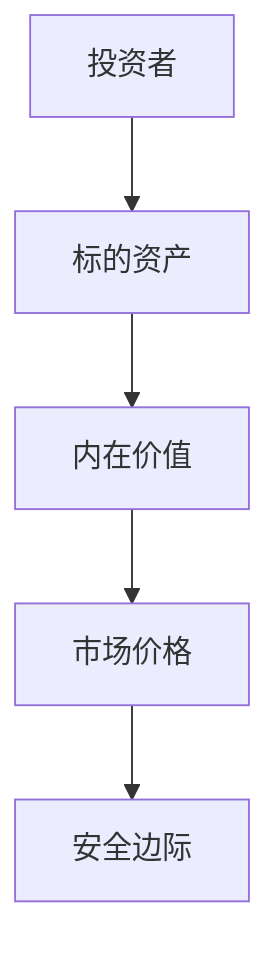
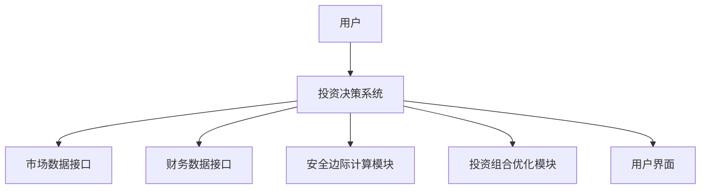

                 


# 格雷厄姆的安全边际概念

## 关键词：安全边际，投资学，价值投资，内在价值，市场定价

## 摘要：  
格雷厄姆的安全边际概念是价值投资理论的核心，通过计算内在价值和市场价格之间的差距，帮助投资者在市场波动中做出更明智的投资决策。本文将从安全边际的定义、计算方法、数学模型，到实际投资中的应用进行系统性分析，结合具体案例和算法实现，帮助读者深入理解安全边际的概念及其在投资中的实际应用。

---

## 第一部分: 格雷厄姆安全边际概念的背景与基础

### 第1章: 安全边际的起源与定义

#### 1.1 格雷厄姆投资理论的起源  
- 1.1.1 投资学说的演变历程  
  - 从古典经济学到现代金融学，投资理论的演变历程  
  - 格雷厄姆在20世纪初对投资学的贡献  

- 1.1.2 格雷厄姆的学术背景与贡献  
  - 作为“价值投资之父”，格雷厄姆的核心思想  
  - 对投资理论的创新与突破  

- 1.1.3 安全边际概念的提出背景  
  - 20世纪初市场的投机性与非理性  
  - 格雷厄姆提出安全边际的初衷  

#### 1.2 安全边际的定义与核心理念  
- 1.2.1 安全边际的定义  
  - 内在价值与市场价格之间的差距  
  - 安全边际是保护投资者免受市场波动的核心工具  

- 1.2.2 安全边际的核心要素  
  - 内在价值的计算  
  - 市场价格的波动性  
  - 安全边际的量化标准  

- 1.2.3 安全边际与投资风险的关系  
  - 如何通过安全边际降低投资风险  
  - 安全边际的宽度与投资安全性的关系  

#### 1.3 安全边际与价值投资的联系  
- 1.3.1 价值投资的基本原理  
  - 购买低于内在价值的资产  
  - 长期持有的投资策略  

- 1.3.2 安全边际在价值投资中的地位  
  - 安全边际是价值投资的核心原则  
  - 如何通过安全边际筛选优质投资标的  

- 1.3.3 安全边际与市场情绪的关系  
  - 市场情绪对安全边际的影响  
  - 在市场恐慌中寻找安全边际的机会  

#### 1.4 安全边际的计算方法  
- 1.4.1 内在价值的计算公式  
  - $$内在价值 = \frac{股息率 \times 市盈率}{市净率}$$  
  - $$内在价值 = \frac{营业收入 \times 净利润 \times 市销率}{市盈率}$$  

- 1.4.2 安全边际的量化标准  
  - 常见的安全边际比率（如30%、50%）  
  - 根据市场环境调整安全边际的宽窄  

- 1.4.3 安全边际的动态调整  
  - 如何根据市场变化动态调整安全边际  
  - 安全边际的宽窄与投资收益的关系  

---

## 第二部分: 安全边际的核心概念与数学模型

### 第2章: 安全边际的数学模型与公式

#### 2.1 内在价值的计算公式  
- $$内在价值 = \frac{股息率 \times 市盈率}{市净率}$$  
  - 示例：某公司股息率为5%，市盈率为15，市净率为3，计算其内在价值  

- $$内在价值 = \frac{营业收入 \times 净利润 \times 市销率}{市盈率}$$  
  - 示例：某公司营业收入为1000万，净利润为200万，市销率为1.5，市盈率为10，计算其内在价值  

#### 2.2 安全边际的计算公式  
- $$安全边际 = 内在价值 - 市场价格$$  
  - 示例：某公司内在价值为50元，市场价格为35元，计算安全边际  

- $$安全边际率 = \frac{(内在价值 - 市场价格)}{市场价格}$$  
  - 示例：安全边际率为35%，表示市场价格低于内在价值35%  

#### 2.3 安全边际的属性特征对比表  
| 属性 | 特征 |  
|------|------|  
| 计算基础 | 内在价值 |  
| 计算方式 | 市场价格比较 |  
| 应用场景 | 投资决策 |  

#### 2.4 ER实体关系图（Mermaid流程图）  


---

## 第三部分: 安全边际的算法原理与实现

### 第3章: 安全边际的算法实现

#### 3.1 安全边际的算法原理  
- 3.1.1 内在价值计算的算法流程  
  - 数据输入：营业收入、净利润、股息率、市盈率、市净率、市销率  
  - 中间计算：计算内在价值  
  - 输出：内在价值  

- 3.1.2 安全边际计算的算法流程  
  - 数据输入：市场价格  
  - 中间计算：安全边际 = 内在价值 - 市场价格  
  - 输出：安全边际  

#### 3.2 安全边际算法的Python实现  
```python  
def calculate_intrinsic_value(earnings, revenue, dividend_yield, price_to_earnings, price_to_book, price_to_sales):  
    intrinsic_value1 = (dividend_yield * price_to_earnings) / price_to_book  
    intrinsic_value2 = (revenue * earnings * price_to_sales) / price_to_earnings  
    return (intrinsic_value1 + intrinsic_value2) / 2  

def calculate_margin_of_safety(intrinsic_value, market_price):  
    margin_of_safety = intrinsic_value - market_price  
    return margin_of_safety / market_price * 100  

# 示例计算  
intrinsic_value = calculate_intrinsic_value(200000, 1000000, 0.05, 15, 3, 1.5)  
market_price = 35  
margin_of_safety_rate = calculate_margin_of_safety(intrinsic_value, market_price)  
print(f"安全边际率为：{margin_of_safety_rate}%")  
```

#### 3.3 安全边际算法的数学模型  
- $$ intrinsic\_value = \frac{dividend\_yield \times price\_to\_earnings}{price\_to\_book} $$  
- $$ intrinsic\_value = \frac{revenue \times earnings \times price\_to\_sales}{price\_to\_earnings} $$  
- $$ margin\_of\_safety = intrinsic\_value - market\_price $$  
- $$ margin\_of\_safety\_rate = \frac{margin\_of\_safety}{market\_price} \times 100 $$  

---

## 第四部分: 安全边际在投资系统中的应用

### 第4章: 投资决策系统的架构设计

#### 4.1 项目背景与目标  
- 投资决策系统的开发背景  
- 系统目标：基于安全边际概念，实现智能化投资决策支持  

#### 4.2 系统功能设计  
- 4.2.1 投资标的筛选模块  
  - 输入：市场数据、财务数据  
  - 输出：符合安全边际条件的投资标的列表  

- 4.2.2 安全边际计算模块  
  - 输入：内在价值、市场价格  
  - 输出：安全边际率  

- 4.2.3 投资组合优化模块  
  - 输入：多个投资标的的安全边际率  
  - 输出：最优投资组合建议  

#### 4.3 系统架构设计  


#### 4.4 接口设计与交互流程  
- 4.4.1 系统接口设计  
  - REST API接口：获取市场数据、计算安全边际  

- 4.4.2 用户交互流程  
  - 用户输入投资目标  
  - 系统输出投资建议  

#### 4.5 系统实现中的注意事项  
- 数据源的可靠性  
- 算法的实时性与准确性  
- 系统的可扩展性  

---

## 第五部分: 项目实战与最佳实践

### 第5章: 项目实战

#### 5.1 环境安装与配置  
- 安装Python环境  
- 安装必要的库（pandas, numpy, matplotlib）  

#### 5.2 核心代码实现  
```python  
import pandas as pd  
import numpy as np  

# 示例数据加载  
data = pd.read_csv('market_data.csv')  

# 计算内在价值和安全边际  
data['intrinsic_value'] = calculate_intrinsic_value(data['earnings'], data['revenue'], data['dividend_yield'], data['price_to_earnings'], data['price_to_book'], data['price_to_sales'])  
data['margin_of_safety'] = calculate_margin_of_safety(data['intrinsic_value'], data['market_price'])  

# 可视化结果  
plt.bar(data['ticker'], data['margin_of_safety'])  
plt.title('安全边际率分布')  
plt.xlabel('股票代码')  
plt.ylabel('安全边际率(%)')  
plt.show()  
```

#### 5.3 代码解读与分析  
- 数据加载与预处理  
- 内在价值与安全边际的计算  
- 可视化结果分析  

#### 5.4 案例分析与实际应用  
- 选取具体股票进行案例分析  
- 安全边际在实际投资中的应用  

#### 5.5 项目小结  
- 项目实现的关键点总结  
- 安全边际算法的实际效果  

### 第6章: 最佳实践、小结与展望

#### 6.1 最佳实践总结  
- 安全边际的计算与调整  
- 投资策略的制定与优化  

#### 6.2 项目小结  
- 项目成果回顾  
- 安全边际概念的深入理解  

#### 6.3 注意事项与风险提示  
- 数据来源的可靠性  
- 市场波动对安全边际的影响  
- 投资决策的复杂性  

#### 6.4 拓展阅读与进一步研究方向  
- 安全边际的高级应用  
- 其他投资策略与安全边际的结合  

---

## 第六部分: 作者信息

作者：AI天才研究院/AI Genius Institute & 禅与计算机程序设计艺术/Zen And The Art of Computer Programming

