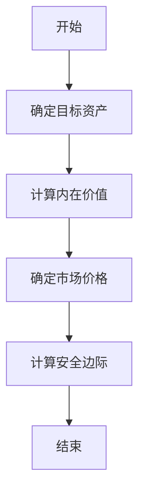
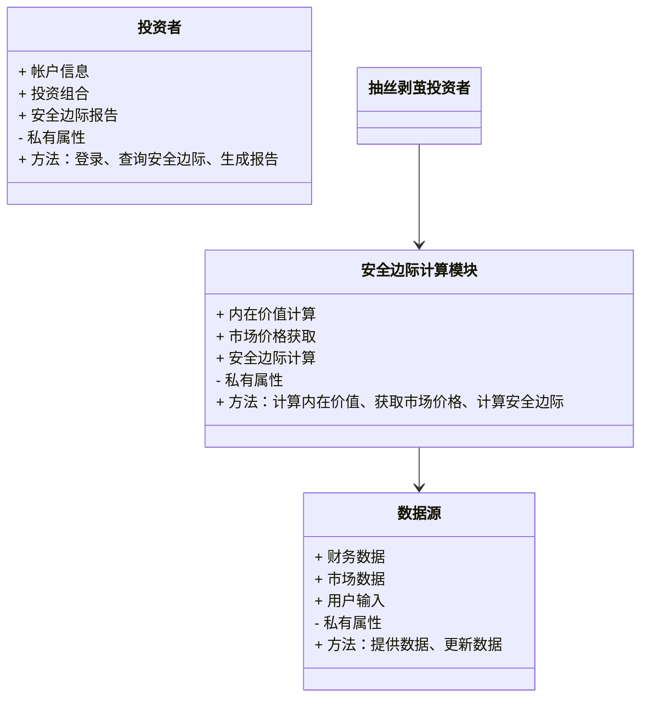

                 


# 格雷厄姆的安全边际理论实践

> 关键词：安全边际理论，投资分析，价值评估，风险管理，投资策略

> 摘要：本文深入探讨了格雷厄姆的安全边际理论，从理论基础到算法实现，从系统架构到项目实战，结合技术语言和专业分析，全面解析了安全边际理论在投资实践中的应用。通过详细的技术分析和案例研究，本文为读者提供了从理论到实践的完整指南。

---

# 第一部分：安全边际理论的背景与核心概念

## 第1章：安全边际理论的背景与起源

### 1.1 安全边际理论的起源

#### 1.1.1 价值投资的先驱：本杰明·格雷厄姆

- **本杰明·格雷厄姆**是价值投资的鼻祖，被誉为“价值投资之父”。
- 他在20世纪30年代提出了安全边际理论，为现代投资理论奠定了基础。
- 格雷厄姆的学生**彼得·林奇**和**沃伦·巴菲特**继承并发扬了他的思想，使其成为投资领域的经典理论。

#### 1.1.2 安全边际理论的提出背景

- **1929年经济大萧条**后，投资者对稳健投资策略的需求日益迫切。
- 格雷厄姆通过分析市场的波动性和投资者的心理行为，提出了安全边际理论。
- 理论的核心在于通过计算内在价值与市场价格的差异，为投资者提供一个安全的投资空间。

#### 1.1.3 格雷厄姆的投资理念与方法

- **价值投资**：寻找市场价格低于内在价值的股票。
- **安全边际**：通过计算内在价值与市场价格的差异，评估投资的安全性。
- **风险管理**：通过安全边际控制投资风险，避免过度波动对投资组合的影响。

### 1.2 安全边际理论的核心概念

#### 1.2.1 安全边际的定义与内涵

- **安全边际**：内在价值与市场价格之间的差额，反映了投资的安全空间。
- **内在价值**：资产在合理市场条件下的真实价值，与市场价格无关。
- **市场价格**：资产在市场上的交易价格，受市场波动和投资者情绪影响。

#### 1.2.2 安全边际在投资中的作用

- **降低风险**：通过安全边际，投资者可以避免因市场价格波动而造成损失。
- **提高收益**：安全边际高的资产，具有更大的增值潜力。
- **长期投资**：安全边际理论强调长期投资，避免短期波动的影响。

#### 1.2.3 安全边际与投资风险的关系

- **正相关**：安全边际越高，投资风险越低。
- **负相关**：市场价格越偏离内在价值，投资风险越高。

### 1.3 安全边际理论的现代发展

#### 1.3.1 理论的演变与应用

- **现代投资组合理论**：将安全边际理论与资产配置相结合，优化投资组合。
- **行为金融学**：研究投资者心理与行为，结合安全边际理论，分析市场波动。
- **量化投资**：通过算法和大数据分析，量化安全边际，实现自动化投资。

#### 1.3.2 当代投资者对安全边际的理解

- **基本面分析**：通过财务指标评估内在价值，计算安全边际。
- **技术分析**：通过价格走势和成交量分析，辅助判断安全边际。
- **风险管理**：结合安全边际，制定风险管理策略，控制投资风险。

#### 1.3.3 安全边际理论的局限性与改进

- **局限性**：无法完全预测市场波动，安全边际仅提供参考价值。
- **改进方向**：结合多种分析方法，提高安全边际计算的准确性。

---

## 第2章：安全边际的核心概念与计算方法

### 2.1 安全边际的定义与计算方法

#### 2.1.1 安全边际的数学定义

$$
\text{安全边际} = \text{内在价值} - \text{市场价格}
$$

#### 2.1.2 安全边际的计算步骤

1. **计算内在价值**：通过基本面分析，评估资产的真实价值。
2. **确定市场价格**：获取资产当前的市场价格。
3. **计算安全边际**：用内在价值减去市场价格，得到安全边际。

#### 2.1.3 安全边际的评估指标

- **安全边际率**：安全边际占内在价值的比例，用于衡量投资的安全性。
$$
\text{安全边际率} = \frac{\text{安全边际}}{\text{内在价值}} \times 100\%
$$

### 2.2 安全边际与内在价值的关系

#### 2.2.1 内在价值的计算公式

$$
\text{内在价值} = \frac{\text{未来现金流}}{\text{折现率}}
$$

#### 2.2.2 安全边际与内在价值的关联

- 安全边际是内在价值与市场价格的差额，反映了投资的安全空间。
- 内在价值越高，安全边际越大，投资风险越低。

#### 2.2.3 内在价值的评估方法

- **DCF模型**：通过现金流折现法计算内在价值。
- **市盈率法**：通过市盈率和净利润计算内在价值。
- **市净率法**：通过市净率和净资产计算内在价值。

### 2.3 安全边际的属性特征对比

#### 2.3.1 安全边际与市场价的对比

| 特性       | 安全边际         | 市场价格         |
|------------|------------------|------------------|
| 定义       | 内在价值 - 市场价格 | 资产的交易价格    |
| 影响因素   | 内在价值、市场价格 | 市场供需、投资者情绪 |
| 计算公式   | 内在价值 - 市场价格 | -                |
| 作用       | 衡量投资安全性    | 衡量市场估值      |

#### 2.3.2 安全边际与市盈率的关系

- **市盈率**：股价与每股净利润的比率。
$$
\text{市盈率} = \frac{\text{股价}}{\text{每股净利润}}
$$
- **安全边际与市盈率**：市盈率越低，内在价值相对市场价格越高，安全边际越大。

#### 2.3.3 安全边际与市净率的关系

- **市净率**：股价与每股净资产的比率。
$$
\text{市净率} = \frac{\text{股价}}{\text{每股净资产}}
$$
- **安全边际与市净率**：市净率越低，内在价值相对市场价格越高，安全边际越大。

---

## 第3章：安全边际的算法原理与数学模型

### 3.1 安全边际计算的算法流程



### 3.2 安全边际计算的Python实现

```python
def calculate_margin_of_safety(intrinsic_value, market_price):
    return intrinsic_value - market_price

# 示例计算
intrinsic_value = 100
market_price = 80
margin_of_safety = calculate_margin_of_safety(intrinsic_value, market_price)
print(f"安全边际为: {margin_of_safety}")
```

### 3.3 安全边际的数学模型与公式

- **安全边际计算公式**
$$
\text{安全边际} = \text{内在价值} - \text{市场价格}
$$

- **内在价值计算公式**
$$
\text{内在价值} = \frac{\text{未来现金流}}{\text{折现率}}
$$

---

## 第4章：安全边际的系统分析与架构设计

### 4.1 问题场景介绍

- **目标**：设计一个基于安全边际理论的投资分析系统。
- **需求**：投资者需要快速计算安全边际，评估投资风险。

### 4.2 系统功能设计



---

## 第5章：安全边际的项目实战

### 5.1 项目环境安装

```bash
pip install pandas numpy matplotlib
```

### 5.2 核心代码实现

```python
import pandas as pd
import numpy as np

def calculate_margin_of_safety(intrinsic_value, market_price):
    return intrinsic_value - market_price

# 示例数据
data = {
    '股票代码': ['A', 'B', 'C'],
    '内在价值': [100, 150, 80],
    '市场价格': [80, 120, 70]
}

df = pd.DataFrame(data)
df['安全边际'] = df['内在价值'] - df['市场价格']

print(df)
```

### 5.3 案例分析

- **案例**：某股票的内在价值为100元，市场价格为80元。
- **计算**：安全边际 = 100 - 80 = 20元。
- **结论**：投资该股票的安全边际为20元，具有较高的投资价值。

---

## 第6章：最佳实践与小结

### 6.1 本章小结

- **核心要点**：
  - 安全边际是内在价值与市场价格的差额，反映了投资的安全空间。
  - 内在价值的计算是安全边际分析的基础。
  - 安全边际越高的资产，投资风险越低，收益潜力越大。

### 6.2 注意事项

- **数据准确性**：内在价值的计算依赖于准确的财务数据和合理的假设。
- **市场波动**：安全边际仅提供参考价值，无法完全消除市场波动的影响。
- **长期投资**：安全边际理论更适合长期投资，避免短期波动的影响。

### 6.3 拓展阅读

- **《证券分析》**：格雷厄姆的经典著作，详细阐述了安全边际理论。
- **《巴菲特致股东的信》**：巴菲特对安全边际理论的实践与应用。
- **《投资学原理》**：现代投资理论中的安全边际应用。

---

# 作者

**作者：AI天才研究院/AI Genius Institute & 禅与计算机程序设计艺术/Zen And The Art of Computer Programming**

---

**注**：以上内容为示例性的技术博客文章结构，您可以根据实际需求进一步扩展和补充细节。

