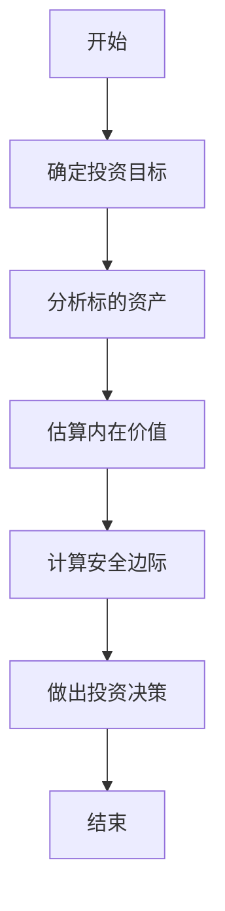
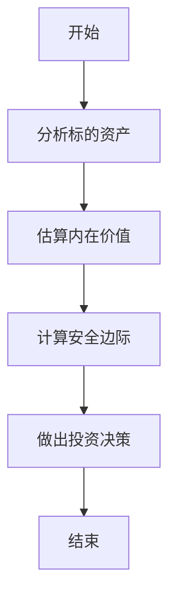
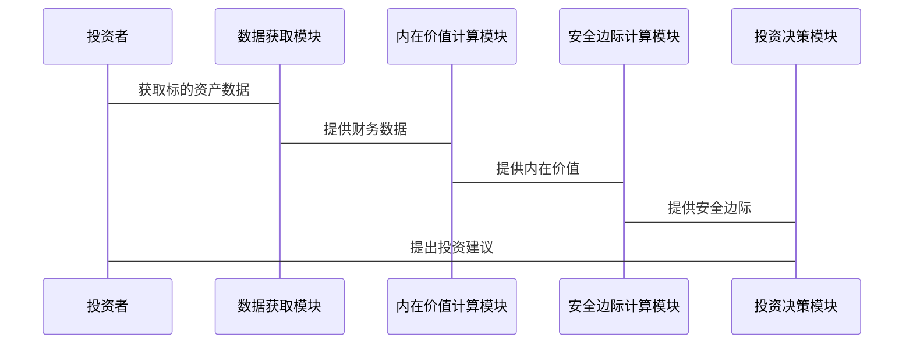

                 


# 格雷厄姆的安全边际：如何在投资中留有余地

> 关键词：格雷厄姆，安全边际，投资，价值投资，风险管理

> 摘要：本文深入探讨了格雷厄姆提出的安全边际概念，分析其在投资中的重要性，详细讲解安全边际的计算方法、数学模型、系统架构及实际应用案例，帮助读者在投资决策中留有余地，降低风险，实现稳健收益。

---

## 第1章: 安全边际的定义与背景

### 1.1 安全边际的定义

#### 1.1.1 安全边际的起源与历史

本杰明·格雷厄姆是20世纪著名的投资学家，被誉为“价值投资之父”。他在《证券分析》一书中首次系统性地提出了“安全边际”这一概念。安全边际是指投资者在购买股票时，以低于其内在价值的价格买入，从而在市场波动时留有安全空间，避免因市场恐慌导致的损失。

#### 1.1.2 安全边际的核心概念

安全边际是价值投资的核心原则之一。它强调在投资时，应考虑市场的非理性波动，避免以过高的价格买入资产。通过留出安全边际，投资者能够在市场下跌时保护本金，同时在市场上涨时获得超额收益。

#### 1.1.3 安全边际在投资中的重要性

安全边际的重要性体现在以下几个方面：

- **风险控制**：通过留出安全边际，投资者能够降低投资组合的下行风险。
- **长期收益**：安全边际较高的投资标的往往具有更大的上涨空间。
- **心理因素**：安全边际能够帮助投资者在市场恐慌时保持冷静，避免做出错误决策。

### 1.2 安全边际的背景与问题背景

#### 1.2.1 投资中的不确定性

市场波动是投资中不可避免的现象。股票价格受多种因素影响，如宏观经济环境、行业趋势、公司基本面等。这些因素的不确定性使得市场价格往往偏离其内在价值。

#### 1.2.2 安全边际的提出与解决

格雷厄姆通过引入安全边际，为投资者提供了一种应对市场不确定性的方法。通过购买低于内在价值的股票，投资者能够在市场低估时买入，在市场高估时卖出，从而在长期实现稳健收益。

#### 1.2.3 安全边际的边界与外延

安全边际的应用不仅限于股票投资，还可以扩展到债券、房地产等其他资产类别。其核心思想是通过合理的估值，避免支付过高的价格。

### 1.3 安全边际的核心要素

#### 1.3.1 安全边际的构成要素

安全边际的构成包括内在价值、市场价格和安全空间。内在价值是资产的真正价值，市场价格是市场的反映，安全空间是内在价值与市场价格之间的差额。

#### 1.3.2 核心要素之间的关系

- **内在价值**：资产的真正价值，是安全边际计算的基础。
- **市场价格**：市场的反映，可能高于或低于内在价值。
- **安全空间**：内在价值与市场价格的差额，决定投资的安全性。

#### 1.3.3 安全边际的数学模型

$$ \text{安全边际} = \text{内在价值} - \text{市场价格} $$

---

## 第2章: 核心概念与联系

### 2.1 安全边际的原理

#### 2.1.1 安全边际的计算原理

安全边际的计算基于内在价值的估算。投资者需要对标的资产进行深入分析，估算其内在价值，然后比较市场价格，确定安全空间。

#### 2.1.2 安全边际与市场波动的关系

市场波动会导致股票价格偏离其内在价值。通过留出安全边际，投资者能够在市场波动中保护本金，避免损失。

#### 2.1.3 安全边际与内在价值的联系

内在价值是安全边际计算的基础，而安全边际则是内在价值与市场价格之间的差额。两者共同决定了投资的安全性和收益性。

### 2.2 核心概念对比

#### 2.2.1 安全边际与风险

安全边际通过留出安全空间，降低投资风险。风险主要来自市场价格的波动，而安全边际能够有效缓冲这种波动带来的影响。

#### 2.2.2 安全边际与波动性

波动性是市场波动的表现，安全边际通过留出安全空间，降低波动性对投资组合的影响。

#### 2.2.3 安全边际与收益

安全边际较高的投资标的通常具有更高的长期收益潜力。通过避免支付过高的价格，投资者能够在市场上涨时获得超额收益。

### 2.3 实体关系图

#### 2.3.1 安全边际的ER实体关系图

```mermaid
erDiagram
    customer[投资者] {
        ++ 投资者ID
        ++ 投资标的
        ++ 投资金额
        ++ 投资日期
    }
    investment[投资标的] {
        ++ 标的ID
        ++ 内在价值
        ++ 市场价格
        ++ 安全边际
    }
    risk[风险] {
        ++ 风险ID
        ++ 风险类型
        ++ 风险程度
    }
    customer --> investment : 持有
    investment --> risk : 面临
```

#### 2.3.2 安全边际与投资决策的流程图



---

## 第3章: 安全边际的算法原理

### 3.1 安全边际的计算流程

#### 3.1.1 算法步骤分解

1. **确定投资目标**：选择适合的资产进行投资。
2. **分析标的资产**：研究公司的财务状况、行业地位、竞争优势等。
3. **估算内在价值**：使用DCF模型等方法计算内在价值。
4. **计算安全边际**：比较市场价格与内在价值，确定安全空间。
5. **做出投资决策**：根据安全边际的大小决定是否买入或卖出。

#### 3.1.2 算法的输入与输出

- **输入**：标的资产的财务数据、市场数据。
- **输出**：内在价值、市场价格、安全边际。

#### 3.1.3 算法的数学模型

$$ \text{内在价值} = \sum_{t=1}^{n} \frac{\text{自由现金流}}{(1 + r)^t} $$

### 3.2 安全边际的计算公式

#### 3.2.1 内在价值的计算公式

$$ \text{内在价值} = \frac{\text{永续年金}}{\text{折现率}} $$

#### 3.2.2 安全边际的计算公式

$$ \text{安全边际} = \text{内在价值} - \text{市场价格} $$

### 3.3 算法流程图



### 3.4 Python代码实现

```python
def calculate_intrinsic_value(free_cash_flow, discount_rate):
    # 计算永续年金的现值
    intrinsic_value = free_cash_flow / discount_rate
    return intrinsic_value

def calculate_margin_of_safety(intrinsic_value, market_price):
    margin_of_safety = intrinsic_value - market_price
    return margin_of_safety

# 示例计算
free_cash_flow = 100
discount_rate = 0.1
market_price = 50

intrinsic_value = calculate_intrinsic_value(free_cash_flow, discount_rate)
margin_of_safety = calculate_margin_of_safety(intrinsic_value, market_price)

print(f"内在价值: {intrinsic_value}")
print(f"安全边际: {margin_of_safety}")
```

---

## 第4章: 数学模型与公式

### 4.1 内在价值的计算

#### 4.1.1 内在价值的公式

$$ \text{内在价值} = \frac{\text{自由现金流}}{\text{折现率}} $$

#### 4.1.2 内在价值的计算步骤

1. **估算自由现金流**：预测未来现金流。
2. **确定折现率**：选择合适的折现率。
3. **计算内在价值**：使用公式计算。

### 4.2 安全边际的数学模型

#### 4.2.1 安全边际的计算公式

$$ \text{安全边际} = \text{内在价值} - \text{市场价格} $$

#### 4.2.2 公式的应用实例

假设某股票的内在价值为100元，市场价格为80元，其安全边际为20元。

#### 4.2.3 公式的局限性与改进

公式假设市场价格与内在价值之间的差额完全反映在安全边际中，但在实际情况中，市场波动可能影响内在价值的估算。

---

## 第5章: 系统分析与架构设计方案

### 5.1 问题场景介绍

投资者需要一个系统来计算安全边际，辅助投资决策。

### 5.2 系统功能设计

- **数据获取**：获取标的资产的财务数据和市场数据。
- **内在价值计算**：估算内在价值。
- **安全边际计算**：比较市场价格与内在价值，确定安全边际。
- **投资决策**：根据安全边际做出投资决策。

### 5.3 系统架构设计


### 5.4 系统接口设计

- **数据接口**：获取标的资产的财务数据和市场数据。
- **计算接口**：计算内在价值和安全边际。
- **决策接口**：根据安全边际做出投资决策。

### 5.5 系统交互设计



---

## 第6章: 项目实战

### 6.1 环境安装

安装Python和相关库，如pandas、numpy、scipy。

### 6.2 系统核心实现源代码

```python
import pandas as pd
import numpy as np

def calculate_intrinsic_value(free_cash_flow, discount_rate):
    return free_cash_flow / discount_rate

def calculate_margin_of_safety(intrinsic_value, market_price):
    return intrinsic_value - market_price

# 示例数据
data = {
    '标的资产': ['股票A', '股票B'],
    '自由现金流': [100, 150],
    '折现率': [0.1, 0.12],
    '市场价格': [80, 90]
}

df = pd.DataFrame(data)

# 计算内在价值和安全边际
df['内在价值'] = df.apply(lambda x: calculate_intrinsic_value(x['自由现金流'], x['折现率']), axis=1)
df['安全边际'] = df.apply(lambda x: calculate_margin_of_safety(x['内在价值'], x['市场价格']), axis=1)

print(df)
```

### 6.3 代码应用解读与分析

代码展示了如何使用Python计算内在价值和安全边际，并将结果存储在DataFrame中。通过分析数据，投资者可以做出投资决策。

### 6.4 实际案例分析

以苹果公司为例，计算其内在价值和安全边际，分析投资的安全性。

### 6.5 项目小结

通过实战项目，读者能够理解安全边际的概念，并将其应用于实际投资中。

---

## 第7章: 最佳实践

### 7.1 小结

安全边际是价值投资的核心原则，能够帮助投资者在市场波动中保护本金，实现稳健收益。

### 7.2 注意事项

- **合理估算内在价值**：内在价值的估算需要基于充分的分析和研究。
- **动态调整安全边际**：市场环境和资产状况会变化，需要定期调整。
- **结合其他投资策略**：安全边际可以与其他投资策略结合使用，提高投资效果。

### 7.3 拓展阅读

- 格雷厄姆的《证券分析》
- 巴菲特的《致股东的信》
- 彼得·林奇的《投资指南》

---

## 作者：AI天才研究院/AI Genius Institute & 禅与计算机程序设计艺术/Zen And The Art of Computer Programming

