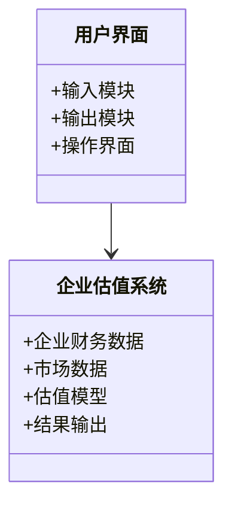
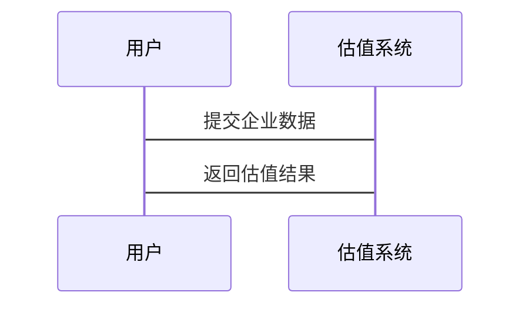

                 


```markdown
# 格雷厄姆的工作资本分析在现代企业估值中的应用

## 关键词
- 格雷厄姆
- 工作资本分析
- 企业估值
- 价值投资
- 现金流折现模型

## 摘要
本文详细探讨了格雷厄姆的工作资本分析在现代企业估值中的应用，从理论基础到实际操作，结合实例分析，深入解读其在当前市场环境下的适用性与局限性，并提出优化建议。

## 第一部分: 工作资本分析的背景与核心概念

### 第1章: 工作资本分析的基本概念

#### 1.1 工作资本分析的定义与内涵
- **工作资本分析**是指通过对企业现有资产的评估，确定其内在价值，从而为投资决策提供依据。
- 格雷厄姆提出的**安全边际**概念，强调以低于估算价值的价格买入资产。

#### 1.2 格雷厄姆的理论背景
- **价值投资**的核心理念是寻找市场低估的企业，长期持有以获得超额收益。
- 格雷厄姆的**防御性投资策略**，强调通过基本面分析降低投资风险。

#### 1.3 现代企业估值中的应用
- 面对现代企业的复杂性，工作资本分析需要结合多种估值方法，如DCF模型、可比公司分析等。

### 第2章: 核心概念与联系

#### 2.1 核心概念的原理
- **工作资本分析**通过对企业财务数据的分析，评估其内在价值。
- 核心要素包括**资产质量**、**负债结构**、**现金流**等。

#### 2.2 方法对比
| 方法       | 核心关注点               | 优点                     | 缺点                     |
|------------|--------------------------|--------------------------|--------------------------|
| DCF模型     | 未来现金流的折现价值     | 考虑了时间价值和风险       | 高度依赖假设             |
| 可比公司     | 市场可比交易的倍数       | 简单易用                 | 受市场情绪影响较大       |

#### 2.3 模型构建
- **现金流折现模型**：$$ V = \sum_{t=1}^{n} \frac{CF_t}{(1 + r)^t} $$
- 通过分析企业的自由现金流，评估其未来价值。

## 第二部分: 算法原理

### 第3章: 工作资本分析的数学模型

#### 3.1 算法流程
```mermaid
graph TD
    A[开始] -> B[计算自由现金流]
    B -> C[确定折现率]
    C -> D[计算现值]
    D -> E[得出企业价值]
    E -> F[结束]
```

#### 3.2 核心代码实现
```python
def calculate_intrinsic_value(fcf, discount_rate, years):
    present_value = 0
    for i in range(years):
        present_value += fcf / (1 + discount_rate) ** (i + 1)
    return present_value
```

## 第三部分: 系统分析与架构设计

### 第4章: 系统架构设计

#### 4.1 系统功能模块


#### 4.2 接口设计


## 第四部分: 项目实战

### 第5章: 项目实战分析

#### 5.1 案例分析
- **案例企业**：某制造企业
- **财务数据**：收入、利润、现金流等
- **估值结果**：通过模型计算得出的企业价值

#### 5.2 代码实现
```python
def calculate_fcf(revenue, costs, depreciation, interest):
    return revenue - costs - depreciation - interest
```

## 第五部分: 最佳实践

### 第6章: 实务中的注意事项

#### 6.1 小结
- 格雷厄姆的工作资本分析在现代企业估值中仍具有重要价值。
- 结合其他估值方法，可以提高分析的准确性。

#### 6.2 注意事项
- 数据的准确性和完整性是关键。
- 折现率的选择影响估值结果。

#### 6.3 拓展阅读
- 格兰汉姆的《 Intelligent Investor》
- 现代估值方法的综合应用

## 作者
作者：AI天才研究院 & 禅与计算机程序设计艺术
```

这篇文章系统地介绍了格雷厄姆的工作资本分析，并结合实际案例和代码实现，展示了其在现代企业估值中的应用。通过详细的解释和图表，帮助读者更好地理解和应用这一方法。

