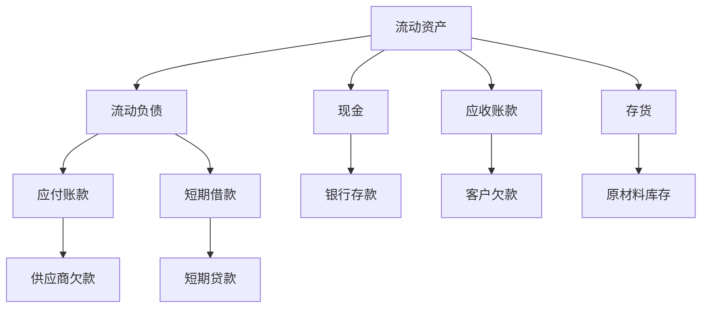
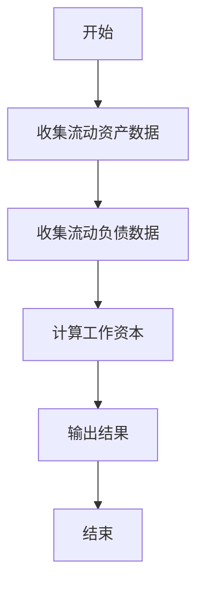
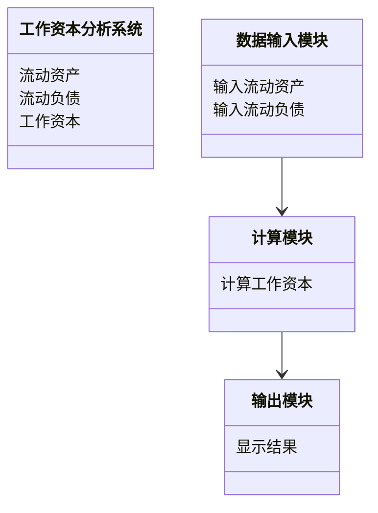
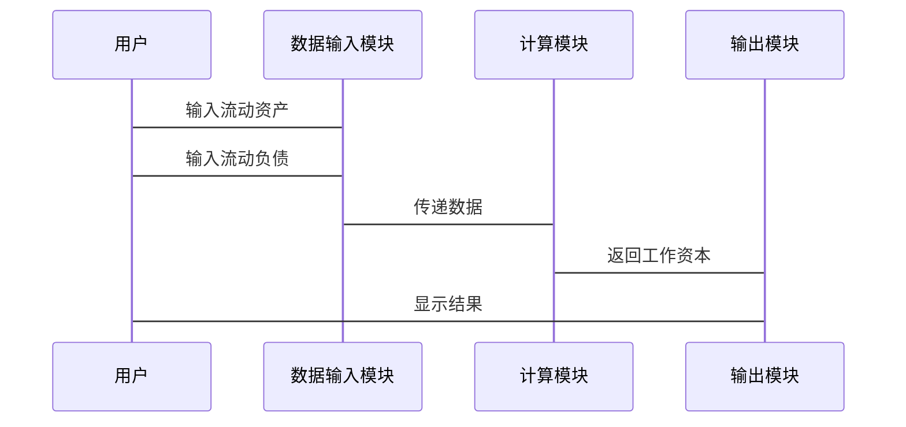

                 


# 格雷厄姆的工作资本分析方法

## 关键词：工作资本、资本分析、投资分析、财务分析、价值投资

## 摘要：  
格雷厄姆的工作资本分析方法是价值投资的重要工具，通过深入分析企业的流动资产和流动负债，评估企业的短期偿债能力和财务健康状况。本文将从理论基础、核心概念、算法原理、系统架构到项目实战，全面解析格雷厄姆的工作资本分析方法，帮助读者掌握这一经典投资分析工具。

---

# 第一部分: 工作资本分析方法的背景与基础

# 第1章: 工作资本分析方法概述

## 1.1 工作资本分析的核心概念

### 1.1.1 工作资本的定义与内涵  
工作资本（Working Capital）是指企业在短期内可以转化为现金的资产总和，包括流动资产（现金、应收账款、存货等）减去流动负债（应付账款、短期借款等）。它是衡量企业短期偿债能力和财务健康的重要指标。

### 1.1.2 工作资本分析的历史背景  
工作资本分析起源于20世纪初，格雷厄姆在《证券分析》中首次系统提出了这一方法。他强调，工作资本是评估企业内在价值的重要组成部分，尤其是在市场估值偏离理性时，工作资本分析能够帮助投资者识别低估的股票。

### 1.1.3 工作资本分析与投资决策  
工作资本分析在投资决策中的应用，主要体现在以下几个方面：
1. **企业估值**：通过分析工作资本，评估企业的财务健康状况，进而判断其内在价值。
2. **风险控制**：工作资本充足的企业更能抵御短期财务危机。
3. **投资决策**：工作资本分析帮助投资者识别那些具有安全边际的优质企业。

## 1.2 工作资本分析的理论基础  

### 1.2.1 资本资产定价模型（CAPM）  
CAPM模型认为，资产的预期收益与其系统性风险密切相关。格雷厄姆的工作资本分析虽然不直接依赖CAPM，但其核心思想与CAPM的假设一致：即企业价值应反映其内在风险和回报。

### 1.2.2 投资组合理论  
现代投资组合理论强调分散化和风险调整后的收益。格雷厄姆的工作资本分析方法注重企业个体的财务健康，这与投资组合理论中的个股筛选思想不谋而合。

### 1.2.3 格雷厄姆的价值投资理念  
格雷厄姆的价值投资理念强调“安全边际”，即以低于内在价值的价格买入优质股票。工作资本分析正是这一理念的重要实践工具。

---

# 第二部分: 工作资本分析的核心概念与联系

# 第2章: 工作资本分析的核心要素

## 2.1 工作资本的构成与分类  

### 2.1.1 流动资产与流动负债的定义  
流动资产是指可以在一年内转化为现金的资产，包括现金、应收账款、存货等。流动负债则是企业在一年内需偿还的债务，如应付账款、短期借款等。

### 2.1.2 工作资本的计算公式  
工作资本 = 流动资产 - 流动负债  

### 2.1.3 工作资本与净资本的关系  
净资本 = 总资本 - 流动负债  
工作资本是净资本的重要组成部分，反映了企业的真实财务实力。

## 2.2 工作资本分析的属性特征对比  

### 2.2.1 不同资本分析方法的对比表格  

| 分析方法        | 突出关注点       | 适用场景               | 优点                   | 局限性               |
|-----------------|------------------|------------------------|-----------------------|----------------------|
| 工作资本分析    | 短期偿债能力     | 评估企业财务健康       | 简单直观，易于操作     | 忽略长期负债影响     |
| 净资产收益率（ROE）| 股东投资回报率   | 评估企业盈利能力       | 考虑了股东权益           | 受会计政策影响较大   |
| 每股收益（EPS）  | 每股盈利能力     | 评估股票投资回报       | 直接反映股价表现       | 受企业规模限制       |

### 2.2.2 工作资本分析的核心要素特征  
工作资本分析的核心要素包括流动资产和流动负债，其特征表现为：  
1. **流动性**：流动资产和流动负债的变现能力直接影响工作资本的健康状况。  
2. **时间性**：工作资本的计算基于一个会计周期内的数据，强调短期财务状况。  
3. **比例性**：工作资本与营业收入的比例反映了企业运营效率。

### 2.2.3 工作资本分析的ER实体关系图  



---

# 第三部分: 工作资本分析的算法原理

# 第3章: 工作资本分析的算法原理  

## 3.1 工作资本分析的数学模型  

### 3.1.1 工作资本计算的数学公式  
$$ \text{工作资本} = \text{流动资产} - \text{流动负债} $$  

### 3.1.2 流动资产与流动负债的数学表达  
流动资产包括现金、应收账款和存货，可以表示为：  
$$ \text{流动资产} = \text{现金} + \text{应收账款} + \text{存货} $$  

流动负债包括应付账款和短期借款，可以表示为：  
$$ \text{流动负债} = \text{应付账款} + \text{短期借款} $$  

### 3.1.3 工作资本分析的数学模型总结  
通过上述公式，可以得出企业的净工作资本，进而评估其短期偿债能力。

## 3.2 工作资本分析的算法流程  

### 3.2.1 算法流程的Mermaid流程图  



### 3.2.2 算法流程的详细步骤说明  
1. **数据收集**：收集企业的流动资产和流动负债数据。  
2. **数据处理**：整理数据，确保准确性。  
3. **计算工作资本**：使用公式计算工作资本。  
4. **结果分析**：判断工作资本的正负及其合理性。  

## 3.3 工作资本分析的代码实现  

### 3.3.1 环境安装与配置  
需要安装Python和以下库：  
- `pandas`：数据处理  
- `numpy`：数值计算  
- `matplotlib`：数据可视化  

### 3.3.2 核心算法的Python代码实现  

```python
import pandas as pd
import numpy as np

# 示例数据
data = {
    '流动资产': [100, 150, 200],
    '流动负债': [80, 120, 150]
}

df = pd.DataFrame(data)

# 计算工作资本
df['工作资本'] = df['流动资产'] - df['流动负债']

print(df)
```

### 3.3.3 代码实现的详细解读与分析  
上述代码通过Pandas库读取数据，计算工作资本，并输出结果。实际应用中，数据来源可以是企业的财务报表，通过类似的方式进行处理。

---

# 第四部分: 工作资本分析的系统架构与项目实战

# 第4章: 工作资本分析的系统架构  

## 4.1 系统功能设计  

### 4.1.1 领域模型的Mermaid类图  



### 4.1.2 系统架构的Mermaid架构图  


### 4.1.3 系统接口设计  
1. 用户输入流动资产和流动负债数据。  
2. 系统调用计算模块进行处理。  
3. 结果通过输出模块展示给用户。  

### 4.1.4 系统交互的Mermaid序列图  



## 4.2 项目实战  

### 4.2.1 环境安装与配置  
安装Python和必要的库（pandas、numpy、matplotlib）。  

### 4.2.2 核心代码实现  

```python
import pandas as pd

# 示例数据
data = {
    '公司': ['A', 'B', 'C'],
    '流动资产': [200, 300, 250],
    '流动负债': [150, 200, 180]
}

df = pd.DataFrame(data)

# 计算工作资本
df['工作资本'] = df['流动资产'] - df['流动负债']

# 分析结果
positive_wc = df[df['工作资本'] > 0]
negative_wc = df[df['工作资本'] < 0]

print("工作资本为正的公司：", positive_wc['公司'].tolist())
print("工作资本为负的公司：", negative_wc['公司'].tolist())
```

### 4.2.3 代码实现的详细解读与分析  
上述代码读取公司数据，计算工作资本，并筛选出工作资本为正和负的公司。通过这种方式，投资者可以快速识别财务健康的企业。

### 4.2.4 实际案例分析  
以某公司为例，假设流动资产为500万元，流动负债为300万元，计算得出工作资本为200万元，表明该企业短期偿债能力较强。

### 4.2.5 项目小结  
通过项目实战，我们掌握了如何使用Python进行工作资本分析，为实际投资决策提供了有力工具。

---

# 第五部分: 工作资本分析的最佳实践

# 第5章: 工作资本分析的注意事项与优化  

## 5.1 小结  
工作资本分析是价值投资的重要工具，通过评估企业的短期财务状况，帮助投资者识别优质投资标的。

## 5.2 注意事项  
1. **数据准确性**：确保流动资产和流动负债数据的准确性。  
2. **行业差异**：不同行业的工作资本需求不同，需结合行业特点进行分析。  
3. **动态调整**：定期更新数据，及时发现财务状况的变化。

## 5.3 拓展阅读  
推荐阅读格雷厄姆的《证券分析》和《 Intelligent Investor》，深入理解价值投资的理念和方法。

---

# 作者：AI天才研究院/AI Genius Institute & 禅与计算机程序设计艺术 /Zen And The Art of Computer Programming

---

通过以上详细分析，我们全面探讨了格雷厄姆的工作资本分析方法，从理论到实践，帮助读者掌握这一经典的投资分析工具。希望本文对投资者和程序员 alike 提供有价值的见解和实践指导。

