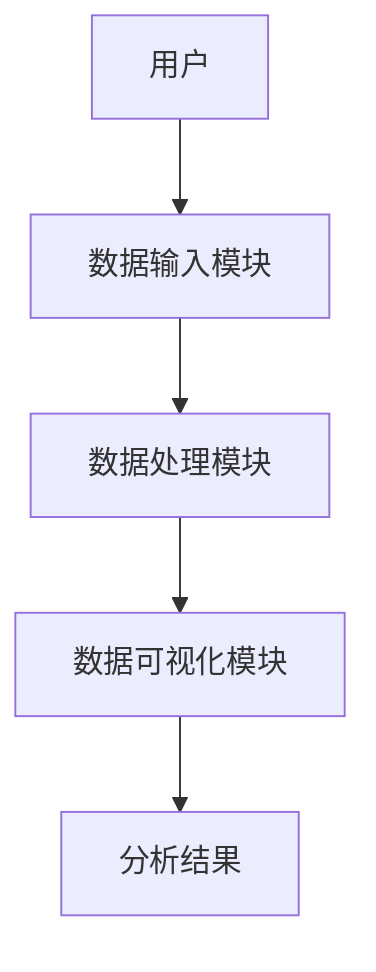

                 


# 格雷厄姆的工作资本分析：评估公司短期健康

> 关键词：格雷厄姆投资理念，工作资本分析，流动资产，流动负债，财务健康评估，价值投资策略

> 摘要：本文深入探讨了格雷厄姆的价值投资理念中，如何通过工作资本分析来评估公司的短期财务健康。文章从工作资本的核心概念出发，结合实际案例和数学模型，详细讲解了工作资本分析的算法原理、系统架构以及实际应用。通过本文的学习，读者将能够掌握如何利用工作资本分析来识别具有投资价值的公司。

---

# 第一部分: 格雷厄姆工作资本分析的背景与核心概念

## 第1章: 工作资本分析的背景与重要性

### 1.1 工作资本分析的定义与作用

#### 1.1.1 工作资本的定义
工作资本（Working Capital）是企业流动资产减去流动负债的部分，是衡量企业短期财务健康的重要指标。流动资产包括现金、应收账款、存货等，流动负债包括应付账款、短期借款等。

#### 1.1.2 工作资本分析的重要性
工作资本分析能够帮助企业评估其短期偿债能力，判断企业是否能够在短期内偿还债务，维持正常的经营运转。对于投资者来说，工作资本分析是评估企业财务健康状况的重要工具。

#### 1.1.3 工作资本分析与企业短期健康的关系
工作资本的正负直接反映了企业的短期偿债能力。正的流动资本意味着企业有足够的流动资产来偿还短期债务，而负的流动资本则意味着企业可能面临短期偿债压力。

### 1.2 格雷厄姆投资理念的简介

#### 1.2.1 格雷厄姆的价值投资理论概述
本杰明·格雷厄姆（Benjamin Graham）是价值投资的鼻祖，他主张以低于内在价值的价格购买优质股票，长期持有，以获得稳定的收益。他的投资理念强调安全边际和对企业的深入分析。

#### 1.2.2 工作资本分析在格雷厄姆投资策略中的地位
在格雷厄姆的投资策略中，工作资本分析是评估企业财务健康的重要手段。他特别关注企业的流动资产和流动负债，认为只有具备充足的流动资本，企业才能在短期市场波动中保持稳健。

#### 1.2.3 格雷厄姆投资理念的核心原则
格雷厄姆的投资理念包括以下核心原则：
1. 以低于内在价值的价格买入股票。
2. 重视企业的财务健康，特别是流动资本和负债情况。
3. 长期持有优质股票，避免短期市场波动的影响。

### 1.3 本书的核心目标与适用范围

#### 1.3.1 本书的核心目标
本书旨在通过格雷厄姆的工作资本分析方法，帮助投资者和企业财务人员深入理解如何评估公司的短期财务健康，从而做出更明智的投资决策。

#### 1.3.2 本书的适用读者群体
本书适用于投资者、企业财务管理人员、金融分析师以及对价值投资感兴趣的学生和学者。

#### 1.3.3 本书的结构安排与学习方法
本书结构清晰，从理论到实践逐步展开，读者可以通过学习工作资本分析的核心概念、算法原理和实际案例，掌握如何将这些方法应用到实际投资中。

---

## 第2章: 工作资本分析的核心概念与联系

### 2.1 工作资本的核心要素

#### 2.1.1 流动资产的构成与特点
流动资产包括以下几项：
- 现金
- 短期投资
- 应收账款
- 存货

#### 2.1.2 流动负债的构成与特点
流动负债包括以下几项：
- 短期借款
- 应付账款
- 应付工资
- 应交税费

#### 2.1.3 工作资本的计算公式与意义
工作资本的计算公式为：
$$
\text{工作资本} = \text{流动资产} - \text{流动负债}
$$
工作资本的意义在于反映企业短期偿债能力，正的流动资本意味着企业有足够的流动资产来偿还短期债务。

### 2.2 工作资本与相关财务指标的关系

#### 2.2.1 工作资本与流动比率
流动比率（Current Ratio）的计算公式为：
$$
\text{流动比率} = \frac{\text{流动资产}}{\text{流动负债}}
$$
流动比率越高，说明企业的短期偿债能力越强。

#### 2.2.2 工作资本与速动比率
速动比率（Quick Ratio）的计算公式为：
$$
\text{速动比率} = \frac{\text{流动资产} - \text{存货}}{\text{流动负债}}
$$
速动比率剔除了存货的影响，更能反映企业快速偿债的能力。

#### 2.2.3 工作资本与净利润的关系
净利润（Net Profit）的计算公式为：
$$
\text{净利润} = \text{营业收入} - \text{营业成本} - \text{费用}
$$
工作资本与净利润的关系在于，正的流动资本能够为净利润提供支持，而负的流动资本可能拖累净利润的表现。

### 2.3 工作资本分析的ER实体关系图
```mermaid
er
    title 工作资本分析的ER实体关系图
    Company -- 投资者: 持股关系
    Company -- 财务报表: 提供数据
    财务报表 -- 工作资本: 计算结果
```

---

## 第3章: 工作资本分析的算法原理与数学模型

### 3.1 工作资本计算的算法流程

#### 3.1.1 数据收集阶段
- 收集企业的流动资产和流动负债数据。
- 确保数据的准确性和完整性。

#### 3.1.2 数据处理阶段
- 将流动资产和流动负债分别汇总。
- 计算工作资本：
$$
\text{工作资本} = \text{流动资产} - \text{流动负债}
$$

#### 3.1.3 结果分析阶段
- 根据工作资本的正负判断企业的短期偿债能力。
- 结合流动比率和速动比率进行综合评估。

### 3.2 工作资本分析的数学模型

#### 3.2.1 工作资本计算公式
$$
\text{工作资本} = \text{流动资产} - \text{流动负债}
$$

#### 3.2.2 流动比率计算公式
$$
\text{流动比率} = \frac{\text{流动资产}}{\text{流动负债}}
$$

#### 3.2.3 速动比率计算公式
$$
\text{速动比率} = \frac{\text{流动资产} - \text{存货}}{\text{流动负债}}
$$

---

## 第4章: 工作资本分析的系统架构与实现

### 4.1 系统功能设计

#### 4.1.1 数据输入模块
- 支持用户输入企业的流动资产和流动负债数据。

#### 4.1.2 数据处理模块
- 计算工作资本、流动比率和速动比率。

#### 4.1.3 数据可视化模块
- 以图表形式展示工作资本分析结果。

### 4.2 系统架构设计

#### 4.2.1 系统架构图


---

## 第5章: 工作资本分析的项目实战

### 5.1 项目背景与目标

#### 5.1.1 项目背景
假设我们是一家投资公司，需要评估某家企业的短期财务健康状况。

#### 5.1.2 项目目标
通过工作资本分析，判断该企业是否具备短期偿债能力。

### 5.2 项目实现步骤

#### 5.2.1 数据收集
收集企业的流动资产和流动负债数据。

#### 5.2.2 数据处理
计算工作资本、流动比率和速动比率。

#### 5.2.3 结果分析
根据分析结果判断企业的短期财务健康状况。

### 5.3 实际案例分析

#### 5.3.1 案例数据
假设某企业的流动资产为$500,000，流动负债为$300,000。

#### 5.3.2 计算工作资本
$$
\text{工作资本} = 500,000 - 300,000 = 200,000
$$

#### 5.3.3 计算流动比率
$$
\text{流动比率} = \frac{500,000}{300,000} \approx 1.6667
$$

#### 5.3.4 计算速动比率
$$
\text{速动比率} = \frac{500,000 - 200,000}{300,000} = \frac{300,000}{300,000} = 1
$$

#### 5.3.5 结果分析
- 工作资本为正，说明企业具备短期偿债能力。
- 流动比率为1.6667，说明企业短期偿债能力较强。
- 速动比率为1，说明企业在排除存货后仍具备较强的短期偿债能力。

---

## 第6章: 工作资本分析的最佳实践与小结

### 6.1 最佳实践

#### 6.1.1 数据收集的注意事项
- 确保数据的准确性和完整性。
- 考虑企业所处的行业特点。

#### 6.1.2 分析结果的解读
- 结合行业标准进行横向比较。
- 考虑企业的具体经营环境和财务状况。

### 6.2 小结

#### 6.2.1 核心观点回顾
工作资本分析是评估企业短期财务健康的重要工具，通过计算工作资本、流动比率和速动比率，可以全面了解企业的短期偿债能力。

#### 6.2.2 进一步学习的方向
- 深入学习格雷厄姆的价值投资理念。
- 掌握更多财务分析方法，如 ROE、ROA 等。

---

## 作者信息

作者：AI天才研究院/AI Genius Institute & 禅与计算机程序设计艺术 /Zen And The Art of Computer Programming

---

这篇文章通过系统地讲解格雷厄姆的工作资本分析方法，帮助读者掌握如何通过流动资产和流动负债的分析，评估企业的短期财务健康状况。文章结合理论与实践，提供了丰富的案例和详细的数学模型，帮助读者在实际投资中应用这些方法。

