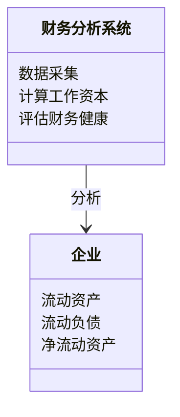
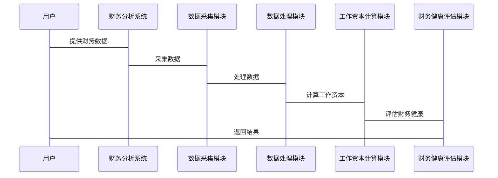

                 


# 格雷厄姆的工作资本分析：适应轻资产商业模式

> 关键词：格雷厄姆，工作资本分析，轻资产商业模式，投资分析，企业价值评估

> 摘要：本文深入探讨了格雷厄姆的工作资本分析方法及其在轻资产商业模式中的应用。通过系统化的分析框架、数学模型和实际案例，本文旨在帮助读者理解如何利用工作资本分析评估企业价值，并为投资决策提供科学依据。

---

# 第1章: 工作资本分析与轻资产商业模式概述

## 1.1 工作资本分析的背景与核心概念

### 1.1.1 什么是工作资本

工作资本（Working Capital）是企业运营中流动资产与流动负债的差额，反映了企业的短期偿债能力和运营效率。它是企业财务健康的重要指标之一。

$$
\text{工作资本} = \text{流动资产} - \text{流动负债}
$$

### 1.1.2 工作资本分析的起源与演变

工作资本分析起源于20世纪初，格雷厄姆是该领域的先驱。他提出，通过分析企业的流动资产和流动负债，可以评估企业的短期偿债能力和运营效率。

### 1.1.3 轻资产商业模式的特点与挑战

轻资产模式以低固定资产投入、高流动资产为核心，依赖数据、品牌和技术驱动。这种模式下，工作资本分析尤为重要，因为流动资产和流动负债的管理直接关系到企业的生存和发展。

---

## 1.2 格雷厄姆的投资理念与工作资本分析

### 1.2.1 格雷厄姆的投资哲学

格雷厄姆是价值投资之父，他强调以低于内在价值的价格买入优质股票。工作资本分析是其评估企业内在价值的重要工具。

### 1.2.2 工作资本分析在投资中的应用

格雷厄姆通过分析企业的流动资产和流动负债，评估企业的短期偿债能力和运营效率，从而判断其是否具备投资价值。

### 1.2.3 轻资产模式下的工作资本分析

在轻资产模式下，工作资本分析更关注流动资产的构成和流动负债的管理。格雷厄姆的方法在这一模式下依然适用，但需要结合企业的具体业务特点进行调整。

---

## 1.3 工作资本分析的核心要素

### 1.3.1 流动资产与流动负债的定义

流动资产包括现金、应收账款、存货等，流动负债包括应付账款、短期债务等。

### 1.3.2 净流动资产的计算公式

$$
\text{净流动资产} = \text{流动资产} - \text{非流动资产}
$$

### 1.3.3 工作资本的衡量指标

- 速动比率：$$\text{速动比率} = \frac{\text{流动资产} - \text{存货}}{\text{流动负债}}$$
- 流动资产周转率：$$\text{流动资产周转率} = \frac{\text{营业收入}}{\text{平均流动资产}}$$

---

# 第2章: 工作资本分析的数学模型与公式

## 2.1 工作资本的核心公式

### 2.1.1 工作资本的计算公式

$$
\text{工作资本} = \text{流动资产} - \text{流动负债}
$$

### 2.1.2 净流动资产的计算公式

$$
\text{净流动资产} = \text{流动资产} - \text{非流动资产}
$$

### 2.1.3 速动比率的计算公式

$$
\text{速动比率} = \frac{\text{流动资产} - \text{存货}}{\text{流动负债}}
$$

## 2.2 工作资本分析的数学模型

### 2.2.1 流动资产的构成与权重分析

流动资产由现金、应收账款、存货等组成，权重取决于企业业务模式。

### 2.2.2 净流动资产的动态变化模型

$$
\Delta \text{净流动资产} = \Delta \text{流动资产} - \Delta \text{非流动资产}
$$

### 2.2.3 工作资本与企业价值的关系

$$
\text{企业价值} = \text{净流动资产} + \text{非流动资产} - \text{债务}
$$`

## 2.3 通过公式计算企业财务健康度

### 2.3.1 速动比率的计算与企业偿债能力评估

速动比率越高，企业短期偿债能力越强。

### 2.3.2 流动资产周转率的计算与运营效率分析

流动资产周转率越高，企业运营效率越高。

### 2.3.3 工作资本与企业价值的关系

工作资本是企业价值的重要组成部分，直接影响企业的财务健康和投资价值。

---

# 第3章: 工作资本分析的系统架构与设计

## 3.1 系统分析框架

### 3.1.1 问题场景介绍

分析一家互联网企业的财务状况，评估其工作资本和企业价值。

### 3.1.2 项目介绍与目标

目标是通过工作资本分析，评估企业的财务健康和投资价值。

### 3.1.3 系统功能需求分析

- 数据采集与处理
- 工作资本计算
- 财务健康评估

## 3.2 系统架构设计

### 3.2.1 领域模型设计（Mermaid 类图）



### 3.2.2 系统架构设计（Mermaid 架构图）

```mermaid
architecturalDiagram
    财务分析系统
    + 数据采集模块
    + 工作资本计算模块
    + 财务健康评估模块
```

### 3.2.3 系统接口设计

- 数据接口：CSV、Excel
- 计算接口：Python 函数

## 3.3 系统交互设计

### 3.3.1 系统交互流程（Mermaid 序列图）



### 3.3.2 用户角色与权限分配

- 用户：数据输入和结果查看
- 系统管理员：系统维护和权限管理

### 3.3.3 数据流与信息传递机制

- 数据输入：财务数据
- 数据处理：清洗和转换
- 数据输出：工作资本分析结果

---

# 第4章: 工作资本分析的项目实战

## 4.1 环境安装与工具准备

### 4.1.1 Python 环境安装

安装 Python 和必要的库（Pandas、NumPy）。

### 4.1.2 数据分析工具安装

安装 Jupyter Notebook 或 VS Code 的数据分析扩展。

### 4.1.3 开发环境配置

配置虚拟环境，安装必要的依赖库。

## 4.2 核心算法实现

### 4.2.1 工作资本计算的 Python 代码实现

```python
import pandas as pd

def calculate_working_capital(data):
    working_capital = data['流动资产'] - data['流动负债']
    return working_capital

# 示例数据
data = {
    '流动资产': [100, 200, 150],
    '流动负债': [50, 100, 70]
}
df = pd.DataFrame(data)
print(calculate_working_capital(df))
```

### 4.2.2 数据清洗与特征提取

使用 Pandas 对数据进行清洗和特征提取。

### 4.2.3 模型训练与评估

通过机器学习模型对工作资本进行预测和评估。

## 4.3 代码应用与案例分析

### 4.3.1 案例数据集介绍

介绍案例数据集的来源和内容。

### 4.3.2 代码运行与结果解读

运行代码，解读结果。

### 4.3.3 案例分析与总结

总结案例分析的结果，提出改进建议。

## 4.4 项目小结与经验分享

### 4.4.1 项目实施的关键点

强调数据质量、模型选择和结果解读的重要性。

### 4.4.2 实践中的常见问题与解决方案

解决数据缺失、模型过拟合等问题。

### 4.4.3 项目成果与未来改进方向

总结项目成果，提出未来改进方向。

---

# 第5章: 工作资本分析的最佳实践与注意事项

## 5.1 格雷厄姆投资理念的现代应用

### 5.1.1 价值投资的现代挑战

应对市场变化和技术进步的挑战。

### 5.1.2 轻资产模式下的投资策略

结合企业业务模式和财务状况制定投资策略。

### 5.1.3 工作资本分析的动态调整

根据市场变化和企业状况动态调整分析方法。

## 5.2 实际操作中的注意事项

### 5.2.1 数据质量的重要性

确保数据准确性和完整性。

### 5.2.2 模型的适用性

选择适合企业特点的模型。

### 5.2.3 风险管理

重视风险管理，避免过度依赖单一指标。

---

# 总结

工作资本分析是评估企业财务健康和投资价值的重要工具。通过系统化的分析框架、数学模型和实际案例，我们可以更好地理解和应用格雷厄姆的工作资本分析方法，为投资决策提供科学依据。

作者：AI天才研究院/AI Genius Institute & 禅与计算机程序设计艺术 /Zen And The Art of Computer Programming

