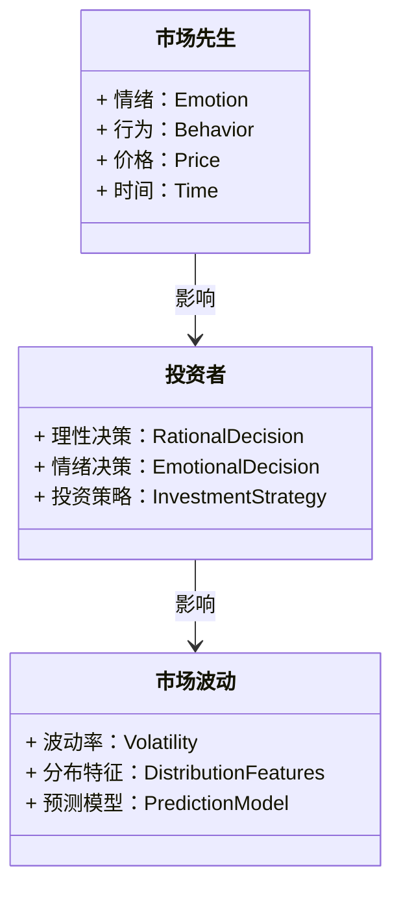
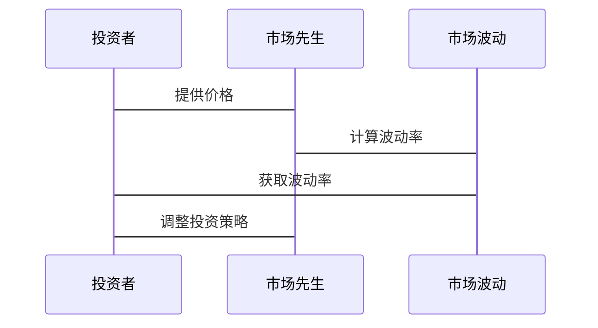

                 


# 格雷厄姆的市场先生比喻

> 关键词：市场先生比喻、投资者行为、价值投资、风险管理、市场波动、波动率、投资策略

> 摘要：本文深入探讨了格雷厄姆提出的市场先生比喻，分析其在投资理论中的作用，结合数学模型和实际案例，详细阐述了其在价值投资、风险管理等方面的应用，并提供了系统的架构设计和实战代码示例。

---

# 第1章: 市场先生比喻的背景与核心概念

## 1.1 本杰明·格雷厄姆与市场先生的提出

### 1.1.1 格雷厄姆的生平与投资理念

本杰明·格雷厄姆（Benjamin Graham）是20世纪著名的投资学家，被誉为“价值投资之父”。他出生于1894年，曾在纽约证券交易所工作，后来成为哥伦比亚大学的教授，培养了包括沃伦·巴菲特在内的众多投资界名人。格雷厄姆的投资理念以基本面分析和安全边际为核心，强调以合理价格购买具有内在价值的股票。

### 1.1.2 市场先生比喻的提出背景

在《 Intelligent Investor 》一书中，格雷厄姆提出了“市场先生”（Mr. Market）的概念。这一比喻旨在解释市场的波动性和投资者心理之间的关系。市场先生代表了市场的整体情绪，他的行为往往受情绪驱动，而非理性分析。通过这一比喻，格雷厄姆希望投资者能够区分“价格”与“价值”，避免被市场的短期波动所迷惑。

### 1.1.3 市场先生在投资理论中的地位

市场先生比喻是格雷厄姆投资理论的重要组成部分，它帮助投资者理解市场的非理性波动，并强调长期投资的重要性。这一概念不仅适用于股票市场，还适用于任何类型的资产投资。

---

## 1.2 市场先生比喻的核心概念

### 1.2.1 市场先生的定义与特征

市场先生是一个虚构的角色，代表市场的整体情绪和行为。他的特点包括：

1. **情绪化**：市场先生的行为受到情绪驱动，可能在贪婪时推高价格，或在恐惧时压低价格。
2. **短期性**：市场先生关注的是短期价格波动，而非长期价值。
3. **不可预测性**：市场先生的行为难以预测，这使得市场波动具有不确定性。

### 1.2.2 市场先生与实际市场的联系与区别

#### 联系

1. 市场先生代表了市场的整体情绪，与实际市场的波动性一致。
2. 市场先生的行为反映了投资者的心理变化，与实际市场中投资者的行为一致。

#### 区别

1. 市场先生是虚构的，而实际市场是由众多投资者共同作用的结果。
2. 市场先生的行为是情绪化的，而实际市场中投资者的行为可能更为理性或多元化。

### 1.2.3 市场先生比喻的适用范围与局限性

#### 适用范围

1. 解释市场波动的原因。
2. 帮助投资者理解短期价格波动与长期价值之间的区别。
3. 强调安全边际和长期投资的重要性。

#### 局限性

1. 市场先生比喻过于简化了市场的复杂性。
2. 无法完全解释市场的所有波动现象。

---

## 1.3 投资者行为与市场波动的关联

### 1.3.1 投资者心理与市场波动的关系

投资者的心理变化直接影响市场的波动。当市场先生情绪高涨时，投资者倾向于追涨杀跌，导致价格偏离内在价值。

### 1.3.2 市场先生比喻对投资者决策的影响

市场先生比喻提醒投资者关注长期价值，而非短期价格波动。它帮助投资者避免情绪化决策，并在市场恐慌时保持冷静。

### 1.3.3 市场先生比喻在投资策略中的应用

市场先生比喻在价值投资、风险管理等领域具有重要应用。它帮助投资者制定长期投资策略，并在市场波动中保持理性。

---

# 第2章: 市场先生比喻的核心概念与投资者行为分析

## 2.1 市场先生的定义与属性

### 2.1.1 市场先生的定义

市场先生是格雷厄姆提出的一个比喻，代表市场的整体情绪和行为。他每天为投资者提供买卖价格，但其行为往往情绪化且不可预测。

### 2.1.2 市场先生的核心属性分析

1. **情绪化**：市场先生的行为受情绪驱动，可能在短期内大幅波动。
2. **短期性**：他关注的是短期价格变化，而非长期价值。
3. **不可预测性**：市场先生的行为难以预测，这使得市场波动具有不确定性。

### 2.1.3 市场先生与实际市场的对比

市场先生与实际市场的主要区别在于，市场先生是虚构的，而实际市场是由众多投资者共同作用的结果。然而，两者的行为模式在某些方面是相似的，尤其是情绪化和不可预测性。

---

## 2.2 投资者行为的分析与分类

### 2.2.1 投资者行为的分类

投资者行为可以分为以下几类：

1. **理性投资者**：基于基本面分析做出决策，较少受情绪影响。
2. **情绪化投资者**：受市场情绪驱动，倾向于追涨杀跌。
3. **短期投资者**：关注短期价格波动，频繁交易。
4. **长期投资者**：关注长期价值，注重投资策略的稳定性。

### 2.2.2 不同类型投资者的行为特征

- **理性投资者**：注重基本面分析，追求长期价值。
- **情绪化投资者**：受市场情绪影响，倾向于短期交易。
- **短期投资者**：关注价格波动，追求短期收益。
- **长期投资者**：关注长期价值，注重投资策略的稳定性。

### 2.2.3 投资者行为对市场波动的影响

投资者行为直接影响市场的波动性。情绪化投资者的短期交易行为可能导致市场价格偏离内在价值，而理性投资者的长期投资行为有助于市场稳定。

---

## 2.3 市场先生与投资者心理的联系

### 2.3.1 市场先生比喻如何反映投资者心理

市场先生比喻通过情绪化和不可预测的行为，反映了投资者心理的变化。它帮助投资者理解市场的波动性，并提醒他们关注长期价值。

### 2.3.2 投资者情绪对市场先生的影响

投资者情绪直接影响市场先生的行为。当投资者情绪高涨时，市场先生可能推高价格；当投资者情绪低落时，市场先生可能压低价格。

### 2.3.3 市场先生比喻对投资者决策的启示

市场先生比喻提醒投资者避免情绪化决策，并在市场波动中保持冷静。它强调了长期投资的重要性，并建议投资者关注内在价值而非短期价格波动。

---

# 第3章: 市场先生比喻与投资策略

## 3.1 市场先生比喻在价值投资中的应用

### 3.1.1 价值投资的基本原理

价值投资是一种投资策略，强调以低于内在价值的价格购买优质资产。其核心在于寻找市场先生定价错误的机会。

### 3.1.2 市场先生比喻对价值投资的启示

市场先生比喻提醒投资者关注长期价值，并在市场恐慌时寻找低估资产。它帮助投资者识别短期波动中的投资机会。

### 3.1.3 价值投资中的市场先生视角

价值投资者应以市场先生为镜，反思市场波动背后的心理因素，并在市场低估时果断投资。

---

## 3.2 市场先生比喻与风险管理

### 3.2.1 风险管理的基本概念

风险管理是指通过识别、评估和控制风险，以减少投资损失的可能性。它是投资策略的重要组成部分。

### 3.2.2 市场先生比喻对风险管理的影响

市场先生比喻提醒投资者关注市场的波动性和不可预测性，并在投资组合中加入风险管理措施。

### 3.2.3 如何利用市场先生视角进行风险管理

投资者可以通过市场先生比喻，识别市场波动中的潜在风险，并采取相应的风险管理策略。

---

## 3.3 市场先生比喻与逆向投资

### 3.3.1 逆向投资的基本原理

逆向投资是一种投资策略，强调在市场低迷时买入，在市场高涨时卖出。它利用市场先生的情绪化行为，寻找投资机会。

### 3.3.2 市场先生比喻对逆向投资的启示

市场先生比喻提醒投资者关注市场的非理性波动，并在市场恐慌时寻找低估资产。

### 3.3.3 逆向投资中的市场先生视角

逆向投资者应以市场先生为镜，反思市场波动背后的心理因素，并在市场低估时果断投资。

---

## 3.4 市场先生比喻与长期投资

### 3.4.1 长期投资的基本概念

长期投资是一种投资策略，强调长期持有优质资产，忽略短期价格波动。

### 3.4.2 市场先生比喻对长期投资的启示

市场先生比喻提醒投资者关注长期价值，并在市场波动中保持冷静。

### 3.4.3 长期投资中的市场先生视角

长期投资者应以市场先生为镜，反思市场波动背后的心理因素，并在市场低估时果断投资。

---

# 第4章: 市场先生比喻的数学模型与波动分析

## 4.1 市场波动的数学模型

### 4.1.1 波动率的定义与计算公式

波动率是衡量资产价格波动性的指标。标准差是常用的波动率计算公式：

$$ \text{波动率} = \sqrt{\frac{1}{n-1} \sum_{i=1}^{n} (x_i - \bar{x})^2} $$

其中，$x_i$ 是第i个观测值，$\bar{x}$ 是平均值，$n$ 是观测次数。

### 4.1.2 市场波动的分布特征

市场波动通常服从正态分布，但极端事件可能导致尾部厚实。市场先生比喻提醒投资者关注波动率的非对称性和不可预测性。

---

## 4.2 投资者行为的数学建模

### 4.2.1 投资者情绪的量化模型

投资者情绪可以通过市场成交量、波动率等指标量化。例如，使用归一化波动率衡量情绪强度：

$$ \text{情绪强度} = \frac{\text{实际波动率}}{\text{长期平均波动率}} $$

### 4.2.2 市场先生比喻与投资者行为的数学关联

市场先生的行为可以用随机游走模型模拟。假设市场先生的行为是随机的，价格波动可以表示为：

$$ p_{t} = p_{t-1} + \epsilon $$

其中，$\epsilon$ 是随机误差项，表示市场先生的情绪波动。

### 4.2.3 投资者行为对市场波动的数学影响

投资者情绪化行为会导致市场波动率增加。例如，使用 ARCH 模型分析波动率的自相关性：

$$ \sigma_{t}^2 = a + b \sigma_{t-1}^2 + c r_{t-1}^2 $$

其中，$\sigma_{t}^2$ 是第t期的波动率，$r_{t-1}$ 是第t-1期的收益。

---

## 4.3 市场波动的预测与分析

### 4.3.1 波动率的预测模型

使用 GARCH 模型预测波动率：

$$ \sigma_{t}^2 = a + b \sigma_{t-1}^2 + c r_{t-1}^2 $$

### 4.3.2 市场先生比喻对波动率预测的启示

市场先生比喻提醒投资者关注波动率的非对称性和不可预测性。因此，在波动率预测中应考虑市场情绪和投资者行为的复杂性。

### 4.3.3 波动率与市场先生比喻的关系

波动率是市场先生行为的量化表现。通过分析波动率，可以更好地理解市场先生的情绪变化。

---

# 第5章: 市场先生比喻与投资策略的系统分析

## 5.1 系统功能设计

### 5.1.1 领域模型（Mermaid 类图）



### 5.1.2 系统架构设计（Mermaid 架构图）


### 5.1.3 系统接口设计

- 投资者与市场先生之间的接口：投资者根据市场先生的行为调整投资策略。
- 市场先生与市场波动之间的接口：市场波动反映市场先生的情绪和行为。
- 投资者与市场波动之间的接口：投资者根据市场波动调整投资策略。

### 5.1.4 系统交互设计（Mermaid 序列图）



---

## 5.2 项目实战

### 5.2.1 环境安装

安装必要的Python库：

```bash
pip install pandas numpy matplotlib
```

### 5.2.2 核心实现代码

```python
import pandas as pd
import numpy as np
import matplotlib.pyplot as plt

# 示例数据：假设市场先生的行为模拟
np.random.seed(42)
market_behavior = np.random.normal(0, 1, 100)  # 随机波动
prices = np.cumsum(market_behavior)  # 累积和模拟价格

# 计算波动率
volatility = np.std(market_behavior)

# 可视化
plt.figure(figsize=(10, 6))
plt.plot(prices, label='Price')
plt.xlabel('Time')
plt.ylabel('Price')
plt.title('Market Behavior Simulation')
plt.legend()
plt.show()
```

### 5.2.3 代码应用解读与分析

上述代码模拟了市场先生的行为，生成随机价格序列，并计算波动率。通过可视化，可以观察市场波动的分布特征，帮助投资者理解市场先生的情绪变化。

---

## 5.3 实际案例分析

### 5.3.1 案例介绍

以2020年新冠疫情为例，分析市场先生比喻在实际投资中的应用。

### 5.3.2 案例分析

1. **市场波动**：疫情爆发导致市场恐慌，波动率显著增加。
2. **投资者行为**：投资者情绪低落，市场先生行为表现为价格大幅下跌。
3. **投资策略**：长期投资者在市场恐慌时寻找低估资产，逆向投资者在市场低谷时增加持仓。

### 5.3.3 案例总结

市场先生比喻帮助投资者在市场恐慌时保持冷静，并利用波动率分析寻找投资机会。

---

## 5.4 项目小结

通过系统分析和项目实战，我们可以更好地理解市场先生比喻在投资策略中的应用。市场波动的数学模型和投资者行为的分析为我们提供了理论支持，而实际案例则验证了这些理论的有效性。

---

# 第6章: 总结与展望

## 6.1 总结

市场先生比喻是格雷厄姆提出的重要投资理论，帮助投资者理解市场波动和投资者心理。通过分析市场先生的定义、特征和投资者行为，我们可以制定有效的投资策略，如价值投资、风险管理等。

## 6.2 展望

未来，市场先生比喻的研究可以结合大数据和人工智能技术，进一步分析市场波动和投资者行为。此外，市场先生比喻在量化投资中的应用也值得深入探讨。

## 6.3 最佳实践 tips

1. **长期投资**：关注长期价值，忽略短期波动。
2. **风险管理**：在投资组合中加入风险管理措施。
3. **逆向思维**：在市场恐慌时寻找投资机会。
4. **量化分析**：利用数学模型和大数据技术分析市场波动。

---

# 作者：AI天才研究院/AI Genius Institute & 禅与计算机程序设计艺术/Zen And The Art of Computer Programming

