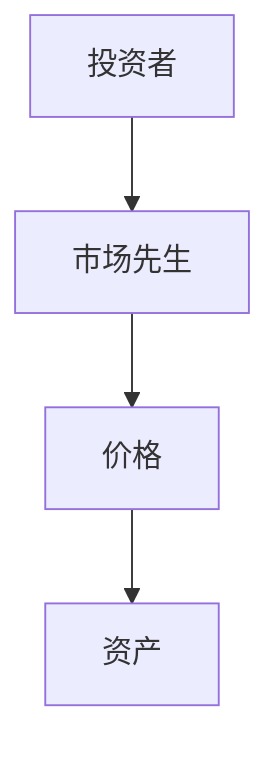
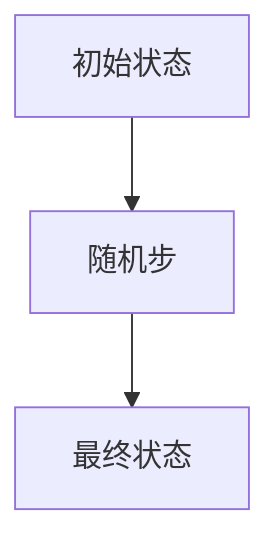
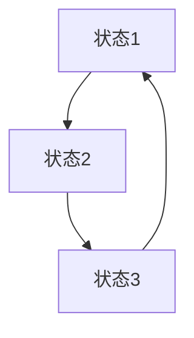
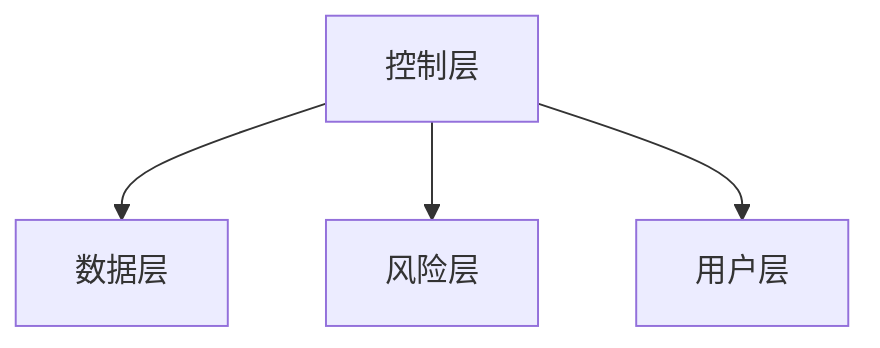
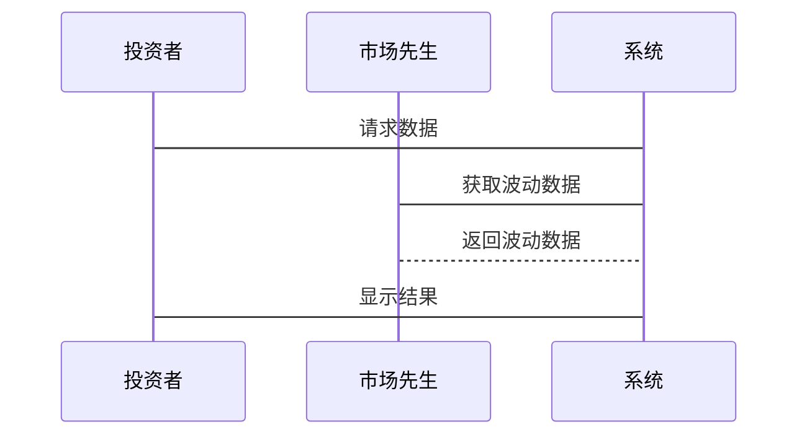

                 


# 格雷厄姆的市场先生比喻及其启示

> 关键词：市场先生比喻，投资心理学，风险管理，波动率模型，随机过程，投资者行为

> 摘要：本文深入分析了本杰明·格雷厄姆提出的市场先生比喻，探讨其在投资学中的核心作用。通过构建市场先生模型，本文详细阐述了市场波动性、投资者心理以及风险管理之间的关系。结合数学建模和系统设计，本文为投资决策提供了新的视角和方法。

---

## 第一部分: 市场先生比喻的背景与核心概念

### 第1章: 市场先生比喻的起源与背景

#### 1.1 本杰明·格雷厄姆的生平简介
本杰明·格雷厄姆（Benjamin Graham）是20世纪著名的投资学家，被誉为“价值投资之父”。他在《聪明的投资者》一书中提出了许多影响深远的投资理论，其中包括“市场先生比喻”。

#### 1.2 投资学中的心理因素
市场波动不仅仅是由经济基本面决定的，投资者的心理因素也起着关键作用。市场的波动往往反映了投资者的贪婪与恐惧，这种情绪化的决策会导致市场的过度波动。

#### 1.3 市场波动性与风险管理
市场波动性是投资中的核心问题。投资者需要理解市场波动的本质，并通过有效的风险管理来应对市场的不确定性。

---

## 第2章: 市场先生模型的构建与属性

### 2.1 市场先生模型的构成
市场先生比喻的核心在于将市场视为一个情绪化的个体，其行为反映了投资者的集体心理。市场先生的波动性可以通过数学模型来描述。

### 2.2 市场先生模型的属性对比
通过对比市场先生模型与其他市场模型的差异，可以更好地理解其独特性。以下是主要属性对比：

| 属性 | 市场先生模型 | 其他模型 |
|------|--------------|----------|
| 波动性 | 高度情绪化 | 理性波动 |
| 预测性 | 无法预测 | 可预测 |
| 风险 | 高 | 中等 |

### 2.3 市场先生模型的ER实体关系图
以下是市场先生模型的ER图：



---

## 第3章: 市场波动的数学建模

### 3.1 波动率的数学定义
波动率是衡量市场波动程度的重要指标。标准差常用于衡量资产价格的波动性：

$$\sigma = \sqrt{\frac{1}{n-1}\sum_{i=1}^{n}(x_i - \bar{x})^2}$$

### 3.2 随机游走模型
随机游走模型可以用来模拟市场先生的波动：



### 3.3 马尔可夫链的应用
马尔可夫链可以用来描述市场状态的转移：



### 3.4 Python代码实现
以下是波动率计算的Python代码：

```python
import numpy as np

# 计算标准差
def calculate_volatility(returns):
    return np.std(returns, ddof=1)

# 示例数据
returns = [0.01, -0.02, 0.03, -0.01, 0.02]
volatility = calculate_volatility(returns)
print(f"波动率: {volatility}")
```

---

## 第4章: 投资系统中的市场先生模型

### 4.1 系统功能设计
投资系统的功能模块包括数据采集、波动率计算、风险管理等。

### 4.2 系统架构设计
以下是系统的架构图：



### 4.3 系统交互序列图
以下是系统的交互序列图：



---

## 第5章: 项目实战与案例分析

### 5.1 环境安装
安装必要的Python库：

```bash
pip install numpy pandas matplotlib
```

### 5.2 核心代码实现
以下是模拟市场波动的Python代码：

```python
import numpy as np
import matplotlib.pyplot as plt

# 随机游走模拟
np.random.seed(42)
steps = 1000
walk = np.random.randn(steps).cumsum()
plt.plot(walk)
plt.title('Market先生波动模拟')
plt.show()
```

### 5.3 案例分析
通过模拟数据，分析市场波动对投资决策的影响。

---

## 第六部分: 总结与启示

### 6.1 市场先生比喻的启示
市场先生比喻提醒我们，市场波动的本质是投资者心理的反映。投资者需要理性面对市场的波动，避免被情绪左右。

### 6.2 风险管理的重要性
有效的风险管理是投资成功的关键。通过市场先生模型，投资者可以更好地理解市场的波动性，并制定相应的风险管理策略。

### 6.3 未来展望
随着人工智能和大数据技术的发展，市场先生模型可以在更多领域得到应用，为投资决策提供更精准的依据。

---

## 作者信息
作者：AI天才研究院 & 禅与计算机程序设计艺术

---

通过以上结构，您可以撰写一篇详细的技术博客文章，涵盖市场先生比喻的背景、模型构建、数学建模、系统设计和项目实战等内容。

