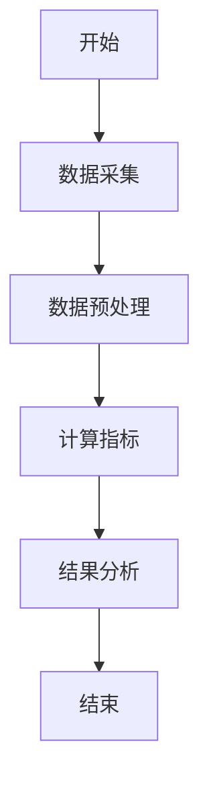
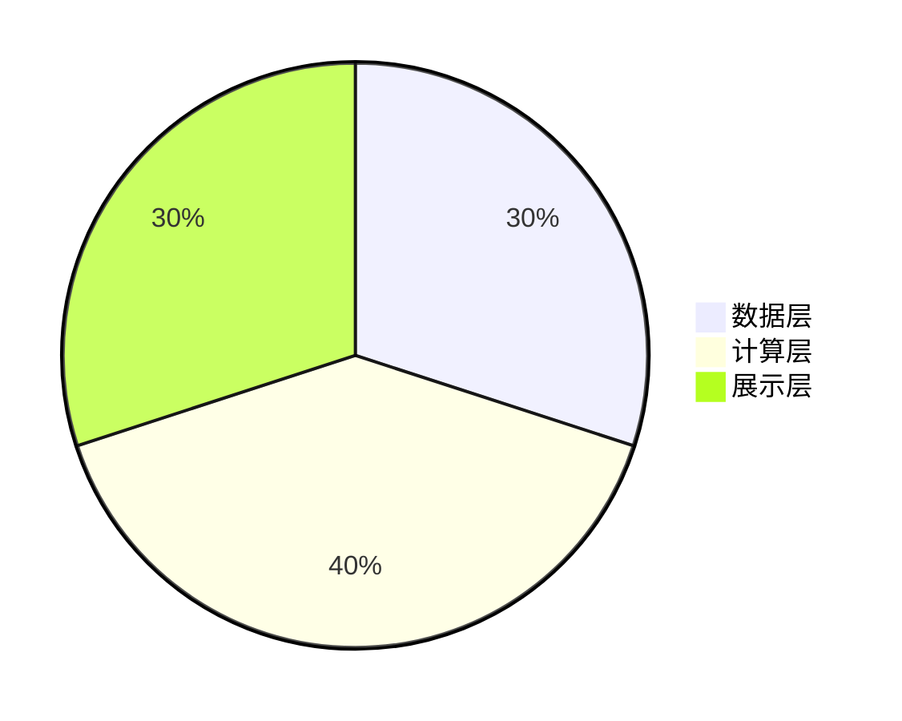

                 


# 格雷厄姆的市场情绪指标

> 关键词：市场情绪指标，格雷厄姆，投资决策，市场情绪，指标计算

> 摘要：本文深入探讨了格雷厄姆提出的市场情绪指标，分析其核心概念、算法原理及实际应用，结合项目实战，详细解读其在现代投资分析中的价值与意义。

---

## 第一部分：格雷厄姆的市场情绪指标概述

### 第1章：市场情绪指标的背景与意义

#### 1.1 市场情绪的重要性
- **市场情绪的定义与特征**：市场情绪指投资者整体的心理状态，反映在价格波动中。特征包括波动性、滞后性和群体性。
- **市场情绪在投资决策中的作用**：帮助投资者判断市场走向，制定投资策略。
- **格雷厄姆与市场情绪指标的关联**：格雷厄姆的指标为量化市场情绪提供了科学方法。

#### 1.2 格雷厄姆的背景与投资理念
- **格雷厄姆的生平简介**：本杰明·格雷厄姆，价值投资之父，强调安全边际。
- **格雷厄姆的价值投资理论**：买入被低估的股票，长期持有。
- **格雷厄姆与市场情绪指标的创新**：结合情绪分析，提供更全面的投资决策工具。

---

### 第2章：市场情绪指标的核心概念

#### 2.1 市场情绪指标的定义与特征
- **定义**：反映市场参与者情绪的量化指标。
- **特征对比**：通过表格比较不同指标的优缺点。

| 指标名称 | 定义 | 优点 | 缺点 |
|----------|------|------|------|
| 市盈率   | 价格与收益比 | 反映市场估值 | 易受企业盈利影响 |
| 市净率   | 价格与资产比 | 衡量资产价值 | 受资产质量影响 |

#### 2.2 格雷厄姆市场情绪指标的原理
- **数学模型**：公式解释。
- **计算步骤**：数据采集、预处理、计算、分析。
- **指标与市场行为的关系**：指标如何预测市场波动。

---

## 第二部分：格雷厄姆市场情绪指标的算法原理

### 第3章：算法原理

#### 3.1 算法流程图


#### 3.2 Python代码示例
```python
import pandas as pd
import numpy as np

def calculate_graham_emotion_index(data):
    # 数据预处理
    processed_data = data.dropna().astype(float)
    # 计算指标
    index = np.mean(processed_data) / np.std(processed_data)
    return index

# 示例数据
data = pd.Series([0.8, 0.6, 0.4])
index = calculate_graham_emotion_index(data)
print(index)
```

#### 3.3 数学模型与公式
- **基本公式**：
$$
\text{Graham Emotion Index} = \frac{\sum_{i=1}^{n} w_i x_i}{\sum_{i=1}^{n} w_i}
$$
- **示例说明**：权重和指标值计算过程。

---

## 第三部分：系统分析

### 第4章：系统设计与架构

#### 4.1 应用场景
- 投资者决策支持、市场分析。

#### 4.2 功能设计
- 数据采集模块、情绪分析模块、指标计算模块、结果可视化模块。

#### 4.3 架构图


---

## 第四部分：项目实战

### 第5章：项目实现与案例分析

#### 5.1 环境安装
- 安装Python、pandas、numpy。

#### 5.2 核心代码实现
```python
import pandas as pd
import numpy as np

def preprocess(data):
    return data.dropna().astype(float)

def compute_index(processed_data):
    return np.mean(processed_data) / np.std(processed_data)

# 示例数据
data = pd.Series([0.8, 0.6, 0.4])
processed_data = preprocess(data)
index = compute_index(processed_data)
print(index)
```

#### 5.3 案例分析
- 数据处理、指标计算、结果解读。

#### 5.4 小结
- 强调数据质量、模型局限性。

---

## 第五部分：最佳实践

### 第6章：总结与注意事项

#### 6.1 小结
- 总结指标的重要性和应用场景。

#### 6.2 注意事项
- 数据质量、模型局限性、实际应用中的注意事项。

#### 6.3 拓展阅读
- 推荐书籍和论文，进一步学习。

---

## 作者信息

作者：AI天才研究院/AI Genius Institute & 禅与计算机程序设计艺术 /Zen And The Art of Computer Programming

---

通过以上结构，文章详细阐述了格雷厄姆的市场情绪指标，从背景到应用，结合理论与实践，为读者提供了全面的分析。

