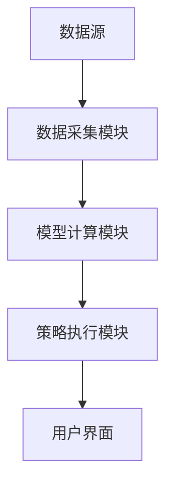
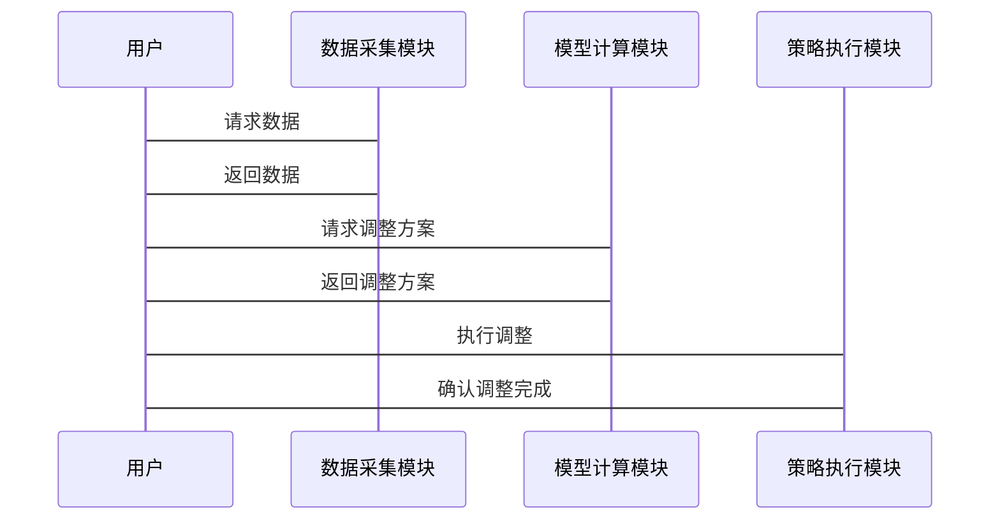

                 


# 格雷厄姆的投资组合再平衡策略

> 关键词：投资组合，再平衡，价值投资，资产配置，投资策略

> 摘要：本文深入探讨了格雷厄姆的投资组合再平衡策略，从其核心概念、数学模型、系统架构到实际应用进行了全面分析。通过详细讲解再平衡的原理、算法和系统设计，结合实际案例和代码实现，帮助读者理解如何在现代投资管理中应用这一策略。

---

## 第一部分: 投资组合再平衡的背景与基础

### 第1章: 投资组合与再平衡概述

#### 1.1 投资组合的基本概念
- **投资组合的定义**：投资组合是将资金分配到不同资产（如股票、债券、房地产等）的一种方式，旨在通过分散投资降低风险并实现收益最大化。
- **投资组合的特点**：
  - 分散性：通过多样化投资降低特定资产的风险。
  - 风险-收益平衡：根据不同投资者的风险承受能力调整资产配置。
  - 动态调整：根据市场变化和个人目标进行优化。

#### 1.2 再平衡策略的定义与目的
- **再平衡的定义**：再平衡是指定期调整投资组合的资产配置，使其恢复到预定的目标比例，以应对市场波动和实现长期投资目标。
- **再平衡的目的**：
  - 维持资产配置：确保投资组合的结构与最初设定的目标一致。
  - 降低风险：通过调整避免某类资产权重过大带来的风险。
  - 抓住市场机会：在市场变化中进行资产调整以捕捉收益。

#### 1.3 格雷厄姆投资理念的核心要素
- **价值投资**：格雷厄姆强调以低于内在价值的价格买入优质资产，长期持有。
- **防御性投资**：注重安全性和稳定性，避免过度冒险。
- **长期视角**：再平衡策略帮助投资者在长期投资中保持纪律性，避免情绪化决策。

### 1.4 本章小结
- 投资组合再平衡是投资管理中的关键策略。
- 格雷厄姆的价值投资理念为再平衡策略提供了理论基础。

---

## 第二部分: 投资组合再平衡的核心概念与原理

### 第2章: 投资组合再平衡的原理与机制

#### 2.1 再平衡的数学模型与公式
- **资产权重计算**：
  $$ w_i = \frac{a_i}{\sum_{j=1}^{n} a_j} $$
  其中，$w_i$ 是第 $i$ 个资产的权重，$a_i$ 是第 $i$ 个资产的金额，$n$ 是资产总数。
  
- **再平衡优化模型**：
  $$ \text{目标函数：} \min \sum_{i=1}^{n} (w_i^{target} - w_i)^2 $$
  $$ \text{约束条件：} \sum_{i=1}^{n} w_i = 1 $$

#### 2.2 再平衡的触发条件与策略
- **定期再平衡**：按固定时间（如每年一次）进行调整。
- **动态再平衡**：根据市场波动或资产表现随时调整。
- **基于阈值的再平衡**：当某类资产偏离目标权重超过设定阈值时进行调整。

#### 2.3 再平衡的成本与收益分析
- **成本构成**：
  - 交易成本：买卖资产的佣金和税费。
  - 机会成本：频繁调整可能导致的收益损失。
- **收益来源**：
  - 通过调整避免过度集中风险。
  - 抓住市场变化带来的收益机会。

#### 2.4 本章小结
- 再平衡策略的数学模型和触发条件是实现有效投资组合管理的关键。
- 成本与收益的平衡是制定再平衡策略时需要考虑的重要因素。

---

## 第三部分: 投资组合再平衡的系统分析与架构设计

### 第3章: 投资组合再平衡的系统架构

#### 3.1 系统功能模块设计
- **数据采集模块**：
  - 从金融市场获取实时或历史数据。
  - 数据清洗与预处理。
- **模型计算模块**：
  - 计算当前资产权重。
  - 生成再平衡调整方案。
- **策略执行模块**：
  - 根据调整方案执行交易指令。
  - 记录调整日志。

#### 3.2 系统架构设计


#### 3.3 系统接口设计
- **数据接口**：定义与数据源交互的接口，如API调用。
- **策略接口**：定义再平衡策略的输入输出接口。
- **用户接口**：提供用户与系统的交互界面，如命令行或图形界面。

#### 3.4 系统交互流程


### 第4章: 投资组合再平衡的项目实战

#### 4.1 环境安装
- 安装Python和相关库：
  ```bash
  pip install numpy pandas matplotlib
  ```

#### 4.2 核心代码实现
- 计算当前权重：
  ```python
  import pandas as pd
  import numpy as np

  assets = [100000, 50000, 75000]
  weights = np.array(assets) / np.sum(assets)
  print("当前权重:", weights)
  ```

- 生成再平衡方案：
  ```python
  target_weights = [0.6, 0.3, 0.1]
  current_weights = np.array([0.65, 0.25, 0.1])
  threshold = 0.05

  # 检查是否需要再平衡
  rebalance = False
  for i in range(len(current_weights)):
      if abs(current_weights[i] - target_weights[i]) > threshold:
          rebalance = True
          break

  if rebalance:
      print("需要再平衡")
  else:
      print("无需再平衡")
  ```

#### 4.3 案例分析
- 假设目标权重为60%股票、30%债券、10%现金，当前权重为65%股票、25%债券、0%现金。
- 计算得出股票权重超出目标5%，因此需要再平衡。

---

## 作者信息

作者：AI天才研究院 & 禅与计算机程序设计艺术  
联系邮箱：contact@aitianji.com  
个人简介：专注于人工智能与投资组合管理的交叉研究，致力于通过技术手段优化投资策略。

---

希望这篇文章能为您提供深入的理论分析和实际指导，帮助您更好地理解和应用格雷厄姆的投资组合再平衡策略。如果需要进一步探讨或案例分析，请随时联系！

