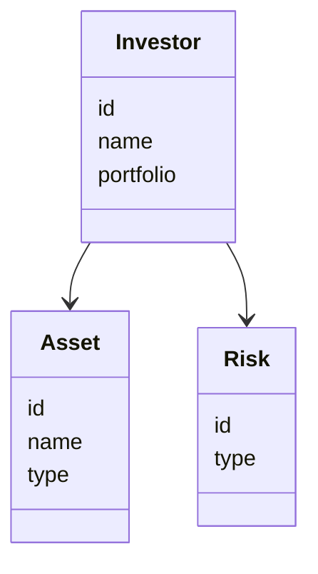
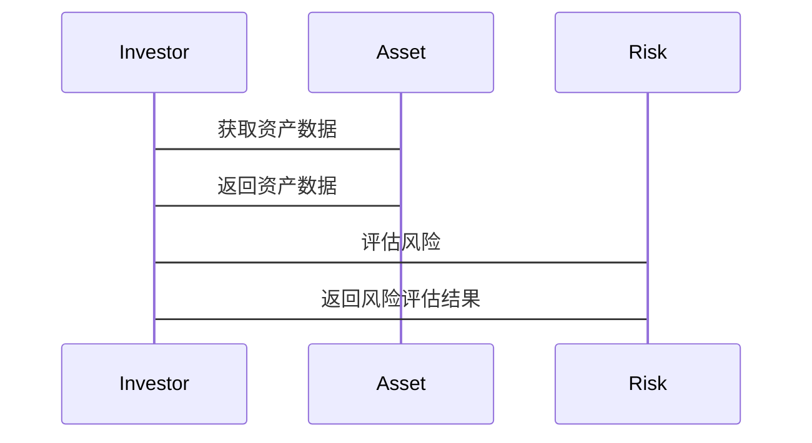

                 


# 格雷厄姆的投资组合管理

> 关键词：投资组合管理，价值投资，风险管理，资产配置，Python实现，数学模型

> 摘要：本文详细探讨了格雷厄姆的投资理念及其在投资组合管理中的应用。通过分析投资组合的核心概念、算法原理和系统设计，结合Python代码实现和实际案例，帮助读者掌握投资组合管理的策略和方法。

---

## 第一章：投资组合管理概述

### 1.1 投资组合管理的基本概念

#### 1.1.1 投资组合的定义与特点
投资组合是指投资者持有的多种资产（如股票、债券、房地产等）的集合。其特点包括多样性、风险分散性和收益的稳定性。通过合理配置不同资产，投资者可以在不同市场条件下优化收益并降低风险。

#### 1.1.2 投资组合管理的目标与意义
投资组合管理的目标是通过科学配置资产，实现收益最大化和风险最小化。其意义在于帮助投资者在复杂市场中保持稳定收益，避免单一投资的风险。

#### 1.1.3 投资组合管理的核心要素
核心要素包括资产配置、风险管理和绩效评估。这些要素相互关联，共同决定了投资组合的表现。

---

### 1.2 格雷厄姆的投资理念

#### 1.2.1 价值投资的核心思想
格雷厄姆倡导价值投资，即以低于内在价值的价格买入优质资产。他认为市场波动是暂时的，优质资产的长期价值终将体现。

#### 1.2.2 安全边际的概念与应用
安全边际是指买入价格与内在价值之间的差距。通过预留安全边际，投资者可以降低市场波动带来的风险。

#### 1.2.3 长期投资与复利效应
格雷厄姆强调长期投资的重要性，认为复利效应是实现财富增长的关键。长期持有优质资产可以最大化复利效应。

---

## 第二章：投资组合管理的核心概念

### 2.1 资产配置的原理与方法

#### 2.1.1 资产配置的定义与分类
资产配置是将资金分配到不同资产类别（如股票、债券、现金等）的过程。常见的分类包括保守型、平衡型和成长型配置。

#### 2.1.2 不同资产类别的特点对比（表格形式）

| 资产类别 | 风险 | 收益 | 流动性 |
|----------|------|------|--------|
| 股票     | 高   | 高   | 中     |
| 债券     | 中   | 中   | 高     |
| 现金     | 低   | 低   | 高     |

#### 2.1.3 资产配置的决策过程
决策过程包括确定投资目标、评估风险承受能力、选择资产类别并动态调整配置。

---

### 2.2 分散投资的数学模型

#### 2.2.1 分散投资的原理
分散投资通过持有多种资产降低特定资产的风险。其数学原理基于协方差矩阵的计算。

#### 2.2.2 投资组合的方差计算公式
$$ \text{方差} = \sum_{i=1}^{n} w_i^2 \sigma_i^2 + 2 \sum_{i=1}^{n} \sum_{j=i+1}^{n} w_i w_j \sigma_{i,j} $$

#### 2.2.3 ER实体关系图
```mermaid
er
actor Investor {
  id
  name
}
actor Asset {
  id
  name
  type
}
actor Risk {
  id
  type
}
```

---

### 2.3 风险管理的策略与工具

#### 2.3.1 风险的定义与分类
风险包括市场风险、流动性风险和信用风险等。

#### 2.3.2 投资组合风险的度量方法
常用方法包括标准差、VaR（Value at Risk）和夏普比率。

#### 2.3.3 风险管理的常用工具（ER实体关系图）
```mermaid
er
actor Risk_Mitigation {
  id
  tool
  description
}
```

---

## 第三章：投资组合管理的算法原理

### 3.1 现代投资组合理论（MPT）的算法实现

#### 3.1.1 有效前沿的定义与特点
有效前沿是指在给定风险下，收益最高的投资组合构成的曲线。

#### 3.1.2 均值-方差优化的数学模型
$$ \text{目标函数} = \min_w \sum_{i=1}^{n} \sum_{j=1}^{n} w_i w_j \sigma_{i,j} $$

#### 3.1.3 优化算法的实现步骤
1. 计算资产的期望收益和协方差矩阵。
2. 使用优化算法（如拉格朗日乘数法）求解最优权重。

---

### 3.2 投资组合优化的Python实现

#### 3.2.1 环境安装与库的导入
```python
import numpy as np
import pandas as pd
from scipy.optimize import minimize
```

#### 3.2.2 核心代码实现
```python
def portfolio_optimization(returns):
    n = len(returns.columns)
    mu = returns.mean().values
    sigma = returns.cov().values
    def objective(weights):
        return np.dot(weights.T, np.dot(sigma, weights))
    cons = ({'type': 'eq', 'fun': lambda w: np.sum(w) - 1.0})
    bounds = [(0, 1) for _ in range(n)]
    result = minimize(objective, np.ones(n)/n, method='SLSQP', bounds=bounds, constraints=cons)
    return result.x
```

---

## 第四章：系统分析与架构设计

### 4.1 问题场景介绍
本章设计一个投资组合管理系统，帮助投资者根据市场变化动态调整资产配置。

### 4.2 系统功能设计

#### 4.2.1 领域模型（Mermaid类图）


### 4.3 系统架构设计

#### 4.3.1 系统架构（Mermaid架构图）


### 4.4 系统接口设计
接口包括资产数据接口、用户界面接口和风险管理接口。

### 4.5 系统交互（Mermaid序列图）


---

## 第五章：项目实战

### 5.1 环境安装
安装必要的Python库，如numpy、pandas和scipy。

### 5.2 核心代码实现
使用Python实现投资组合优化算法，如均值-方差优化。

### 5.3 实际案例分析
通过具体案例展示如何根据市场变化调整资产配置，优化投资组合。

---

## 第六章：最佳实践与注意事项

### 6.1 小结
投资组合管理是实现长期收益的关键，需结合格雷厄姆的价值投资理念和现代投资组合理论。

### 6.2 注意事项
投资者应根据自身风险承受能力和市场环境动态调整投资策略。

### 6.3 拓展阅读
推荐阅读《证券投资学》和《Python金融计算》等书籍。

---

## 作者
作者：AI天才研究院 & 禅与计算机程序设计艺术

