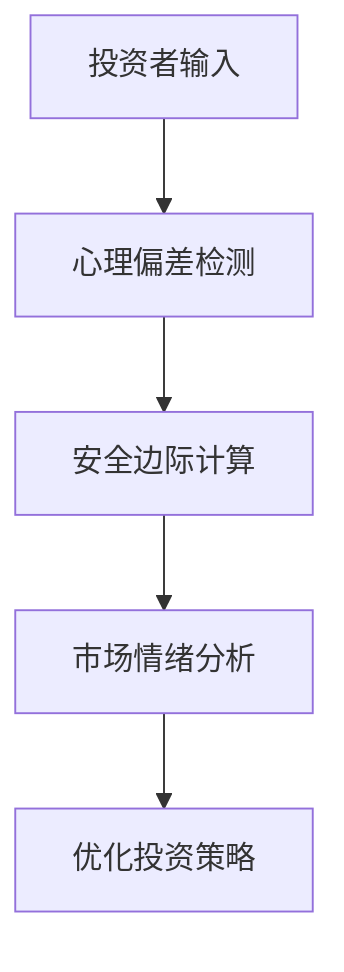
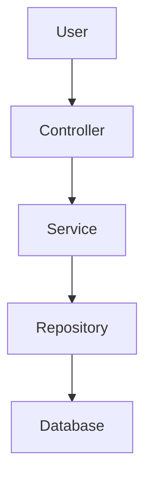
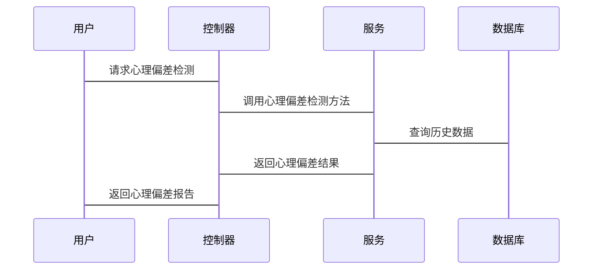

                 


# 格雷厄姆的投资者心理学洞见

## 关键词：投资者心理学，格雷厄姆，价值投资，心理偏差，市场行为，安全边际

## 摘要：本文深入探讨了格雷厄姆的投资者心理学洞见，分析了心理偏差对投资决策的影响，结合数学模型和系统架构，详细阐述了价值投资策略与心理因素的关系。通过实际案例和项目实战，展示了如何将心理学洞见应用于投资决策中，并提供了实用的建议和最佳实践。

---

# 第1章: 投资者心理学概述

## 1.1 投资者心理学的基本概念

### 1.1.1 什么是投资者心理学
投资者心理学是研究投资者在决策过程中心理因素的学科，关注情绪、认知偏差和行为模式对投资决策的影响。

### 1.1.2 投资者心理学的核心研究领域
- 情绪对投资决策的影响
- 认知偏差与投资行为
- 投资策略与心理因素的结合

### 1.1.3 格雷厄姆的投资者心理学洞见
格雷厄姆强调安全边际和内在价值，认为心理因素在投资决策中起着关键作用。

---

## 1.2 格雷厄姆的投资者心理学背景

### 1.2.1 格雷厄姆的生平简介
本杰明·格雷厄姆（Benjamin Graham）是价值投资之父，其投资哲学深刻影响了巴菲特等投资者。

### 1.2.2 格雷厄姆的投资哲学与心理学的结合
格雷厄姆的价值投资理论强调理性决策和长期视角，结合心理学洞见，提出了安全边际和内在价值的概念。

### 1.2.3 格雷厄姆对现代投资者心理学的贡献
格雷厄姆的理论为现代投资者心理学奠定了基础，尤其是在心理偏差和决策行为方面。

---

## 1.3 投资者心理学的核心问题

### 1.3.1 投资者决策的非理性特征
投资者常常受到贪婪、恐惧和从众心理的驱动，导致非理性决策。

### 1.3.2 心理偏差对投资决策的影响
心理偏差如确认偏差、损失厌恶等，会影响投资者的决策过程。

### 1.3.3 格雷厄姆的投资者心理模型
格雷厄姆提出了基于心理因素的投资策略，强调安全边际和长期价值。

---

# 第2章: 人性中的心理偏差与投资决策

## 2.1 心理偏差的定义与分类

### 2.1.1 心理偏差的定义
心理偏差是人类在认知和决策过程中产生的系统性错误。

### 2.1.2 常见心理偏差的分类
- **确认偏差**：倾向于寻找支持已有观点的信息。
- **损失厌恶**：对损失的厌恶程度远高于对收益的追求。
- **从众心理**：跟随大多数人的决策。
- **过度自信**：高估自己判断的准确性。

### 2.1.3 心理偏差对投资决策的具体影响
心理偏差会导致投资者做出错误的投资决策，如追涨杀跌和过度交易。

---

## 2.2 格雷厄姆对心理偏差的洞见

### 2.2.1 格雷厄姆对贪婪与恐惧的分析
- 贪婪会导致投资者过度冒险，恐惧则会使投资者错失机会。
- 通过安全边际来对抗贪婪和恐惧的影响。

### 2.2.2 格雷厄姆对从众心理的解读
- 从众心理会导致投资者盲目跟随市场趋势，忽视基本面分析。
- 强调独立思考和基本面研究的重要性。

### 2.2.3 格雷厄姆对过度自信的批判
- 过度自信会导致投资者低估风险，过高估计自己的判断能力。
- 通过严格的价值评估和安全边际来减少过度自信的影响。

---

## 2.3 心理偏差与投资行为的数学模型

### 2.3.1 心理偏差的数学表达式
- 确认偏差：$P(\text{选择支持信息}) > 0.5$
- 损失厌恶：$V(\text{损失}) > V(\text{收益})$

### 2.3.2 投资决策中的概率模型
- 投资者在面对不确定性时，心理偏差会影响概率判断，导致非理性决策。

### 2.3.3 通过数学模型分析心理偏差对投资的影响
- 通过概率模型和统计分析，可以量化心理偏差对投资收益的影响。

---

## 2.4 本章小结
心理偏差是投资者决策中的关键因素，格雷厄姆通过其洞见，为投资者提供了解决这些问题的策略，如安全边际和独立思考。

---

# 第3章: 格雷厄姆的价值投资策略与心理因素

## 3.1 价值投资策略的定义与核心要素

### 3.1.1 价值投资的定义
价值投资是通过深入分析企业的内在价值，寻找市场价格低于内在价值的投资机会。

### 3.1.2 价值投资的核心要素
- 内在价值：企业的实际价值，与市场价格无关。
- 安全边际：市场价格与内在价值之间的差距，作为风险缓冲。

### 3.1.3 价值投资与心理因素的关系
- 价值投资强调理性决策，与心理偏差对抗。

---

## 3.2 格雷厄姆的价值投资心理模型

### 3.2.1 格雷厄姆的安全边际概念
- 安全边际：$ \text{内在价值} - \text{市场价格} $
- 通过安全边际来降低心理偏差对投资决策的影响。

### 3.2.2 格雷厄姆的内在价值计算
- 内在价值公式：$ \text{内在价值} = \text{现金流} / \text{折现率} $

### 3.2.3 格雷厄姆的长期投资策略
- 长期投资：减少短期市场波动对心理的影响。

---

## 3.3 心理因素对价值投资策略的影响

### 3.3.1 心理因素如何影响安全边际的选择
- 心理偏差可能导致投资者忽略安全边际的重要性。

### 3.3.2 心理因素如何影响内在价值的计算
- 心理偏差可能影响现金流和折现率的估计。

### 3.3.3 心理因素如何影响长期投资决策
- 心理因素可能导致投资者在长期投资中失去耐心。

---

## 3.4 本章小结
格雷厄姆的价值投资策略通过心理模型，帮助投资者克服心理偏差，实现长期稳定的投资收益。

---

# 第4章: 投资者心理定价机制与市场行为

## 4.1 投资者心理定价机制的定义

### 4.1.1 心理定价机制的定义
投资者根据心理预期和情绪，对资产价格进行主观定价。

### 4.1.2 心理定价机制的核心特征
- 主观性：基于心理预期。
- 不确定性：受情绪和认知偏差影响。

### 4.1.3 心理定价机制与市场行为的关系
心理定价机制驱动市场波动，影响资产价格。

---

## 4.2 格雷厄姆对心理定价机制的分析

### 4.2.1 格雷厄姆对市场情绪的分析
- 市场情绪：$ \text{市场情绪} = \text{贪婪} + \text{恐惧} $
- 市场情绪波动导致价格偏离内在价值。

### 4.2.2 格雷厄姆对市场波动的解读
- 市场波动：$ \text{波动幅度} \propto \text{心理偏差} $

### 4.2.3 格雷厄姆对市场参与者的心理分析
- 市场参与者：$ \text{理性投资者} + \text{非理性投资者} $

---

## 4.3 心理定价机制的数学模型

### 4.3.1 心理定价机制的数学表达式
- 心理定价：$ \text{心理价格} = \text{内在价值} \times (1 + \text{心理偏差}) $

### 4.3.2 通过数学模型分析心理定价机制
- 利用统计学方法，分析心理定价机制对市场的影响。

---

## 4.4 本章小结
心理定价机制是市场行为的核心驱动力，格雷厄姆通过其洞见，帮助投资者理解市场波动的根源。

---

# 第5章: 投资者心理分析系统的架构设计

## 5.1 问题场景介绍
投资者心理分析系统旨在帮助投资者识别和克服心理偏差，优化投资决策。

## 5.2 系统功能设计

### 5.2.1 系统功能模块
- 心理偏差检测：检测投资者的贪婪、恐惧等偏差。
- 安全边际计算：计算投资标的的安全边际。
- 市场情绪分析：分析市场整体情绪。

### 5.2.2 系统功能模块图


## 5.3 系统架构设计

### 5.3.1 系统架构图


## 5.4 系统接口设计
- API接口：`/api心理偏差检测`，返回心理偏差类型。
- 接口：`/api安全边际计算`，返回安全边际值。

## 5.5 系统交互流程图


---

# 第6章: 项目实战——投资者心理分析系统

## 6.1 环境安装
- 安装Python和相关库：`pip install numpy pandas scikit-learn`

## 6.2 系统核心实现源代码

### 6.2.1 心理偏差检测
```python
def detect心理偏差(数据):
    # 实现心理偏差检测算法
    return 偏差类型
```

### 6.2.2 安全边际计算
```python
def compute安全边际(内在价值, 市场价格):
    return 内在价值 - 市场价格
```

## 6.3 代码应用解读与分析
- 心理偏差检测：通过机器学习算法识别投资者的心理偏差。
- 安全边际计算：基于价值投资理论，计算投资标的的安全边际。

## 6.4 实际案例分析
- 案例：某股票的内在价值为100元，市场价格为80元，安全边际为20元。

## 6.5 项目小结
投资者心理分析系统通过技术手段帮助投资者克服心理偏差，优化投资决策。

---

# 第7章: 最佳实践与小结

## 7.1 最佳实践 tips
- 定期进行心理调适，避免情绪化决策。
- 通过安全边际和内在价值分析，优化投资策略。
- 保持长期视角，避免短期波动的干扰。

## 7.2 小结
格雷厄姆的投资者心理学洞见为现代投资提供了宝贵的理论支持，结合技术手段，投资者可以更好地克服心理偏差，实现长期稳定的投资收益。

---

# 作者信息

作者：AI天才研究院/AI Genius Institute & 禅与计算机程序设计艺术 /Zen And The Art of Computer Programming

