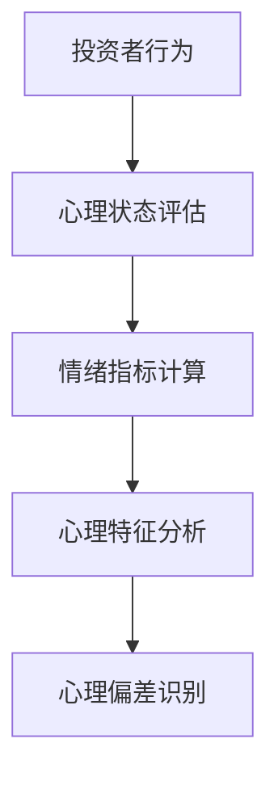
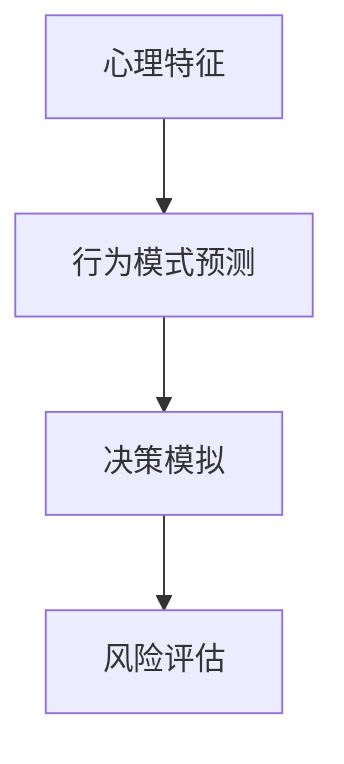
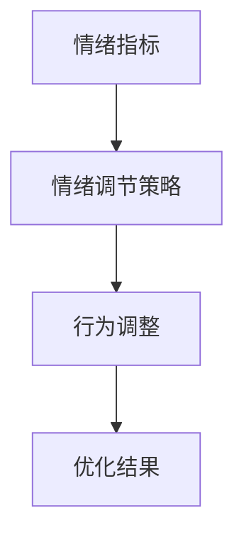

                 


# 格雷厄姆的投资者心理建设

> 关键词：投资者心理，投资心理，投资策略，价值投资，风险管理，心理建设

> 摘要：本文探讨了投资者心理建设的重要性及其在投资决策中的作用，结合格雷厄姆的价值投资理念，分析了投资者心理偏差、情绪管理和心理成熟度对投资绩效的影响，提出了心理建设的具体方法和策略。

---

## 第1章：投资者心理建设的背景与重要性

### 1.1 投资者心理建设的背景介绍

#### 1.1.1 投资者决策的背景与问题背景
投资者心理建设是投资成功的关键因素之一。在金融市场中，投资者的行为往往受到心理偏差的影响，如过度自信、从众心理和损失厌恶等。这些偏差可能导致错误的决策，进而影响投资回报。

#### 1.1.2 投资者心理偏差与行为偏差的定义
心理偏差是指投资者在决策过程中由于心理因素导致的系统性错误。常见的心理偏差包括：
- **过度自信**：投资者倾向于高估自己的能力，导致冒险行为。
- **从众心理**：投资者跟随大众决策，忽视独立思考。
- **损失厌恶**：投资者对损失的敏感度高于对收益的敏感度，导致决策保守。

#### 1.1.3 投资者心理建设的必要性与目标
心理建设的目标是帮助投资者识别和克服心理偏差，培养理性决策能力，增强情绪管理和风险控制能力。通过心理建设，投资者可以更好地应对市场波动，避免非理性决策。

---

### 1.2 投资者心理建设的核心概念与联系

#### 1.2.1 投资者心理建设的核心要素
投资者心理建设的核心要素包括：
1. **心理特征**：投资者的认知能力、风险偏好和情绪稳定性。
2. **行为模式**：投资者在不同市场环境下的决策行为。
3. **情绪管理**：投资者在面对市场波动时的自我调节能力。

#### 1.2.2 投资者心理与行为的关系
心理状态直接影响投资者的行为模式。例如，贪婪和恐惧是投资者最常见的心理状态，它们可能导致过度买入或卖出行为。

#### 1.2.3 投资者心理建设的ER实体关系图（Mermaid）

```mermaid
er
  actor: 投资者
  actor -->|心理特征| 心理状态
  actor -->|行为模式| 投资决策
  actor -->|情绪管理| 风险控制
```

---

## 第2章：投资者心理建设的原理与模型

### 2.1 投资者心理建设的原理

#### 2.1.1 投资者心理建设的基本原理
心理建设的核心是通过自我认知和行为调整，帮助投资者克服心理偏差，实现理性决策。

#### 2.1.2 投资者心理与决策的关系
心理状态通过影响投资者的决策过程，进而影响投资结果。例如，乐观的投资者可能倾向于高估资产价值，导致过度投资。

#### 2.1.3 投资者心理建设的数学模型

$$
E = \sum p_i x_i
$$

其中，\( E \) 是期望值，\( p_i \) 是各个结果的概率，\( x_i \) 是对应的结果。

---

### 2.2 投资者心理建设的算法原理

#### 2.2.1 心理状态评估算法



#### 2.2.2 行为模式预测算法



#### 2.2.3 情绪管理优化算法



---

## 第3章：投资者心理建设的数学模型与公式

### 3.1 投资者心理建设的数学模型

#### 3.1.1 心理状态评估模型

$$
P = \sum p_i \times S_i
$$

其中，\( P \) 是心理状态评估结果，\( p_i \) 是各个心理指标的概率，\( S_i \) 是对应的心理指标值。

#### 3.1.2 行为模式预测模型

$$
F = \beta \times X + \epsilon
$$

其中，\( F \) 是预测的行为模式，\( \beta \) 是回归系数，\( X \) 是自变量，\( \epsilon \) 是误差项。

#### 3.1.3 情绪管理优化模型

$$
O = \min \sum w_i \times E_i
$$

其中，\( O \) 是优化结果，\( w_i \) 是各个情绪指标的权重，\( E_i \) 是对应的情绪指标值。

---

## 第4章：投资者心理建设的系统分析与架构设计

### 4.1 问题场景介绍

#### 4.1.1 投资者心理问题的场景描述
投资者在面对市场波动时，常常因情绪影响做出错误决策。例如，股市下跌时，投资者可能恐慌性抛售，导致损失扩大。

#### 4.1.2 投资者行为偏差的具体表现
投资者的行为偏差包括：
1. **过度交易**：频繁买卖导致交易成本增加。
2. **追涨杀跌**：盲目跟随市场趋势，忽视价值投资。
3. **羊群效应**：跟随大多数投资者的决策，缺乏独立判断。

---

### 4.2 系统功能设计

#### 4.2.1 领域模型（Mermaid 类图）


---

### 4.3 系统架构设计（Mermaid 架构图）

```mermaid
archi
  客户端 --> 中间件：发送心理评估请求
  中间件 --> 数据库：查询心理特征
  数据库 --> 中间件：返回心理特征
  中间件 --> 客户端：返回心理评估结果
```

---

## 第5章：投资者心理建设的项目实战

### 5.1 项目实战：投资者心理评估系统实现

#### 5.1.1 环境安装
安装Python和相关库（如pandas、numpy、scikit-learn）。

#### 5.1.2 核心功能实现

```python
import pandas as pd
from sklearn.linear_model import LinearRegression

# 数据预处理
data = pd.read_csv('investor_data.csv')
X = data[['心理特征1', '心理特征2']]
y = data['行为模式']

# 建立模型
model = LinearRegression()
model.fit(X, y)

# 预测结果
predicted = model.predict(X)
```

#### 5.1.3 代码解读与分析
上述代码使用线性回归模型预测投资者的行为模式。数据预处理部分读取数据并提取特征变量，模型建立部分使用Scikit-learn库中的LinearRegression类训练模型，最后进行预测。

---

## 第6章：投资者心理建设的最佳实践

### 6.1 小结
投资者心理建设是投资成功的关键因素。通过识别和克服心理偏差，投资者可以做出更理性的决策，提高投资绩效。

### 6.2 注意事项
1. **持续学习**：投资者需要不断学习和反思，避免陷入心理陷阱。
2. **情绪管理**：投资者应学会控制情绪，避免被市场波动左右。
3. **长期视角**：投资需要耐心和纪律，避免短期波动影响决策。

### 6.3 拓展阅读
推荐阅读格雷厄姆的《聪明的投资者》和《心理与市场》等书籍，深入理解投资者心理建设的理论与实践。

---

作者：AI天才研究院/AI Genius Institute & 禅与计算机程序设计艺术 /Zen And The Art of Computer Programming

