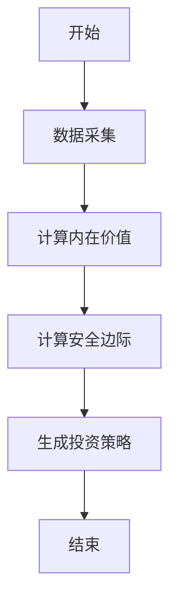

                 


# 《格雷厄姆的投资者教育理念》

> 关键词：投资者教育，价值投资，安全边际，投资系统，投资策略，格雷厄姆，投资哲学

> 摘要：本文系统阐述了格雷厄姆的投资者教育理念，从价值投资的核心概念、数学模型、系统架构到项目实战，结合技术语言和逻辑分析，深入解读了格雷厄姆的投资哲学及其对现代投资的深远影响。文章通过详细的数学公式、流程图和代码实现，展现了如何将格雷厄姆的理念转化为可执行的投资策略。

---

## 第一部分：背景介绍与核心概念

### 第1章：投资者教育的背景与重要性

#### 1.1 投资者教育的定义与目标

投资者教育是指通过系统化的方法，帮助投资者掌握投资知识、提升决策能力和风险管理技能，以实现长期稳健的投资收益。其目标是让投资者理解市场规律、掌握投资工具、制定合理的投资策略，并在实践中避免常见误区。

#### 1.2 格雷厄姆的教育理念

格雷厄姆是价值投资的鼻祖，他的教育理念强调以下几点：
- **长期视角**：投资不是短期交易，而是对企业的深入理解和长期持有。
- **安全边际**：在投资时，确保买入价格低于企业的内在价值，以降低风险。
- **避免情绪化**：投资者应避免受市场情绪影响，坚持理性决策。

### 第2章：价值投资的核心理念

#### 2.1 价值投资的定义与特点

价值投资是一种投资策略，强调以低于内在价值的价格买入优质企业。其特点包括：
- **注重基本面**：分析企业的财务报表、盈利能力和行业地位。
- **长期持有**：避免频繁交易，追求企业的长期成长。
- **安全边际**：买入价格低于内在价值，确保投资的安全性。

#### 2.2 格雷厄姆的安全边际理论

安全边际是格雷厄姆理念的核心。它是指买入价格与内在价值之间的差距，确保即使出现估值偏差，投资者仍能获得正收益。例如，如果某股票的内在价值为100元，买入价格为80元，安全边际为20元。

### 第3章：投资决策的数学模型与分析

#### 3.1 价值评估的数学模型

格雷厄姆常用现金流折现模型（DCF）来评估企业的内在价值。公式如下：

$$
\text{内在价值} = \sum_{t=1}^{n} \frac{\text{现金流}_t}{(1 + r)^t}
$$

其中，\( r \) 是折现率，\( \text{现金流}_t \) 是第 \( t \) 年的现金流。

#### 3.2 格雷厄姆的选股标准

格雷厄姆选股注重以下指标：
- **低市盈率（P/E）**：市盈率低于行业平均水平。
- **低市净率（P/B）**：市净率低于行业平均水平。
- **高股息率**：股息率稳定且较高。

---

## 第二部分：系统架构与项目实战

### 第4章：投资系统的架构与实现

#### 4.1 投资系统架构设计

投资系统架构包括以下模块：
- 数据采集模块：收集企业财务数据、市场数据。
- 分析模块：计算内在价值、评估安全边际。
- 决策模块：根据分析结果生成投资策略。

#### 4.2 投资决策的算法实现

以下是基于格雷厄姆理念的选股算法流程图：



### 第5章：投资者教育的项目实战

#### 5.1 环境搭建与数据准备

- 数据源：选择可靠的数据供应商，如Yahoo Finance。
- 数据清洗：去除缺失值和异常值。
- 数据存储：使用数据库存储企业财务数据。

#### 5.2 核心算法实现

以下是价值评估的Python代码示例：

```python
def calculate_intrinsic_value(cash_flows, discount_rate):
    intrinsic_value = 0
    for t in range(len(cash_flows)):
        cash_flow = cash_flows[t]
        discounted_cash_flow = cash_flow / (1 + discount_rate)**t
        intrinsic_value += discounted_cash_flow
    return intrinsic_value

# 示例数据
cash_flows = [100, 120, 150]
discount_rate = 0.08

intrinsic_value = calculate_intrinsic_value(cash_flows, discount_rate)
print(f"内在价值：{intrinsic_value}")
```

### 第6章：最佳实践与投资策略

#### 6.1 格雷厄姆投资策略的最佳实践

- **分散投资**：避免将所有资金投入单一股票。
- **定期复核**：定期检查投资组合，调整不符合条件的股票。
- **长期持有**：避免频繁交易，降低交易成本。

---

## 第三部分：总结与展望

### 6.2 小结

格雷厄姆的投资者教育理念为现代投资提供了重要的理论基础。通过系统化的分析和实践，投资者可以更好地理解价值投资的核心，制定科学的投资策略。

### 6.3 注意事项

- **避免过度简化**：价值投资需要深入分析，不能仅看表面指标。
- **保持学习**：市场环境不断变化，投资者需持续学习和调整策略。

### 6.4 拓展阅读

推荐阅读格雷厄姆的经典著作《证券分析》和《聪明的投资者》，深入了解其投资哲学。

---

作者：AI天才研究院/AI Genius Institute & 禅与计算机程序设计艺术 /Zen And The Art of Computer Programming

