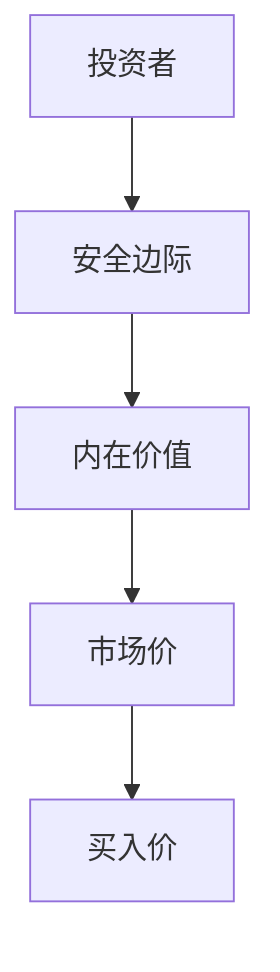
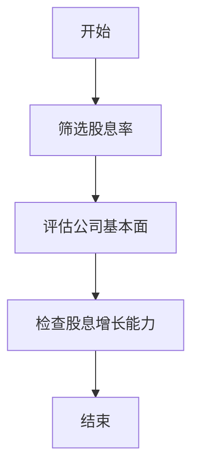
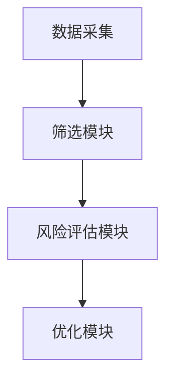

                 


# 格雷厄姆的股息投资策略：稳定收益的来源

> 关键词：格雷厄姆，股息投资，价值投资，稳定收益，风险管理，高分红股票

> 摘要：格雷厄姆的股息投资策略是一种以长期稳定收益为目标的投资方法，通过选择高分红股票构建投资组合，并通过风险管理确保投资的安全性。本文将详细分析格雷厄姆的投资理论、股息投资的核心概念、策略实施步骤、风险管理方法，并通过案例分析和实践指导，帮助投资者理解和应用这一策略。

---

## 第一部分: 格雷厄姆投资理论的背景与基础

### 第1章: 格雷厄姆投资理论概述

#### 1.1 格雷厄姆的生平与投资理念
格雷厄姆（Benjamin Graham）是20世纪著名的投资理论家，被誉为“价值投资之父”。他于1894年出生于纽约，早年就读于哥伦比亚大学，毕业后进入华尔街工作。格雷厄姆的投资理念以“安全边际”为核心，强调以低于内在价值的价格买入优质资产。他的著作《证券分析》和《聪明的投资者》对全球投资界产生了深远影响。

**图1.1：格雷厄姆的投资理念框架**



格雷厄姆认为，市场的短期波动不可预测，但长期来看，价格终将回归其内在价值。因此，投资者应关注企业的基本面，选择那些具有稳定盈利能力和较强分红能力的公司。

#### 1.2 股息投资策略的核心概念
股息投资策略是格雷厄姆价值投资的重要组成部分。其核心在于通过选择高分红的股票，实现长期稳定的收益。

**表1.1：股息投资与成长投资的对比**

| 比较维度       | 股息投资                     | 成长投资                     |
|----------------|------------------------------|------------------------------|
| 投资目标       | 稳定的现金流和分红收益       | 长期资本增值                 |
| 选股标准       | 高分红、低市盈率、强基本面   | 高成长性、高市盈率           |
| 风险承受能力   | 较低                        | 较高                        |
| 适合投资者     | 追求稳定收益的投资者         | 追求资本增值的投资者         |

---

### 第2章: 股息投资的理论基础

#### 2.1 股息的定义与分类
股息是公司分配给股东的利润部分，通常以现金或股票形式发放。股息的分类如下：

- **普通股股息**：公司向普通股股东分配的股息。
- **优先股股息**：公司向优先股股东分配的股息，通常优先于普通股。
- **累积股息**：如果公司当年未分配股息，累积股息将在未来弥补。

#### 2.2 股息投资的核心原理
股息投资的核心在于通过筛选高分红股票，构建一个稳定的现金流来源。以下是股息投资的数学模型：

**公式1.1：股息率计算**
$$ \text{股息率} = \frac{\text{每股股息}}{\text{股票价格}} \times 100\% $$

**公式1.2：股息收益率**
$$ \text{股息收益率} = \frac{\text{每股股息}}{\text{股票价格}} \times 100\% $$

---

## 第二部分: 股息投资策略的实施步骤

### 第3章: 确定投资目标

#### 3.1 确定投资目标
投资目标是股息投资的第一步。以下是确定投资目标的步骤：

**步骤1：明确投资目的**
- 收益目标：年化收益率5%-10%
- 投资期限：长期（5年以上）

**步骤2：评估风险承受能力**
- 风险厌恶型投资者更适合股息投资
- 风险承受能力强的投资者可以配置部分成长股

**步骤3：设定股息增长目标**
- 寻找股息收益率稳定或逐年增长的股票

### 第4章: 选择高分红股票

#### 4.1 筛选高分红股票
筛选高分红股票时，需综合考虑以下因素：

- **股息率**：通常选择股息率在3%-7%之间的股票。
- **股息增长能力**：选择有能力持续增长股息的公司。
- **公司基本面**：ROE（净资产收益率）应高于行业平均水平。

**图4.1：筛选高分红股票的流程图**



---

## 第三部分: 股息投资的风险管理与应对策略

### 第5章: 股票市场的波动性

#### 5.1 应对市场波动的策略
市场波动是股息投资的主要风险之一。以下是应对策略：

- **分散投资**：将资金分散投资于不同行业和地区的股票，降低行业风险。
- **长期持有**：避免频繁交易，降低交易成本和税收负担。
- **定期再平衡**：每年调整投资组合，确保股息收益率稳定。

### 第6章: 股票基本面变化

#### 6.1 评估公司基本面
评估公司基本面时，需关注以下指标：

- **ROE（净资产收益率）**：衡量公司盈利能力。
- **毛利率**：反映公司产品竞争力。
- **负债率**：评估公司财务健康状况。

**表6.1：基本面分析指标**

| 指标名称       | 计算公式                          | 重要性 |
|----------------|-----------------------------------|--------|
| ROE            | 净利润 / 净资产                  | 高     |
| 毛利率          | (收入 - 成本) / 收入            | 中     |
| 负债率          | 负债总额 / 资产总额              | 高     |

---

## 第四部分: 股息投资的长期策略与案例分析

### 第7章: 长期股息投资的优势

#### 7.1 长期股息投资的复利效应
复利效应是长期股息投资的核心优势。以下是复利效应的计算示例：

**公式7.1：复利计算公式**
$$ A = P \times (1 + r)^n $$
- \( A \)：终值
- \( P \)：本金
- \( r \)：年收益率
- \( n \)：年数

**案例分析：**
假设投资本金为10万元，年收益率为6%，投资期限为20年，最终收益为：
$$ A = 100000 \times (1 + 0.06)^{20} \approx 320713.54 $$

---

## 第五部分: 系统分析与架构设计方案

### 第8章: 系统分析与架构设计

#### 8.1 系统功能设计
- **数据采集模块**：收集股票的股息率、股价等数据。
- **筛选模块**：根据设定条件筛选高分红股票。
- **风险评估模块**：评估投资组合的风险。
- **优化模块**：调整投资组合以实现最优配置。

**图8.1：系统架构图**



---

## 第六部分: 项目实战

### 第9章: 项目实战

#### 9.1 环境安装
- **工具安装**：安装Python、Pandas、Matplotlib等工具。
- **数据来源**：使用Yahoo Finance获取股票数据。

#### 9.2 核心代码实现
以下是Python代码示例：

```python
import pandas as pd
import yfinance as yf

# 下载股票数据
def get_stock_data(ticker):
    data = yf.download(ticker, start='2020-01-01', end='2023-12-31')
    return data['Close']

# 计算股息率
def calculate_dividend_yield(stock_data, dividend):
    return (dividend / stock_data).mean() * 100

# 示例代码
tickers = ['AAPL', 'MSFT', 'PG']
data = {}
for t in tickers:
    data[t] = get_stock_data(t)

dividends = { 
    'AAPL': 0.85,
    'MSFT': 0.52,
    'PG': 0.63
}

for t in tickers:
    print(f"{t}: {calculate_dividend_yield(data[t], dividends[t])}%")
```

---

## 结论

格雷厄姆的股息投资策略是一种以长期稳定收益为目标的投资方法，通过选择高分红股票构建投资组合，并通过风险管理确保投资的安全性。本文详细分析了格雷厄姆的投资理论、股息投资的核心概念、策略实施步骤、风险管理方法，并通过案例分析和实践指导，帮助投资者理解和应用这一策略。

---

## 作者

作者：AI天才研究院/AI Genius Institute & 禅与计算机程序设计艺术 /Zen And The Art of Computer Programming

