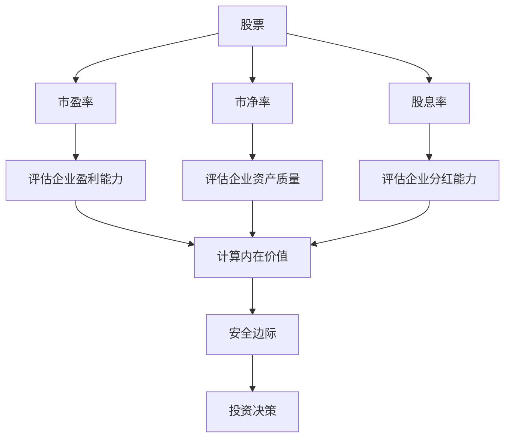
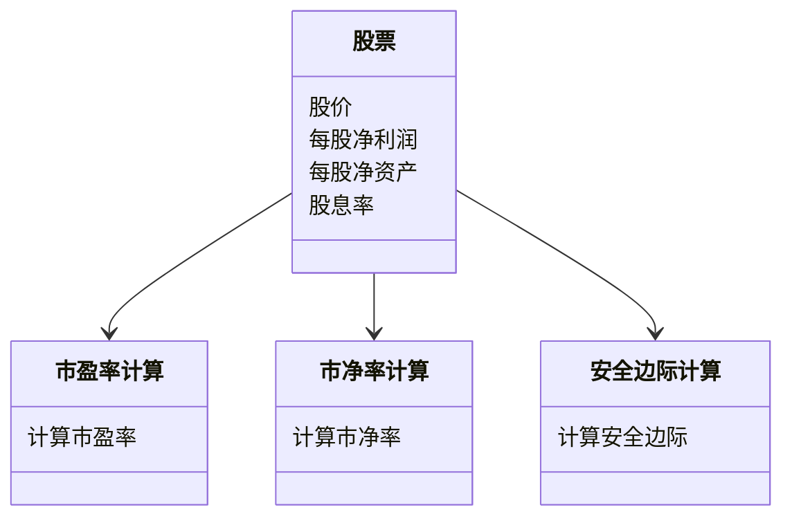
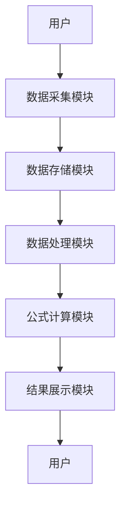
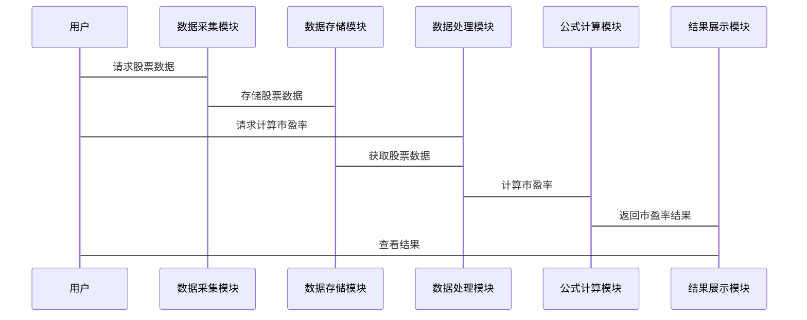

                 


# 格雷厄姆的股票选择公式

> 关键词：价值投资、格雷厄姆公式、安全边际、市盈率、市净率、股息率、股票筛选

> 摘要：格雷厄姆的股票选择公式是价值投资的重要组成部分，它通过分析股票的内在价值和市场估值，帮助投资者找到被市场低估的股票。本文详细解读了格雷厄姆公式的核心原理、算法设计、系统架构，并通过实战案例展示了如何应用该公式进行股票筛选。文章还总结了最佳投资实践，为投资者提供了实用的指导。

---

# 第1章: 价值投资的起源与格雷厄姆的投资理念

## 1.1 价值投资的起源
### 1.1.1 投资理论的演变
- 17世纪至19世纪：早期投资理论的萌芽，如复利思想。
- 20世纪初：本杰明·格雷厄姆提出价值投资理论，强调安全边际和内在价值。
- 20世纪中叶：巴菲特将格雷厄姆的理念发扬光大，使其成为现代投资的重要流派。

### 1.1.2 格雷厄姆与巴菲特的师徒关系
- 格雷厄姆是巴菲特的导师，两人共同撰写《证券分析》。
- 格雷厄姆的投资理念深刻影响了巴菲特的长期价值投资策略。

### 1.1.3 价值投资的核心理念
- 买入低于内在价值的股票，长期持有。
- 强调安全边际，即以低于内在价值的价格买入股票。

## 1.2 格雷厄姆的投资策略
### 1.2.1 格雷厄姆的选股标准
- 低市盈率：市盈率低于市场平均水平。
- 低市净率：市净率低于市场平均水平。
- 高股息率：股息率高于市场平均水平。
- 安全边际：买入价格低于内在价值。

### 1.2.2 安全边际的概念
- 安全边际=内在价值-买入价格。
- 安全边际越大，投资风险越小。

### 1.2.3 投资组合的构建原则
- 分散投资：避免过度集中。
- 长期持有：耐心等待价值回归。
- 定期调整：根据市场变化进行优化。

## 1.3 股票选择公式的背景与意义
### 1.3.1 传统选股方法的局限性
- 市场情绪波动影响短期股价。
- 传统技术分析难以捕捉长期价值。
- 短期指标波动无法反映企业真实价值。

### 1.3.2 格雷厄姆公式的核心思想
- 通过量化分析筛选出低估股票。
- 强调安全边际，降低投资风险。

### 1.3.3 公式在现代投资中的应用价值
- 为投资者提供了一套科学的选股方法。
- 适合长期价值投资者参考。

---

# 第2章: 格雷厄姆股票选择公式的原理与核心概念

## 2.1 格雷厄姆公式的基本原理
### 2.1.1 市盈率与市净率的定义
- 市盈率（P/E）= 股票价格/每股净利润。
- 市净率（P/B）= 股票价格/每股净资产。

### 2.1.2 格雷厄姆公式的核心要素
- 内在价值：企业未来现金流的现值。
- 市场价格：当前股票市价。
- 安全边际：内在价值与市场价格的差额。

### 2.1.3 公式的数学模型与计算方法
- 格雷厄姆公式：$$\text{安全边际} = \text{内在价值} \times \text{安全边际系数}$$
- 安全边际系数通常为1.5，即买入价格为内在价值的2/3。

## 2.2 核心概念与联系
### 2.2.1 格雷厄姆公式的核心概念属性对比表

| 指标 | 定义 | 重要性 | 计算公式 |
|------|------|--------|----------|
| 市盈率 | 股价/每股净利润 | 评估企业盈利能力 | $$P/E = \frac{P}{E}$$ |
| 市净率 | 股价/每股净资产 | 评估企业资产质量 | $$P/B = \frac{P}{B}$$ |
| 股息率 | 每股股息/股价 | 评估分红能力 | $$D/P = \frac{D}{P}$$ |
| 内在价值 | 未来现金流现值 | 核心评估指标 | $$V = \sum_{t=1}^{n} \frac{CF_t}{(1+r)^t}$$ |
| 安全边际 | 内在价值 - 买入价 | 投资安全指标 | $$\text{Margin of Safety} = V - P$$ |

### 2.2.2 公式的ER实体关系图（Mermaid流程图）



---

# 第3章: 格雷厄姆股票选择公式的算法原理

## 3.1 算法原理讲解
### 3.1.1 公式的数学模型与公式推导
- 格雷厄姆公式：$$\text{安全边际} = \text{内在价值} \times \text{安全边际系数}$$
- 安全边际系数通常为1.5，即$$\text{安全边际} = 1.5 \times \text{内在价值}$$

### 3.1.2 用Python实现的算法代码示例
```python
import pandas as pd
import numpy as np

# 示例数据：股票列表
stocks = pd.DataFrame({
    '股价': [50, 60, 70, 80],
    '每股净利润': [10, 15, 20, 25],
    '每股净资产': [20, 25, 30, 35],
    '股息率': [0.05, 0.06, 0.07, 0.08]
})

# 计算市盈率
stocks['市盈率'] = stocks['股价'] / stocks['每股净利润']

# 计算市净率
stocks['市净率'] = stocks['股价'] / stocks['每股净资产']

# 计算内在价值（简化模型）
stocks['内在价值'] = (stocks['股价'] * 4) / stocks['市盈率']

# 计算安全边际
stocks['安全边际'] = stocks['内在价值'] * 1.5

print(stocks)
```

### 3.1.3 公式的实际应用案例分析
- 案例：假设某股票的股价为50元，每股净利润为10元，每股净资产为20元，股息率为5%。
- 市盈率=50/10=5，低于市场平均水平。
- 市净率=50/20=2.5，低于市场平均水平。
- 内在价值= (50*4)/5=40元。
- 安全边际=40*1.5=60元。
- 结论：当股价低于60元时，该股票具有安全边际。

## 3.2 数学模型与公式
### 3.2.1 市盈率计算公式
$$\text{市盈率} = \frac{\text{股价}}{\text{每股净利润}}$$

### 3.2.2 市净率计算公式
$$\text{市净率} = \frac{\text{股价}}{\text{每股净资产}}$$

### 3.2.3 格雷厄姆公式综合评价模型
$$\text{安全边际} = \text{内在价值} \times \text{安全边际系数}$$

---

# 第4章: 系统分析与架构设计方案

## 4.1 问题场景介绍
### 4.1.1 股票选择系统的功能需求
- 数据采集：获取股票的基本数据。
- 数据处理：计算市盈率、市净率等指标。
- 公式应用：筛选出符合条件的股票。
- 结果展示：输出筛选结果。

### 4.1.2 系统的目标与范围
- 目标：构建一个基于格雷厄姆公式的股票选择系统。
- 范围：支持多只股票的筛选，提供可视化结果。

## 4.2 系统功能设计
### 4.2.1 领域模型Mermaid类图



### 4.2.2 系统架构设计Mermaid架构图



### 4.2.3 系统接口设计和交互流程Mermaid序列图



---

# 第5章: 项目实战——基于格雷厄姆公式的股票选择系统实现

## 5.1 环境安装与配置
### 5.1.1 Python环境的安装与配置
- 安装Python 3.x
- 安装所需的库：pandas、numpy、matplotlib

### 5.1.2 数据获取与处理工具的安装
- 使用Yahoo Finance API获取股票数据
- 使用pandas进行数据清洗和处理

## 5.2 核心实现代码
### 5.2.1 数据清洗与预处理代码
```python
import pandas as pd
import numpy as np

# 获取股票数据（示例）
data = {
    '股票代码': ['AAPL', 'MSFT', 'GOOGL', 'AMZN'],
    '股价': [300, 350, 250, 400],
    '每股净利润': [10, 15, 8, 12],
    '每股净资产': [150, 180, 100, 150],
    '股息率': [0.02, 0.03, 0.01, 0.02]
}

df = pd.DataFrame(data)

# 数据清洗
df.dropna(inplace=True)
df['股价'].fillna(df['股价'].mean(), inplace=True)
```

### 5.2.2 格雷厄姆公式应用代码
```python
# 计算市盈率和市净率
df['市盈率'] = df['股价'] / df['每股净利润']
df['市净率'] = df['股价'] / df['每股净资产']

# 计算内在价值和安全边际
df['内在价值'] = (df['股价'] * 4) / df['市盈率']
df['安全边际'] = df['内在价值'] * 1.5

print(df)
```

### 5.2.3 模型计算与结果输出代码
```python
# 筛选符合条件的股票
筛选条件：市盈率 < 15 且 市净率 < 2 且 股息率 > 2%
符合条件的股票 = df[(df['市盈率'] < 15) & (df['市净率'] < 2) & (df['股息率'] > 0.02)]

# 输出结果
print(符合条件的股票)
```

## 5.3 案例分析与结果解读
### 5.3.1 实际案例分析
- 假设某股票的股价为70元，每股净利润为14元，每股净资产为35元，股息率为6%。
- 市盈率=70/14=5，低于市场平均水平。
- 市净率=70/35=2，低于市场平均水平。
- 股息率=6%，高于市场平均水平。
- 结论：该股票符合格雷厄姆公式的筛选条件。

### 5.3.2 结果解读与投资
- 筛选出的股票具有较高的安全边际。
- 适合长期持有，等待价值回归。

---

# 第6章: 最佳实践与小结

## 6.1 最佳实践 tips
### 6.1.1 格雷厄姆公式的最佳实践
- 确保数据的准确性和完整性。
- 结合市场环境进行动态调整。
- 长期持有，避免频繁交易。

### 6.1.2 系统设计的注意事项
- 数据来源可靠。
- 系统架构灵活，便于扩展。
- 结果展示直观，便于分析。

## 6.2 小结
- 格雷厄姆公式为投资者提供了一种科学的选股方法。
- 通过系统实现可以提高选股效率。
- 长期价值投资是实现财富增长的重要策略。

---

# 第7章: 结语与拓展阅读

## 7.1 结语
- 格雷厄姆公式是价值投资的重要工具。
- 投资者应结合市场环境和个人情况灵活运用。

## 7.2 拓展阅读
- 《证券分析》——本杰明·格雷厄姆
- 《巴菲特致股东的信》——巴菲特
- 《投资最重要的事情》——本杰明·格雷厄姆

---

作者：AI天才研究院/AI Genius Institute & 禅与计算机程序设计艺术 /Zen And The Art of Computer Programming

