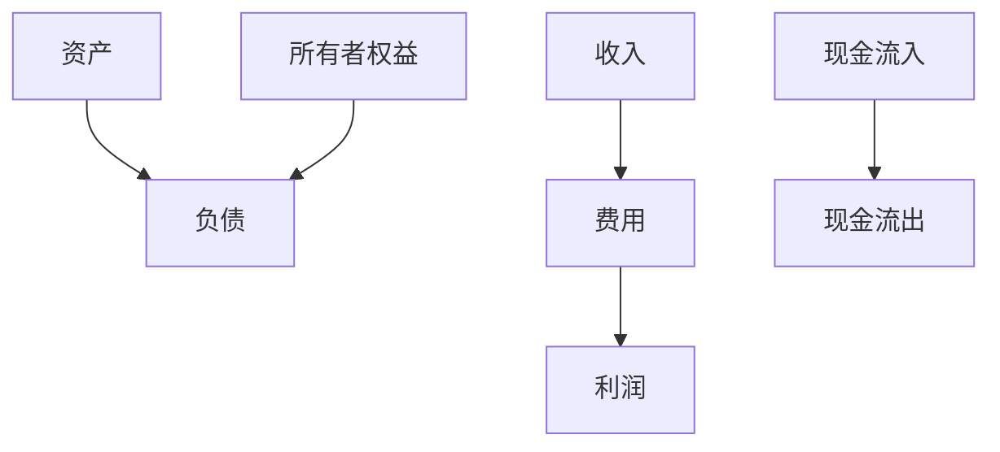

                 

# 《格雷厄姆的财务报表分析：应对创新会计处理方法》

## 关键词：财务报表分析，创新会计，投资策略，风险管理，格雷厄姆分析

## 摘要：  
本文系统地探讨了格雷厄姆的财务报表分析方法在应对创新会计处理方法中的应用。通过对财务报表核心概念的深入分析，结合创新会计处理方法的背景与类型，本文详细阐述了如何识别和评估创新会计处理，并提供实际案例分析与应对策略。文章旨在帮助读者掌握财务报表分析的高级方法，提升在复杂会计环境下的投资决策能力。

---

# 目录大纲

## 第一部分：财务报表分析基础

### 第1章：财务报表分析概述

#### 1.1 财务报表分析的基本概念
- 1.1.1 财务报表分析的定义与目的  
- 1.1.2 财务报表分析的核心要素：资产负债表、利润表、现金流量表  
- 1.1.3 财务报表分析的三大目标：真实性、准确性、完整性  

#### 1.2 格雷厄姆的财务分析方法
- 1.2.1 格雷厄姆的背景与投资理念  
- 1.2.2 格雷厄姆财务分析的核心原则  
- 1.2.3 格雷厄姆分析方法的现代应用  

#### 1.3 创新会计处理方法的背景
- 1.3.1 传统会计处理方法的局限性  
- 1.3.2 创新会计处理方法的兴起  
- 1.3.3 创新会计对财务报表的影响  

### 第2章：创新会计处理方法的类型与影响

#### 2.1 创新会计处理方法的类型
- 2.1.1 收入确认的新方法  
- 2.1.2 资产负债表项目的创新处理  
- 2.1.3 利润表中的创新会计调整  

#### 2.2 创新会计处理方法的影响
- 2.2.1 对财务报表真实性的挑战  
- 2.2.2 对投资决策的影响  
- 2.2.3 对风险管理的启示  

### 第3章：财务报表分析的核心概念与联系

#### 3.1 财务报表分析的核心概念
- 3.1.1 资产负债表的核心要素：资产、负债、所有者权益  
- 3.1.2 利润表的核心要素：收入、费用、利润  
- 3.1.3 现金流量表的核心要素：经营活动、投资活动、筹资活动  

#### 3.2 核心概念属性特征对比表
- 3.2.1 资产负债表与利润表的对比  
- 3.2.2 利润表与现金流量表的对比  
- 3.2.3 资产负债表与现金流量表的对比  

#### 3.3 ER实体关系图

---

## 第二部分：创新会计处理方法的应对策略

### 第4章：创新会计处理方法的识别与评估

#### 4.1 创新会计处理方法的识别
- 4.1.1 识别创新会计处理的关键指标  
- 4.1.2 通过财务比率分析识别异常值  
- 4.1.3 案例分析：收入确认的新方法  

#### 4.2 创新会计处理方法的评估
- 4.2.1 评估创新会计处理的合理性  
- 4.2.2 评估创新会计处理对财务报表的影响  
- 4.2.3 评估创新会计处理对投资决策的影响  

### 第5章：应对创新会计处理的策略

#### 5.1 应对策略的核心原则
- 5.1.1 保持财务报表分析的准确性  
- 5.1.2 提高财务报表分析的敏感性  
- 5.1.3 强化财务报表分析的前瞻性  

#### 5.2 应对策略的具体措施
- 5.2.1 加强对创新会计处理的培训  
- 5.2.2 建立创新会计处理的预警机制  
- 5.2.3 制定创新会计处理的风险管理方案  

---

## 第三部分：财务报表分析的高级方法

### 第6章：财务报表分析的高级方法

#### 6.1 比率分析
- 6.1.1 比率分析的定义与作用  
- 6.1.2 常见财务比率的计算公式  
- 6.1.3 案例分析：利用比率分析评估企业财务状况  

#### 6.2 趋势分析
- 6.2.1 趋势分析的定义与作用  
- 6.2.2 财务数据的可视化方法  
- 6.2.3 案例分析：利用趋势分析预测企业未来表现  

#### 6.3 行业比较分析
- 6.3.1 行业比较分析的定义与作用  
- 6.3.2 行业比较的标准与方法  
- 6.3.3 案例分析：利用行业比较分析评估企业竞争力  

### 第7章：结合创新会计处理的案例分析

#### 7.1 案例分析：收入确认的新方法
- 7.1.1 案例背景  
- 7.1.2 创新会计处理的具体表现  
- 7.1.3 财务报表分析的应对策略  

#### 7.2 案例分析：资产减值的新会计处理
- 7.2.1 案例背景  
- 7.2.2 创新会计处理的具体表现  
- 7.2.3 财务报表分析的应对策略  

#### 7.3 案例分析：商誉的创新处理
- 7.3.1 案例背景  
- 7.3.2 创新会计处理的具体表现  
- 7.3.3 财务报表分析的应对策略  

---

## 第四部分：总结与展望

### 第8章：总结与展望

#### 8.1 总结
- 8.1.1 格雷厄姆财务分析方法的核心观点  
- 8.1.2 应对创新会计处理方法的关键策略  
- 8.1.3 财务报表分析的未来发展趋势  

#### 8.2 展望
- 8.2.1 创新会计处理方法的未来发展方向  
- 8.2.2 财务报表分析技术的未来创新  
- 8.2.3 格雷厄姆分析方法的持续价值  

---

## 作者：AI天才研究院 & 禅与计算机程序设计艺术

---

**注**：本文目录大纲为初步规划，具体内容将根据实际写作进展逐步完善。

