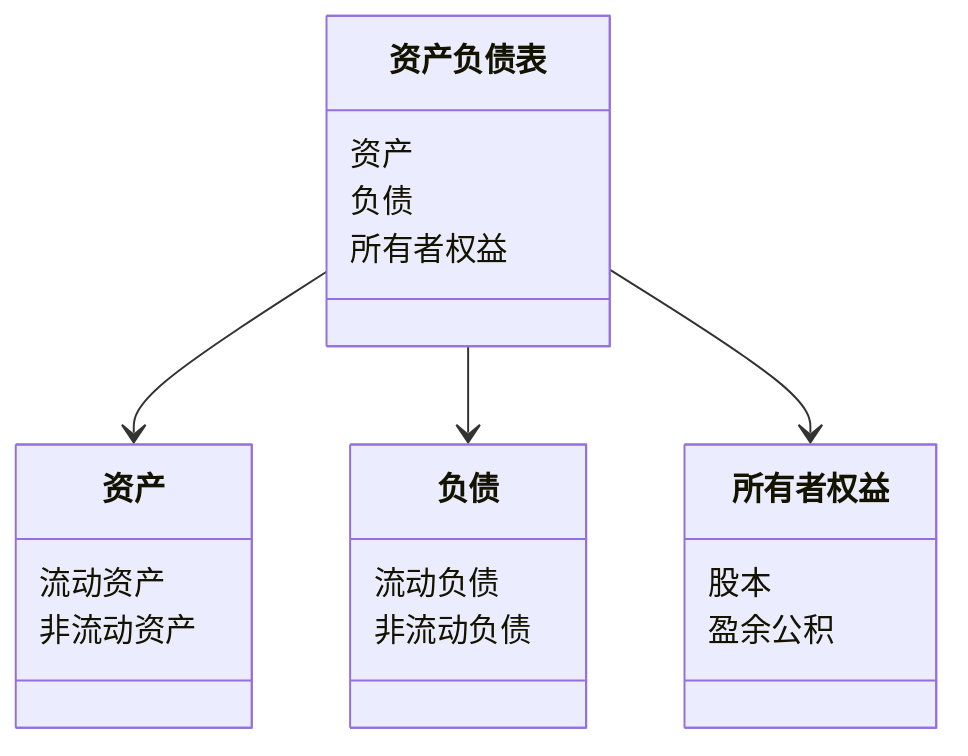
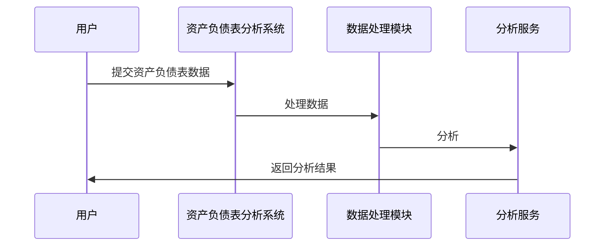

                 


# 格雷厄姆的资产负债表分析技巧

> 关键词：价值投资、财务分析、资产负债表、财务健康、投资策略

> 摘要：格雷厄姆作为价值投资的鼻祖，他的资产负债表分析技巧对投资者和企业决策者具有重要影响。本文将深入探讨资产负债表的核心要素、分析方法和实际应用，结合格雷厄姆的理论，提供一套系统化的分析框架，帮助读者更好地理解如何通过资产负债表评估企业价值和制定投资策略。

---

## 第一部分：背景介绍

### 第1章：资产负债表的基本概念与分析框架

#### 1.1 资产负债表的基本概念

##### 1.1.1 资产、负债和所有者权益的定义

- **资产**：企业拥有的资源，预期能为企业带来经济利益。包括流动资产（如现金、应收账款）和非流动资产（如固定资产、无形资产）。
- **负债**：企业偿还的债务，包括流动负债（如应付账款、短期借款）和非流动负债（如长期借款）。
- **所有者权益**：企业的净资产，等于资产减去负债。

##### 1.1.2 资产负债表的结构与组成

- 资产负债表由资产、负债和所有者权益三部分组成，展示企业在特定时间点的财务状况。

##### 1.1.3 资产负债表的编制与审计

- 按照会计准则编制，需经过审计以确保数据准确性和合规性。

#### 1.2 资产负债表分析的重要性

##### 1.2.1 资产负债表在企业价值评估中的作用

- 通过分析资产负债表，评估企业的财务健康状况和内在价值。

##### 1.2.2 资产负债表分析对投资者决策的影响

- 投资者通过分析资产负债表，判断企业的财务风险和投资价值。

##### 1.2.3 资产负债表分析的局限性

- 数据可能存在主观性，分析结果受假设和模型影响。

#### 1.3 格雷厄姆的分析方法与技巧

##### 1.3.1 格雷厄姆的背景与投资理念

- 价值投资之父，强调安全边际和内在价值。

##### 1.3.2 格雷厄姆的资产负债表分析框架

- 侧重流动资产和流动负债，关注企业的偿债能力和财务稳定性。

##### 1.3.3 格雷厄姆分析方法的实际应用

- 通过实例分析，展示格雷厄姆方法的实际效果。

#### 1.4 本章小结

- 介绍了资产负债表的基本概念和分析框架，强调格雷厄姆方法的独特性和实用性。

---

## 第2章：资产负债表的核心要素分析

### 2.1 资产分析

#### 2.1.1 流动资产与非流动资产的分类

- 流动资产：现金及现金等价物、应收账款、存货等。
- 非流动资产：固定资产、无形资产、长期投资等。

#### 2.1.2 格雷厄姆对流动资产的关注点

- 重视流动资产的变现能力，确保企业有足够的流动资金应对短期债务。

#### 2.1.3 非流动资产的评估与分析

- 关注非流动资产的使用效率和潜在价值。

### 2.2 负债分析

#### 2.2.1 流动负债与非流动负债的分类

- 流动负债：短期借款、应付账款、应付工资等。
- 非流动负债：长期借款、债券发行等。

#### 2.2.2 格雷厄姆对负债结构的重视

- 优化负债结构，降低财务风险。

#### 2.2.3 负债对企业财务健康的影响

- 过高的负债可能增加财务风险，影响企业稳定性。

### 2.3 所有者权益分析

#### 2.3.1 所有者权益的构成与评估

- 包括股本、资本公积、盈余公积等。

#### 2.3.2 格雷厄姆对所有者权益的关注

- 重视所有者权益的稳定性，确保企业内在价值。

#### 2.3.3 所有者权益与企业价值的关系

- 所有者权益是企业价值的重要组成部分，影响企业的市场价值。

### 2.4 本章小结

- 详细分析了资产、负债和所有者权益的核心要素，强调格雷厄姆方法的实用性和独特性。

---

## 第3章：资产负债表的比率分析与估值

### 3.1 常见财务比率分析

#### 3.1.1 流动比率与速动比率

- 流动比率 = 流动资产 / 流动负债
- 速动比率 = （流动资产 - 存货）/ 流动负债

#### 3.1.2 负债比率与杠杆比率

- 负债比率 = 负债总额 / 资产总额
- 杠杆比率 = 负债总额 / 所有者权益

#### 3.1.3 资产回报率与股东权益回报率

- 资产回报率 = 净利润 / 平均资产总额
- 股东权益回报率 = 净利润 / 平均所有者权益

### 3.2 格雷厄姆的比率分析方法

#### 3.2.1 格雷厄姆对流动比率的重视

- 通常认为流动比率应保持在2以上，确保企业有足够的流动资金。

#### 3.2.2 格雷厄姆对市盈率与市净率的分析

- 市盈率 = 每股市价 / 每股收益
- 市净率 = 每股市价 / 每股净资产

#### 3.2.3 格雷厄姆的内在价值计算方法

- 内在价值 = 股东权益 / 股权比率

### 3.3 资产负债表的估值应用

#### 3.3.1 资产负债表在企业估值中的作用

- 通过分析资产负债表，估算企业的内在价值。

#### 3.3.2 格雷厄姆的"安全边际"概念

- 安全边际 = 内在价值 - 市场价格

#### 3.3.3 资产负债表与投资策略

- 结合资产负债表分析，制定价值投资策略。

### 3.4 本章小结

- 介绍了常见财务比率和格雷厄姆的分析方法，强调了资产负债表在估值中的重要性。

---

## 第四部分：系统分析与架构设计

### 第4章：系统分析与架构设计方案

#### 4.1 问题场景介绍

- 通过资产负债表分析，评估企业的财务健康状况。

#### 4.2 项目介绍

- 开发一个基于格雷厄姆分析方法的资产负债表分析系统。

#### 4.3 系统功能设计

##### 4.3.1 领域模型（Mermaid 类图）



##### 4.3.2 系统架构设计（Mermaid架构图）

```mermaid
container 资产负债表分析系统 {
    service 资产负债表分析服务
    service 数据采集模块
    service 数据处理模块
}
```

##### 4.3.3 系统接口设计

- 数据接口：接收资产负债表数据。
- 分析接口：输出分析结果。

##### 4.3.4 系统交互（Mermaid序列图）



### 4.5 本章小结

- 展示了系统分析与架构设计的流程，为实际应用提供了参考。

---

## 第五部分：项目实战

### 第5章：项目实战

#### 5.1 环境安装

- 安装Python、Pandas、Matplotlib等工具。

#### 5.2 系统核心实现源代码

##### 5.2.1 数据处理代码

```python
import pandas as pd

# 读取资产负债表数据
df = pd.read_csv('balance_sheet.csv')

# 计算流动比率
current_assets = df['流动资产'].iloc[0]
current_liabilities = df['流动负债'].iloc[0]
current_ratio = current_assets / current_liabilities
print(f'流动比率：{current_ratio:.2f}')
```

##### 5.2.2 可视化代码

```python
import matplotlib.pyplot as plt

plt.figure(figsize=(10, 6))
plt.bar(['流动资产', '非流动资产'], [df['流动资产'].iloc[0], df['非流动资产'].iloc[0]])
plt.title('资产结构分析')
plt.show()
```

#### 5.3 代码应用解读与分析

- 通过代码实现资产负债表数据的处理和可视化，帮助读者更好地理解分析过程。

#### 5.4 实际案例分析

- 以具体企业为例，展示如何应用格雷厄姆的分析方法进行实际分析。

#### 5.5 项目小结

- 总结项目实战的经验和教训，为读者提供实际操作的参考。

---

## 第六部分：总结

### 第6章：总结

#### 6.1 本章小结

- 回顾了全文内容，强调了资产负债表分析的重要性和实际应用。

#### 6.2 注意事项

- 分析时需结合企业实际经营状况，避免片面判断。

#### 6.3 拓展阅读

- 推荐进一步阅读格雷厄姆的经典著作《证券分析》。

---

## 作者：AI天才研究院/AI Genius Institute & 禅与计算机程序设计艺术 /Zen And The Art of Computer Programming

---

本文通过系统化的分析和实例演示，深入探讨了格雷厄姆的资产负债表分析技巧，为投资者和企业提供了实用的分析框架和工具。

