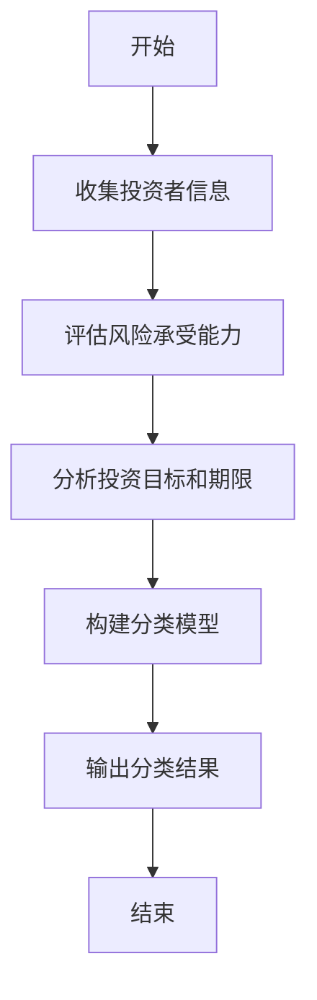

                 


# 格雷厄姆的防御型与进取型投资者区分

## 关键词：防御型投资者，进取型投资者，投资策略，风险评估，价值投资，投资决策

## 摘要

本文深入探讨了格雷厄姆提出的防御型与进取型投资者的区分，分析了两种投资者在特征、策略及适用场景上的差异，并通过数学模型和系统架构设计，提供了如何根据投资者类型进行投资决策的方法。文章从背景介绍、核心概念、算法原理、数学模型、系统分析、项目实战到最佳实践，层层剖析，帮助读者全面理解并应用这一投资理论。

---

## 第一部分：背景介绍

### 第1章：投资的基本概念与重要性

#### 1.1 投资的基本概念

投资是指将资金投入到某种资产或项目中，以期在未来获得收益或资本增值的行为。投资的核心目标是实现财富的保值与增值，同时需要考虑风险与收益的平衡。

- **资产**：包括现金、股票、债券、房地产等，是投资者可以持有并产生收益的物品。
- **投资**：通过购买资产，利用资金的时间价值和资本增值，实现财富增长。

#### 1.2 防御型与进取型投资者的定义

- **防御型投资者**：这类投资者注重本金的安全性和稳定的收益，通常采取保守稳健的投资策略，追求长期稳定的回报。
- **进取型投资者**：这类投资者愿意承担较高的风险，以期获得更高的收益，通常采取积极主动的投资策略，追求高回报。

#### 1.3 两者的主要区别

| 特性                | 防御型投资者                     | 进取型投资者                     |
|---------------------|---------------------------------|---------------------------------|
| 风险承受能力        | 低                             | 高                             |
| 投资目标            | 稳定收益                       | 高收益                        |
| 投资策略            | 价值投资、分散投资             | 投机、杠杆交易                 |
| 适用场景            | 稳定现金流需求、低风险承受能力 | 高风险承受能力、追求高回报     |

---

## 第二部分：核心概念与联系

### 第2章：防御型与进取型投资者的特征与策略

#### 2.1 防御型投资者的特征

- **风险厌恶型**：防御型投资者倾向于避免高风险投资，更注重本金的安全。
- **保守稳健**：通过分散投资和价值投资，降低风险，追求稳定回报。
- **长期稳定收益**：防御型投资者更关注长期的稳健增长，而非短期波动。

#### 2.2 防御型投资者的策略

- **价值投资**：寻找被市场低估的资产，长期持有，等待其价值回归。
- **分散投资**：通过投资多种资产降低风险，避免过度依赖单一投资标的。
- **定期投资**：定期定额投资，分散投资时点，降低市场波动影响。

#### 2.3 进取型投资者的特征

- **高风险承受能力**：愿意承担较高的市场波动和风险，以期获得更高的回报。
- **追求高收益**：通过杠杆、投机等手段，追求超越市场平均收益的目标。
- **灵活性与冒险精神**：进取型投资者更倾向于根据市场变化调整投资策略，抓住短期机会。

#### 2.4 进取型投资者的策略

- **高风险高回报投资**：如创业板、新三板等高风险市场，追求高收益。
- **投机与短线交易**：通过市场波动，短期买卖赚取价差。
- **利用杠杆与衍生工具**：通过融资、期权等工具放大收益或对冲风险。

### 第3章：防御型与进取型投资者的对比分析

#### 3.1 核心概念对比

- **投资目标**：防御型注重稳定收益，进取型追求高回报。
- **风险承受**：防御型低风险承受，进取型高风险承受。
- **投资策略**：防御型稳健保守，进取型积极主动。

#### 3.2 投资策略对比

| 战略                | 防御型投资者                     | 进取型投资者                     |
|---------------------|---------------------------------|---------------------------------|
| 风险管理            | 高分散、低杠杆                 | 适度杠杆、高风险              |
| 时间跨度            | 长期稳健                       | 短期高回报                      |
| 投资工具            | 股票（低波动）、债券、现金      | 股票（高波动）、期货、期权     |

---

## 第三部分：算法原理与数学模型

### 第4章：防御型与进取型投资者区分的算法原理

#### 4.1 算法原理

防御型与进取型投资者的区分可以通过投资者的问卷调查和数据分析来实现。以下是具体的算法步骤：

1. **数据收集**：收集投资者的风险承受能力、投资目标、投资期限等信息。
2. **风险评估**：通过标准差、方差等指标评估投资者的风险偏好。
3. **分类模型**：使用决策树或逻辑回归模型，将投资者分为防御型或进取型。
4. **结果输出**：根据分类结果，提供相应的投资建议。

#### 4.2 算法流程图



#### 4.3 数学模型

防御型投资者的风险评估模型：

$$
\text{风险指数} = \frac{\text{标准差} \times \text{波动率}}{\text{预期收益}}
$$

进取型投资者的风险评估模型：

$$
\text{风险指数} = \frac{\text{标准差} \times \text{波动率} \times 1.5}{\text{预期收益}}
$$

---

### 第5章：数学模型与公式解析

#### 5.1 风险评估公式

- **标准差（Standard Deviation）**：衡量资产收益的波动程度，公式为：

$$
\sigma = \sqrt{\frac{1}{N} \sum_{i=1}^{N} (x_i - \mu)^2}
$$

其中，$\mu$ 是平均收益，$x_i$ 是每个观测值。

- **贝塔系数（Beta）**：衡量资产相对于市场的波动性，公式为：

$$
\beta = \frac{\text{协方差}(r_i, r_m)}{\text{方差}(r_m)}
$$

其中，$r_i$ 是资产收益，$r_m$ 是市场收益。

#### 5.2 投资组合优化

防御型投资者的投资组合优化：

$$
\text{最优组合} = \argmin_{w} \left( w^T \Sigma w \right)
$$

其中，$w$ 是投资权重向量，$\Sigma$ 是资产的协方差矩阵。

进取型投资者的投资组合优化：

$$
\text{最优组合} = \argmax_{w} \left( w^T \mu - \lambda w^T \Sigma w \right)
$$

其中，$\lambda$ 是风险厌恶系数。

---

## 第四部分：系统分析与架构设计

### 第6章：投资决策支持系统的分析与设计

#### 6.1 系统架构设计


#### 6.2 功能模块设计

- **数据输入模块**：收集投资者信息，如资产规模、风险承受能力等。
- **风险评估模块**：计算风险指数，判断投资者类型。
- **投资建议模块**：根据投资者类型，推荐合适的投资策略。
- **结果输出模块**：显示投资建议和风险提示。

---

## 第五部分：项目实战

### 第7章：投资决策支持系统的实现

#### 7.1 环境安装

安装Python、Pandas、NumPy、Scikit-learn等库。

#### 7.2 核心代码实现

```python
import pandas as pd
import numpy as np
from sklearn.tree import DecisionTreeClassifier

# 数据加载
data = pd.read_csv('investor_data.csv')

# 特征与目标变量分离
X = data[['资产规模', '风险承受能力', '投资期限']]
y = data['投资者类型']

# 模型训练
model = DecisionTreeClassifier()
model.fit(X, y)

# 预测
new_investor = [[500000, '低', '长期']]
predicted = model.predict(new_investor)
print(predicted)
```

#### 7.3 案例分析

以一个资产规模为50万元，风险承受能力为低，投资期限为长期的投资者为例，模型预测其为防御型投资者，建议采用价值投资和分散投资策略。

---

## 第六部分：最佳实践与小结

### 第8章：最佳实践与总结

#### 8.1 小结

防御型与进取型投资者的区分是投资决策中的重要环节。防御型投资者注重本金安全和稳定收益，适合长期稳健投资；进取型投资者追求高收益，适合高风险承受能力的投资者。

#### 8.2 注意事项

- 投资者应根据自身情况选择合适策略，避免盲目跟风。
- 定期评估和调整投资组合，以适应市场变化。
- 结合市场环境，灵活调整投资策略。

#### 8.3 拓展阅读

推荐阅读格雷厄姆的《证券分析》和彼得·林奇的《投资漫步华尔街》，深入理解投资策略。

---

## 作者：AI天才研究院 & 禅与计算机程序设计艺术

---

通过以上详细分析，您可以根据自身需求选择合适的投资策略，实现财富的有效管理和增长。

