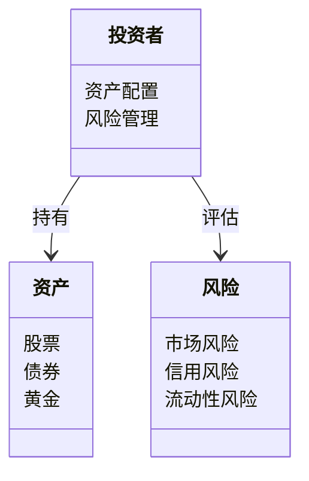
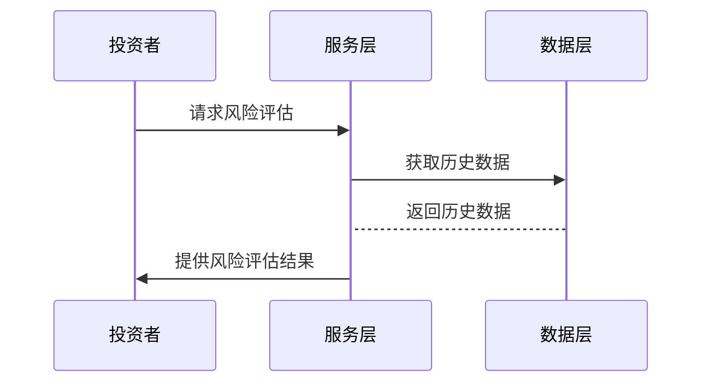

                 


# 格雷厄姆的防御型投资者策略：应对地缘政治风险

## 关键词

- 防御型投资者
- 地缘政治风险
- 资产配置
- 风险管理
- 格雷厄姆投资策略

## 摘要

本文深入探讨了格雷厄姆的防御型投资者策略在应对地缘政治风险中的应用。通过分析防御型投资的核心理念、地缘政治风险的成因及其对投资的影响，本文提供了详细的策略和方法，帮助投资者在不确定的环境中保护和增长资产。文章结合数学模型、系统架构和实际案例，为读者提供了全面的指导。

---

# 第1章：防御型投资者概述

## 1.1 投资的基本概念

### 1.1.1 投资的定义与分类

投资是指将资金投入到特定资产中，以期获得未来收益的行为。根据资产类型，投资可以分为以下几类：

- **股票**：代表公司所有权的权益资产。
- **债券**：借款人承诺在特定时间内偿还本金和利息的债务工具。
- **现金及现金等价物**：流动性最强的资产，如活期存款、货币市场基金等。
- **房地产**：通过购买房地产获得租金收入和资本增值。
- **衍生品**：基于其他资产价格波动的金融工具，如期权、期货等。

### 1.1.2 投资者类型：防御型与进攻型

- **防御型投资者**：注重本金安全和稳定收益，追求风险较低的投资回报。
- **进攻型投资者**：愿意承担较高风险，以期获得超额收益。

### 1.1.3 防御型投资的核心原则

防御型投资者注重以下原则：

- **安全性**：优先选择低风险资产，确保本金安全。
- **稳定性**：通过分散投资降低风险，避免过度依赖单一资产。
- **长期性**：注重长期价值，而非短期波动。

## 1.2 格雷厄姆的防御型投资策略

### 1.2.1 格雷厄姆的投资理念

本杰明·格雷厄姆是价值投资的鼻祖，他提出的防御型投资策略强调以下几点：

- **安全边际**：以低于内在价值的价格购买资产，确保投资的安全性。
- **长期视角**：忽略短期市场波动，关注企业的长期价值。
- **分散投资**：通过投资多种资产降低风险。

### 1.2.2 安全边际的概念

安全边际是指资产市场价格低于其内在价值的部分。通过购买具有较大安全边际的资产，投资者可以在市场波动中获得保护。

$$ \text{安全边际} = \text{内在价值} - \text{市场价格} $$

### 1.2.3 防御型投资的核心原则

防御型投资的核心原则包括：

- **分散投资**：避免将所有资金投入到单一资产中。
- **价值投资**：选择具有较低市盈率和市净率的股票。
- **长期持有**：耐心持有优质资产，避免频繁交易。

---

# 第2章：地缘政治风险的基础

## 2.1 地缘政治风险的定义

### 2.1.1 地缘政治的定义

地缘政治是指国家间因地理位置、资源分布、文化差异等因素而产生的政治、经济和军事关系。

### 2.1.2 风险的分类

地缘政治风险可以分为以下几类：

- **政治风险**：政府政策变化、政治动荡等。
- **经济风险**：贸易制裁、经济制裁等。
- **军事风险**：战争、冲突等。

### 2.1.3 地缘政治风险对投资的影响

地缘政治风险可能导致以下后果：

- **资产价格波动**：股票、债券等资产价格大幅波动。
- **流动性风险**：市场流动性下降，难以变现资产。
- **信用风险**：经济制裁可能导致债券违约。

---

# 第3章：防御型投资者的资产配置

## 3.1 资产配置的基本原则

### 3.1.1 分散投资的重要性

分散投资可以降低特定资产的风险，避免因单一资产波动而导致的重大损失。

### 3.1.2 资产类别的选择

防御型投资者应选择以下资产类别：

- **债券**：提供稳定的利息收入。
- **黄金**：作为避险资产，具有保值功能。
- **蓝筹股**：业绩稳定、分红丰厚的大型企业股票。

## 3.2 防御型资产的选择

### 3.2.1 稳定收益资产：债券

债券是防御型投资者的重要选择，尤其是政府债券和高等级公司债券。

$$ \text{债券收益率} = \frac{\text{年利息}}{\text{债券面值}} $$

### 3.2.2 避险资产：黄金

黄金是传统避险资产，常在地缘政治危机中表现优异。

### 3.2.3 蓝筹股：防御性股票

蓝筹股公司具有稳定的收益和较高的分红，适合防御型投资者。

## 3.3 资产配置的数学模型

### 3.3.1 现代投资组合理论简介

现代投资组合理论（MPT）由哈里·马科维茨提出，强调通过分散投资降低风险。

$$ \text{投资组合风险} = \sqrt{w_1^2 \sigma_1^2 + w_2^2 \sigma_2^2 + 2 w_1 w_2 \rho_{12} \sigma_1 \sigma_2} $$

其中：
- \( w_1, w_2 \)：资产的权重
- \( \sigma_1, \sigma_2 \)：资产的风险
- \( \rho_{12} \)：资产的相关性

### 3.3.2 风险与收益的平衡

通过优化资产配置，投资者可以在风险与收益之间找到最佳平衡点。

---

# 第4章：防御型投资者的风险管理

## 4.1 风险评估的基本方法

### 4.1.1 识别风险来源

防御型投资者需要识别以下风险来源：

- **市场风险**：整体市场的波动。
- **信用风险**：债券发行人违约的风险。
- **流动性风险**：资产难以变现的风险。

### 4.1.2 量化风险程度

使用夏普比率衡量风险调整后的收益：

$$ \text{夏普比率} = \frac{E[r_p] - r_f}{\sigma_p} $$

其中：
- \( E[r_p] \)：投资组合的期望收益
- \( r_f \)：无风险利率
- \( \sigma_p \)：投资组合的波动率

## 4.2 风险对冲策略

### 4.2.1 使用衍生工具对冲

衍生工具如期权和期货可以帮助对冲特定风险。

### 4.2.2 通过资产分散降低风险

分散投资是降低非系统性风险的有效方法。

## 4.3 风险调整后的投资决策

防御型投资者应根据风险承受能力调整投资组合。

---

# 第5章：应对地缘政治风险的具体策略

## 5.1 地缘政治风险的分析与预测

### 5.1.1 风险分析框架

防御型投资者应建立以下分析框架：

- **政治环境分析**：评估国家的政治稳定性。
- **经济环境分析**：评估经济制裁的可能性。
- **军事冲突评估**：评估地区冲突的可能性。

### 5.1.2 风险预测的方法

- **历史分析法**：通过历史数据预测未来风险。
- **情景分析法**：模拟不同情景下的投资表现。

## 5.2 防御型投资者的具体策略

### 5.2.1 债券投资

- **政府债券**：如美国国债、德国国债。
- **高等级公司债券**：如标普评级AAA以上的债券。

### 5.2.2 黄金投资

- **黄金ETF**：如SPDR Gold Shares。
- **黄金期货**：通过期货市场对冲风险。

### 5.2.3 蓝筹股投资

- **防御性股票**：如公用事业股、消费品股。

---

# 第6章：系统分析与架构设计方案

## 6.1 问题场景介绍

防御型投资者需要应对地缘政治风险，通过合理的资产配置和风险管理保护投资。

## 6.2 系统功能设计

### 6.2.1 领域模型（mermaid类图）



### 6.2.2 系统架构设计（mermaid架构图）


### 6.2.3 系统接口设计

- **API接口**：提供资产价格、风险评估等数据接口。

### 6.2.4 系统交互（mermaid序列图）



---

# 第7章：项目实战

## 7.1 环境安装

- **编程语言**：Python 3.9+
- **库**：pandas, numpy, matplotlib

## 7.2 核心实现源代码

```python
import pandas as pd
import numpy as np

def calculate_sharpe_ratio(returns, risk_free_rate):
    excess_returns = returns - risk_free_rate
    sharpe_ratio = np.mean(excess_returns) / np.std(excess_returns)
    return sharpe_ratio

# 示例数据
returns = [0.05, 0.02, 0.03, 0.01]
risk_free_rate = 0.01

print(f"夏普比率：{calculate_sharpe_ratio(returns, risk_free_rate)}")
```

## 7.3 实际案例分析

以2022年俄罗斯入侵乌克兰为例，分析地缘政治风险对投资的影响：

- **股票市场**：能源股价格大幅波动。
- **债券市场**：俄罗斯债券大幅贬值。
- **黄金市场**：黄金价格上涨，成为避险资产。

---

# 第8章：最佳实践 tips、小结、注意事项、拓展阅读

## 8.1 小结

格雷厄姆的防御型投资策略强调本金安全和稳定收益，通过合理的资产配置和风险管理，投资者可以在地缘政治风险中保护资产。

## 8.2 注意事项

- **定期评估投资组合**：根据市场变化调整资产配置。
- **避免过度分散**：分散投资应基于资产的相关性。
- **关注宏观经济**：密切关注地缘政治事件。

## 8.3 拓展阅读

- 《证券分析》——本杰明·格雷厄姆
- 《投资学原理》——威廉·夏普

---

# 作者

作者：AI天才研究院/AI Genius Institute & 禅与计算机程序设计艺术/Zen And The Art of Computer Programming

---

# 参考文献

- 格雷厄姆，本杰明.《证券分析》
- 马科维茨，哈里.《投资学原理》

---

# 链接

- [格雷厄姆投资策略](https://www.wikipedia.org/wiki/Benjamin_Graham)
- [现代投资组合理论](https://www.wikipedia.org/wiki/Modern_Portfolio_Theory)

---

通过以上内容，读者可以全面了解格雷厄姆的防御型投资者策略在应对地缘政治风险中的应用，掌握相关的数学模型和系统架构设计，为实际投资提供指导。

