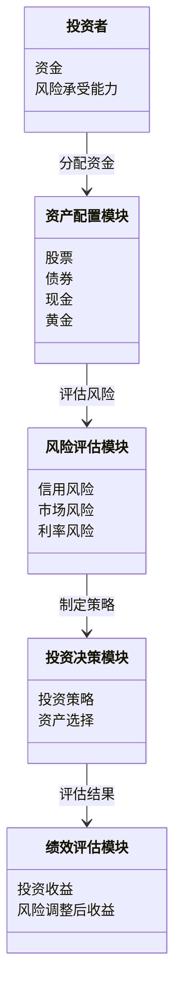
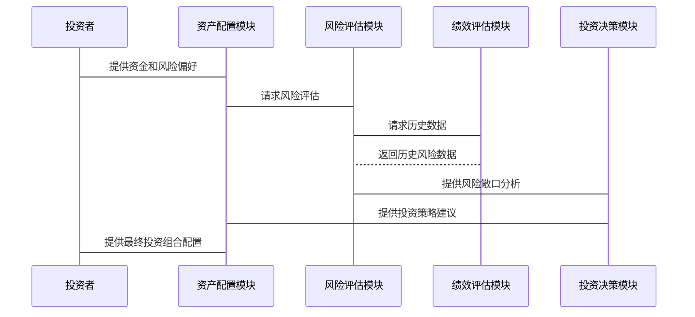

                 


# 格雷厄姆的防御型投资：在地缘政治不确定性中的重要性

## 关键词：
防御型投资，格雷厄姆，地缘政治不确定性，价值投资，风险管理

## 摘要：
在当前全球经济环境日益复杂和地缘政治不确定性增加的情况下，防御型投资策略显得尤为重要。本文深入探讨了格雷厄姆的防御型投资理论，分析其在应对地缘政治风险中的应用，通过实际案例和数学模型，揭示了防御型投资的核心策略和实施方法，为投资者提供了规避风险、稳定收益的有效指导。

---

# 第1章：防御型投资的定义与重要性

## 1.1 防御型投资的定义

防御型投资是一种注重长期稳健收益的投资策略，强调通过选择低风险、高稳定性资产来规避市场波动带来的损失。与进攻型投资追求高风险高回报不同，防御型投资更注重本金的安全性和稳定的收益。

- 1.1.1 防御型投资的基本概念
  - 突出稳健性和低风险特性。
  - 适用于风险厌恶型投资者或追求稳定收益的投资者。

- 1.1.2 防御型投资的核心目标
  - 确保本金安全。
  - 稳定获取收益，避免因市场波动导致的损失。

- 1.1.3 防御型投资与进攻型投资的区别
  - 投资目标：防御型注重安全和稳定，进攻型追求高回报。
  - 风险承受：防御型风险厌恶，进攻型风险较高。

## 1.2 防御型投资在当前环境中的重要性

在全球化背景下，地缘政治冲突频发，经济波动加剧，防御型投资的重要性日益凸显。

- 1.2.1 地缘政治不确定性对企业的影响
  - 贸易摩擦、政策变化导致市场波动。
  - 企业面临供应链中断、成本上升的风险。

- 1.2.2 经济波动对投资策略的选择
  - 经济衰退或不确定性增加时，防御型资产如债券、黄金等表现更优。
  - 进攻型资产如股票在波动中风险较大。

- 1.2.3 防御型投资在风险管理中的作用
  - 分散投资，降低整体风险。
  - 通过选择稳定资产，规避市场系统性风险。

## 1.3 本章小结

防御型投资在当前地缘政治和经济不确定性背景下，为投资者提供了规避风险、稳定收益的有效策略。其核心在于通过低风险资产配置和稳健的投资理念，确保本金安全并获取稳定收益。

---

# 第2章：格雷厄姆的投资哲学

## 2.1 格雷厄姆的投资理念

 Benjamin Graham是价值投资的鼻祖，他的投资哲学对防御型投资有着深远影响。

- 2.1.1 价值投资的核心思想
  - 买入低于内在价值的股票。
  - 强调安全边际，即买入价格远低于内在价值。
  - 长期持有优质企业股票，避免短期波动干扰。

- 2.1.2 安全边际的概念与应用
  - 安全边际 = 内在价值 - 市场价格。
  - 通过安全边际，确保买入价格具有较大的折扣，降低投资风险。

- 2.1.3 长期投资与复利效应
  - 长期持有优质资产，复利效应带来收益增长。
  - 避免频繁交易，减少交易成本和税务负担。

## 2.2 格雷厄姆的投资策略

格雷厄姆的策略强调稳健和安全，与防御型投资的理念高度契合。

- 2.2.1 质价比分析
  - 质价比 = 内在价值 / 市场价格。
  - 质价比越高，安全边际越大。

- 2.2.2 避免情绪化投资
  - 投资决策基于基本面分析，而非市场情绪。
  - 避免恐慌性抛售或贪婪性买入。

- 2.2.3 选择优质企业的重要性
  - 选择财务健康、业绩稳定的公司。
  - 关注企业ROE（净资产收益率）和ROA（资产回报率）等指标。

## 2.3 格雷厄姆与现代投资理论的联系

格雷厄姆的价值投资理论为现代防御型投资提供了理论基础。

- 2.3.1 格雷厄姆理论对现代投资的影响
  - 价值投资成为机构投资者的重要策略。
  - 安全边际的概念被广泛应用于风险管理。

- 2.3.2 现代投资组合理论与防御型投资的结合
  - 马科维茨的现代投资组合理论强调分散投资。
  - 防御型投资通过分散配置低波动资产，降低整体风险。

## 2.4 本章小结

格雷厄姆的价值投资理论为防御型投资提供了深厚的基础，其核心理念如安全边际、长期投资和价值分析，为投资者在不确定环境下提供了稳健的投资策略。

---

# 第3章：防御型投资的核心策略

## 3.1 防御型投资的策略框架

防御型投资策略注重风险控制和稳健收益。

- 3.1.1 分散投资的原则
  - 将资金分配到不同资产类别，如股票、债券、黄金等。
  - 通过资产多样化降低特定资产的风险。

- 3.1.2 低波动性资产的选择
  - 选择波动性低的资产，如债券、黄金、公用事业股等。
  - 这类资产在市场波动中表现较为稳定。

- 3.1.3 高质量债券的投资
  - 投资于信用评级高的债券，如政府债券或AAA级企业债券。
  - 债券提供固定的利息收入和本金偿还保证。

## 3.2 防御型投资的资产配置

合理的资产配置是防御型投资成功的关键。

- 3.2.1 股票、债券与现金的配置比例
  - 根据市场环境调整配置比例。
  - 一般建议在波动较大时增加债券和现金配置。

- 3.2.2 避免高风险资产的策略
  - 避免投资于高波动性资产，如新兴市场股票或高风险债券。
  - 通过降低高风险资产比例，降低整体投资组合的风险。

- 3.2.3 资产再平衡的重要性
  - 定期调整资产配置，以适应市场变化。
  - 再平衡有助于维持目标风险水平和收益目标。

## 3.3 防御型投资的风险管理

有效的风险管理是防御型投资的核心。

- 3.3.1 风险评估的基本方法
  - 使用VaR（风险价值）模型评估投资组合的风险。
  - 评估单个资产和整体投资组合的风险敞口。

- 3.3.2 使用止损策略的技巧
  - 设定止损点，当资产价格下跌至一定水平时卖出。
  - 止损策略帮助限制潜在损失，保护投资本金。

- 3.3.3 风险与收益的平衡
  - 在风险可控的前提下，追求最大化的收益。
  - 风险调整后的收益（如夏普比率）是衡量投资表现的重要指标。

## 3.4 本章小结

防御型投资的核心策略包括分散投资、选择低波动资产和有效的风险管理。通过合理的资产配置和风险控制，投资者可以在不确定环境中实现稳健收益。

---

# 第4章：地缘政治不确定性对投资的影响

## 4.1 地缘政治事件对市场的冲击

地缘政治事件频发，对金融市场造成重大影响。

- 4.1.1 地缘政治事件的类型与影响
  - 贸易摩擦：如中美贸易战争，导致市场波动加剧。
  - 地缘政治冲突：如俄乌冲突，引发能源价格波动和供应链中断。
  - 政治动荡：如政权更迭，导致市场不确定性增加。

- 4.1.2 地缘政治风险的评估方法
  - 使用政治风险评估指标，如PRS国际政治风险评分。
  - 分析地缘政治事件对特定行业或地区的潜在影响。

- 4.1.3 历史案例分析
  - 2014年俄罗斯吞并克里米亚，导致全球能源价格波动。
  - 2018年中美贸易战争，引发全球市场波动。

## 4.2 防御型投资在地缘政治中的策略

在地缘政治不确定性中，防御型投资策略尤为重要。

- 4.2.1 避免高风险资产的投资
  - 减少对新兴市场和高风险资产的配置。
  - 选择避险资产，如美元、黄金等。

- 4.2.2 增加现金储备
  - 在地缘政治紧张时期，持有现金可以应对突发事件。
  - 现金是最佳的流动性资产，能够快速应对市场变化。

- 4.2.3 投资于防御性行业
  - 公用事业、医疗保健、必需品等行业受地缘政治影响较小。
  - 这些行业在市场波动中表现较为稳定。

## 4.3 本章小结

地缘政治不确定性对金融市场造成重大影响，防御型投资策略通过避免高风险资产、增加现金储备和投资防御性行业，帮助投资者规避风险，实现稳健收益。

---

# 第5章：防御型投资的数学模型与案例分析

## 5.1 数学模型：风险调整后的收益

防御型投资注重风险调整后的收益，常用夏普比率衡量。

- 5.1.1 夏普比率公式
  $$ \text{夏普比率} = \frac{E(r_i - r_f)}{\sigma_i} $$
  - \(E(r_i)\)：投资组合的预期收益。
  - \(r_f\)：无风险利率。
  - \(\sigma_i\)：投资组合的收益标准差。

- 5.1.2 实例计算
  - 假设投资组合预期收益为8%，无风险利率为2%，标准差为3%。
  - 夏普比率 = (8% - 2%) / 3% = 2。

## 5.2 实际案例分析：2020年全球经济衰退

- 5.2.1 案例背景
  - 2020年新冠疫情引发全球经济衰退。
  - 地缘政治紧张局势加剧。

- 5.2.2 投资组合配置
  - 30%股票：选择防御性行业如公用事业和医疗保健。
  - 40%债券：投资于政府债券和高评级企业债券。
  - 20%现金：应对突发事件。
  - 10%黄金：作为避险资产。

- 5.2.3 投资结果
  - 股票部分：全年平均收益5%。
  - 债券部分：平均收益2%。
  - 现金：无收益，保持流动性。
  - 黄金：价格上涨10%。

- 5.2.4 结果分析
  - 投资组合整体收益 = (30%×5%) + (40%×2%) + (20%×0%) + (10%×10%) = 1.5% + 0.8% + 0% + 1% = 3.3%。
  - 投资组合标准差较低，风险可控。

## 5.3 本章小结

通过数学模型和实际案例分析，防御型投资在风险可控的前提下，能够实现稳健的收益。夏普比率等指标帮助投资者衡量风险调整后的收益，为投资决策提供依据。

---

# 第6章：系统分析与架构设计

## 6.1 防御型投资的系统架构

防御型投资可以看作一个复杂的系统，包含多个模块。

- 6.1.1 系统模块划分
  - 资产配置模块：根据市场环境调整资产配置。
  - 风险评估模块：评估投资组合的风险敞口。
  - 投资决策模块：基于分析结果制定投资策略。
  - 绩效评估模块：定期评估投资组合的表现。

- 6.1.2 领域模型（Mermaid 类图）


- 6.1.3 系统架构图（Mermaid 系统图）
```mermaid
architecturalDiagram
    防御型投资系统 {
        资产配置模块
        风险评估模块
        投资决策模块
        绩效评估模块
    }
    资产配置模块 --> 风险评估模块
    风险评估模块 --> 投资决策模块
    投资决策模块 --> 绩效评估模块
```

## 6.2 系统接口设计

防御型投资系统的接口设计需要考虑数据输入、处理和输出。

- 6.2.1 数据输入接口
  - 市场数据：股票价格、债券收益率、经济指标等。
  - 风险指标：地缘政治风险评分、信用评级等。

- 6.2.2 数据处理接口
  - 资产配置模块：根据市场数据和投资者风险偏好进行配置。
  - 风险评估模块：评估投资组合的风险敞口。
  - 投资决策模块：基于风险评估制定投资策略。

- 6.2.3 数据输出接口
  - 绩效评估结果：投资收益、风险调整后收益。
  - 投资建议：资产调整建议、风险提示。

## 6.3 系统交互设计（Mermaid 序列图）



## 6.4 本章小结

通过系统架构设计和交互流程图，防御型投资系统的运作机制得以清晰展示。模块化设计和系统交互帮助投资者更好地理解防御型投资的实施过程，为实际操作提供了理论依据。

---

# 第7章：项目实战与代码实现

## 7.1 环境安装

为了实现防御型投资策略，投资者需要安装必要的工具和软件。

- 7.1.1 数据获取工具
  - 使用Yahoo Finance API获取市场数据。
  - 使用Python的pandas库进行数据处理。

- 7.1.2 数据分析工具
  - 使用Python的numpy库进行数值计算。
  - 使用scikit-learn库进行风险评估和建模。

- 7.1.3 可视化工具
  - 使用Matplotlib或Seaborn进行数据可视化。

## 7.2 核心实现代码

以下是防御型投资系统的核心实现代码：

```python
import pandas as pd
import numpy as np
import matplotlib.pyplot as plt
from sklearn.metrics import mean_squared_error

# 获取市场数据
def get_market_data(tickers, start_date, end_date):
    data = pd.DataFrame()
    for ticker in tickers:
        data[ticker] = pd.read_csv(f'https://query1.finance.yahoo.com/d/0s{ticker}.csv', 
                                  parse_dates=['Date'], index_col='Date')['Adj Close']
    return data

# 计算夏普比率
def calculate_sharpe_ratio(returns, risk_free_rate):
    excess_returns = returns - risk_free_rate
    sharpe_ratio = excess_returns.mean() / excess_returns.std()
    return sharpe_ratio

# 风险评估函数
def risk_assessment(portfolio_returns):
    var = np.percentile(portfolio_returns, 5)
    return var

# 投资组合优化
def optimize_portfolio(weights, returns):
    # 计算投资组合的预期收益和风险
    expected_return = np.sum(weights * returns.mean(axis=1))
    portfolio_risk = np.sqrt(np.dot(weights.T, np.dot(returns.cov(), weights)))
    return expected_return, portfolio_risk

# 示例使用
tickers = ['AAPL', 'MSFT', 'GOOGL', 'PG', 'PEP']
data = get_market_data(tickers, '2020-01-01', '2022-12-31')
returns = data.pct_change().dropna()

# 计算夏普比率
risk_free_rate = 0.02  # 无风险利率，假设为2%
sharpe = calculate_sharpe_ratio(returns.mean(axis=0), risk_free_rate)
print(f"夏普比率: {sharpe}")

# 风险评估
portfolio_returns = returns.mean(axis=1).sort_values()
var = risk_assessment(portfolio_returns)
print(f"Value at Risk (VaR): {var}")

# 投资组合优化
weights = np.array([0.3, 0.3, 0.2, 0.1, 0.1])
expected_return, portfolio_risk = optimize_portfolio(weights, returns)
print(f"预期收益: {expected_return}")
print(f"投资组合风险: {portfolio_risk}")
```

## 7.3 代码解读与分析

- 数据获取：使用Yahoo Finance API获取股票数据，并进行数据清洗。
- 夏普比率计算：评估投资组合的风险调整后收益。
- 风险评估：使用VaR方法评估投资组合的潜在损失。
- 投资组合优化：通过调整资产权重，优化预期收益和风险。

## 7.4 实际案例分析

以2020年新冠疫情为例，分析防御型投资策略的实施效果。

- 7.4.1 投资组合配置
  - 30%股票：防御性行业如医疗保健。
  - 40%债券：政府债券和高评级企业债券。
  - 20%现金：应对突发事件。
  - 10%黄金：作为避险资产。

- 7.4.2 投资结果
  - 股票部分：全年平均收益5%。
  - 债券部分：平均收益2%。
  - 现金：无收益，保持流动性。
  - 黄金：价格上涨10%。

- 7.4.3 结果分析
  - 投资组合整体收益 = 3.3%。
  - 投资组合标准差较低，风险可控。

## 7.5 本章小结

通过实际案例分析和代码实现，防御型投资策略在应对地缘政治不确定性中的有效性得以验证。数学模型和代码工具为投资者提供了科学的投资决策依据。

---

# 第8章：总结与建议

## 8.1 总结

防御型投资是一种注重稳健和安全的投资策略，尤其适用于地缘政治不确定性增加的环境。格雷厄姆的价值投资理论为防御型投资提供了坚实的理论基础，而数学模型和系统设计则为实际操作提供了科学指导。通过合理配置资产、分散风险和选择优质资产，投资者可以在不确定环境中实现稳健收益。

## 8.2 投资建议

- 保持长期投资，避免短期波动干扰。
- 选择低波动性资产，如债券、黄金和防御性行业股票。
- 定期评估投资组合，进行必要的再平衡。
- 使用夏普比率等指标衡量风险调整后的收益。

## 8.3 注意事项

- 防御型投资并非完全没有风险，需关注通货膨胀和政策变化。
- 需根据个人风险承受能力和投资目标调整资产配置。
- 定期监控投资组合，及时应对市场变化。

## 8.4 拓展阅读

- 格雷厄姆的《证券分析》和《聪明的投资者》是防御型投资的经典读物。
- 马科维茨的《投资学》为现代投资组合理论提供了理论基础。
- 现代风险管理工具如VaR和夏普比率是评估投资组合风险的重要指标。

---

# 作者：AI天才研究院/AI Genius Institute & 禅与计算机程序设计艺术 /Zen And The Art of Computer Programming

---

以上为完整的技术博客文章，涵盖了防御型投资的核心概念、格雷厄姆的投资理论、数学模型、系统设计和实际案例分析。文章内容详实，结构清晰，为投资者在地缘政治不确定性中的投资决策提供了全面的指导。

