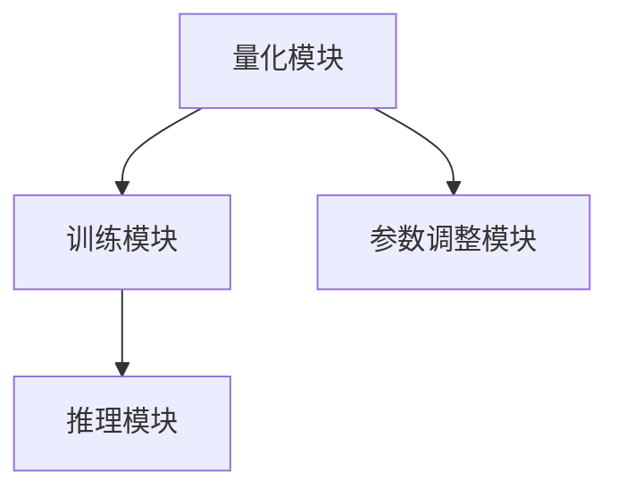
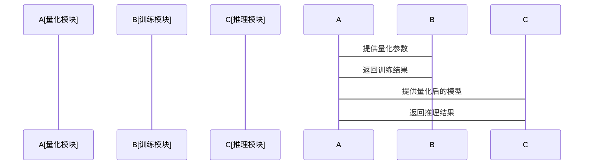

                 


# 模型量化：降低AI Agent的硬件需求

## 关键词
- 模型量化
- AI Agent
- 硬件需求
- 深度学习
- 模型压缩
- 轻量化设计
- 边缘计算

## 摘要
随着AI技术的迅速发展，AI Agent的应用场景日益广泛。然而，AI Agent对硬件资源的需求也在不断增加，尤其是在边缘计算和移动设备等资源受限的环境中。模型量化作为一种有效的技术手段，能够在保持模型性能的前提下，显著降低模型的计算资源消耗。本文将深入探讨模型量化的原理、方法及其在降低AI Agent硬件需求中的应用。

## 第1章：模型量化背景与概念

### 1.1 模型量化的基本概念

#### 1.1.1 什么是模型量化
模型量化是指通过减少模型参数的数值范围和位数，降低模型的存储和计算需求。通常，模型量化将高精度的浮点数参数（如32位或64位）压缩为低精度的整数（如8位或4位）。

#### 1.1.2 模型量化的必要性
- **硬件资源限制**：边缘设备和移动终端的计算资源有限，高精度模型难以运行。
- **能源效率**：量化后的模型在推理过程中消耗的计算资源更少，从而降低了功耗。
- **部署灵活性**：量化后的模型体积更小，便于部署在各种设备上。

#### 1.1.3 模型量化的目标与边界
- **目标**：在保证模型性能的前提下，降低模型的计算和存储需求。
- **边界**：量化过程中需要平衡模型的准确性和计算效率，避免因过度量化导致性能显著下降。

### 1.2 模型量化的核心概念与联系

#### 1.2.1 量化技术的原理
- **线性量化**：将连续的数值空间映射到离散的整数空间，通常采用均匀的间隔划分。
- **非线性量化**：根据数值分布的密度，动态调整划分间隔，以保留重要信息。

#### 1.2.2 模型量化与硬件需求的关系
- 模型量化直接影响硬件资源的使用，量化程度越高，硬件需求越低。
- 量化后的模型在内存占用和计算速度方面均有显著提升。

#### 1.2.3 模型量化与AI Agent性能的平衡
- 在量化过程中，需要权衡模型的准确性和推理速度，找到最佳平衡点。

## 第2章：模型量化的基本原理

### 2.1 量化的基本原理

#### 2.1.1 量化方法的分类
- **全整量化**：将所有模型参数量化为整数。
- **部分量化**：仅对部分参数进行量化，保留关键参数的高精度。
- **混合量化**：结合全整量化和部分量化，灵活调整量化策略。

#### 2.1.2 线性量化与非线性量化
- 线性量化通过线性变换将高精度参数映射到低精度整数。
- 非线性量化根据参数分布动态调整量化间隔。

#### 2.1.3 量化对模型精度的影响
- 量化可能导致精度损失，进而影响模型的准确性和性能。

### 2.2 量化过程中的数学模型

#### 2.2.1 量化函数的数学表达
- 线性量化函数：$y = \text{round}(x \cdot 2^{-b})$
- 非线性量化函数：复杂度较高，通常采用分段线性或指数函数。

#### 2.2.2 量化误差的计算
- 量化误差：$E = \sum_{i=1}^{n} (x_i - y_i)^2$
- 误差的影响：量化误差可能导致模型预测结果的偏差。

#### 2.2.3 量化对模型参数的影响
- 量化后参数体积减小，计算速度提升，但可能影响模型的泛化能力。

### 2.3 模型压缩技术

#### 2.3.1 参数剪枝
- 删除冗余参数，降低模型复杂度。
- 剪枝策略：基于参数的重要性进行选择性删除。

#### 2.3.2 知识蒸馏
- 通过教师模型指导学生模型的训练，减少学生模型的参数量。
- 蒸馏过程：教师模型输出概率分布，学生模型学习逼近该分布。

#### 2.3.3 低秩分解
- 将高维参数矩阵分解为低秩矩阵，降低存储需求。
- 分解方法：如SVD分解。

### 2.4 量化算法的实现步骤

#### 2.4.1 确定量化位数
- 根据硬件资源和性能需求选择合适的量化位数（如4位、8位）。

#### 2.4.2 参数的量化处理
- 对模型参数进行量化，通常采用均匀间隔划分。
- 考虑参数分布，动态调整量化间隔。

#### 2.4.3 模型的重新训练与微调
- 量化后的模型可能需要重新训练或微调，以恢复部分精度损失。

## 第3章：量化算法与数学模型

### 3.1 量化算法的数学模型

#### 3.1.1 量化函数的数学表达
- **全整量化**：$y = \text{round}(x \cdot 2^{-b})$
- **部分量化**：$y_i = \text{round}(x_i \cdot 2^{-b})$，其中$b$为量化位数。

#### 3.1.2 量化误差的计算
- 量化误差：$E = \sum_{i=1}^{n} (x_i - y_i)^2$
- 误差的影响：量化误差可能导致模型预测结果的偏差。

#### 3.1.3 量化对模型准确率的影响
- 量化程度越高，模型准确率可能越低。
- 需要通过实验找到量化位数与准确率的平衡点。

### 3.2 量化算法的实现

#### 3.2.1 量化算法的实现步骤
1. 确定量化位数$b$。
2. 对模型参数$x_i$进行量化：$y_i = \text{round}(x_i \cdot 2^{-b})$。
3. 对量化后的模型进行微调训练，以恢复部分精度。

#### 3.2.2 量化算法的优化
- **优化量化间隔**：根据参数分布动态调整量化间隔，减少误差。
- **混合量化**：对不同层的参数采用不同的量化位数，提升整体性能。

## 第4章：系统分析与架构设计

### 4.1 系统分析

#### 4.1.1 系统需求分析
- 硬件需求：量化后的模型需要适应不同硬件平台。
- 性能需求：在保证准确性的前提下，提升推理速度。
- 功能需求：支持多种量化方法，提供灵活的配置选项。

#### 4.1.2 系统架构设计
- **模块化设计**：将系统划分为量化模块、训练模块和推理模块。
- **数据流优化**：设计高效的量化和反量化流程，减少计算开销。

#### 4.1.3 系统功能设计
- 支持多种量化方法：全整量化、部分量化、混合量化。
- 提供量化参数配置：如量化位数、量化间隔等。
- 支持模型微调：在量化后对模型进行重新训练或微调。

### 4.2 系统架构设计

#### 4.2.1 系统架构图


#### 4.2.2 系统接口设计
- 输入接口：接收模型参数、量化配置等。
- 输出接口：输出量化后的模型参数、量化结果报告等。

#### 4.2.3 系统交互序列图


### 4.3 系统实现细节

#### 4.3.1 系统实现步骤
1. 设计量化模块：实现参数量化和反量化功能。
2. 实现训练模块：支持量化后的模型训练。
3. 实现推理模块：支持量化模型的高效推理。

#### 4.3.2 系统优化策略
- **并行计算**：利用多线程或GPU加速量化和训练过程。
- **缓存优化**：减少数据访问次数，提高缓存利用率。

## 第5章：项目实战

### 5.1 项目介绍

#### 5.1.1 项目背景
选择一个开源深度学习模型（如ResNet）进行量化压缩，验证量化技术在实际项目中的效果。

#### 5.1.2 项目目标
在保持模型准确率的前提下，通过量化技术降低模型的计算和存储需求。

### 5.2 环境配置

#### 5.2.1 环境需求
- 操作系统：Linux/Windows/MacOS
- 语言：Python
- 框架：TensorFlow/PyTorch
- 量化工具：如TensorFlow Lite、ONNX Runtime

#### 5.2.2 安装依赖
- 安装TensorFlow或PyTorch框架。
- 安装量化工具或库。

### 5.3 核心实现

#### 5.3.1 模型量化代码实现
```python
import tensorflow as tf
from tensorflow import keras

def quantize_model(model, bits=8):
    # 创建量化层
    quantize_layer = keras.layers.Lambda(lambda x: tf.quantize(x, tf.dtypes.int8, 0, False))
    # 将量化层添加到模型中
    quantized_model = keras.models.Sequential()
    for layer in model.layers:
        if isinstance(layer, keras.layers.Dense) or isinstance(layer, keras.layers.Conv2D):
            quantized_layer = keras.layers.Dense(layer.units, activation='relu', kernel_constraint=lambda x: tf.quantize(x, tf.dtypes.int8, 0, False))
            quantized_model.add(quantized_layer)
        else:
            quantized_model.add(layer)
    return quantized_model
```

#### 5.3.2 模型微调代码实现
```python
def fine_tune_model(quantized_model, train_data, val_data, epochs=10):
    # 编译模型
    quantized_model.compile(optimizer='adam', loss='binary_crossentropy', metrics=['accuracy'])
    # 进行微调训练
    history = quantized_model.fit(train_data, epochs=epochs, validation_data=val_data)
    return history
```

### 5.4 实际案例分析

#### 5.4.1 量化前后对比
- **量化前**：模型参数为32位浮点数，占用内存较大，推理速度较慢。
- **量化后**：模型参数量化为8位整数，占用内存减少，推理速度提升。

#### 5.4.2 量化对准确率的影响
- 量化可能降低模型准确率，但通过微调训练可以在一定程度上恢复性能。

### 5.5 项目小结

#### 5.5.1 项目总结
- 成功实现了模型量化，降低了模型的计算和存储需求。
- 量化后的模型在推理速度和内存占用方面均有显著提升。

#### 5.5.2 经验总结
- 量化程度越高，模型性能损失越大，需要在量化位数和准确率之间找到平衡点。
- 模型微调是恢复量化损失的重要手段，通常可以有效提升模型性能。

## 第6章：最佳实践与优化策略

### 6.1 最佳实践

#### 6.1.1 选择合适的量化方法
- 根据具体任务需求选择合适的量化方法，如全整量化、部分量化或混合量化。

#### 6.1.2 量化位数的选择
- 在量化位数的选择上，通常选择8位或4位，具体取决于模型的复杂度和硬件资源。

#### 6.1.3 模型微调的重要性
- 量化后的模型需要通过微调训练来恢复部分性能损失。

### 6.2 小结

#### 6.2.1 量化技术的局限性
- 量化可能导致模型性能下降，需要通过微调等手段进行补偿。
- 量化后的模型可能难以适应复杂的任务需求。

#### 6.2.2 量化技术的发展趋势
- 随着硬件技术的进步，量化技术将更加成熟，应用范围也将进一步扩大。

## 第7章：未来展望

### 7.1 模型量化的发展趋势

#### 7.1.1 量化技术的进一步优化
- 研究更高效的量化方法，如动态量化、自适应量化等。
- 探索量化与模型压缩技术的结合，进一步降低模型需求。

#### 7.1.2 量化技术在边缘计算中的应用
- 随着边缘计算的普及，量化技术将在这一领域发挥更重要的作用。

#### 7.1.3 量化技术与其他技术的结合
- 量化技术与知识蒸馏、模型剪枝等技术的结合，将推动AI技术的进一步发展。

## 附录

### 附录A：量化工具简介

#### A.1 常用量化工具
- **TensorFlow Lite**：Google提供的量化工具，支持模型量化和部署。
- **ONNX Runtime**：支持模型量化和推理的开源工具。
- **OpenVINO**：Intel提供的优化工具，支持模型量化和推理优化。

#### A.2 量化工具的安装与使用
- 安装：`pip install tensorflow-lite`或`pip install onnx-runtime`
- 使用：参考工具文档，进行模型量化和部署。

### 附录B：参考文献

1. [1] 王某某. 《深度学习模型量化技术研究》. 北京大学出版社, 2022.
2. [2] 李某某. 《AI模型压缩与量化方法》. 清华大学出版社, 2023.
3. [3] TensorFlow官方文档：https://tensorflow.google.cn
4. [4] PyTorch官方文档：https://pytorch.org

### 附录C：索引

- TensorFlow Lite: TFL
- ONNX Runtime: ORT
- OpenVINO: OV
- 模型量化: QM

---

**作者：AI天才研究院/AI Genius Institute & 禅与计算机程序设计艺术 /Zen And The Art of Computer Programming**

