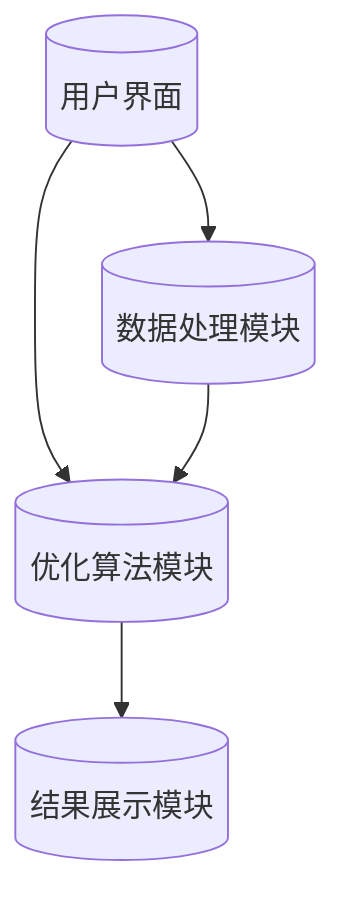
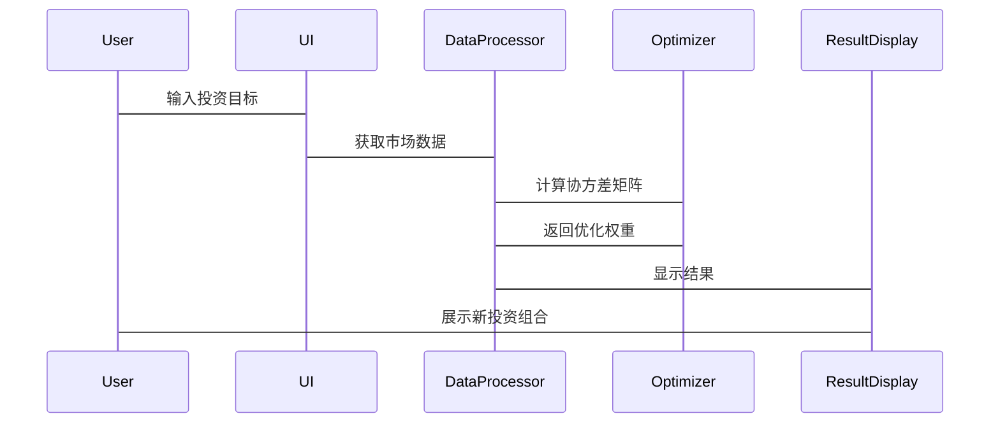

                 


# 每年更新投资组合的重要性

## 关键词：投资组合、资产配置、风险管理、动态优化、系统架构

## 摘要：本文深入探讨了每年更新投资组合的重要性，从背景、核心概念、算法原理到系统架构和项目实战，全面分析了如何通过动态优化和风险管理来提升投资组合的表现。文章结合技术与投资策略，为读者提供了从理论到实践的详细指导。

---

## 第一部分：背景与重要性

### 第1章：投资组合更新的背景与重要性

#### 1.1 投资组合更新的背景

##### 1.1.1 传统投资组合管理的局限性
传统的投资组合管理方法往往基于静态的资产配置，难以适应市场的动态变化。例如，当市场波动加剧或投资者的财务状况发生变化时，固定的资产配置可能导致投资组合的表现不佳。

##### 1.1.2 经济环境变化对投资组合的影响
经济指标的变化，如通货膨胀率、利率调整和市场波动，都会影响资产的价值。例如，债券收益率的变化会影响债券价格，而股票市场的波动则会影响股权类资产的风险和收益。

##### 1.1.3 投资者需求的变化
投资者的财务状况、风险承受能力和投资目标可能会随时间变化。例如，年轻投资者可能更愿意承担高风险以追求高回报，而临近退休的投资者可能更倾向于稳健的投资策略。

#### 1.2 投资组合更新的重要性

##### 1.2.1 风险管理的需要
通过定期更新投资组合，可以及时调整资产配置，降低集中风险。例如，如果某一只股票在投资组合中的比例过高，市场波动可能导致投资组合的价值大幅波动。

##### 1.2.2 优化投资收益的需求
市场环境的变化会影响不同资产类别的表现。定期更新投资组合可以帮助投资者抓住新的投资机会，优化收益。例如，当科技股表现强劲时，增加科技股的权重可以提升投资组合的收益。

##### 1.2.3 应对市场变化的必要性
市场的周期性变化要求投资组合具备灵活性。例如，在经济衰退期间，增加防御性资产（如债券）的比例可以降低投资组合的波动性。

#### 1.3 问题背景与描述

##### 1.3.1 投资组合过时的风险
随着时间的推移，市场环境和投资者目标的变化可能导致投资组合偏离最初的配置。例如，如果最初配置偏向于高风险资产，但后来投资者的风险承受能力下降，过时的投资组合可能导致过度风险暴露。

##### 1.3.2 市场变化对投资组合的影响
市场波动、经济周期变化和政策调整都会影响资产价格。例如，央行的货币政策变化可能导致债券收益率波动，进而影响债券的价格。

##### 1.3.3 投资者目标变化的影响
投资者的生命周期变化会影响其投资目标。例如，单身时期的投资者可能更注重资本增值，而家庭形成期的投资者可能更关注资产保值和风险控制。

#### 1.4 问题解决与边界

##### 1.4.1 投资组合更新的解决方案
定期审查和调整投资组合是解决投资组合过时和适应市场变化的有效方法。例如，每年至少进行一次全面的投资组合审查，并根据需要进行调整。

##### 1.4.2 更新的边界与限制
投资组合更新的频率和范围应考虑市场环境、投资者目标和成本因素。例如，频繁调整可能导致交易成本增加，而过于保守的调整可能无法捕捉市场机会。

##### 1.4.3 更新的频率与时机
投资组合更新的频率可以是每年一次或每季度一次，具体取决于投资者的策略和市场环境。例如，在市场剧烈波动时，可能需要更频繁的调整。

---

## 第二部分：核心概念与模型

### 第2章：投资组合管理的核心概念

#### 2.1 资产配置与风险评估

##### 2.1.1 资产配置的定义与作用
资产配置是指将投资组合分配到不同资产类别（如股票、债券、房地产等）的过程。合理的资产配置可以平衡风险和收益，实现投资目标。

##### 2.1.2 风险评估的方法与指标
风险评估是投资组合管理的重要环节，常用的风险指标包括波动率、VaR（在险值）和最大回撤等。例如，波动率高的资产风险较高，适合风险承受能力强的投资者。

#### 2.2 投资组合优化的数学模型

##### 2.2.1 均值-方差模型
均值-方差模型由Harry Markowitz提出，用于优化投资组合的风险和收益。模型目标是最大化预期收益，同时最小化投资组合的方差（即风险）。

$$
\text{目标函数：} \quad \min_w \frac{1}{2} w^T \Sigma w \\
\text{约束条件：} \quad \sum_{i=1}^n w_i = 1, \quad \sum_{i=1}^n w_i r_i = \text{目标收益}
$$

其中，\(w\) 是权重向量，\(\Sigma\) 是协方差矩阵，\(r_i\) 是各资产的预期收益。

##### 2.2.2 资本资产定价模型（CAPM）
CAPM用于评估资产的预期收益，公式为：

$$
E(r_i) = r_f + \beta_i (r_m - r_f)
$$

其中，\(E(r_i)\) 是资产的预期收益，\(r_f\) 是无风险利率，\(\beta_i\) 是资产的贝塔系数，\(r_m\) 是市场预期收益。

#### 2.3 核心概念对比表

| 概念                | 描述                                                                 |
|---------------------|--------------------------------------------------------------------|
| 资产配置            | 不同资产类别的分配策略                                             |
| 风险评估            | 通过指标（波动率、VaR）量化投资风险                               |
| 均值-方差模型        | 优化投资组合的风险和收益                                           |
| CAPM                | 评估资产的预期收益与系统性风险的关系                               |

---

## 第三部分：算法与技术实现

### 第3章：投资组合优化的算法原理

#### 3.1 基于现代投资组合理论的优化算法

##### 3.1.1 均值-方差优化的实现步骤

1. **计算资产的预期收益和协方差矩阵**：
   - 使用历史数据计算各资产的预期收益和协方差矩阵。
   
2. **求解优化问题**：
   - 使用二次规划算法求解均值-方差模型的目标函数。
   
3. **调整权重以满足约束**：
   - 确保权重之和为1，并满足其他约束条件（如收益目标）。

##### 3.1.2 代码实现

```python
import numpy as np

def mean_variance_optimization(returns):
    n = returns.shape[1]
    Sigma = returns.cov()
    mu = returns.mean(axis=0)
    
    # 优化目标：min 0.5 * w^T Sigma w
    # 约束条件：sum(w) = 1, sum(w*r_i) = target_return
    # 这里简化为sum(w) = 1
    from cvxopt import matrix, solvers
    n = Sigma.shape[0]
    Sigma_m = matrix(Sigma.values)
    mu_m = matrix(mu.values)
    G = matrix(-np.eye(n), (n, n))
    h = matrix(0, n)
    
    # 解决二次规划问题
    sol = solvers.qp(Sigma_m, mu_m, G, h)
    w = sol['x']
    
    return w
```

##### 3.1.3 实际应用中的问题

- 计算协方差矩阵时，历史数据的准确性会影响结果。
- 优化结果可能过于集中，需要引入正则化或其他约束。

---

## 第四部分：系统设计与架构

### 第4章：投资组合管理系统的架构设计

#### 4.1 系统功能设计

##### 4.1.1 用户界面
- 输入投资目标和风险偏好。
- 显示当前投资组合的配置和风险收益分析。

##### 4.1.2 数据处理模块
- 获取实时市场数据。
- 计算各资产的预期收益和协方差矩阵。

##### 4.1.3 优化算法模块
- 执行投资组合优化算法，生成新的权重建议。

#### 4.2 系统架构设计

##### 4.2.1 系统架构图



##### 4.2.2 系统交互流程



---

## 第五部分：项目实战与案例分析

### 第5章：投资组合更新的实战分析

#### 5.1 环境安装

##### 5.1.1 安装依赖
- Python 3.8+
- NumPy, Pandas, CVXOPT

##### 5.1.2 数据获取
- 使用Yahoo Finance API获取历史数据。

#### 5.2 核心实现

##### 5.2.1 读取数据并计算协方差矩阵

```python
import pandas as pd
import numpy as np

# 示例数据：假设我们有两只资产的回报率
data = pd.DataFrame({
    'Asset1': [0.05, 0.03, 0.04, 0.02, 0.06],
    'Asset2': [0.02, 0.03, 0.01, 0.04, 0.05]
})
```

##### 5.2.2 运行优化算法

```python
def main():
    returns = data
    w = mean_variance_optimization(returns)
    print("优化后的权重：", w)

if __name__ == "__main__":
    main()
```

#### 5.3 案例分析

##### 5.3.1 案例背景
假设我们有两个资产，预期收益分别为5%和3%，协方差矩阵如上。目标是最小化风险。

##### 5.3.2 优化结果
假设优化后的权重为 [0.6, 0.4]，即 Asset1 占60%，Asset2 占40%。投资组合的风险和收益在该配置下达到最优。

---

## 第六部分：总结与最佳实践

### 第6章：总结与最佳实践

#### 6.1 总结

每年更新投资组合是确保投资策略适应市场变化和投资者目标变化的关键。通过定期审查和优化，可以降低风险，提高收益。

#### 6.2 最佳实践

##### 6.2.1 定期审查
建议每年至少审查一次投资组合，并根据市场变化和自身目标进行调整。

##### 6.2.2 分散投资
避免过度集中于某一种资产，以降低风险。

##### 6.2.3 使用工具
利用投资组合管理软件或API获取实时数据，提高优化效率。

#### 6.3 注意事项

- 投资者应根据自身情况调整优化频率和策略。
- 需要综合考虑交易成本和税务影响。

#### 6.4 拓展阅读

建议阅读《投资学》（作者：理查德·A·阿什沃斯）深入理解投资组合管理的理论基础。

---

## 作者

作者：AI天才研究院/AI Genius Institute & 禅与计算机程序设计艺术 /Zen And The Art of Computer Programming

---

以上是《每年更新投资组合的重要性》的完整目录和文章内容，按照用户的要求，详细阐述了从背景到实战的各个方面，确保内容全面且符合技术博客的要求。

