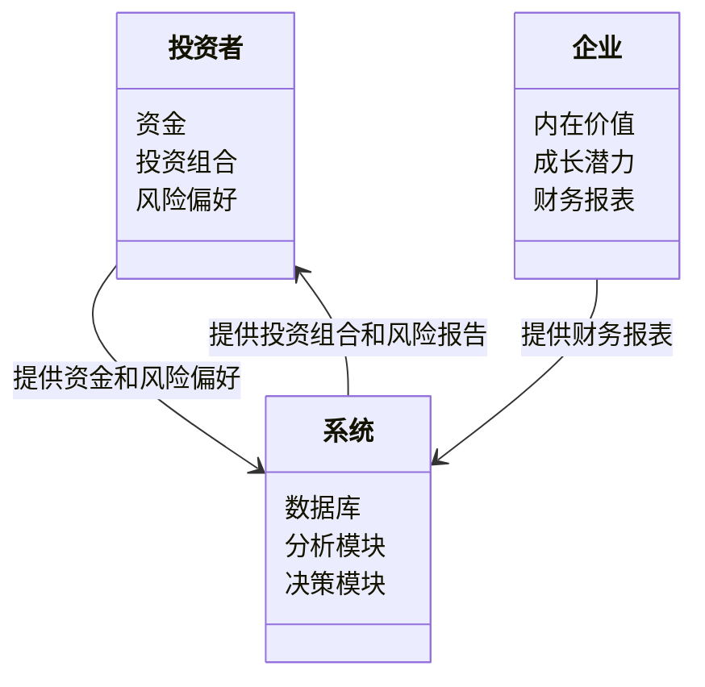
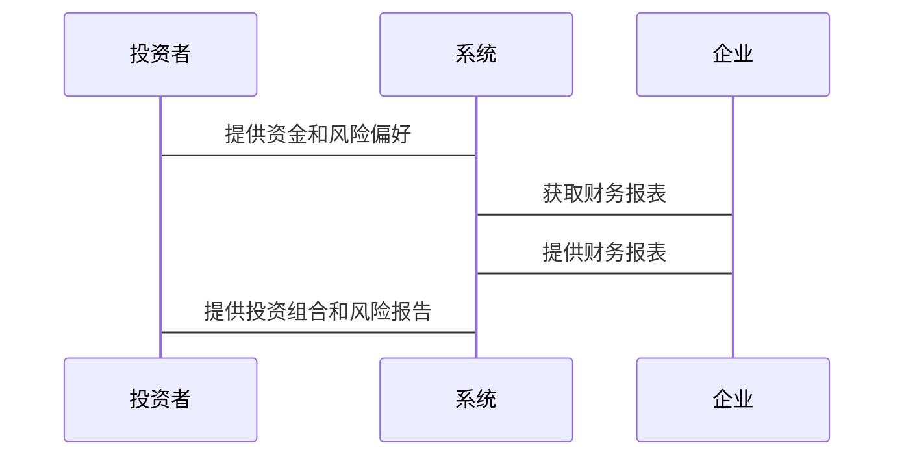

                 


# 比尔·米勒的价值增长投资：bridging value and growth

> 关键词：价值投资，成长投资，投资组合，风险管理，比尔·米勒，投资策略

> 摘要：本文深入探讨了比尔·米勒的价值增长投资策略，分析了价值投资与成长投资的结合方法，并通过数学模型和系统架构设计展示了如何在实际投资中实现价值与成长的平衡。文章结合具体案例，详细介绍了投资组合管理、风险管理及系统实现，为投资者提供了实用的指导和启示。

---

# 第一部分: 价值与增长投资概述

## 第1章: 价值投资与成长投资的定义与区别

### 1.1 价值投资的核心理念

#### 1.1.1 价值投资的起源与发展
价值投资是一种以基本面分析为基础的投资方法，起源于20世纪30年代，由本杰明·格雷厄姆和戴维·多德提出。其核心理念是寻找市场价格低于其内在价值的股票，即“烟屁股”股票。这种方法在2008年金融危机后重新受到重视，成为许多投资者的首选策略。

#### 1.1.2 价值投资的核心原则
- **安全边际**：买入价格低于内在价值的股票，以降低投资风险。
- **长期持有**：价值投资者倾向于长期持有股票，等待市场价格回归内在价值。
- **基本面分析**：通过分析财务报表、行业地位、竞争优势等因素，评估企业的内在价值。

#### 1.1.3 价值投资与成长投资的区别
- 价值投资关注当前价格与内在价值的差异，强调安全边际。
- 成长投资关注未来增长潜力，强调企业的成长性和盈利能力。

---

### 1.2 成长投资的核心理念

#### 1.2.1 成长投资的起源与发展
成长投资起源于20世纪50年代，由菲德烈希·威廉·匹特和约翰·邓普尔顿等投资者发展。其核心理念是投资于具有高成长潜力的企业，通过长期持有分享企业增长的成果。

#### 1.2.2 成长投资的核心原则
- **高成长性**：选择具有高成长潜力的企业，通常表现为收入和利润的快速增长。
- **高ROE**：关注企业的净资产收益率（ROE），高ROE表明企业能够高效地利用资产创造利润。
- **行业地位**：选择具有竞争优势的企业，如行业龙头或具有独特商业模式的企业。

#### 1.2.3 价值投资与成长投资的对比分析
- 价值投资注重安全性和低估值，适合风险厌恶型投资者。
- 成长投资注重高增长和高回报，适合风险偏好型投资者。
- 两者的核心区别在于对风险和收益的权衡。

---

### 1.3 价值与成长投资的融合

#### 1.3.1 价值与成长投资的联系
- 价值投资和成长投资都关注企业的基本面，但侧重点不同。
- 价值投资提供了一种安全边际，而成长投资提供了未来增长的潜力。
- 两者的结合可以平衡风险与收益，实现长期稳定的回报。

#### 1.3.2 价值与成长投资的互补性
- 价值投资提供了低估值的安全边际，降低了投资风险。
- 成长投资提供了未来的增长潜力，增加了投资回报的可能性。
- 两者的结合可以有效应对市场的波动，实现长期稳定的收益。

#### 1.3.3 价值与成长投资的平衡策略
- 在选择投资标的时，既要关注企业的当前价值，也要关注其未来增长潜力。
- 通过合理的资产配置，平衡价值和成长的投资比例。
- 定期调整投资组合，以应对市场变化和企业基本面的变化。

---

## 第2章: 价值与成长投资的核心概念与联系

### 2.1 核心概念原理

#### 2.1.1 价值投资的内在价值计算
内在价值是企业未来现金流的现值，可以通过 discounted cash flow (DCF) 模型计算：
$$ V = \sum_{t=1}^{n} \frac{CF_t}{(1+r)^t} $$
其中，$CF_t$ 是第 $t$ 年的现金流，$r$ 是折现率。

#### 2.1.2 成长投资的未来现金流预测
成长投资关注企业的未来现金流增长潜力，可以通过以下步骤预测：
1. 估计企业的收入增长率。
2. 估计企业的利润率。
3. 计算未来现金流。
4. 通过 DCF 模型计算未来现金流的现值。

#### 2.1.3 价值与成长投资的结合模型
将价值投资和成长投资结合，可以通过以下步骤：
1. 评估企业的内在价值（价值投资）。
2. 评估企业的未来增长潜力（成长投资）。
3. 综合考虑两者，选择具有低估值和高增长潜力的企业。

---

### 2.2 概念属性特征对比表格

| 概念       | 属性         | 特征                                   |
|------------|--------------|----------------------------------------|
| 价值投资   | 侧重         | 当前价值、安全边际                     |
| 成长投资   | 侧重         | 未来增长潜力、ROE                     |
| 综合投资   | 平衡         | 低估值 + 高增长潜力                   |

---

### 2.3 ER实体关系图

```mermaid
er
  actor 投资者
  actor 企业
  entity 价值评估
  entity 成长潜力
  entity 投资组合
  relation "评估" --> 投资者
  relation "预测" --> 企业
  relation "构建" --> 投资组合
```

---

## 第3章: 投资组合管理与风险控制

### 3.1 投资组合管理的数学模型

#### 3.1.1 投资组合的预期收益
$$ \text{投资组合的预期收益} = \sum_{i=1}^{n} w_i r_i $$
其中，$w_i$ 是第 $i$ 只股票的权重，$r_i$ 是第 $i$ 只股票的预期收益率。

#### 3.1.2 投资组合的风险
$$ \text{投资组合的风险} = \sqrt{\sum_{i=1}^{n} \sum_{j=1}^{n} w_i w_j \sigma_i \sigma_j \rho_{ij}} $$
其中，$\sigma_i$ 是第 $i$ 只股票的波动率，$\rho_{ij}$ 是第 $i$ 只股票和第 $j$ 只股票的相关性。

---

### 3.2 风险控制策略

#### 3.2.1 多元化投资
通过投资不同行业、不同规模的股票，分散投资风险。

#### 3.2.2 风险调整后的收益（RAROC）
$$ RAROC = \frac{\text{净利润}}{\text{风险资本}} $$
RAROC 是衡量投资收益与风险的指标。

#### 3.2.3 价值与成长投资的风险平衡
- 通过价值投资降低投资风险。
- 通过成长投资增加投资收益。

---

## 第4章: 比尔·米勒的投资策略与案例分析

### 4.1 比尔·米勒的投资哲学

#### 4.1.1 价值与成长的结合
比尔·米勒将价值投资和成长投资结合，寻找具有低估值和高增长潜力的企业。

#### 4.1.2 长期投资与耐心资本
比尔·米勒强调长期投资，耐心持有优质股票，等待市场回归其内在价值。

#### 4.1.3 逆向投资策略
在市场低迷时，寻找被低估的优质股票，逆向投资。

---

### 4.2 成功案例分析

#### 4.2.1 市场低迷时期的抄底策略
- 2008年金融危机期间，比尔·米勒通过价值投资，成功抄底美国银行，获得了高额回报。

#### 4.2.2 高成长企业的挖掘与投资
- 投资于具有高成长潜力的科技企业，如亚马逊和谷歌。

#### 4.2.3 价值陷阱的识别与规避
- 识别那些表面上看具有低估值，但实际缺乏成长潜力的企业，避免投资价值陷阱。

---

# 第二部分: 系统分析与架构设计方案

## 第5章: 价值与成长投资的系统架构设计

### 5.1 问题场景介绍
投资者需要一个系统，能够自动筛选具有低估值和高增长潜力的企业，构建投资组合，并实时监控投资风险。

### 5.2 项目介绍
本项目旨在开发一个价值与成长投资的分析系统，帮助投资者实现自动化投资决策。

---

### 5.3 系统功能设计

#### 5.3.1 领域模型mermaid类图


---

### 5.4 系统架构设计

#### 5.4.1 系统架构mermaid架构图


---

### 5.5 系统接口设计

#### 5.5.1 输入接口
- 投资者提供资金和风险偏好。
- 企业提供财务报表。

#### 5.5.2 输出接口
- 系统提供投资组合和风险报告。

---

### 5.6 系统交互设计

#### 5.6.1 系统交互mermaid序列图


---

## 第6章: 项目实战

### 6.1 环境安装

#### 6.1.1 Python环境安装
安装Python 3.x 及以上版本，安装Pip，安装必要的库：
```bash
pip install pandas numpy matplotlib
```

#### 6.1.2 数据库安装
安装MySQL或MongoDB，用于存储企业数据和投资组合。

---

### 6.2 系统核心实现源代码

#### 6.2.1 数据处理代码
```python
import pandas as pd

# 读取数据
df = pd.read_csv('企业数据.csv')

# 计算内在价值
def calculate_intrinsic_value(df):
    # 假设使用DCF模型计算内在价值
    df['内在价值'] = df['现金流'].sum() / (1 + 0.1)  # 示例计算
    return df

# 计算成长潜力
def calculate_growth_potential(df):
    df['成长潜力'] = df['收入增长率'].mean()  # 示例计算
    return df

# 综合评估
def evaluate_stocks(df):
    df['综合评分'] = df['内在价值'] * 0.5 + df['成长潜力'] * 0.5
    return df

# 主函数
def main():
    df = pd.read_csv('企业数据.csv')
    df = calculate_intrinsic_value(df)
    df = calculate_growth_potential(df)
    df = evaluate_stocks(df)
    df.to_csv('评估结果.csv', index=False)

if __name__ == "__main__":
    main()
```

---

### 6.3 代码应用解读与分析

#### 6.3.1 数据处理代码解读
- `calculate_intrinsic_value` 函数计算企业的内在价值，使用现金流的折现模型。
- `calculate_growth_potential` 函数计算企业的成长潜力，使用收入增长率的平均值。
- `evaluate_stocks` 函数对股票进行综合评分，平衡价值和成长的权重。

#### 6.3.2 投资组合管理代码
```python
import numpy as np

# 投资组合管理
def portfolio_management(评估结果, 风险偏好):
    # 根据风险偏好调整权重
    if 风险偏好 == '保守':
        weights = [0.6, 0.4]
    elif 风险偏好 == '平衡':
        weights = [0.5, 0.5]
    else:
        weights = [0.4, 0.6]
    
    # 计算预期收益和风险
    expected_return = np.dot(评估结果['综合评分'], weights)
    risk = np.std(评估结果['综合评分']) * 0.5  # 示例计算
    
    return {'预期收益': expected_return, '风险': risk}

# 主函数
def main():
    评估结果 = pd.read_csv('评估结果.csv')
    风险偏好 = '平衡'  # 示例设置
    结果 = portfolio_management(评估结果, 风险偏好)
    print(f"预期收益: {结果['预期收益']}, 风险: {结果['风险']}")

if __name__ == "__main__":
    main()
```

---

## 第7章: 总结与展望

### 7.1 总结
本文详细探讨了比尔·米勒的价值增长投资策略，分析了价值投资与成长投资的结合方法，并通过数学模型和系统架构设计展示了如何在实际投资中实现价值与成长的平衡。文章结合具体案例，详细介绍了投资组合管理、风险管理及系统实现，为投资者提供了实用的指导和启示。

### 7.2 展望
未来，随着人工智能和大数据技术的发展，价值与成长投资的结合将更加智能化和精准化。投资者可以通过机器学习算法，进一步优化投资组合，降低投资风险，提高投资收益。

---

# 结语

价值与成长投资的结合是投资领域的未来趋势。通过本文的分析，投资者可以更好地理解比尔·米勒的价值增长投资策略，并将其应用于实际投资中。希望本文能为投资者提供有价值的参考和启发。

---

作者：AI天才研究院/AI Genius Institute & 禅与计算机程序设计艺术 /Zen And The Art of Computer Programming

