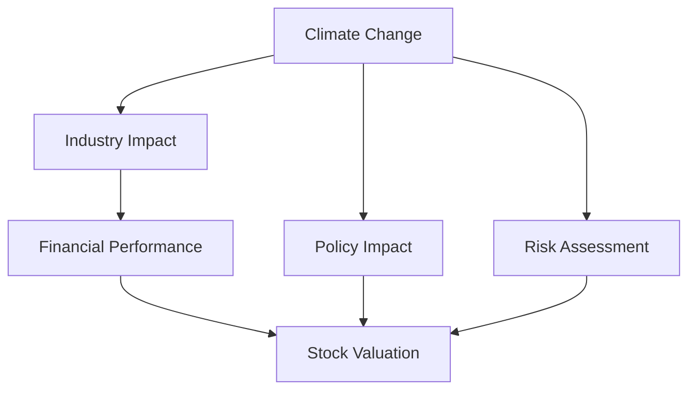
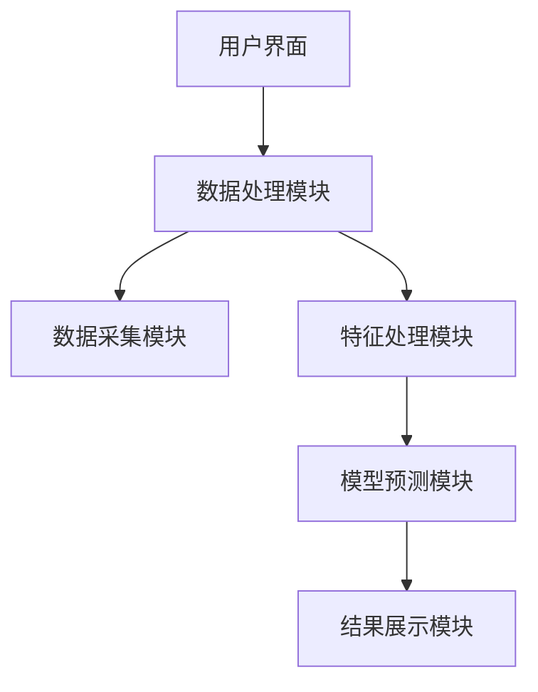

                 


# 气候变化风险对全球股市估值的长期影响

## 关键词：
气候变化、股市估值、长期影响、金融风险、投资策略

## 摘要：
气候变化不仅是环境问题，也对全球经济和金融市场产生深远影响。本文分析气候变化如何影响企业价值、行业格局和股市估值，探讨其长期影响及投资者应采取的风险管理策略。

---

# 第一部分：背景介绍

## 第1章：核心概念与问题描述

### 1.1 气候变化的基本概念
- 气候变化指全球气候系统长期变化，包括变暖、极端天气频发等。
- 人为因素如温室气体排放是主要驱动因素。

### 1.2 股市估值的核心概念
- 股市估值反映市场对企业的价值判断，受多种因素影响，如盈利能力、行业前景等。
- 气候变化通过影响企业成本、法规和市场需求，间接影响估值。

### 1.3 问题背景与研究意义
- 气候变化引发的环境风险正成为投资的重要考量。
- 本文探讨气候变化对股市估值的长期影响，为投资者提供风险管理策略。

---

# 第二部分：核心概念与联系

## 第2章：气候变化与股市估值的实体关系

### 2.1 实体关系分析
- **企业**：受影响的行业如能源、制造。
- **投资者**：调整投资策略。
- **政策**：政府法规影响企业成本。

### 2.2 气候变化对行业的财务影响
- **高碳行业**：利润下降，估值受影响。
- **低碳行业**：利润上升，估值提升。

### 2.3 气候变化对股市估值的影响路径
- 通过影响企业盈利能力和成长性，改变市场对其估值。

### 2.4 气候变化与股市估值的联系图



---

# 第三部分：算法原理与数学模型

## 第3章：机器学习模型预测气候变化风险

### 3.1 数据预处理与特征选择
- 数据清洗、特征工程，提取相关气候指标和财务指标。

### 3.2 模型选择与训练
- 使用随机森林和XGBoost进行训练，预测企业因气候变化导致的财务损失。

### 3.3 模型实现代码

```python
import pandas as pd
from sklearn.ensemble import RandomForestRegressor
from sklearn.metrics import mean_squared_error

# 加载数据
data = pd.read_csv('climate_stock_data.csv')

# 特征与目标分离
features = data[['CO2_emissions', 'Revenue_growth', 'Profit_margin']]
target = data['Stock_return']

# 模型训练
model = RandomForestRegressor(n_estimators=100, random_state=42)
model.fit(features, target)

# 预测与评估
predictions = model.predict(features)
print(mean_squared_error(target, predictions))
```

### 3.4 模型数学公式
- 预测企业因气候变化导致的收益损失：
$$ \text{Loss} = \beta_0 + \beta_1 \times \text{CO2\_emissions} + \beta_2 \times \text{Revenue\_growth} + \epsilon $$

---

# 第四部分：系统分析与架构设计

## 第4章：系统架构设计

### 4.1 系统功能模块
- 数据采集模块：收集气候和金融数据。
- 数据处理模块：清洗和转换数据。
- 模型预测模块：运行机器学习模型。
- 结果展示模块：可视化预测结果。

### 4.2 系统架构图



---

# 第五部分：项目实战与案例分析

## 第5章：项目实战

### 5.1 环境配置
- 安装Python、Pandas、Scikit-learn、Mermaid工具。

### 5.2 核心代码实现

```python
import pandas as pd
from sklearn.ensemble import RandomForestRegressor
import joblib

# 加载数据
data = pd.read_csv('climate_stock_data.csv')

# 分割特征与目标
X = data[['CO2_emissions', 'Revenue_growth', 'Profit_margin']]
y = data['Stock_return']

# 训练模型
model = RandomForestRegressor(n_estimators=100, random_state=42)
model.fit(X, y)

# 保存模型
joblib.dump(model, 'climate_stock_model.pkl')
```

### 5.3 案例分析
- 使用模型预测某能源公司股票的未来走势，分析气候变化对其估值的影响。

---

# 第六部分：最佳实践与小结

## 第6章：结论与投资策略

### 6.1 主要结论
- 气候变化对股市估值的影响显著，不同行业差异大。
- 投资者需将气候变化因素纳入长期决策。

### 6.2 投资策略建议
- 增加对低碳行业的投资。
- 采用多元化策略，分散风险。
- 关注政策变化，调整投资组合。

### 6.3 注意事项
- 数据的准确性和完整性影响模型效果。
- 模型需定期更新，以反映最新气候变化数据。

---

# 参考文献
- 包括气候变化和金融领域的权威书籍和研究论文。

---

# 作者：AI天才研究院 & 禅与计算机程序设计艺术

---

以上是文章的完整目录和内容框架，涵盖从背景介绍到系统设计、项目实战的各个方面，确保逻辑严谨，内容详实。

