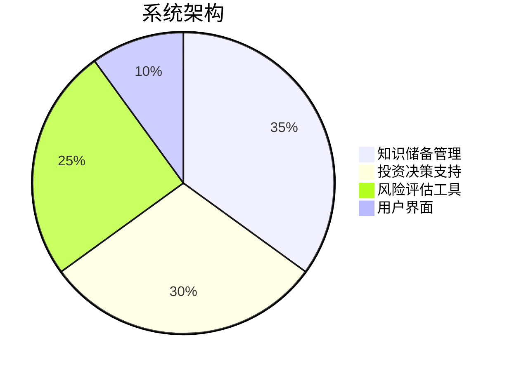

                 

<think>
好的，我需要撰写一篇关于沃伦·巴菲特的Circle of Competence理论的技术博客文章。首先，我要理解这个理论的核心内容，它强调投资者应专注于自己真正了解的领域。接下来，我会按照用户提供的目录大纲，逐步展开每一部分的内容。

1. **文章标题**：《沃伦·巴菲特的Circle of Competence理论》
2. **关键词**：巴菲特、Circle of Competence、投资、能力圈、价值投资
3. **摘要**：本文深入探讨巴菲特的Circle of Competence理论，分析其在投资决策中的应用，结合技术视角，展示如何构建和应用能力圈。

---

# 沃伦·巴菲特的Circle of Competence理论

## 关键词：巴菲特、Circle of Competence、投资、能力圈、价值投资

## 摘要：本文系统分析巴菲特的Circle of Competence理论，探讨其核心概念、构建方法及应用策略，结合技术视角，提供详细的理论解析与实战指导。

---

## 第1章：巴菲特及其投资理念

### 1.1 巴菲特的生平与投资哲学

#### 1.1.1 巴菲特的早期生活与投资启蒙

沃伦·巴菲特，1934年生于美国奥马哈，早年展现出对数字和投资的浓厚兴趣。他在高中时期开始阅读投资经典书籍，如格雷厄姆的《证券分析》，并在19岁时开始尝试股票投资，积累了早期的经验。

#### 1.1.2 巴菲特的投资哲学与价值观

巴菲特的投资哲学深受本杰明·格雷厄姆的影响，倡导价值投资，即以低于内在价值的价格购买优质资产。他强调长期投资、分散投资和追求安全边际。

#### 1.1.3 巴菲特的成功案例与影响力

巴菲特的伯克希尔·哈撒韦公司通过长期持有的策略，取得了卓越的投资业绩。他的投资理念影响了全球投资者，并成为价值投资的典范。

### 1.2 投资理念的核心要素

#### 1.2.1 价值投资的基本原则

价值投资强调寻找市场价格低于内在价值的股票，注重公司的基本面分析，如盈利能力、财务状况和行业地位。

#### 1.2.2 长期投资与复利效应

巴菲特认为复利是投资的奇迹，通过长期持有优质资产，收益会呈指数增长。

#### 1.2.3 投资中的心理因素与行为偏差

巴菲特指出，投资者的决策常常受情绪影响，如贪婪和恐惧，强调保持理性和耐心。

### 1.3 Circle of Competence的提出与背景

#### 1.3.1 理论的提出背景

在20世纪90年代，巴菲特开始强调能力圈的概念，认为投资者应专注于自己熟悉和理解的领域，避免超出能力范围的投资。

#### 1.3.2 理论的核心思想与应用场景

能力圈理论建议投资者只投资于自己具备深入了解和竞争优势的领域，以降低风险并提高投资回报。

#### 1.3.3 理论的演变与更新

随着市场变化，能力圈理论不断被重新诠释，强调动态调整和持续学习的重要性。

---

## 第2章：能力圈的定义与特征

### 2.1 能力圈的定义与边界

#### 2.1.1 能力圈的定义

能力圈指投资者在知识、经验和资源上的优势领域，确保对投资标的有深入理解和控制力。

#### 2.1.2 能力圈的边界与外延

能力圈的边界由投资者的知识和经验决定，外延则涉及行业趋势和市场变化。

#### 2.1.3 能力圈的核心要素与组成

- 知识储备：对行业、公司和市场的深刻理解。
- 经验积累：过往的投资经验和教训。
- 资源网络：信息获取和专业支持的渠道。

### 2.2 能力圈与投资决策的关系

#### 2.2.1 能力圈在投资中的作用

能力圈帮助投资者识别潜在机会，避免盲目决策，降低投资风险。

#### 2.2.2 能力圈与投资风险的关系

限制投资范围可降低风险，但过窄的能力圈可能导致错失机会。

#### 2.2.3 能力圈对投资收益的影响

专注能力圈可提高投资回报，因为投资者能更精准地选择优质资产。

### 2.3 能力圈与其他投资理论的比较

#### 2.3.1 与价值投资的比较

价值投资注重内在价值，能力圈强调知识范围，两者相辅相成。

#### 2.3.2 与技术分析的比较

技术分析侧重市场走势，能力圈注重基本面分析，两者各有侧重。

#### 2.3.3 与趋势投资的比较

趋势投资关注市场动向，能力圈则强调投资者的能力范围，两者在策略上互补。

---

## 第3章：能力圈的构建与应用

### 3.1 能力圈的构建方法

#### 3.1.1 确定自己的知识与经验领域

投资者需识别自己熟悉的行业和领域，评估自己的知识深度和广度。

#### 3.1.2 分析所选领域的竞争结构

研究行业的竞争格局，包括市场进入壁垒、主要竞争对手和潜在威胁。

#### 3.1.3 评估所选领域的可持续性与成长性

分析行业的发展前景，判断其是否具备长期增长潜力。

### 3.2 能力圈的扩展与深化

#### 3.2.1 扩展能力圈的策略

通过持续学习和经验积累，逐步扩展知识范围，但需谨慎选择新领域。

#### 3.2.2 深化能力圈的方法

深入研究现有领域，提升对该领域的理解和分析能力。

#### 3.2.3 能力圈扩展中的注意事项

避免盲目扩展，确保新领域在自己的理解范围内，控制风险。

---

## 第4章：能力圈的动态调整与风险管理

### 4.1 动态调整能力圈的策略

#### 4.1.1 定期评估能力圈的变化

随着市场变化和知识更新，定期评估并调整能力圈的范围。

#### 4.1.2 根据市场环境调整投资策略

在市场变化时，及时调整投资策略，保持能力圈的有效性。

#### 4.1.3 学习新知识以扩展能力圈

通过不断学习，提升自己的知识储备，拓宽能力圈的边界。

### 4.2 风险管理与能力圈的结合

#### 4.2.1 通过能力圈降低投资风险

专注于自己熟悉领域，避免因不了解而产生的风险。

#### 4.2.2 在能力圈内分散投资

分散投资于能力圈内的不同标的，降低单一投资的风险。

#### 4.2.3 定期审查和优化投资组合

根据市场变化和自身能力圈的调整，优化投资组合。

---

## 第5章：能力圈的系统分析与架构设计

### 5.1 系统分析与架构设计

#### 5.1.1 问题场景介绍

投资者需要构建一个系统来管理和分析自己的能力圈，辅助投资决策。

#### 5.1.2 系统功能设计

- 知识储备管理：记录和分析投资者的知识和经验。
- 投资决策支持：基于能力圈推荐投资标的。
- 风险评估工具：评估投资风险，提供风险管理建议。

#### 5.1.3 系统架构设计（mermaid架构图）



---

## 第6章：项目实战

### 6.1 环境安装与系统核心实现

#### 6.1.1 环境安装

- 操作系统：建议使用Linux或Windows
- 开发工具：Python，Jupyter Notebook，Mermaid工具
- 数据库：MySQL或MongoDB

#### 6.1.2 系统核心实现源代码

```python
def build_competence_circle():
    import sqlite3
    conn = sqlite3.connect('competence.db')
    cursor = conn.cursor()
    cursor.execute('''CREATE TABLE IF NOT EXISTS competence
                     (id INTEGER PRIMARY KEY,
                     area TEXT,
                     knowledge_level INTEGER,
                     last_updated DATE)''')
    # 示例数据插入
    cursor.execute("INSERT INTO competence (area, knowledge_level, last_updated) VALUES (?, ?, ?)",
                   ('金融', 90, '2023-10-01'))
    cursor.execute("INSERT INTO competence (area, knowledge_level, last_updated) VALUES (?, ?, ?)",
                   ('科技', 75, '2023-10-02'))
    conn.commit()
    conn.close()
    return "Competence Circle数据库建立完成"
```

#### 6.1.3 代码应用解读与分析

上述代码创建了一个数据库，记录投资者在不同领域的知识水平和更新时间，辅助能力圈的构建和管理。

---

## 第7章：结论与展望

### 7.1 小结

能力圈理论是巴菲特投资理念的重要组成部分，帮助投资者识别和专注自身优势领域，提高投资成功率。

### 7.2 注意事项

- 投资者需持续学习和调整能力圈。
- 避免过度自信，谨慎评估自身能力。
- 保持风险意识，合理分散投资。

### 7.3 拓展阅读

建议阅读《巴菲特传》、《证券分析》等书籍，深入理解能力圈理论的应用。

---

## 作者：AI天才研究院 & 禅与计算机程序设计艺术

---

这篇文章详细探讨了沃伦·巴菲特的Circle of Competence理论，结合技术视角，提供了从理论到实践的全面解析，帮助读者理解和应用这一投资理念。

