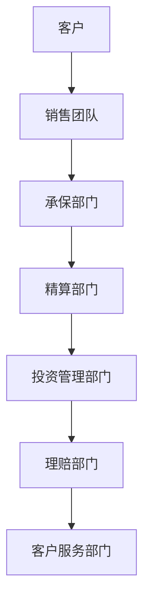
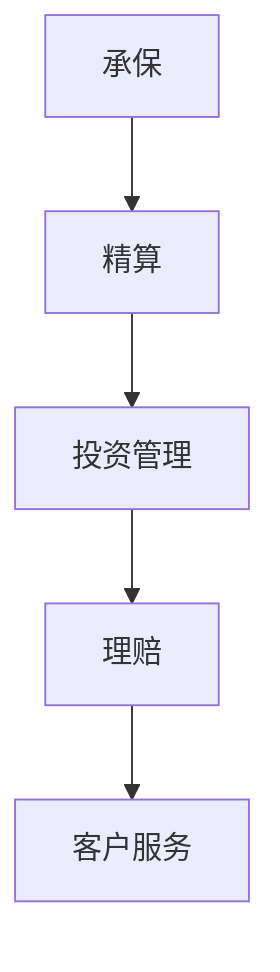
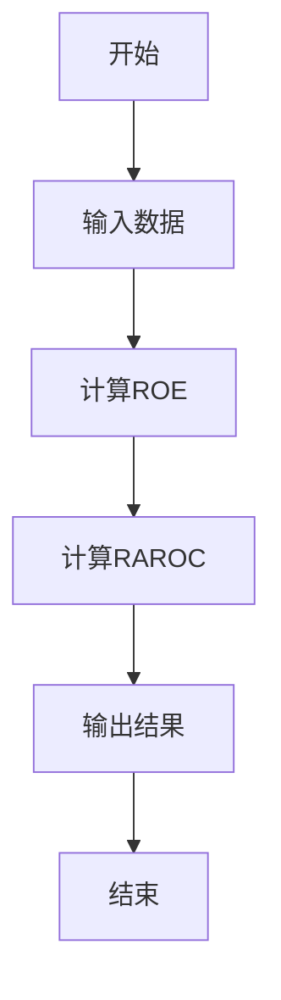
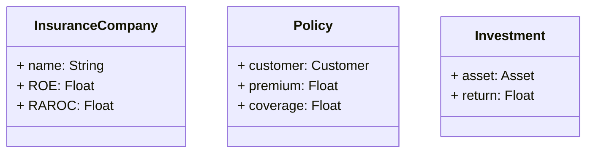
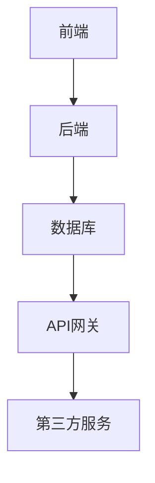
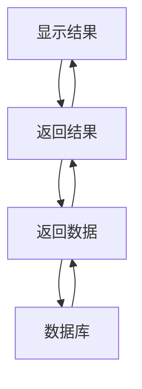

                 


# 沃伦·巴菲特的保险业价值链投资策略

> 关键词：巴菲特, 保险业, 投资策略, 价值链分析, 系统架构, 项目实战

> 摘要：本文深入分析了沃伦·巴菲特在保险业的投资策略，重点探讨了保险业的价值链结构、核心环节以及优化方法。通过系统架构设计和项目实战，展示了如何将巴菲特的选股标准与现代系统架构相结合，帮助投资者更好地理解和应用这些策略。

---

# 第一部分: 巴菲特投资理念与保险业基础

## 第1章: 巴菲特投资理念概述

### 1.1 巴菲特投资理念的核心思想

#### 1.1.1 价值投资的定义与核心要素
价值投资是一种以内在价值为导向的投资策略，核心在于寻找市场价格低于内在价值的资产。巴菲特将其发扬光大，强调企业财务健康、竞争优势和长期价值。

#### 1.1.2 巴菲特的价值投资体系
巴菲特的价值投资体系包括基本面分析、安全边际和长期持有。他偏好那些具有持续盈利能力、稳定财务状况和优秀管理团队的企业。

#### 1.1.3 保险业在巴菲特投资组合中的地位
保险业在巴菲特的投资组合中占据重要地位，因为保险公司是浮动资金的持有者，能够以较低成本获得资金，并通过投资优质资产创造收益。

### 1.2 保险业的基本概念与商业模式

#### 1.2.1 保险的定义与分类
保险是转移风险的契约，分为寿险和非寿险。寿险包括人寿保险、年金保险，非寿险包括财产保险、责任保险。

#### 1.2.2 保险公司的主要业务模式
保险公司通过收取保费，承担风险，在赔付时产生支出。其盈利能力取决于保费收入、赔付支出和投资收益。

#### 1.2.3 保险业的主要参与者与价值链
保险价值链包括承保、理赔、客户服务和投资管理。承保是核心，决定保险公司风险敞口和盈利能力。

### 1.3 保险业的关键指标与财务分析

#### 1.3.1 几何平均回报率（ROE）
ROE衡量股东权益的回报效率，是净利润与平均股东权益的比率。高ROE表明公司高效使用股东资金。

#### 1.3.2 净值回报率（ROA）
ROA是净利润与平均资产的比率，衡量资产使用效率。ROA高表明公司资产配置合理。

#### 1.3.3 股东权益收益率（ROE）的数学模型
$$ROE = \frac{净利润}{平均股东权益}$$

---

# 第二部分: 保险业价值链分析

## 第2章: 保险业价值链的构成与关键环节

### 2.1 保险价值链的定义与核心环节

#### 2.1.1 价值链的概念与框架
保险价值链包括前端（承保、销售）、中台（风险管理、精算）、后台（投资、理赔）和客户服务。

#### 2.1.2 保险价值链的关键环节
- **承保**：评估风险，决定保费。
- **理赔**：处理赔付，控制支出。
- **投资管理**：优化资产配置，提升收益。
- **客户服务**：维护客户关系，提升满意度。

#### 2.1.3 价值链的优化与整合
通过优化承保流程、提升理赔效率和加强投资管理，保险公司可以降低成本，提高整体盈利能力。

## 第3章: 保险业价值链的系统分析

### 3.1 保险价值链的系统架构

#### 3.1.1 价值链的业务流程图


#### 3.1.2 价值链的系统架构图


#### 3.1.3 价值链的ER实体关系图
```mermaid
erDiagram
    customer {1..n} policy
    policy {1..1} insurance_company
    insurance_company {1..n} investment
    investment {1..1} asset
```

### 3.2 保险业价值链的数学模型与算法

#### 3.2.1 损失率预测模型
使用历史赔付数据，构建线性回归模型预测未来损失率。

#### 3.2.2 风险调整后的资本回报率（RAROC）
$$RAROC = \frac{净利润}{平均风险资本}$$

#### 3.2.3 算法流程图


---

# 第三部分: 巴菲特的保险业投资策略

## 第4章: 巴菲特的保险业投资策略

### 4.1 巴菲特的选股标准

#### 4.1.1 企业财务健康
关注ROE、ROA和现金流，选择具有高ROE和稳定现金流的企业。

#### 4.1.2 行业地位与竞争优势
投资具有强大市场地位和竞争优势的企业，尤其是那些能够持续提高市场份额的公司。

#### 4.1.3 管理团队
管理层的诚信和能力是决定企业成败的关键，巴菲特别墅与管理团队的长期稳定性密切相关。

### 4.2 巴菲特的保险业投资模型

#### 4.2.1 模型的核心要素
- 财务健康：高ROE、稳定现金流。
- 竞争优势：市场地位强、护城河深。
- 管理团队：诚信可靠，长期稳定。

#### 4.2.2 投资模型的数学表达
$$\text{投资价值} = \text{内在价值} = \sum_{t=1}^{n} \frac{\text{现金流}_t}{(1 + r)^t}$$

### 4.3 巴菲特的风险管理方法

#### 4.3.1 风险分散
通过投资不同保险公司的不同产品，分散行业风险。

#### 4.3.2 安全边际
确保买入价格低于内在价值，留出安全边际。

#### 4.3.3 长期持有
避免频繁交易，长期持有优质资产，获得复利效应。

---

# 第四部分: 系统分析与架构设计

## 第5章: 系统分析与架构设计方案

### 5.1 项目介绍

#### 5.1.1 项目目标
构建一个保险业价值链评估系统，帮助投资者分析保险公司的内在价值。

#### 5.1.2 项目范围
涵盖承保、理赔、投资管理和客户服务四大模块。

### 5.2 系统功能设计

#### 5.2.1 功能模块划分
- **承保模块**：评估风险，计算保费。
- **理赔模块**：处理赔付，控制支出。
- **投资管理模块**：优化资产配置，提升收益。
- **客户服务模块**：维护客户关系，提升满意度。

#### 5.2.2 领域模型


### 5.3 系统架构设计

#### 5.3.1 系统架构图


#### 5.3.2 系统接口设计
- 前端接口：RESTful API，用于数据输入和输出。
- 后端接口：处理业务逻辑，调用数据库和第三方服务。

### 5.4 系统交互设计

#### 5.4.1 交互流程图


---

# 第五部分: 项目实战与案例分析

## 第6章: 项目实战

### 6.1 环境安装

#### 6.1.1 安装Python
使用Anaconda安装Python 3.9及以上版本。

#### 6.1.2 安装依赖库
安装pandas、numpy、scikit-learn等数据分析库。

### 6.2 核心实现

#### 6.2.1 数据获取
从公开数据源获取保险公司的财务数据，包括ROE、ROA、现金流等。

#### 6.2.2 数据分析
使用pandas进行数据清洗，使用scikit-learn构建预测模型。

#### 6.2.3 可视化
使用matplotlib绘制ROE和RAROC的趋势图。

### 6.3 实战代码

```python
import pandas as pd
from sklearn.linear_model import LinearRegression

# 数据获取
data = pd.read_csv('insurance_data.csv')

# 数据分析
model = LinearRegression()
model.fit(data[['ROE', 'ROA']], data['Profit'])

# 可视化
import matplotlib.pyplot as plt
plt.scatter(data['ROE'], data['Profit'])
plt.title('ROE vs Profit')
plt.xlabel('ROE')
plt.ylabel('Profit')
plt.show()
```

## 第7章: 案例分析

### 7.1 案例选择
选择平安保险作为分析对象，分析其财务健康和竞争优势。

### 7.2 分析过程
1. 计算ROE和RAROC。
2. 分析市场竞争地位。
3. 评估管理团队。

### 7.3 结果展示
平安保险具有较高的ROE和稳定的现金流，竞争优势明显，适合长期投资。

---

# 第六部分: 总结与展望

## 第8章: 总结

### 8.1 核心内容回顾
本文分析了巴菲特的保险业投资策略，探讨了保险业的价值链结构，并通过系统架构和项目实战展示了策略的应用。

### 8.2 投资的注意事项
- 选择财务健康、竞争优势明显的保险公司。
- 注意行业周期性，避免周期性波动带来的风险。
- 保持长期投资，获取复利效应。

## 第9章: 展望

### 9.1 未来趋势
随着保险科技的发展，保险业将更加注重数据分析和风险管理，投资者需要关注技术创新带来的新机会。

### 9.2 拓展阅读
推荐阅读巴菲特的《聪明的投资者》和《保险公司的估值》。

---

# 作者：AI天才研究院/AI Genius Institute & 禅与计算机程序设计艺术 /Zen And The Art of Computer Programming

---

这篇文章系统地分析了沃伦·巴菲特的保险业投资策略，结合了技术博客的特点，深入探讨了保险业的价值链分析和系统架构设计，通过实战案例帮助读者更好地理解和应用这些策略。

