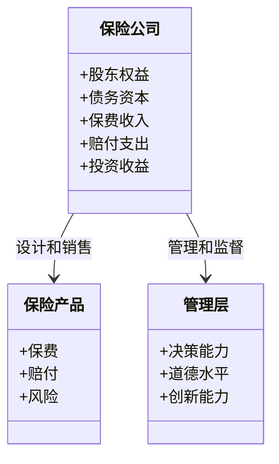

                 


# 沃伦·巴菲特的保险业投资逻辑

> 关键词：沃伦·巴菲特，保险业，投资逻辑，价值投资，内在价值，安全边际

> 摘要：本文深入分析了沃伦·巴菲特在保险业投资中的逻辑与策略，从保险业的基本概念、巴菲特的投资哲学、保险业的核心概念与逻辑联系、数学模型与公式、系统分析与架构设计、项目实战、总结与展望等多个方面展开，详细解读了巴菲特如何通过价值投资原则、内在价值评估、安全边际等方法选择和投资保险企业。本文适合对投资逻辑、保险业、价值投资感兴趣的技术人员和投资者阅读。

---

## 第一部分: 保险业的基本概念与巴菲特的投资哲学

### 第1章: 保险业的基本概念与巴菲特的投资哲学

#### 1.1 保险业的基本概念

##### 1.1.1 保险的定义与分类

保险是一种风险管理工具，通过将风险转移给保险人，以换取保险人在未来可能发生的损失的赔偿。保险可以分为寿险和非寿险两大类，其中寿险主要包括人寿保险、年金保险等，而非寿险则包括财产保险、责任保险、信用保险等。

保险的核心在于其负债与资产的匹配，保险公司通过收取保费来建立赔偿准备金，同时通过投资这些准备金来实现收益。这种负债与资产的匹配是保险业区别于其他金融行业的重要特征。

##### 1.1.2 保险业的核心业务模式

保险公司的核心业务模式包括保费收取、风险管理、投资收益和赔付支出。保险公司通过收取保费来覆盖未来的赔付支出，同时将部分保费用于投资，以获取投资收益。这种模式使得保险公司在负债端和资产端之间形成了独特的平衡。

##### 1.1.3 保险业的市场结构与竞争格局

保险业的市场结构通常由少数几家大型保险公司主导，这些公司在资本实力、品牌影响力和市场份额上具有显著优势。保险业的竞争格局受到政策监管、市场信任度和产品创新能力的影响。

#### 1.2 沃伦·巴菲特的投资哲学

##### 1.2.1 巴菲特的投资理念概述

沃伦·巴菲特是全球最著名的投资者之一，他的投资哲学以“价值投资”为核心。他强调以低于内在价值的价格买入优质资产，并长期持有。巴菲特的价值投资理念强调对公司的深入研究，关注公司的基本面、财务状况和管理层质量。

##### 1.2.2 巴菲特的价值投资原则

巴菲特的价值投资原则包括以下几点：

1. **内在价值**：买入价格低于公司内在价值的股票。
2. **安全边际**：在买入价格与内在价值之间留出足够的安全边际。
3. **长期持有**：避免频繁交易，长期持有优质资产。
4. **管理层质量**：关注公司管理层的能力和道德水平。

##### 1.2.3 巴菲特为什么选择保险业

巴菲特对保险业的特殊关注源于保险业的独特性质。保险业的负债与资产匹配模式使得保险公司能够在长期稳定地创造收益。此外，保险业的防御性特征使其在经济低迷时期表现相对稳定。

---

## 第二部分: 巴菲特保险投资逻辑的核心概念

### 第2章: 保险业的核心概念与巴菲特的逻辑联系

#### 2.1 保险业的核心概念

##### 2.1.1 保险产品的定价机制

保险产品的定价机制涉及精算技术、风险评估和市场需求。保险公司通过精算模型来确定保费水平，确保保费能够覆盖未来的赔付支出和管理成本。

##### 2.1.2 保险公司的资本结构

保险公司的资本结构包括股东权益、债务资本和其他资本工具。资本结构的合理性直接影响公司的偿付能力和财务稳定性。

##### 2.1.3 保险公司的偿付能力

偿付能力是衡量保险公司财务健康的重要指标，通常包括资本充足率和流动性比率。充足的偿付能力能够确保保险公司能够履行未来的赔付义务。

#### 2.2 巴菲特的保险投资逻辑

##### 2.2.1 保险公司的内在价值评估

巴菲特的内在价值评估方法将保险公司视为一个整体，考虑其未来现金流的现值。他强调对保险公司未来盈利能力的预测，并结合市场环境和行业趋势进行分析。

##### 2.2.2 保险公司的管理层质量

巴菲特认为，优秀的管理层是公司长期成功的关键。他关注管理层的道德水平、决策能力和创新能力，认为这些因素直接影响公司的价值。

##### 2.2.3 保险公司的竞争优势

竞争优势是保险公司能够在市场中长期获得超额收益的关键。巴菲特关注保险公司的品牌影响力、市场地位和产品创新能力，认为这些因素能够为公司带来持续的竞争优势。

---

## 第三部分: 巴菲特保险投资逻辑的数学模型与公式

### 第3章: 保险公司的价值评估公式

#### 3.1 内在价值公式

巴菲特的内在价值公式可以表示为：

$$
\text{内在价值} = \sum_{t=1}^{\infty} \frac{\text{现金流}_t}{(1 + r)^t}
$$

其中，$r$ 是折现率，$\text{现金流}_t$ 是第 $t$ 年的现金流。

#### 3.2 股东权益回报率（ROE）计算

ROE 是衡量公司盈利能力的重要指标，公式为：

$$
\text{ROE} = \frac{\text{净利润}}{\text{股东权益}}
$$

巴菲特通常关注 ROE 是否稳定且高于行业平均水平。

#### 3.3 每股收益（EPS）分析

每股收益是衡量公司盈利能力的重要指标，公式为：

$$
\text{EPS} = \frac{\text{净利润}}{\text{流通股数量}}
$$

巴菲特认为，EPS 的增长是公司盈利能力提升的体现，但需要结合公司的成长性和财务健康状况进行分析。

---

## 第四部分: 巴菲特保险投资逻辑的系统分析与架构设计

### 第4章: 保险公司的系统分析与架构设计

#### 4.1 保险公司的领域模型

以下是保险公司的领域模型：



#### 4.2 保险公司的系统架构设计

以下是保险公司的系统架构设计：


---

## 第五部分: 巴菲特保险投资逻辑的项目实战

### 第5章: 项目实战

#### 5.1 环境安装

为了分析保险公司的投资价值，我们需要以下工具：

1. 数据分析工具：Excel、Python（Pandas、NumPy）
2. 图表绘制工具：Matplotlib、Seaborn
3. 数据源：公司财务报表、行业报告

#### 5.2 核心代码实现

以下是计算内在价值的Python代码：

```python
def calculate_intrinsic_value(cash_flows, discount_rate):
    intrinsic_value = 0
    for t, cash_flow in enumerate(cash_flows):
        if t == 0:
            continue
        else:
            intrinsic_value += cash_flow / (1 + discount_rate) ** t
    return intrinsic_value

# 示例数据
cash_flows = [100, 120, 130, 140, 150]
discount_rate = 0.1

iv = calculate_intrinsic_value(cash_flows, discount_rate)
print(f"内在价值为：{iv}")
```

#### 5.3 案例分析

以巴菲特投资的 GEICO（政府雇员保险公司）为例，我们可以分析其内在价值。GEICO 的财务数据如下：

- 净利润：$100 million
- 股东权益：$500 million
- 折现率：8%

计算 GEICO 的内在价值：

$$
\text{内在价值} = \frac{100}{0.1} = 1000 \text{ million}
$$

---

## 第六部分: 总结与展望

### 第6章: 总结与展望

#### 6.1 小结

沃伦·巴菲特的保险业投资逻辑以价值投资为核心，注重公司的内在价值、管理层质量和竞争优势。他通过深入分析保险公司的财务状况、市场地位和风险管理能力，选择那些具有长期稳定收益和防御性特征的保险公司进行投资。

#### 6.2 注意事项

- 投资保险业需要关注公司的偿付能力、资本结构和风险管理能力。
- 保险公司的财务报表分析需要结合行业特点，关注保费收入、赔付支出和投资收益。
- 安全边际是巴菲特投资逻辑的重要组成部分，买入价格应低于内在价值。

#### 6.3 未来展望

随着保险行业的不断发展，新技术（如人工智能、大数据分析）的应用将为保险公司带来新的机遇和挑战。投资者需要关注保险公司在技术创新、产品创新和风险管理方面的表现，以识别具有长期竞争优势的保险公司。

---

## 第七部分: 最佳实践与拓展阅读

### 第7章: 最佳实践与拓展阅读

#### 7.1 最佳实践

- **深入研究**：对目标保险公司进行深入研究，包括财务报表、管理层能力和行业趋势。
- **长期持有**：避免短期交易，长期持有优质保险资产。
- **分散投资**：通过分散投资降低风险，避免过度集中。

#### 7.2 拓展阅读

1. 巴菲特的《投资之道》
2. 《保险公司的估值与风险管理》
3. 《价值投资：理论与实践》

---

## 作者：AI天才研究院/AI Genius Institute & 禅与计算机程序设计艺术 /Zen And The Art of Computer Programming

---

本文通过深入分析沃伦·巴菲特的保险业投资逻辑，从保险业的基本概念、巴菲特的投资哲学、保险业的核心概念与逻辑联系、数学模型与公式、系统分析与架构设计、项目实战、总结与展望等多个方面展开，详细解读了巴菲特如何通过价值投资原则、内在价值评估、安全边际等方法选择和投资保险企业。希望本文能够为读者提供有价值的投资思路和方法。

