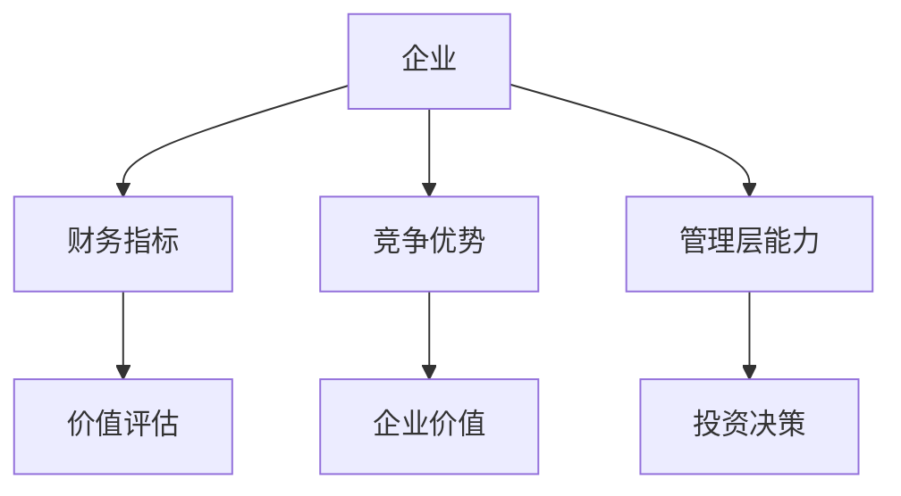
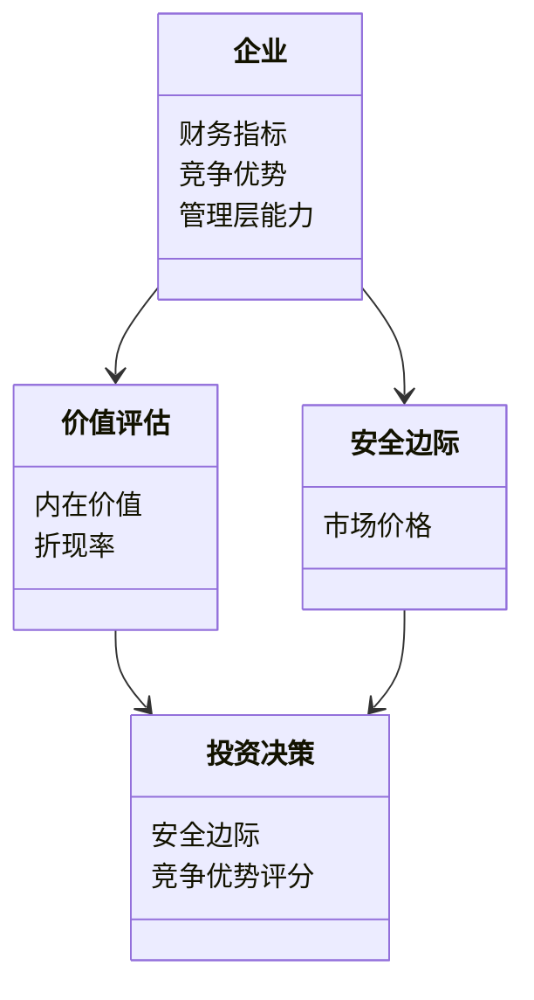
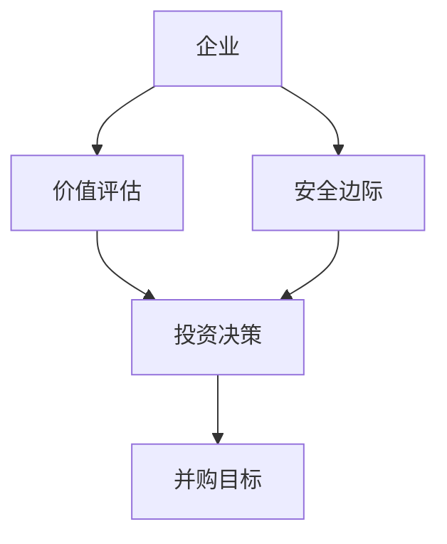
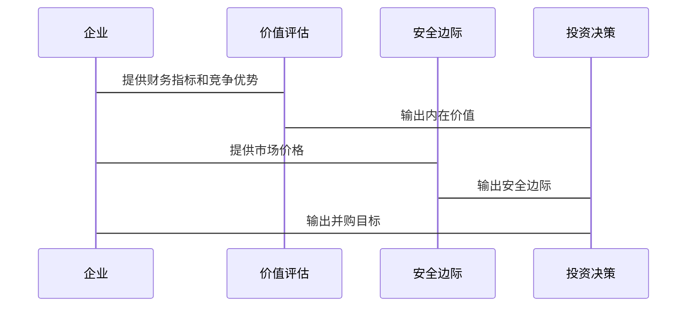

                 


# 沃伦·巴菲特的并购策略分析

> 关键词：沃伦·巴菲特，并购策略，价值投资，安全边际，竞争优势，投资哲学

> 摘要：沃伦·巴菲特是全球最著名的企业家和投资者之一，他的并购策略以价值投资为核心，强调安全边际和竞争优势。本文从背景介绍、核心概念、算法原理、系统分析、项目实战等多方面详细分析巴菲特的并购策略，帮助读者深入理解其投资哲学和成功秘诀。

---

## 第一部分: 沃伦·巴菲特并购策略的背景与核心概念

### 第1章: 沃伦·巴菲特并购策略的背景介绍

#### 1.1 并购策略的定义与重要性

- **1.1.1 并购的定义**
  - 并购（Mergers and Acquisitions, M&A）是企业之间合并或收购的过程，旨在通过整合资源、扩展市场或增强竞争力来实现战略目标。
  - 并购不仅仅是交易，更是一种企业战略，涉及财务、法律、管理和运营等多个方面。

- **1.1.2 并购在企业战略中的重要性**
  - 并购是企业快速扩张、进入新市场或获取新技术的有效手段。
  - 通过并购，企业可以避免从零开始的竞争，迅速获得市场份额和竞争优势。
  - 并购还能优化资产配置，提升整体运营效率。

- **1.1.3 沃伦·巴菲特与并购策略的独特结合**
  - 沃伦·巴菲特不仅是投资者，还是并购策略的实践者和导师。
  - 他将价值投资的理念与并购策略相结合，形成了独特的投资哲学，强调安全边际和长期价值。
  - 他的并购策略不仅关注短期收益，更注重企业的长期竞争优势和内在价值。

#### 1.2 沃伦·巴菲特的投资哲学

- **1.2.1 价值投资的核心理念**
  - 价值投资是一种投资策略，强调以低于内在价值的价格购买优质资产。
  - 巴菲特的价值投资理念基于基本面分析，注重企业的财务健康、行业地位和管理层能力。
  - 他强调“价格是买入的机会，价值是买入的依据”，即买入价格应低于企业的内在价值。

- **1.2.2 安全边际的概念与应用**
  - 安全边际是指买入价格与内在价值之间的差距，确保即使出现估值误差，投资仍能盈利。
  - 安全边际越大，投资风险越小，回报越稳定。
  - 巴菲特在并购中始终强调安全边际，确保投资的稳健性。

- **1.2.3 长期投资与企业价值的关联**
  - 长期投资是巴菲特并购策略的重要组成部分，他倾向于持有优质资产的长期股权。
  - 长期投资使他能够分享企业的成长，同时避免短期市场的波动风险。
  - 他相信企业的内在价值会随着时间的推移而增长，因此长期持有优质资产是实现财富增长的关键。

#### 1.3 沃伦·巴菲特并购策略的核心要素

- **1.3.1 财务健康状况的重要性**
  - 财务健康是企业生存和发展的基础，巴菲特在并购中优先考虑企业的财务状况。
  - 他关注企业的盈利能力、资产负债表的健康状况以及现金流的稳定性。
  - 通过分析财务指标，他能够评估企业的财务风险和投资价值。

- **1.3.2 行业地位与竞争优势**
  - 巴菲特认为，企业的行业地位和竞争优势是决定其长期价值的关键因素。
  - 他倾向于投资具有强大市场地位和竞争优势的企业，这些企业能够在行业中长期保持领先地位。
  - 竞争优势可能来自技术、品牌、成本优势或客户忠诚度等方面。

- **1.3.3 管理层能力与企业治理**
  - 管理层的能力和企业治理结构对企业的长期成功至关重要。
  - 巴菲特在并购中注重评估管理层的诚信、能力和战略眼光。
  - 他倾向于投资那些由优秀管理层领导的企业，相信管理层能够为企业创造长期价值。

#### 1.4 本章小结

- 本章介绍了并购策略的定义和重要性，并重点阐述了沃伦·巴菲特的投资哲学和并购策略的核心要素。
- 巴菲特的并购策略以价值投资为核心，强调安全边际、长期投资、财务健康、行业地位和管理层能力。
- 这些核心要素共同构成了巴菲特并购策略的理论基础，为后续的分析提供了框架。

---

### 第2章: 沃伦·巴菲特并购策略的核心概念与联系

#### 2.1 核心概念原理

- **2.1.1 价值评估的数学模型**
  - 价值评估是巴菲特并购策略的核心，他通过分析企业的内在价值来确定合理的买入价格。
  - 内在价值的计算基于企业的未来现金流，使用 discounted cash flow (DCF) 模型进行评估。
  - DCF 模型的核心公式为：
    $$ V = \sum_{t=1}^{n} \frac{CF_t}{(1 + r)^t} + \frac{TV}{(1 + r)^n} $$
    其中，$V$ 是企业的内在价值，$CF_t$ 是第 $t$ 年的自由现金流，$r$ 是折现率，$TV$ 是终值。

- **2.1.2 安全边际的计算方法**
  - 安全边际是巴菲特并购策略中的关键概念，用于降低投资风险。
  - 安全边际的计算公式为：
    $$ \text{安全边际} = \text{内在价值} - \text{市场价格} $$
    通过确保市场价格低于内在价值，巴菲特能够降低投资的风险。

- **2.1.3 企业竞争优势的分析框架**
  - 企业竞争优势是决定其长期价值的关键因素，巴菲特在并购中注重分析企业的竞争优势。
  - 他将竞争优势分为两类：可扩展的竞争优势和不可扩展的竞争优势。
    - 可扩展的竞争优势：例如技术优势、品牌优势和成本优势，这些优势可以通过规模经济进一步扩大。
    - 不可扩展的竞争优势：例如地理位置、特定资源或监管许可，这些优势具有独特性，难以被竞争对手复制。

#### 2.2 核心概念属性对比表格

- 下表总结了巴菲特并购策略中的核心概念及其属性：

| 概念         | 属性                | 描述                                   |
|--------------|---------------------|--------------------------------------|
| 价值评估     | 定量分析            | 通过财务指标计算企业内在价值         |
| 安全边际     | 风险控制            | 确保投资价格低于内在价值             |
| 竞争优势     | 持续性与可扩展性     | 企业核心竞争力的长期性与扩展能力     |

#### 2.3 ER实体关系图

- 下图展示了巴菲特并购策略的核心概念之间的关系：



#### 2.4 本章小结

- 本章详细阐述了巴菲特并购策略中的核心概念及其相互关系。
- 价值评估、安全边际和竞争优势是巴菲特并购策略的核心要素，它们共同决定了企业的内在价值和投资风险。
- 通过分析这些核心概念，我们可以更好地理解巴菲特的投资哲学和并购策略。

---

### 第3章: 沃伦·巴菲特并购策略的算法原理

#### 3.1 价值评估的数学模型

- **3.1.1 股权资本成本计算**
  - 股权资本成本是价值评估中的关键参数，通常使用资本资产定价模型（CAPM）进行计算。
  - CAPM 公式为：
    $$ r = \frac{D}{V} \times W_d \times r_d + \frac{E}{V} \times W_e \times r_e $$
    其中，$D$ 是债务价值，$V$ 是企业价值，$W_d$ 和 $W_e$ 分别是债务和股权的权重，$r_d$ 和 $r_e$ 是债务和股权的资本成本。

- **3.1.2 内在价值计算**
  - 内在价值是基于未来现金流的现值计算得出的，公式为：
    $$ V = \sum_{t=1}^{n} \frac{CF_t}{(1 + r)^t} + \frac{TV}{(1 + r)^n} $$
    其中，$CF_t$ 是第 $t$ 年的自由现金流，$r$ 是折现率，$TV$ 是终值。

#### 3.2 安全边际的计算方法

- **3.2.1 安全边际公式**
  - 安全边际是内在价值与市场价格之间的差额：
    $$ \text{安全边际} = \text{内在价值} - \text{市场价格} $$
  - 巴菲特通常要求安全边际至少为 20% 以上，以确保投资的安全性。

#### 3.3 竞争优势的评估算法

- **3.3.1 竞争优势评分表**
  - 竞争优势评分表用于评估企业在行业中的竞争力，评分标准如下：
    - 0 分：无明显竞争优势。
    - 5 分：有一定竞争优势，但容易被竞争对手复制。
    - 10 分：具有可扩展竞争优势，能够在未来持续保持领先地位。

#### 3.4 本章小结

- 本章详细介绍了巴菲特并购策略中的算法原理，包括价值评估、安全边际和竞争优势的计算方法。
- 这些算法为巴菲特的并购决策提供了科学依据，确保投资的稳健性和可持续性。

---

## 第二部分: 沃伦·巴菲特并购策略的系统分析与实战应用

### 第4章: 沃伦·巴菲特并购策略的系统分析

#### 4.1 问题场景介绍

- **4.1.1 并购目标识别**
  - 并购目标识别是并购策略的第一步，需要明确企业的战略目标和投资方向。
  - 巴菲特通常选择具有可扩展竞争优势和强大财务健康状况的企业作为并购目标。

- **4.1.2 并购风险评估**
  - 并购风险包括财务风险、市场风险和管理风险等，需要进行全面评估。
  - 巴菲特通过分析企业的财务指标和竞争优势，评估并购的风险和回报。

#### 4.2 系统功能设计

- **4.2.1 领域模型类图**
  - 领域模型类图展示了巴菲特并购策略的核心要素及其关系：
  


- **4.2.2 系统架构设计**
  - 系统架构设计展示了巴菲特并购策略的应用架构：



- **4.2.3 系统接口设计**
  - 系统接口设计展示了并购策略中的关键接口：
    - 价值评估接口：接受企业的财务指标和竞争优势，输出内在价值。
    - 安全边际接口：接受企业的市场价格，输出安全边际。
    - 投资决策接口：整合价值评估和安全边际的结果，输出并购目标。

- **4.2.4 系统交互序列图**
  - 系统交互序列图展示了并购策略的应用流程：



#### 4.3 本章小结

- 本章从系统分析的角度，详细介绍了巴菲特并购策略的应用架构和交互流程。
- 通过领域模型类图和系统架构图，我们能够更好地理解并购策略的内在逻辑和实现过程。
- 系统接口设计和交互序列图为我们提供了具体的实施步骤和接口规范。

### 第5章: 沃伦·巴菲特并购策略的项目实战

#### 5.1 项目介绍

- **5.1.1 项目背景**
  - 本文将通过具体案例，分析巴菲特的并购策略在实际中的应用。
  - 案例包括可口可乐和IBM等企业的投资分析。

- **5.1.2 项目目标**
  - 通过案例分析，验证巴菲特并购策略的有效性和可行性。
  - 总结并购策略的关键要素和实际应用中的注意事项。

#### 5.2 核心实现

- **5.2.1 价值评估的实现**
  - 使用DCF模型计算企业的内在价值。
  - 以可口可乐为例，假设未来5年的现金流分别为10, 12, 14, 16, 18亿美元，终值为20亿美元，折现率为8%。
  - 内在价值计算公式为：
    $$ V = \sum_{t=1}^{5} \frac{CF_t}{(1 + 0.08)^t} + \frac{20}{(1 + 0.08)^5} $$

- **5.2.2 安全边际的实现**
  - 计算企业的内在价值后，与市场价格进行比较，确保市场价格低于内在价值。
  - 例如，假设可口可乐的内在价值为100亿美元，市场价格为80亿美元，则安全边际为20亿美元。

- **5.2.3 竞争优势的实现**
  - 评估企业的竞争优势，确定其竞争优势评分。
  - 例如，可口可乐的竞争优势评分为9分（满分10分），说明其具有较强的可扩展竞争优势。

#### 5.3 代码实现

- **5.3.1 价值评估的Python实现**
  ```python
  def calculate_intrinsic_value(cash_flows, discount_rate, terminal_value):
      intrinsic_value = 0
      for t in range(len(cash_flows)):
          intrinsic_value += cash_flows[t] / (1 + discount_rate) ** t
      intrinsic_value += terminal_value / (1 + discount_rate) ** len(cash_flows)
      return intrinsic_value

  # 示例数据
  cash_flows = [10, 12, 14, 16, 18]
  discount_rate = 0.08
  terminal_value = 20

  iv = calculate_intrinsic_value(cash_flows, discount_rate, terminal_value)
  print(f"内在价值: {iv:.2f}亿美元")
  ```

- **5.3.2 安全边际的Python实现**
  ```python
  def calculate_margin_of_safety(intrinsic_value, market_price):
      return intrinsic_value - market_price

  # 示例数据
  intrinsic_value = 100
  market_price = 80

  mos = calculate_margin_of_safety(intrinsic_value, market_price)
  print(f"安全边际: {mos:.2f}亿美元")
  ```

- **5.3.3 竞争优势评分的Python实现**
  ```python
  def assesscompetitive_advantage(enterprise):
      # 假设enterprise是一个包含竞争优势信息的字典
      # 评分标准：0-2分：无竞争优势；3-7分：有一定竞争优势；8-10分：可扩展竞争优势
      score = 0
      if enterprise['market_position'] >= 0.7:
          score += 5
      if enterprise['cost_advantage'] >= 0.6:
          score += 5
      return score

  # 示例数据
  enterprise = {
      'market_position': 0.8,
      'cost_advantage': 0.7
  }

  ca_score = assesscompetitive_advantage(enterprise)
  print(f"竞争优势评分: {ca_score}")
  ```

#### 5.4 项目小结

- 本章通过具体案例和代码实现，展示了巴菲特并购策略的实际应用。
- 价值评估、安全边际和竞争优势评分是并购策略的核心实现步骤，为投资者提供了科学的决策依据。
- 通过代码实现，我们能够更好地理解和应用这些算法，提升投资决策的准确性和效率。

---

## 第三部分: 沃伦·巴菲特并购策略的优化与拓展

### 第6章: 沃伦·巴菲特并购策略的优化与拓展

#### 6.1 并购策略的优化方向

- **6.1.1 提高价值评估的准确性**
  - 通过引入更多的财务指标和市场数据，提高内在价值的计算精度。
  - 使用机器学习算法预测现金流和市场趋势，优化价值评估模型。

- **6.1.2 加强竞争优势的动态评估**
  - 竞争优势并非静态，需要定期评估和更新。
  - 引入实时市场数据和竞争对手分析，动态调整竞争优势评分。

- **6.1.3 优化安全边际的计算方法**
  - 结合市场波动性和企业风险，动态调整安全边际的计算公式。
  - 使用统计套利和风险管理技术，进一步降低投资风险。

#### 6.2 并购策略的拓展应用

- **6.2.1 并购策略在新兴市场的应用**
  - 新兴市场具有较高的增长潜力，但也伴随着更大的风险。
  - 巴菲特的并购策略可以为新兴市场的投资者提供参考，帮助他们识别具有竞争优势的企业。

- **6.2.2 并购策略在科技企业的应用**
  - 科技企业的竞争优势通常依赖于技术创新和知识产权。
  - 巴菲特的并购策略需要结合科技企业的特点，评估其技术优势和市场地位。

#### 6.3 本章小结

- 本章探讨了巴菲特并购策略的优化方向和拓展应用。
- 随着市场的变化和技术的发展，并购策略需要不断优化和创新，以适应新的挑战和机遇。
- 通过优化和拓展，我们可以更好地应用巴菲特的并购策略，提升投资回报和风险管理能力。

---

## 第四部分: 结语与展望

### 第7章: 结语与展望

#### 7.1 结语

- 本文系统地分析了沃伦·巴菲特的并购策略，从核心概念到算法实现，再到实际应用，全面阐述了其投资哲学和成功秘诀。
- 巴菲特的并购策略以价值投资为核心，强调安全边际和竞争优势，为投资者提供了科学的决策依据。

#### 7.2 未来展望

- 随着人工智能和大数据技术的发展，并购策略将更加智能化和数据驱动。
- 未来的并购策略需要结合新技术，优化价值评估和竞争优势分析，提升投资效率和准确性。
- 巴菲特的并购策略将继续为投资者提供参考和启发，推动投资领域的创新和发展。

---

## 作者：AI天才研究院/AI Genius Institute & 禅与计算机程序设计艺术 /Zen And The Art of Computer Programming

