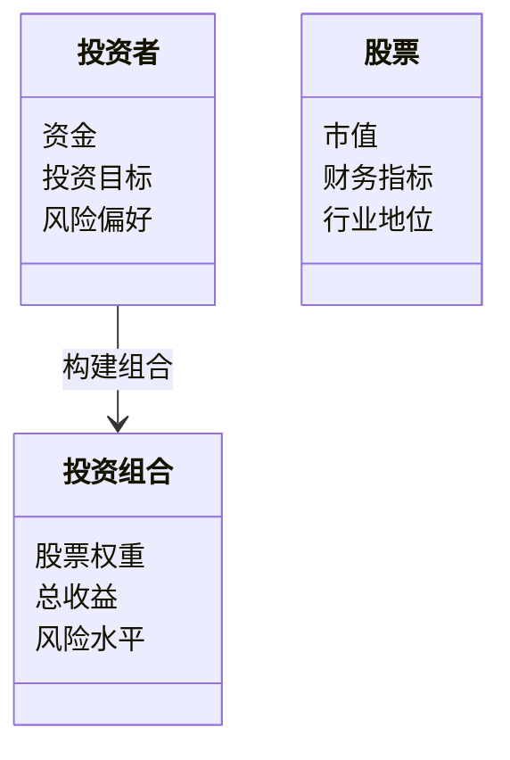

                 


# 沃伦·巴菲特的长期持股策略分析

> 关键词：长期持股，巴菲特，价值投资，投资策略，股票分析，投资组合，风险管理

> 摘要：本文深入分析了沃伦·巴菲特的长期持股策略，探讨了其背后的投资哲学、数学模型、系统架构和实际应用。通过结合基本面分析、安全边际、长期视角等核心概念，本文为投资者提供了从理论到实践的全面指导。

---

# 引言

沃伦·巴菲特是全球最著名的投资者之一，他的长期持股策略以“价值投资”为核心，强调买入优秀的公司并长期持有。本文将从背景、理论、实践三个层面，系统地分析这一策略的核心要素、数学模型和实现方法。

---

## 第1章: 长期持股策略的背景与核心概念

### 1.1 长期持股策略的背景介绍

#### 1.1.1 投资市场的基本问题背景
投资市场的核心问题是如何在不确定性中实现资产增值。传统交易策略依赖短期价格波动，但高频交易和市场噪声使得短期预测难度极大。

#### 1.1.2 长期持股策略的定义与问题描述
长期持股策略强调买入优质企业并长期持有，通过复利效应实现财富增长。其核心问题是：如何识别优质企业并制定长期持股计划。

#### 1.1.3 长期持股策略的核心目标与解决方法
核心目标是通过持有优质企业获得超额收益。解决方法包括基本面分析、安全边际和分散投资。

#### 1.1.4 长期持股策略的边界与外延
边界包括优质企业的定义和长期的期限范围。外延涉及动态再平衡和风险管理。

#### 1.1.5 核心概念的结构与组成要素
核心要素包括基本面分析、安全边际、长期视角、复利效应和风险管理。

### 1.2 长期持股策略的核心概念与联系

#### 1.2.1 核心概念的原理与属性
长期持股策略基于价值投资理念，强调企业内在价值和市场情绪的短期波动。

#### 1.2.2 核心概念的特征对比表格
| 特征      | 长期持股策略 | 短期交易策略 |
|-----------|--------------|---------------|
| 投资期限  | 长期         | 短期           |
| 风险偏好  | 低           | 高             |
| 分析维度  | 宏观+微观    | 微观           |

#### 1.2.3 实体关系图（ER图）架构
```mermaid
erd
    投资者 --> 投资组合: 持有
    投资组合 --> 股票: 包含
    股票 --> 财务指标: 满足
```

---

## 第2章: 长期持股策略的数学模型与算法原理

### 2.1 投资组合优化的数学模型

#### 2.1.1 投资组合优化的数学公式
最大化收益和最小化风险的目标函数：
$$
\text{目标函数：} \quad \max \left( \sum_{i=1}^{n} w_i r_i - \lambda \sum_{i=1}^{n} w_i^2 \right)
$$

#### 2.1.2 投资组合优化的约束条件
权重之和为1：
$$
\sum_{i=1}^{n} w_i = 1
$$

### 2.2 风险与收益的平衡算法

#### 2.2.1 风险调整后的收益计算公式
夏普比率：
$$
\text{夏普比率 } = \frac{E[r - r_f]}{\sigma}
$$

#### 2.2.2 马科维茨均值-方差模型
最小方差组合：
$$
\text{再平衡权重 } = \frac{\text{当前权重}}{\text{目标权重}}
$$

### 2.3 投资组合再平衡算法

#### 2.3.1 投资组合再平衡的步骤
1. 计算当前权重
2. 对比目标权重
3. 调整权重

#### 2.3.2 投资组合再平衡的数学模型
$$
\text{再平衡权重 } = \frac{\text{当前权重}}{\text{目标权重}}
$$`

---

## 第3章: 长期持股策略的系统分析与架构设计

### 3.1 投资系统场景介绍

#### 3.1.1 投资者需求分析
目标：财富增值；约束：风险承受能力。

#### 3.1.2 投资环境分析
市场波动、政策变化、企业基本面。

#### 3.1.3 投资目标与约束条件
目标：长期收益；约束：分散投资、定期再平衡。

### 3.2 投资系统功能设计

#### 3.2.1 领域模型（Mermaid 类图）


---

## 第4章: 长期持股策略的项目实战

### 4.1 项目介绍

#### 4.1.1 项目背景与目标
选择优质企业进行长期投资。

#### 4.1.2 项目需求分析
分析企业财务指标、行业地位、竞争优势。

### 4.2 项目核心实现

#### 4.2.1 系统核心实现源代码
```python
import pandas as pd
import numpy as np

# 示例数据：股票财务指标
data = {
    '股票': ['AAPL', 'MSFT', 'GOOGL'],
    '市盈率': [15, 16, 20],
    'ROE': [25, 18, 22],
    '收入增长率': [8, 6, 7]
}
df = pd.DataFrame(data)

# 计算价值评分
def calculate_score(row):
    score = row['市盈率'] * 0.3 + row['ROE'] * 0.4 + row['收入增长率'] * 0.3
    return score

df['价值评分'] = df.apply(calculate_score, axis=1)
print(df)
```

#### 4.2.2 代码应用解读与分析
根据财务指标计算价值评分，选择高评分企业。

---

## 第5章: 最佳实践与总结

### 5.1 成功的关键点

#### 5.1.1 选择优秀企业
基本面良好、行业地位稳固。

#### 5.1.2 长期持有与分散投资
避免短期波动，分散风险。

#### 5.1.3 定期再平衡
根据市场变化调整投资组合。

### 5.2 小结

长期持股策略是一种有效的投资方法，但需要结合市场环境和个人风险偏好进行调整。

---

## 附录

### A. 参考文献

1. 巴菲特年度股东大会演讲
2. 《投资之道》
3. 《证券分析》

### B. 工具与资源

- 财务数据来源：Yahoo Finance
- 数据分析工具：Python, Pandas
- 图表工具：Matplotlib, Seaborn

---

## 作者

作者：AI天才研究院/AI Genius Institute & 禅与计算机程序设计艺术 /Zen And The Art of Computer Programming

