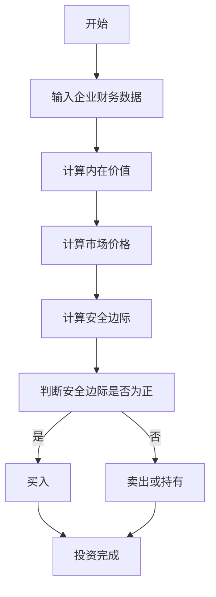
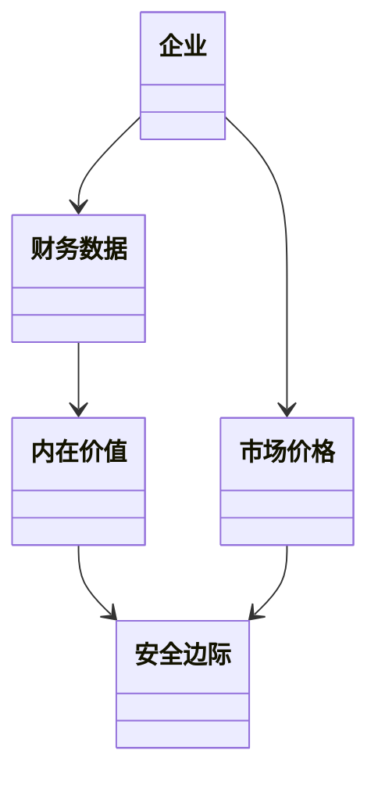

                 


# 沃伦·巴菲特：奥马哈预言家的价值投资策略

## 关键词：巴菲特, 价值投资, 投资策略, 内在价值, 安全边际

## 摘要：  
沃伦·巴菲特作为世界著名投资人，其价值投资策略深刻影响了全球投资领域。本文将从巴菲特的生平、投资哲学、核心概念、数学模型、算法实现、系统架构到实际案例分析，全面解析其价值投资策略，并结合技术语言和系统思维，深入探讨其在现代投资中的应用。

---

## 第一部分: 沃伦·巴菲特的价值投资背景与理念

### 第1章: 巴菲特的生平与投资哲学

#### 1.1 巴菲特的生平简介
- **早年经历**：生于1934年，美国堪萨斯州。幼年展现出对数字的敏锐洞察力，10岁时开始研究股票市场。
- **教育背景**：就读于哥伦比亚大学，师从本杰明·格雷厄姆，学习价值投资理论。
- **职业生涯与成就**：1956年创立合伙公司，1971年完全控股伯克希尔哈撒韦公司，使其成为全球最成功的投资公司之一。

#### 1.2 巴菲特的投资哲学
- **价值投资的定义**：寻找市场价格低于内在价值的企业进行投资。
- **核心理念**：企业应具备强大的竞争优势、稳定的财务状况和可持续的盈利能力。
- **投资原则**：集中投资、长期持有、Margin of Safety（安全边际）。

### 第2章: 价值投资的起源与发展

#### 2.1 价值投资的起源
- **定义与核心概念**：价值投资是一种基于对企业内在价值评估的投资方法。
- **历史发展**：起源于20世纪初，经过多次实践检验，成为投资领域的重要流派。
- **与其他投资策略的对比**：与技术分析、趋势投资等方法不同，价值投资注重基本面分析。

#### 2.2 巴菲特对价值投资的贡献
- **理论创新**：提出“安全边际”概念，强调在价格低于内在价值时投资。
- **实践影响**：通过长期投资于优质企业，验证了价值投资的有效性。
- **称号由来**：因其在奥马哈的长期成功投资，被誉为“奥马哈预言家”。

---

## 第二部分: 价值投资的核心概念与策略

### 第3章: 价值投资的核心概念

#### 3.1 内在价值与市场价值
- **内在价值的定义**：企业未来现金流的现值。
- **市场价值的波动性**：市场价格受市场情绪影响，可能高于或低于内在价值。
- **关系**：内在价值是投资决策的基础，市场价值是实现收益的关键。

#### 3.2 安全边际与投资风险
- **安全边际的定义**：买入价格低于内在价值的差额。
- **计算方法**：安全边际 = 内在价值 - 市场价格。
- **风险控制**：通过安全边际降低投资风险，确保投资的长期稳定性。

### 第4章: 巴菲特的价值投资策略

#### 4.1 选股标准
- **企业基本面分析**：关注ROE（净资产收益率）、ROA（资产回报率）等指标。
- **竞争优势与护城河**：企业应具备独特的竞争优势，如品牌、技术、市场占有率。
- **财务健康状况**：关注企业的负债情况、现金流健康与否。

#### 4.2 投资组合管理
- **构建原则**：集中投资于少数优质企业，避免过度分散。
- **调整策略**：定期评估企业基本面，及时调整持仓。
- **风险控制**：通过分散投资和安全边际降低整体风险。

---

## 第三部分: 巴菲特投资策略的数学模型与算法

### 第5章: 价值投资的数学模型

#### 5.1 内在价值的计算公式
- **现金流折现模型（DCF）**：  
  内在价值 = Σ（未来现金流 / (1 + r)^t）  
  其中，r为折现率，t为时间。
- **股权自由现金流模型**：  
  内在价值 = 经营性现金流 - 再投资需求 + 非经营性现金流。

#### 5.2 安全边际的计算方法
- **公式推导**：安全边际 = 内在价值 - 市场价格。
- **数值计算**：假设某企业内在价值为100，市场价格为80，则安全边际为20。

### 第6章: 价值投资的算法实现

#### 6.1 算法流程图


#### 6.2 Python实现
```python
import pandas as pd
import numpy as np

def calculate_intrinsic_value(revenue, expenses, wacc):
    # 简单的现金流折现模型示例
    cash_flow = revenue - expenses
    return cash_flow / (1 + wacc)

# 示例数据
revenue = 100000000
expenses = 80000000
wacc = 0.1

iv = calculate_intrinsic_value(revenue, expenses, wacc)
print(f"内在价值：{iv:.2f}")
```

---

## 第四部分: 系统分析与架构设计方案

### 第7章: 系统功能设计

#### 7.1 领域模型


#### 7.2 系统架构
```mermaid
rectangle 投资者
rectangle 企业数据库
rectangle 市场数据源
rectangle 计算引擎
rectangle 投资决策模块

投资者 --> 企业数据库
投资者 --> 市场数据源
企业数据库 --> 计算引擎
市场数据源 --> 计算引擎
计算引擎 --> 投资决策模块
```

---

## 第五部分: 项目实战

### 第8章: 实际案例分析

#### 8.1 巴菲特的经典投资案例
- **可口可乐公司**：通过分析其强大的品牌和持续的现金流，巴菲

