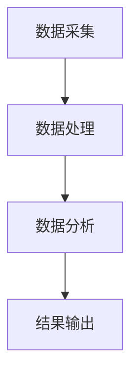

                 


---

# 沃伦巴菲特的股东信解读

> **关键词**: 沃伦巴菲特, 股东信, 投资理念, 财务分析, 竞争优势, 风险管理

> **摘要**: 本文系统性地解读了沃伦巴菲特的股东信，分析了其投资理念、财务分析方法、竞争优势识别及风险管理策略。通过实际案例和数学模型，深入探讨了巴菲特的投资哲学及其在现代投资中的应用，为投资者提供了实用的指导和建议。

---

## 第1章 股东信的背景与重要性

### 1.1 投资理念的核心要素

#### 1.1.1 价值投资的定义与特点
- **定义**: 价值投资是一种以低于公平价值的价格购买优质资产的投资策略。
- **特点**: 强调安全边际、长期持有、逆向投资。

#### 1.1.2 股东信在投资决策中的作用
- 作为投资者与管理层沟通的重要桥梁。
- 提供公司财务状况、经营策略及未来展望的关键信息。

#### 1.1.3 巴菲特投资哲学的演变
- 从早期的套利投资到后期的价值投资。
- 强调安全边际和长期持有的理念。

### 1.2 股东信的阅读方法与工具

#### 1.2.1 如何系统性地阅读股东信
- 从整体到局部，逐步深入分析。
- 关注关键指标和数据，如ROE、净利润等。

#### 1.2.2 分析股东信的关键工具
- 财务报表分析工具：如杜邦分析法。
- 投资策略工具：如PE、PB、DCF模型。

#### 1.2.3 股东信的结构与内容解析
- 主要内容包括：公司财务状况、经营策略、未来计划、风险管理。

### 1.3 股东信的核心主题

#### 1.3.1 财务报表分析的重要性
- 财务报表是评估公司价值的核心工具。
- 通过分析财务报表，识别公司的财务健康状况。

#### 1.3.2 投资策略的多样性
- 不同行业、不同公司的投资策略有所不同。
- 强调根据公司特点制定个性化投资策略。

#### 1.3.3 风险管理的策略
- 通过分散投资、设置止损等方式控制风险。
- 强调安全边际的重要性。

### 1.4 股东信的案例分析

#### 1.4.1 典型案例的解读
- 以苹果公司为例，分析其财务状况和竞争优势。
- 通过股东信了解公司的经营策略和未来计划。

#### 1.4.2 案例分析的方法与步骤
1. 确定分析目标和范围。
2. 收集相关数据和信息。
3. 进行财务分析和竞争优势评估。
4. 制定投资策略和风险管理计划。

#### 1.4.3 案例分析的启示与应用
- 学习巴菲特的投资哲学，应用于实际投资中。
- 通过案例分析，提升投资者的分析能力和决策水平。

### 1.5 本章小结
- 本章介绍了股东信的背景与重要性，分析了其核心主题和阅读方法。
- 通过案例分析，展示了如何将股东信中的信息应用于实际投资中。

---

## 第2章 股东信中的财务分析

### 2.1 财务报表分析的基础知识

#### 2.1.1 资产负债表的关键指标
- **资产**: 包括流动资产和非流动资产。
- **负债**: 包括短期负债和长期负债。
- **所有者权益**: 包括股本、资本公积、盈余公积等。

#### 2.1.2 利润表的核心要素
- **收入**: 包括营业收入、其他收入。
- **成本**: 包括营业成本、销售费用等。
- **利润**: 包括净利润、每股收益。

#### 2.1.3 现金流量表的重要性
- **经营活动现金流**: 反映公司日常经营的现金流情况。
- **投资活动现金流**: 反映公司投资活动的现金流情况。
- **筹资活动现金流**: 反映公司筹资活动的现金流情况。

### 2.2 股东信中的财务分析方法

#### 2.2.1 财务比率分析
- **流动性比率**: 如流动比率、速动比率。
- **偿债能力比率**: 如资产负债率、利息保障倍数。
- **盈利能力比率**: 如净利率、ROE。

#### 2.2.2 资产负债表分析
- 通过分析资产负债表，评估公司的资产结构和负债情况。
- 关注公司是否有足够的流动资产应对短期债务。

#### 2.2.3 利润表分析
- 通过分析利润表，评估公司的盈利能力。
- 关注公司的收入增长和成本控制能力。

### 2.3 股东信中的财务指标解读

#### 2.3.1 资产负债表的关键指标解读
- 以苹果公司为例，分析其资产负债表的关键指标。
- 通过分析，评估公司的财务健康状况。

#### 2.3.2 利润表的核心指标解读
- 以亚马逊为例，分析其利润表的核心指标。
- 通过分析，评估公司的盈利能力和发展潜力。

#### 2.3.3 现金流量表的重要指标解读
- 以谷歌为例，分析其现金流量表的重要指标。
- 通过分析，评估公司的现金流状况和支付能力。

### 2.4 股东信中的财务分析案例

#### 2.4.1 某公司财务报表分析
- 以微软公司为例，分析其财务报表。
- 通过分析，评估公司的财务状况和投资价值。

#### 2.4.2 财务分析结果对企业价值的影响
- 通过财务分析，评估公司的内在价值。
- 结合市场估值，判断是否值得投资。

#### 2.4.3 财务分析的局限性与注意事项
- 财务分析的局限性：财务数据可能存在滞后性。
- 注意事项：结合行业特点和公司实际情况进行分析。

### 2.5 本章小结
- 本章详细介绍了股东信中的财务分析方法和关键指标。
- 通过实际案例，展示了如何通过财务分析评估公司的投资价值。

---

## 第3章 股东信中的竞争优势分析

### 3.1 竞争优势的定义与分类

#### 3.1.1 竞争优势的定义
- 竞争优势是指公司在行业中相对于竞争对手的有利条件。
- 包括成本优势、质量优势、品牌优势等。

#### 3.1.2 竞争优势的分类
- **成本优势**: 通过规模效应降低成本。
- **质量优势**: 提供高质量的产品或服务。
- **品牌优势**: 强大的品牌影响力。

#### 3.1.3 竞争优势的重要性
- 竞争优势是公司长期盈利能力的重要保障。
- 通过竞争优势，公司在行业中占据领先地位。

### 3.2 股东信中的竞争优势识别

#### 3.2.1 识别竞争优势的方法
- **SWOT分析**: 通过分析公司的优势、劣势、机会和威胁。
- **波特五力模型**: 分析行业竞争结构，识别竞争优势。

#### 3.2.2 竞争优势的衡量标准
- **市场份额**: 公司在行业中的市场份额。
- **利润率**: 公司的盈利能力。
- **创新能力**: 公司的研发能力和创新能力。

#### 3.2.3 竞争优势的动态变化
- 行业变化和技术进步可能改变竞争优势。
- 公司需要不断创新和调整以保持竞争优势。

### 3.3 股东信中的竞争优势案例分析

#### 3.3.1 某行业竞争优势分析
- 以科技行业为例，分析其竞争优势。
- 通过分析，识别行业中的优势企业。

#### 3.3.2 竞争优势对企业价值的影响
- 竞争优势强的公司具有更高的投资价值。
- 通过分析竞争优势，判断公司的长期发展潜力。

#### 3.3.3 竞争优势的维持与增强策略
- 通过持续创新和优化管理，维持竞争优势。
- 加强研发投入，提升产品和服务质量。

### 3.4 本章小结
- 本章介绍了竞争优势的定义和分类，分析了如何识别和评估竞争优势。
- 通过实际案例，展示了如何通过竞争优势分析选择具有长期投资价值的公司。

---

## 第4章 股东信中的风险管理

### 4.1 风险管理的定义与重要性

#### 4.1.1 风险管理的定义
- 风险管理是指识别、评估和控制投资风险的过程。
- 包括市场风险、流动性风险、信用风险等。

#### 4.1.2 风险管理的重要性
- 风险管理是保障投资安全的重要手段。
- 通过有效管理风险，提高投资回报率。

#### 4.1.3 风险管理的目标
- 降低投资风险，确保投资安全。
- 通过分散投资，降低非系统性风险。

### 4.2 股东信中的风险管理策略

#### 4.2.1 风险识别与评估
- 通过分析股东信，识别潜在风险。
- 评估风险的影响程度和发生概率。

#### 4.2.2 风险控制与应对策略
- 通过分散投资，降低风险。
- 设定止损点，控制投资损失。

#### 4.2.3 风险监控与调整
- 定期评估投资组合的风险状况。
- 根据市场变化，及时调整投资策略。

### 4.3 股东信中的风险管理案例

#### 4.3.1 风险管理策略的实际应用
- 以巴菲特为例，分析其风险管理策略。
- 通过分析，学习如何有效管理投资风险。

#### 4.3.2 风险管理对投资组合的影响
- 通过风险管理，优化投资组合。
- 提高投资组合的稳定性和回报率。

#### 4.3.3 风险管理的注意事项
- 风险管理需要持续关注和调整。
- 需要结合市场环境和公司实际情况进行管理。

### 4.4 本章小结
- 本章介绍了风险管理的定义和重要性，分析了如何通过股东信进行风险管理。
- 通过实际案例，展示了如何有效管理投资风险，提高投资回报率。

---

## 第5章 股东信中的数学模型与算法

### 5.1 投资决策中的数学模型

#### 5.1.1 股东信分析的数学模型
- **市盈率模型**: P/E = 市场价/每股收益。
- **市净率模型**: P/B = 市场价/每股净资产。
- **股息率模型**: 股息率 = 每股股息/市场价。

#### 5.1.2 投资决策中的数学模型
- **净现值法**: NPV = ∑(CF_t / (1 + r)^t) - 初始投资。
- **内部收益率法**: IRR = 现金流的内部收益率。

#### 5.1.3 数学模型在股东信中的应用
- 通过数学模型，评估公司的内在价值。
- 结合股东信中的数据，制定投资决策。

### 5.2 股东信中的算法原理

#### 5.2.1 股东信分析算法
- **数据采集**: 从股东信中提取财务数据。
- **数据处理**: 清洗和整理数据。
- **数据分析**: 应用数学模型进行分析。
- **结果输出**: 输出分析结果和投资建议。

#### 5.2.2 股东信分析的Python代码实现
```python
import pandas as pd

# 数据采集
data = pd.read_csv(' shareholder_letter.csv ')

# 数据处理
data_clean = data.dropna()

# 数据分析
def calculate_profitability(data):
    roe = data['净利润'] / data['股东权益']
    return roe

profitability = calculate_profitability(data_clean)

# 结果输出
print('盈利能力分析:', profitability)
```

#### 5.2.3 算法的数学模型与公式
- 净利润率公式：$$\text{净利润率} = \frac{\text{净利润}}{\text{营业收入}} \times 100\%$$
- 内部收益率公式：$$\text{IRR} = \text{使 NPV = 0 的利率}$$

### 5.3 股东信中的数学模型案例

#### 5.3.1 数学模型的实际应用
- 以苹果公司为例，应用数学模型进行分析。
- 通过分析，评估苹果公司的投资价值。

#### 5.3.2 数学模型的优缺点
- 优点：提供量化分析，帮助投资者做出决策。
- 缺点：模型假设可能存在偏差，影响分析结果。

#### 5.3.3 数学模型的改进与优化
- 根据实际情况，调整模型参数。
- 引入更多变量，提高模型的准确性。

### 5.4 本章小结
- 本章介绍了投资决策中的数学模型及其在股东信分析中的应用。
- 通过Python代码实现数据分析，展示了如何利用数学模型制定投资策略。

---

## 第6章 股东信中的系统分析与架构设计

### 6.1 系统分析的定义与重要性

#### 6.1.1 系统分析的定义
- 系统分析是指对投资系统的各个组成部分进行分析，以优化系统的整体性能。
- 包括数据采集、数据处理、数据分析和结果输出。

#### 6.1.2 系统分析的重要性
- 系统分析是投资决策的重要工具。
- 通过系统分析，提高投资决策的科学性和准确性。

#### 6.1.3 系统分析的目标
- 提高投资效率，降低投资风险。
- 通过系统分析，优化投资组合。

### 6.2 股东信分析的系统架构设计

#### 6.2.1 系统功能设计
- **数据采集模块**: 从股东信中提取数据。
- **数据处理模块**: 清洗和整理数据。
- **数据分析模块**: 应用数学模型进行分析。
- **结果输出模块**: 输出分析结果和投资建议。

#### 6.2.2 系统架构设计


#### 6.2.3 系统接口设计
- 数据接口：与数据库或其他数据源对接。
- 用户接口：提供友好的用户界面，方便用户操作。

#### 6.2.4 系统交互设计
- 用户输入：输入股东信数据。
- 系统处理：对数据进行分析和处理。
- 用户输出：显示分析结果和投资建议。

### 6.3 股东信分析的系统实现

#### 6.3.1 环境安装与配置
- 安装Python和相关库（如Pandas、Matplotlib）。
- 配置开发环境，如Jupyter Notebook。

#### 6.3.2 系统核心实现源代码
```python
import pandas as pd
import matplotlib.pyplot as plt

# 数据采集
data = pd.read_csv(' shareholder_letter.csv ')

# 数据处理
data_clean = data.dropna()

# 数据分析
def calculate_financial_ratios(data):
    roe = data['净利润'] / data['股东权益']
    roa = data['净利润'] / data['总资产']
    return roe, roa

roe, roa = calculate_financial_ratios(data_clean)

# 可视化分析
plt.plot(roe, label='ROE')
plt.plot(roa, label='ROA')
plt.xlabel('Year')
plt.ylabel('Ratio')
plt.legend()
plt.show()
```

#### 6.3.3 代码应用解读与分析
- 通过代码实现数据采集和处理。
- 应用数学模型进行数据分析，绘制可视化图表。

#### 6.3.4 实际案例分析与详细讲解
- 以亚马逊为例，应用系统分析进行投资评估。
- 通过分析，评估亚马逊的投资价值。

### 6.4 本章小结
- 本章介绍了系统分析的定义和重要性，分析了股东信分析的系统架构设计。
- 通过Python代码实现系统分析，展示了如何利用系统分析优化投资决策。

---

## 第7章 股东信中的项目实战

### 7.1 项目实战的定义与目标

#### 7.1.1 项目实战的定义
- 项目实战是指通过实际操作，应用股东信分析的方法进行投资评估。
- 包括数据采集、数据分析、投资决策等步骤。

#### 7.1.2 项目实战的目标
- 提高投资者的实际操作能力。
- 通过实战，验证股东信分析方法的有效性。

#### 7.1.3 项目实战的意义
- 帮助投资者更好地理解股东信分析的方法。
- 提高投资者的实战能力和决策水平。

### 7.2 项目实战的环境安装

#### 7.2.1 环境安装与配置
- 安装Python和相关库（如Pandas、Matplotlib）。
- 配置开发环境，如Jupyter Notebook。

#### 7.2.2 数据来源与采集
- 数据来源：公开的股东信和财务报表。
- 数据采集：从公司官网或数据库获取数据。

### 7.3 项目核心实现

#### 7.3.1 股东信分析的核心实现
- 数据采集：从股东信中提取财务数据。
- 数据处理：清洗和整理数据。
- 数据分析：应用数学模型进行分析。

#### 7.3.2 投资决策的核心实现
- 通过数据分析，评估公司的投资价值。
- 根据分析结果，制定投资策略。

#### 7.3.3 项目实现的代码示例
```python
import pandas as pd

# 数据采集
data = pd.read_csv(' shareholder_letter.csv ')

# 数据处理
data_clean = data.dropna()

# 数据分析
def calculate_roe(data):
    roe = data['净利润'] / data['股东权益']
    return roe

roe = calculate_roe(data_clean)

# 投资决策
investment_decision = '买入' if roe > 0.1 else '卖出'

print('投资决策:', investment_decision)
```

#### 7.3.4 代码应用解读与分析
- 通过代码实现数据采集和处理。
- 应用数学模型进行数据分析，制定投资决策。

### 7.4 项目实战的实际案例分析

#### 7.4.1 某公司的股东信分析
- 以谷歌为例，分析其股东信。
- 通过分析，评估谷歌的投资价值。

#### 7.4.2 投资决策的过程与结果
- 根据分析结果，制定投资策略。
- 输出投资决策和建议。

#### 7.4.3 项目实战的总结与反思
- 总结项目实战的经验和教训。
- 反思分析方法的优缺点，提出改进建议。

### 7.5 本章小结
- 本章介绍了项目实战的定义和目标，分析了股东信分析的核心实现。
- 通过实际案例，展示了如何通过项目实战提高投资者的实际操作能力。

---

## 第8章 总结与展望

### 8.1 本章总结
- 本章总结了沃伦巴菲特股东信解读的核心内容。
- 强调了股东信在投资决策中的重要性。

### 8.2 未来展望
- 未来将结合更多的数学模型和系统分析方法，进一步优化投资决策。
- 探索人工智能在股东信分析中的应用，提高投资效率和准确性。

### 8.3 注意事项与最佳实践
- 投资者应保持理性，避免盲目跟风。
- 定期评估投资组合，及时调整投资策略。
- 结合市场变化和公司实际情况，制定个性化投资策略。

### 8.4 本章小结
- 本章总结了沃伦巴菲特股东信解读的核心内容，展望了未来的发展方向。
- 提供了投资者在实际操作中的注意事项和最佳实践建议。

---

## 作者

作者：AI天才研究院/AI Genius Institute & 禅与计算机程序设计艺术/Zen And The Art of Computer Programming

---

---

### 本文是关于沃伦巴菲特股东信解读的专业技术博客文章，涵盖了从基础到高级的分析方法和实际案例，帮助投资者更好地理解和应用巴菲特的投资哲学和策略。

