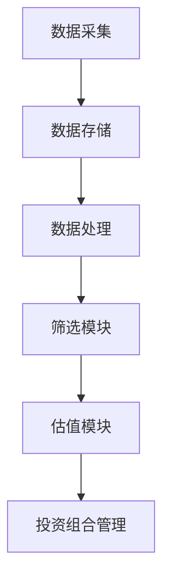

                 

# 沃尔特施洛斯的小盘股投资策略

> 关键词：小盘股投资，沃尔特·施洛斯，价值投资，基本面分析，安全边际

> 摘要：本文深入探讨了沃尔特·施洛斯的小盘股投资策略，分析了其投资理念、选股标准、风险管理方法，以及如何通过基本面分析和安全边际原则实现长期稳定的收益。文章结合具体案例，展示了如何在小盘股市场中发现潜在机会，并通过科学的系统架构和流程化管理提升投资效率。

---

# 第一部分: 小盘股投资策略概述

## 第1章: 小盘股投资的背景与现状

### 1.1 小盘股的定义与特点

#### 1.1.1 小盘股的定义
小盘股是指市值较小的公司股票，通常指市值在50亿到200亿美元之间的公司。与大盘股相比，小盘股的流动性较低，波动性较大，但潜在回报更高。

#### 1.1.2 小盘股市场的特点
- 市场流动性较低，交易量小。
- 价格波动大，受市场情绪影响显著。
- 公司规模小，增长潜力大。
- 估值较低，容易找到被低估的公司。

#### 1.1.3 小盘股与大盘股的对比
| 特性      | 小盘股                  | 大盘股                  |
|-----------|-------------------------|--------------------------|
| 市值      | 较小（50-200亿美元）    | 较大（200亿美元以上）    |
| 流动性     | 较低                   | 较高                   |
| 波动性     | 较高                   | 较低                   |
| 增长潜力   | 较大                   | 较小                   |
| 估值       | 通常较低               | 通常较高               |

---

### 1.2 小盘股投资的历史与发展

#### 1.2.1 小盘股投资的起源
小盘股投资起源于20世纪初，早期投资者通过寻找未被市场关注的公司获得超额收益。

#### 1.2.2 美国小盘股市场的历史演变
- 20世纪30年代：大萧条时期，小盘股市场遭受重创。
- 20世纪50年代：机构投资者开始关注小盘股。
- 20世纪80年代：小盘股市场迎来复苏，机构投资者大量涌入。
- 21世纪：小盘股市场成为全球投资者关注的焦点。

#### 1.2.3 小盘股投资的现状与趋势
当前，小盘股投资在全球范围内呈现多样化趋势，投资者通过技术手段和大数据分析提升投资效率。

---

### 1.3 小盘股投资的价值与风险

#### 1.3.1 小盘股投资的价值
- 高增长潜力：小盘股公司容易通过创新或扩张实现快速成长。
- 估值优势：小盘股通常被市场低估，具有较高的安全边际。

#### 1.3.2 小盘股投资的风险
- 流动性风险：小盘股交易量小，市场深度不足。
- 经营风险：小盘股公司抗风险能力较弱。
- 市场波动风险：小盘股价格波动较大。

#### 1.3.3 小盘股投资的长期回报分析
长期来看，小盘股的回报率通常高于大盘股，但需要通过严格的选股标准和风险管理来实现。

---

## 第2章: 沃尔特·施洛斯的投资理念

### 2.1 沃尔特·施洛斯的生平简介

#### 2.1.1 施洛斯的早期经历
沃尔特·施洛斯（Walter Schloss）出生于1910年，早年在父亲的影响下开始接触投资。

#### 2.1.2 施洛斯的职业生涯
- 1934年，施洛斯加入父亲的公司，开始管理投资。
- 1956年，施洛斯继承父亲的公司，成为首席投资官。
- 施洛斯以小盘股投资闻名，长期管理着一个价值投资基金。

#### 2.1.3 施洛斯的投资哲学
施洛斯认为，投资的本质是寻找具有安全边际的企业，长期持有优质股票可以获得超额回报。

---

### 2.2 施洛斯小盘股投资的核心理念

#### 2.2.1 价值投资的核心思想
施洛斯强调以低于内在价值的价格买入优质股票，长期持有，等待市场重新发现其价值。

#### 2.2.2 小盘股投资的三大原则
1. 选择具有强大竞争优势的企业。
2. 买入价格低于企业内在价值。
3. 长期持有，避免频繁交易。

#### 2.2.3 施洛斯的选股标准
- 企业具有持续盈利能力。
- 估值低于内在价值。
- 公司治理结构良好。
- 行业具有增长潜力。

---

### 2.3 施洛斯投资策略的实践案例

#### 2.3.1 施洛斯的经典投资案例
- 投资于小公司，等待其成长为大公司。
- 通过长期持有，获得复利效应。

#### 2.3.2 案例分析：施洛斯如何选择小盘股
施洛斯通过分析企业的财务状况、行业地位和竞争优势，选择具有长期增长潜力的公司。

#### 2.3.3 案例分析：施洛斯如何管理投资组合
施洛斯注重分散投资，将资金分配到多个小盘股，降低风险，提高整体收益。

---

## 第3章: 小盘股投资的核心分析方法

### 3.1 基本面分析方法

#### 3.1.1 市盈率（P/E）分析
市盈率=股价/每股净利润。施洛斯通常选择市盈率低于行业平均水平的公司。

#### 3.1.2 市净率（P/B）分析
市净率=股价/每股净资产。施洛斯认为市净率低于1的公司具有较高的安全边际。

#### 3.1.3 资产负债表分析
施洛斯注重企业的财务健康状况，确保企业具有较强的偿债能力和盈利能力。

#### 3.1.4 利润表分析
施洛斯关注企业的收入增长和利润率，选择具有稳定增长能力的公司。

---

### 3.2 财务指标与估值模型

#### 3.2.1 常用财务指标解析
- 净利润：衡量企业盈利能力的核心指标。
- 营业收入增长率：衡量企业增长潜力的重要指标。
- 净资产收益率（ROE）：衡量企业资产使用效率的重要指标。

#### 3.2.2 估值模型的建立与应用
施洛斯使用内在价值模型，通过DCF（现金流折现法）估算企业的合理估值。

#### 3.2.3 小盘股的合理估值区间确定
通过对比企业的内在价值和市场价值，确定其是否具有投资价值。

---

### 3.3 行业分析与竞争优势评估

#### 3.3.1 小盘股行业的选择标准
- 行业具有增长潜力。
- 行业竞争格局清晰。
- 行业政策环境稳定。

#### 3.3.2 企业竞争优势的评估方法
- 核心竞争力：企业的技术优势、成本优势、品牌优势。
- 市场地位：企业在行业中的排名和影响力。
- 发展前景：行业未来增长的空间。

#### 3.3.3 行业周期与企业成长性分析
- 行业周期：选择处于上升周期的行业。
- 企业成长性：选择具有稳定增长能力的公司。

---

## 第4章: 小盘股投资策略的实施步骤

### 4.1 确定投资目标与策略

#### 4.1.1 投资目标的设定
- 确定投资期限。
- 设定投资收益目标。
- 确定风险承受能力。

#### 4.1.2 投资策略的选择
- 价值投资策略。
- 成长投资策略。
- 组合投资策略。

#### 4.1.3 投资组合的构建
- 根据风险偏好分配资产。
- 选择具有互补性的股票。
- 定期调整投资组合。

---

### 4.2 小盘股的筛选与评估

#### 4.2.1 小盘股的筛选标准
- 市值在50亿到200亿美元之间。
- 市盈率低于行业平均水平。
- 市净率低于1。

#### 4.2.2 财务指标的综合评估
- 净利润增长率。
- 资产负债率。
- 净资产收益率。

#### 4.2.3 企业竞争力的综合评估
- 核心竞争力。
- 市场地位。
- 发展前景。

---

### 4.3 投资组合的动态调整

#### 4.3.1 投资组合的定期评估
- 每季度评估一次投资组合。
- 检查个股表现。
- 重新评估企业基本面。

#### 4.3.2 市场变化对投资组合的影响
- 市场波动对小盘股的影响。
- 行业变化对投资组合的影响。
- 经济周期对投资组合的影响。

#### 4.3.3 动态调整的策略与技巧
- 根据市场变化调整持仓。
- 根据企业变化调整持仓。
- 保持投资策略的纪律性。

---

## 第5章: 小盘股投资的风险管理与心理控制

### 5.1 小盘股投资的主要风险

#### 5.1.1 市场波动风险
小盘股价格波动较大，容易受到市场情绪的影响。

#### 5.1.2 企业经营风险
小盘股公司抗风险能力较弱，容易受到经营环境变化的影响。

#### 5.1.3 市场流动性风险
小盘股市场流动性较低，容易出现流动性危机。

---

### 5.2 风险管理的具体措施

#### 5.2.1 投资组合的风险分散
- 将资金分配到多个小盘股公司。
- 选择不同行业的公司。
- 选择不同地区的公司。

#### 5.2.2 仓位控制与止损策略
- 设置止损点，避免亏损过大。
- 严格控制仓位，避免过度集中。
- 定期评估仓位，及时调整。

#### 5.2.3 心理风险管理技巧
- 避免情绪化交易。
- 保持纪律性。
- 坚持长期投资。

---

### 5.3 投资者心理与行为分析

#### 5.3.1 投资者常见心理偏差
- 过度自信：认为自己能够准确预测市场。
- 从众心理：跟随市场趋势进行投资。
- 损失厌恶：害怕亏损，错失投资机会。

#### 5.3.2 心理控制与纪律性培养
- 制定明确的投资计划。
- 避免情绪化决策。
- 坚持长期投资。

---

## 第6章: 小盘股投资的系统架构与流程化管理

### 6.1 系统架构设计

#### 6.1.1 系统功能模块
- 数据采集模块：收集小盘股的基本面数据。
- 筛选模块：根据筛选标准选出符合条件的公司。
- 估值模块：计算公司的内在价值。
- 投资组合管理模块：构建和调整投资组合。

#### 6.1.2 系统架构图

---

### 6.2 流程化管理

#### 6.2.1 数据收集与处理
- 收集企业的财务数据。
- 处理数据，计算各项指标。

#### 6.2.2 筛选与估值
- 根据筛选标准选出符合条件的公司。
- 计算公司的内在价值，确定是否低估。

#### 6.2.3 投资组合管理
- 构建投资组合。
- 定期调整投资组合。

---

## 第7章: 小盘股投资的实战案例

### 7.1 案例背景

#### 7.1.1 项目介绍
- 投资标的：某小盘股公司。
- 投资金额：100万美元。
- 投资期限：5年。

#### 7.1.2 项目目标
- 实现年化收益10%以上。
- 通过案例展示小盘股投资的全过程。

---

### 7.2 投资组合构建

#### 7.2.1 数据收集与分析
- 收集公司的财务数据。
- 分析公司的基本面。
- 评估公司的估值。

#### 7.2.2 筛选与估值
- 根据筛选标准选出符合条件的公司。
- 计算公司的内在价值。
- 确定是否低估。

---

### 7.3 投资组合管理

#### 7.3.1 定期评估
- 每季度评估一次投资组合。
- 检查个股表现。
- 重新评估企业基本面。

#### 7.3.2 动态调整
- 根据市场变化调整持仓。
- 根据企业变化调整持仓。
- 保持投资策略的纪律性。

---

## 第8章: 小盘股投资策略的总结与展望

### 8.1 总结

#### 8.1.1 核心观点
- 小盘股投资具有较高的增长潜力。
- 通过基本面分析和安全边际原则实现长期稳定的收益。
- 需要注意风险管理，避免过度集中。

#### 8.1.2 投资启示
- 价值投资是小盘股投资的核心理念。
- 长期持有是实现复利效应的关键。
- 风险管理是投资成功的重要保障。

---

### 8.2 展望

#### 8.2.1 小盘股投资的未来趋势
- 科技创新将推动小盘股市场的进一步发展。
- 大数据和人工智能将提升小盘股投资的效率。
- 全球化将为小盘股投资提供更多机会。

#### 8.2.2 投资者应对策略
- 加强对小盘股市场的研究。
- 利用技术手段提升投资效率。
- 保持长期投资的纪律性。

---

## 作者：AI天才研究院/AI Genius Institute & 禅与计算机程序设计艺术 /Zen And The Art of Computer Programming

