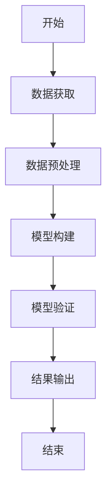
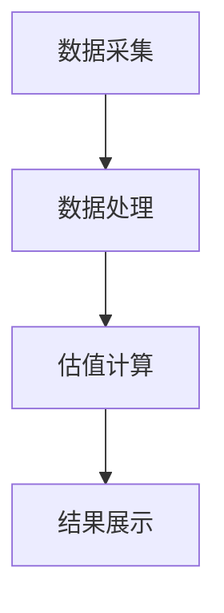

                 


# 法国股市估值:欧元区重要经济体的投资价值

> **关键词**: 法国股市，欧元区，股市估值，投资价值，宏观经济，市盈率，市净率

> **摘要**: 本文深入分析法国股市的估值方法，探讨其在欧元区经济中的重要地位，通过详细的算法原理和系统架构设计，结合实际案例，为投资者提供科学的决策依据。

---

# 目录

1. **法国股市估值的背景与核心概念**
   - 1.1 法国股市的定义与特点
   - 1.2 欧元区经济的重要性
   - 1.3 法国股市估值的背景

2. **法国股市估值的核心概念与联系**
   - 2.1 估值的核心概念
   - 2.2 核心概念的对比分析
   - 2.3 估值模型的构建

3. **法国股市估值的算法原理**
   - 3.1 市盈率与市净率的计算
   - 3.2 估值模型的实现
   - 3.3 算法流程图

4. **法国股市估值的系统分析与架构设计**
   - 4.1 系统功能设计
   - 4.2 系统架构设计
   - 4.3 系统接口设计

5. **法国股市估值的项目实战**
   - 5.1 环境安装与数据准备
   - 5.2 核心代码实现
   - 5.3 案例分析与结果解读

6. **总结与最佳实践**
   - 6.1 总结
   - 6.2 最佳实践
   - 6.3 投资注意事项
   - 6.4 拓展阅读

---

## 第1章: 法国股市估值的背景与核心概念

### 1.1 法国股市的定义与特点

#### 1.1.1 法国股市的定义
法国股市是全球重要的金融市场之一，主要指数为CAC 40，涵盖法国40家最大企业的股票。这些企业分布在多个行业，包括金融、科技、能源和工业等。

#### 1.1.2 法国股市的特点
- **多样性**: 涵盖多个行业的龙头企业。
- **稳定性**: 法国经济成熟，股市波动相对较小。
- **国际化**: 与欧元区其他国家的经济紧密相连。

#### 1.1.3 法国股市与国际市场的关联
法国股市不仅影响国内经济，还对整个欧元区的经济走向有重要影响。国际事件和政策变化都会对法国股市产生直接影响。

### 1.2 欧元区经济的重要性

#### 1.2.1 欧元区的定义与组成
欧元区是使用欧元作为统一货币的国家和地区组成的经济货币联盟，包括德国、法国、意大利等国家。

#### 1.2.2 欧元区经济的特点
- **统一货币**: 使用欧元，减少汇率波动风险。
- **经济政策协调**: 各成员国在财政和货币政策上进行协调。

#### 1.2.3 法国在欧元区经济中的地位
法国是欧元区第二大经济体，其经济表现直接影响整个欧元区的稳定性。法国股市的表现也是欧元区经济健康的重要指标。

### 1.3 法国股市估值的背景

#### 1.3.1 估值的基本概念
估值是指通过对公司财务数据的分析，确定其股票的合理价格。常用的指标包括市盈率（PE）、市净率（PB）和股息率等。

#### 1.3.2 法国股市估值的重要性
准确的估值可以帮助投资者做出更明智的投资决策，降低投资风险，提高投资收益。

#### 1.3.3 影响法国股市估值的主要因素
- **宏观经济因素**: 欧元区的经济政策、利率变化、通货膨胀等。
- **行业因素**: 不同行业的盈利能力和增长潜力不同。
- **公司基本面**: 公司的财务状况、盈利能力、管理团队等。

---

## 第2章: 法国股市估值的核心概念与联系

### 2.1 估值的核心概念

#### 2.1.1 市盈率（PE）的定义与计算
市盈率是股票价格与每股收益的比值，用于衡量股票的投资价值。公式为：
$$ PE = \frac{股价}{每股收益} $$

#### 2.1.2 市净率（PB）的定义与计算
市净率是股票价格与每股净资产的比值，用于衡量股票的投资价值。公式为：
$$ PB = \frac{股价}{每股净资产} $$

#### 2.1.3 股息率的定义与计算
股息率是每股股息与股价的比值，用于衡量股票的分红能力。公式为：
$$ 股息率 = \frac{每股股息}{股价} \times 100\% $$

### 2.2 核心概念的对比分析

#### 2.2.1 PE与PB的对比
- PE侧重于公司的盈利能力，PB侧重于公司的资产价值。
- 对于盈利稳定的公司，PE更适用；对于资产密集型行业，PB更适用。

#### 2.2.2 股息率与股价的关系
股息率高通常意味着股票具有较高的分红能力，但也要考虑公司的盈利能力和股息支付能力。

#### 2.2.3 行业特点对估值的影响
不同行业的估值标准不同，例如科技行业更看重成长性，金融行业更看重盈利能力。

### 2.3 估值模型的构建

#### 2.3.1 基本的估值模型框架
- 确定目标公司
- 收集财务数据
- 计算关键指标（PE、PB、股息率）
- 对比行业平均水平
- 得出结论

#### 2.3.2 市盈率与市净率的综合应用
结合PE和PB进行估值，可以更全面地评估股票的价值。例如，如果一只股票的PE低于行业平均水平，但PB高于行业平均水平，可能意味着该股票被低估或高估。

#### 2.3.3 行业与宏观经济因素的结合
宏观经济因素如GDP增长率、利率水平等会影响整个市场的估值水平。行业特点如周期性、成长性等也会影响估值模型的选择。

---

## 第3章: 法国股市估值的算法原理

### 3.1 市盈率与市净率的计算

#### 3.1.1 市盈率计算公式
$$ PE = \frac{股价}{每股收益} $$

#### 3.1.2 市净率计算公式
$$ PB = \frac{股价}{每股净资产} $$

#### 3.1.3 示例计算
假设某公司股价为50欧元，每股收益为5欧元，每股净资产为20欧元。
- 市盈率：$$ PE = \frac{50}{5} = 10 $$
- 市净率：$$ PB = \frac{50}{20} = 2.5 $$

### 3.2 估值模型的实现

#### 3.2.1 数据获取与预处理
- 数据来源：金融数据供应商或API接口。
- 数据清洗：处理缺失值、异常值。

#### 3.2.2 模型构建与验证
- 使用历史数据训练模型。
- 验证模型的准确性和稳定性。

#### 3.2.3 模型优化与调整
- 调整模型参数。
- 优化算法，提高估值的准确性。

### 3.3 算法流程图


---

## 第4章: 法国股市估值的系统分析与架构设计

### 4.1 系统功能设计

#### 4.1.1 数据采集模块
- 从金融数据源获取实时数据。
- 支持多种数据格式的导入。

#### 4.1.2 估值计算模块
- 计算PE、PB等指标。
- 提供可视化报告。

#### 4.1.3 结果展示模块
- 显示估值结果。
- 提供数据图表。

### 4.2 系统架构设计

#### 4.2.1 模块化设计
- 数据采集模块：负责数据的获取和预处理。
- 估值计算模块：负责核心算法的实现。
- 结果展示模块：负责结果的可视化和报告生成。

#### 4.2.2 系统架构图


---

## 第5章: 法国股市估值的项目实战

### 5.1 环境安装与数据准备

#### 5.1.1 环境安装
- 安装Python和必要的库（Pandas、Matplotlib、Scikit-learn）。
- 安装金融数据API接口。

#### 5.1.2 数据准备
- 获取法国股市的历史数据。
- 数据清洗和预处理。

### 5.2 核心代码实现

#### 5.2.1 数据获取
```python
import pandas as pd
import requests

# 获取数据
url = "https://api.example.com/stock_data"
response = requests.get(url)
data = response.json()
df = pd.DataFrame(data)
```

#### 5.2.2 估值计算
```python
# 计算PE和PB
df['PE'] = df['股价'] / df['每股收益']
df['PB'] = df['股价'] / df['每股净资产']
```

### 5.3 案例分析与结果解读

#### 5.3.1 案例分析
假设分析某法国公司过去5年的PE和PB数据，发现PE平均为12，PB平均为2.0。行业平均水平的PE为15，PB为2.5。这意味着该公司的股票可能被低估，具有投资价值。

#### 5.3.2 结果解读
通过分析发现，该公司的PE低于行业平均水平，PB也低于行业平均水平，说明该股票可能具有较高的投资价值。

---

## 第6章: 总结与最佳实践

### 6.1 总结
本文详细分析了法国股市的估值方法，结合宏观经济和行业特点，构建了科学的估值模型，并通过实际案例进行了验证。

### 6.2 最佳实践
- 定期更新数据和模型。
- 结合多种指标进行综合分析。
- 风险控制，分散投资。

### 6.3 投资注意事项
- 考虑宏观经济环境。
- 关注公司基本面。
- 风险提示：投资有风险，需谨慎。

### 6.4 拓展阅读
- 阅读更多关于股票估值的经典书籍。
- 关注最新的金融研究成果。

---

**作者：AI天才研究院/AI Genius Institute & 禅与计算机程序设计艺术 /Zen And The Art of Computer Programming**

